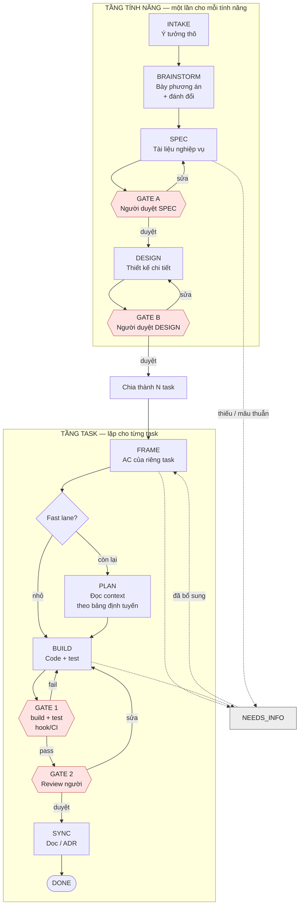
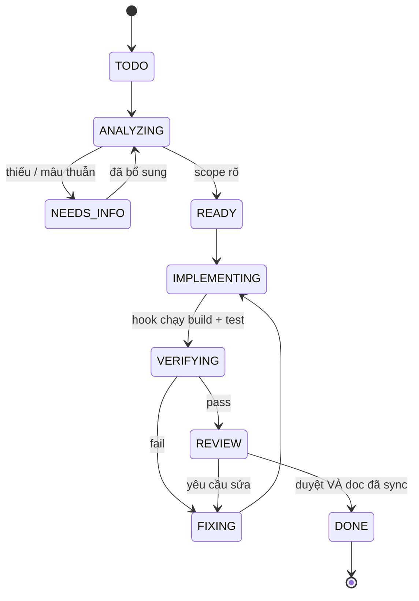
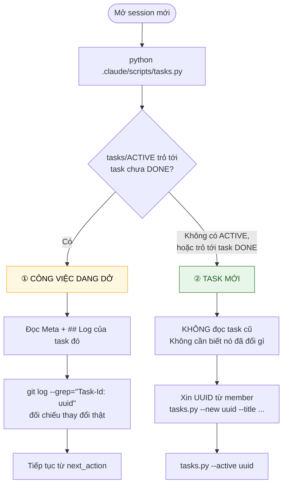

# Luồng vận hành — Intake → Frame → Plan → Build → Verify → Review → Sync

> Bản tổng hợp **thao tác được** từ `AI_DEVELOPMENT_MAP_1.md` (tài liệu thiết kế, viết cho người).
> Tài liệu gốc giải thích *vì sao*; tài liệu này nói *làm gì*.
>
> Bộ tài liệu: **luồng (đang đọc)** · [rule xây dựng docs](01-rule-tai-lieu.md) · [scaffold code](02-scaffold/README.md)
>
> Khi mâu thuẫn với `CLAUDE.md` ở gốc repo, **`CLAUDE.md` thắng** và tài liệu này phải sửa lại.

---

## 1. Ba loại thứ — đừng trộn

| Loại | Định nghĩa | Ví dụ | Ai cưỡng chế |
|---|---|---|---|
| **Stage** | Việc xảy ra theo thời gian, có đầu và cuối | Frame, Plan, Build, Sync | Quy trình |
| **Invariant** | Ràng buộc đúng ở *mọi* chặng, không "chạy" ở đâu | Coding rule, security rule | Rule (định hướng) |
| **Gate** | Điểm **máy** quyết định pass/fail | build, test, CI, review người | Hook / CI (cưỡng chế) |

Context **không phải** một chặng — nó nạp rải rác suốt quá trình theo nhu cầu.

> **Quy tắc phân loại:** *nếu vi phạm gây hậu quả không sửa được bằng lời nhắc, nó phải là gate, không phải rule.*

---

## 2. Luồng chính — hai tầng

Luồng chạy ở **hai tầng khác nhau**, đừng gộp làm một. Tầng tính năng chạy **một lần** cho mỗi tính năng;
tầng task **lặp lại** cho từng đơn vị công việc sinh ra từ đó.



### Tầng tính năng — hai chặng mới

| Chặng | Sản phẩm | Ai làm | Kết thúc khi |
|---|---|---|---|
| **BRAINSTORM** | *không có file riêng* | Người + Claude | Đã bày ≥2 phương án kèm đánh đổi |
| **SPEC** | `docs/10-business/SPEC/SPEC-<slug>.md` | Người chốt, Claude soạn | `status: APPROVED`, mục *Câu hỏi còn treo* rỗng |
| **DESIGN** | `docs/20-architecture/DESIGN/DESIGN-<slug>.md` | Claude soạn, người duyệt | `status: APPROVED`, có mục *Chia task* |

> **Brainstorm không có file riêng.** Kết quả của nó nằm ở mục *"Phương án đã xét và lý do loại"*
> trong chính SPEC. File brainstorm riêng sẽ mục sau tuần đầu và không ai đọc lại.
> Tranh luận mức **kiến trúc** thì về ADR, không về SPEC.

### Hai gate mới

`GATE A` và `GATE B` là **người duyệt**, không phải máy — khác `GATE 1` (hook/CI).
Người ghi quyết định vào frontmatter: `status: APPROVED` và `approved_by` phải có tên.

> `DRAFT` mà đem đi code là làm ngược quy trình. `IN_REVIEW` cũng chưa được.

#### Ai cưỡng chế hai gate này

Người **quyết**, nhưng máy **chặn** — nếu không thì hai gate này chỉ là lời nhắc.

`gate.py` kiểm một điều kiện tiên quyết **trước khi** chạy verify: task có trường `design:` khác `-`
thì file DESIGN đó phải **tồn tại** và **`status: APPROVED`**. Không thoả thì gate dừng ngay, không
chạy test, báo theo mẫu WHAT/WHY/FIX.

| Tình huống | Kết quả |
|---|---|
| `design: -` *(bug nhỏ, việc hạ tầng)* | Bỏ qua, chạy verify bình thường |
| `design:` trỏ tới file không tồn tại | **Dừng.** Sai tên file hoặc DESIGN chưa được tạo |
| DESIGN đang `DRAFT` hoặc `IN_REVIEW` | **Dừng.** Đang code từ tài liệu chưa duyệt |
| DESIGN `APPROVED` nhưng `approved_by` trống | **Dừng.** Không có người duyệt thì không phải APPROVED |

> **Vì sao phải có kiểm tra này:** `00-luong.md` §1 định nghĩa gate là *"điểm **máy** quyết định
> pass/fail"*, và `01-rule-tai-lieu.md` §9.3 nói *một ràng buộc không chuyển được thành kiểm tra tự
> động thì thực chất là một mong ước*. Trước khi có kiểm tra này, `GATE A`/`GATE B` đúng là mong
> ước — không thành phần nào đọc frontmatter đó cả.

Đây là mức cơ bản: nó chặn **code từ DESIGN chưa duyệt**. Nó chưa chặn chuỗi xa hơn *(DESIGN đã
duyệt nhưng SPEC nó trỏ tới thì chưa)* — thêm sau khi thấy cần.

#### `GATE B` có thêm một điều kiện: fresh session test

**DESIGN là thứ một session thực thi trực tiếp từ đó.** Nếu nó thiếu, session sẽ tự lấp bằng phỏng
đoán — và phỏng đoán sai thì phải làm lại.

Nên trước khi `DESIGN` lên `APPROVED`, chạy **fresh session test cấp tính năng**
([§12.2 ④](#122-bốn-phép-thử--chạy-trước-khi-tốn-một-lượt-của-claude)): mở phiên sạch, chỉ đưa repo,
**không giải thích gì bằng lời**, bảo nó đọc DESIGN rồi liệt kê **mọi giả định nó phải tự đưa ra**,
tách riêng thứ đọc được từ repo và thứ thuần suy đoán.

| | |
|---|---|
| **Bắt buộc** | `DESIGN` của Full lane, và mọi doc dẫn hướng khác mà session code trực tiếp từ đó |
| **Khuyến nghị** | `SPEC` của tính năng lớn |
| **Không cần** | Fast lane |

Ghi ngày chạy vào frontmatter `fresh_session_test:` — không có ngày thì coi như chưa chạy.

> **Vì sao thêm gate này:** nó đã tự chứng minh. Lần chạy đầu tiên trên `versions/V1-core.md` tốn
> khoảng 15 phút và bắt được một lỗi thiết kế — output của `tasks.py` phụ thuộc `datetime.now()` nên
> **không tất định**, khiến cơ chế golden file chống hồi quy trở nên vô nghĩa sau đúng một ngày.
> Phát hiện muộn thì mất vài ngày và mất luôn lớp bảo vệ đó.
>
> Đây là vòng chẩn đoán ở [nhật ký chẩn đoán](nhat-ky-chan-doan.md) áp cho chính quy trình: thất bại
> lộ ra khiếm khuyết cấu trúc thì **sửa cấu trúc, không vá một lần**. Tầng lỗi lần đó là
> *Task Specification*, chiều thiếu là *DONE*.

### Ba điểm dễ làm sai ở tầng task

- **`FRAME` kết thúc khi input đủ, không phải khi AC đã được viết ra.** "Đủ" có định nghĩa vận hành
  và bốn phép thử — xem [§12](#12-độ-đủ-của-input--kiểm-trước-khi-giao-việc). Bỏ qua chặng này thì
  mọi chặng sau đều đang xây trên phỏng đoán.
- **`NEEDS_INFO` là lối thoát từ mọi chặng**, không phải trạng thái nằm giữa Frame và Plan.
  Thiếu context bị phát hiện nhiều nhất lúc đang code.
- **`SYNC` nằm trước `DONE`.** Chưa cập nhật doc thì chưa xong. Không có trạng thái nào sau `DONE`.

---

## 3. Enum trạng thái — chỉ một bộ duy nhất

```text
TODO | ANALYZING | NEEDS_INFO | READY | IMPLEMENTING | VERIFYING | REVIEW | FIXING | DONE
```



Mỗi chuyển trạng thái phải trả lời được **ai chuyển, bằng gì**:

| Chuyển | Ai chuyển | Cơ chế |
|---|---|---|
| `IMPLEMENTING → VERIFYING` | Hook `Stop` | `.claude/scripts/gate.py` chạy `mvnw test` |
| `VERIFYING → REVIEW` | **Hook** | `gate.py` ghi `status: REVIEW` vào Meta khi exit code = 0 |
| `VERIFYING → FIXING` | **Hook** | `gate.py` ghi `status: FIXING` khi exit code ≠ 0 |
| `REVIEW → DONE` | **Người** | Duyệt, và chỉ khi doc đã sync |
| bất kỳ `→ NEEDS_INFO` | Claude | Khi thiếu context hoặc doc mâu thuẫn code |

Hai dòng in đậm là điểm mấu chốt: **Claude không được tự gõ `status` hay `gate:` vào Meta.**
Script ghi, Claude đọc. Nếu Claude tự khai thì đó lại là thứ nguyên tắc #3 gọi là "evidence yếu nhất".

Enum này khai ở `CLAUDE.md`; mọi nơi khác chỉ tham chiếu. Sai chính tả một trạng thái là hỏng automation.

> **Có hai enum khác nhau, đừng lẫn:**
> task dùng `TODO…DONE` ở trên; doc dẫn hướng (SPEC, DESIGN, ADR) dùng
> `DRAFT | IN_REVIEW | APPROVED | IMPLEMENTED | SUPERSEDED`.
> Doc cố ý dùng `IN_REVIEW` chứ không phải `REVIEW` — để không trùng trạng thái task.

---

## 4. Hai làn — lý do quy trình không bị bỏ sau 2 sprint

**Fast lane** khi **tất cả** điều kiện đúng:

- ≤ 3 file thay đổi
- Không đổi schema, không migration
- Không đổi hợp đồng API / message
- Không thêm hoặc sửa business rule
- Không đụng auth, phân quyền, dữ liệu nhạy cảm
- **Không đụng BPMN, pipeline, hay enum `TaskType`** *(bổ sung cho dự án BPM — xem §5)*

Fast lane bỏ qua: đọc context ngoài `CLAUDE.md` + file đích, ADR, và rút output contract xuống
còn *files changed* + *kết quả gate*.

**Full lane** cho mọi thứ còn lại. **Phân vân → Full lane.**

> Claude **không được tự nâng Full lane thành Fast lane** giữa chừng. Đang Fast lane mà phát hiện
> phải đổi schema hay đụng BPMN → task quay về `ANALYZING`.

---

## 5. Bảng định tuyến context

Bảng if/then phẳng — đây là thứ Claude thực thi. Bản rút gọn nằm trong `CLAUDE.md`.

| Task đụng tới | Đọc trước khi code | Cập nhật sau khi xong |
|---|---|---|
| *(mọi task)* | `CLAUDE.md`, file TASK, **`DESIGN` mà task trỏ tới** | `status`, `next_action` trong TASK |
| Đề xuất tính năng mới | — | `SPEC/SPEC-<slug>.md` (mới, `status: DRAFT`) |
| SPEC đã duyệt, cần thiết kế | `SPEC/SPEC-<slug>.md` | `DESIGN/DESIGN-<slug>.md` (mới) |
| Task cuối của một DESIGN xong | `DESIGN/DESIGN-<slug>.md` | `DESIGN` và `SPEC` → `status: IMPLEMENTED` |
| Business rule / luồng nghiệp vụ | `docs/10-business/BUSINESS_RULES.md`, `USE_CASES/<uc>.md` | `BUSINESS_RULES.md` nếu phát hiện rule chưa ghi |
| Schema / bảng / index / migration | `docs/30-data/DATA_DICTIONARY/<bảng>.md` | `DATA_DICTIONARY/<bảng>.md` |
| Hợp đồng API / message | `docs/40-api/API_CATALOG.md`, `ERROR_MODEL.md` | `API_CATALOG.md` |
| Quyết định kiến trúc | `docs/20-architecture/ARCHITECTURE.md`, ADR gần nhất | ADR mới |
| Auth / phân quyền / dữ liệu nhạy cảm | `docs/20-architecture/SECURITY_ARCHITECTURE.md` | — |
| Chỉ sửa nội bộ một module | `CLAUDE.md` của module đó | `CLAUDE.md` của module nếu đổi cấu trúc |
| Bug từ production | Bug report + test tái hiện | `docs/60-testing/REGRESSION_MATRIX.md` |
| **BPMN / pipeline / `TaskType` / handler** | `docs/BPM-BASELINE-CONVENTIONS.md` §4, `src/main/resources/bpmn/README.md` | File `.bpmn` trong repo + chạy `BpmnCodeConsistencyTest` |
| **Đặt tên mới bất kỳ** | `docs/BPM-BASELINE-CONVENTIONS.md` §3.3 (từ vựng cấm) | — |

**Không có dòng nào bảo đọc `ARCHITECTURE.md` mặc định** — đó là chủ ý. Bố cục thư mục, danh sách
dependency, tổng quan kiến trúc là thứ Claude tự suy ra được từ repo. Context chỉ trả tiền cho
**cạm bẫy, lý do, và quy ước khác với mặc định**.

Hai dòng in đậm cuối bảng là phần bổ sung riêng cho dự án BPM — chúng canh đúng hai khoản nợ kỹ thuật
đã xác định: coupling ngầm BPMN ↔ code, và rò rỉ từ vựng dự án cũ.

---

## 6. Cơ chế nạp context

| Cơ chế | Khi nào nạp | Dùng cho |
|---|---|---|
| `./CLAUDE.md` | Mỗi session, **luôn luôn** | Lệnh build/test, enum trạng thái, bảng định tuyến, quy tắc bất di bất dịch |
| `.claude/rules/*.md` **có `paths:`** | Khi Claude đọc file khớp glob | Rule theo miền: database, API, security, BPM |
| `.claude/rules/*.md` **không có `paths:`** | Mỗi session | Chỉ khi rule thật sự áp cho mọi file — rất ít |
| `CLAUDE.md` lồng trong thư mục con | Khi Claude đọc file trong thư mục đó | Mapping doc ↔ code của riêng module |
| Skills | Khi được gọi hoặc Claude thấy liên quan | Quy trình lặp lại: implement, review, fix |

Bốn điều dễ sai:

1. **`@import` không giảm context.** File được import vẫn nạp lúc khởi động. Muốn tiết kiệm thật
   thì dùng `paths:` hoặc skills.
2. **Giữ mỗi `CLAUDE.md` dưới 200 dòng.** Dài hơn thì tốn context *và* giảm mức tuân thủ.
   Trần thứ hai: **không quá 15 ràng buộc cứng** — xem [rule tài liệu §9.2](01-rule-tai-lieu.md#92-hai-trần-cứng).
3. **Sau `/compact`, chỉ `CLAUDE.md` gốc được tiêm lại.** Rule có `paths:` chỉ nạp lại khi Claude
   đọc file khớp. Với vòng lặp implement dài, rule miền sẽ rơi giữa chừng —
   **rule nào không được phép rơi thì phải nằm ở `CLAUDE.md` gốc.**
4. **Vị trí trong file cũng quan trọng, không chỉ việc có mặt.** Mô hình sử dụng thông tin ở **đầu**
   và **cuối** văn bản dài tốt hơn đáng kể so với ở **giữa**. Một ràng buộc then chốt chôn giữa một
   file 200 dòng có xác suất cao bị phớt lờ — kể cả khi file đó được nạp đầy đủ.

Điểm 3 và 4 kết hợp thành một quy tắc đặt chỗ: **ràng buộc không được phép rơi phải nằm ở
`CLAUDE.md` gốc, và nằm ở đầu hoặc cuối file đó — không nằm ở giữa.** Với dự án BPM, ba cạm bẫy chết
người (đổi tên handler / `TaskType` / field pipeline) thuộc đúng loại này — bắt buộc nằm ở
`CLAUDE.md` gốc, không đẩy xuống rule có `paths:`.

---

## 7. Rule và Gate — phân vai

| Yêu cầu | Làm bằng |
|---|---|
| Không sửa file ngoài phạm vi task | `permissions.deny` |
| Không push thẳng nhánh chính | `permissions.deny` |
| Không chạy migration lên môi trường thật | `permissions.deny` + `PreToolUse` hook |
| Compile sau mỗi lần sửa | `PostToolUse` hook |
| Chạy test trước khi báo xong | `Stop` hook |
| Test thật sự pass | **CI là nguồn sự thật**, không phải báo cáo của Claude |
| Nhất quán BPMN ↔ code | `BpmnCodeConsistencyTest` trong CI |

> **Evidence do agent tự khai là loại evidence yếu nhất.** "tests executed / passed" phải là output
> thật của hook/CI được dán vào, không phải câu tóm tắt.

Cấu hình cụ thể: [02-scaffold/dot-claude/settings.json](02-scaffold/dot-claude/settings.json).

---

## 8. Output contract — 5 mục, mỗi mục kiểm chứng được

```text
Sau mỗi iteration, báo cáo:

1. Context files read            ← dấu vết định tuyến. Vì Claude tự route, đây là chỗ DUY NHẤT
                                   nhìn thấy nó đã bỏ sót doc nào. Đọc kỹ mục này.
2. Files changed                 ← đối chiếu được với git diff
3. Gate result                   ← DÁN OUTPUT THẬT của build/test, không tóm tắt
4. Status + next_action          ← dùng đúng enum ở §3
5. Assumptions / open questions  ← chỗ Claude phải thú nhận nó đã đoán gì
```

Mục 5 quan trọng nhất về mặt an toàn: nó cho Claude một chỗ hợp lệ để nói "tôi không chắc"
mà không phải dừng hẳn thành `NEEDS_INFO`.

Fast lane chỉ cần mục 2 và 3.

---

## 9. Nguyên tắc cốt lõi

```text
1.  Task là entry point.
2.  Rule định hướng; gate cưỡng chế. Thứ gì quan trọng thật thì phải là gate.
3.  Evidence do agent tự khai không phải evidence. Dán output của máy.
4.  Không đủ context, hoặc doc mâu thuẫn code → NEEDS_INFO. Không đoán, không tự chọn bên.
5.  Context nạp theo nhu cầu. Không đọc toàn repo, không nạp trước thứ Claude tự suy ra được.
6.  Doc không có owner và last_verified là doc không tồn tại.
7.  Không tạo file tài liệu rỗng. Doc rỗng tệ hơn doc thiếu.
8.  Tài liệu chỉ ghi thứ đã có thật, không ghi thứ dự kiến.
9.  DONE = duyệt VÀ doc đã sync. Không có trạng thái nào sau DONE.
10. Mỗi phát hiện quan trọng phải quay ngược vào knowledge base, đúng một chỗ.
```

---

## 10. Bàn giao qua session

Hội thoại **không** sống sót qua session. Nhưng không phải lúc nào cũng cần dựng lại bối cảnh cũ —
có **hai trường hợp khác hẳn nhau**, và `tasks/ACTIVE` là công tắc phân biệt.



### ① Công việc dang dở

Cần dựng lại đầy đủ. Ba nguồn, theo thứ tự tin cậy:

| Nguồn | Trả lời câu gì | Ai ghi |
|---|---|---|
| Meta của file TASK | *Đang đứng ở đâu?* | **Hook `gate.py`** — không phải Claude |
| `## Log` của file TASK | *Đã qua những bước nào?* | Claude, theo output contract |
| `git log --grep="Task-Id: <uuid>"` | *Đã thực sự đổi gì?* | Git — nguồn khách quan |

Đối chiếu nguồn 3 với `changed_files` trong Meta còn phát hiện được lệch giữa khai báo và thực tế.

### ② Đã xong, chuyển sang task mới

**Không cần biết task trước đã đổi gì.** Đọc lại nó chỉ tốn ngữ cảnh và mang theo giả định cũ.

Việc duy nhất phải làm: xác nhận không còn gì bị bỏ quên. `tasks.py` tự cảnh báo —
nó liệt kê mọi task đang ở trạng thái mở (kể cả `REVIEW`) mà không phải task đang làm.

Rồi trỏ `tasks/ACTIVE` sang task mới. **Xoá hoặc ghi đè `tasks/ACTIVE` là bước bắt buộc khi đóng task**,
nếu không `gate.py` sẽ chạy lại test cho task đã DONE ở mỗi lượt Stop — vừa tốn thời gian vừa làm bẩn
`## Log` của task đã đóng.

> `gate.py` tự bảo vệ: thấy task đang trỏ tới đã `DONE` thì bỏ qua hoàn toàn và nhắc xoá `ACTIVE`.
> Nhưng nhắc không thay được việc dọn — task mới vẫn cần `ACTIVE` trỏ đúng chỗ mới có gate.

---

## 11. Nhiều dev cùng lúc

| Vấn đề | Cách xử |
|---|---|
| `TASK-0001.md` đánh số tuần tự → hai nhánh cùng lấy một số | **`TASK-<uuidv4>.md`** — member sinh UUID bằng tool bên thứ ba rồi paste vào. Không đánh số, không phụ thuộc tracker |
| File mapping tập trung → merge conflict liên tục | Mapping nằm trong `CLAUDE.md` lồng theo module |
| ADR đánh số tuần tự → đụng số | `ADR-<yyyy-mm-dd>-<slug>.md` |
| Auto memory của Claude Code | Là bộ nhớ **máy cục bộ**, không chia sẻ qua git. Chỉ `CLAUDE.md`, `.claude/rules/`, `docs/` được commit mới lan ra cả team |

---

## 12. Độ đủ của input — kiểm trước khi giao việc

Chặng FRAME kết thúc khi input **đủ**. Đây là định nghĩa vận hành của "đủ":

> **Đủ nghĩa là Claude không còn giả định nào mà nếu sai thì phải làm lại.**

Không phải "tôi đã viết nhiều". Không phải "tôi đã giải thích kỹ". Mà là: **danh sách phỏng đoán
còn lại đã vô hại chưa.**

### 12.1 Hệ trọng nghĩa là gì

> **Hệ trọng = đoán sai thì phải làm lại.**

| Quyết định | Hệ trọng? | Vì sao |
|---|---|---|
| Tên biến, tên hàm | ✗ | Sửa 10 giây |
| Thứ tự tham số nội bộ | ✗ | Refactor cục bộ |
| Bút toán ghi một chiều hay hai chiều | ✅ | Đổi cả mô hình dữ liệu |
| Có phân trang không, mặc định bao nhiêu | ✅ | Đổi hợp đồng API |
| Có cần `checkModifiableTask` không | ✅ | Lỗ hổng nghiệp vụ hoặc phải viết lại |

Việc **phân loại** quan trọng hơn việc tính ra con số. Không cần biết độ đủ là 0,87 — cần **nhìn thấy
danh sách** những gì đang bị bỏ ngỏ.

Vì sao đoán lại đắt: **k** quyết định hệ trọng bị bỏ ngỏ, mỗi cái 2 lựa chọn hợp lý → xác suất đoán
trúng toàn bộ là **1/2^k**. Với k=3 còn 12,5%; k=6 còn 1,6%. **Các khoảng trống nhân với nhau,
không cộng.**

### 12.2 Bốn phép thử — chạy trước khi tốn một lượt của Claude

#### ① Phép thử điều kiện nghiệm thu

> **Viết được lệnh kiểm tra "xong" ngay bây giờ không?**

```bash
mvnw test -Dtest=PostingValidationTest
curl -s localhost:8080/api/gl/entries -H "Authorization: Bearer $T" | jq '.data | length == 20'
```

Không viết được thì phân biệt hai tình trạng **rất khác nhau**:

| Tình trạng | Triệu chứng | Cách sửa |
|---|---|---|
| **Mô tả chưa rõ** | Biết muốn gì, viết chưa tới | Viết lại yêu cầu |
| **Chưa nghĩ xong** | Không viết được acceptance | **Dừng. Quay về BRAINSTORM/SPEC.** Không giao việc |

Vế thứ hai là điểm quan trọng: **bạn chưa nghĩ xong, chứ không phải Claude chưa hiểu.**

#### ② Phép thử "cấm đụng"

> **Liệt kê được cái gì KHÔNG ĐƯỢC thay đổi chưa?**

Người ta hầu như **luôn** viết được phần "làm gì" và hầu như **không bao giờ** viết phần "không đụng
gì". Mà overreach (§4, `Out of scope` trong TASK) chủ yếu đến từ đúng khoảng trống này.

Claude không có trực giác *"tôi làm đủ rồi"*, và chi phí sinh ý tưởng tiếp theo của nó gần bằng
không. **Ranh giới phải đến từ bên ngoài.**

#### ③ Phép thử "nói lại + liệt kê giả định"

Phép thử có tỷ suất hoàn vốn cao nhất. Trước khi cho Claude viết dòng code nào:

```text
Đừng code vội.

1. Nói lại yêu cầu theo cách hiểu của bạn.
2. Liệt kê MỌI giả định bạn đang phải đưa ra vì tôi chưa nói rõ.
3. Xếp chúng theo mức độ ảnh hưởng NẾU giả định đó sai.
4. Chỉ ra giả định nào bạn lấy được từ repo (kèm tên file),
   giả định nào bạn thuần tuý suy đoán.
```

**Danh sách giả định trả về chính là danh sách khoảng trống.** Một thuộc tính không đo được vừa
biến thành một danh sách đọc trong 60 giây.

Bước 4 là bước quan trọng nhất: nó tách *"biết vì đọc được trong repo"* khỏi *"đoán từ kiến thức
chung"* — và **nhóm thứ hai mới là chỗ rủi ro**.

> Vì sao phép thử này cần thiết: Claude **không phát hiện được sự vắng mặt của thông tin**. Không ai
> nói cho nó biết có quy tắc `checkModifiableTask`, nó sẽ không nghĩ *"chắc mình đang thiếu gì đó"* —
> nó viết code không có kiểm tra và thấy hoàn toàn ổn. Nhưng nó **liệt kê được** chỗ nó đang lấp
> bằng phỏng đoán, **nếu được yêu cầu tường minh**.

#### ④ Fresh session test cấp tính năng

Đưa **chỉ** input + repo cho một phiên sạch, không giải thích bằng lời, hỏi bốn câu:

| # | Câu hỏi | Chiều |
|---|---|---|
| 1 | Tính năng này làm gì **cho người dùng**? | WHAT |
| 2 | Code đặt **ở đâu**, theo **pattern nào**? | WHERE + HOW |
| 3 | Xác minh bằng **lệnh gì**? | DONE |
| 4 | Cái gì **ngoài phạm vi**? | WHERE |

**Tiêu chí chấm: câu nào không trả lời được kèm trích dẫn file cụ thể là một khoảng trống.**

> ⚠️ Bẫy: trả lời **đúng** nhưng **không trích được nguồn** thì vẫn tính là khoảng trống. Nó đang đoán
> từ kiến thức chung về các dự án tương tự. Lần này may mắn đúng — lần sau có thể sai.

### 12.3 Sáu chiều của "đủ"

Độ đủ không phải một đại lượng vô hướng. Thiếu chiều nào thì hỏng theo kiểu đó:

| Chiều | Câu hỏi | Thiếu thì hỏng thế nào | Thuộc về |
|---|---|---|---|
| **WHAT** | Hành vi **quan sát được** là gì? | Đúng kỹ thuật, **sai sản phẩm** | SPEC / TASK |
| **DONE** | **Lệnh nào** chứng minh xong? | **Tuyên bố hoàn thành sớm** | `Acceptance Criteria` |
| **WHERE** | File nào trong phạm vi, cái nào cấm? | **Overreach**, refactor ngoài ý muốn | `Target` + `Out of scope` |
| **HOW** | Quy ước nào **bắt buộc**? | **Vi phạm quy tắc ngầm** — lỗi phổ biến nhất | `CLAUDE.md` / rule |
| **CONTEXT** | Phải **đọc gì trước**? | Đốt context khám phá lại, tạo abstraction trùng | Bảng định tuyến §5 |
| **ENV** | **Chạy/test thế nào**? | Tốn thời gian sửa môi trường thay vì làm việc | `CLAUDE.md` §Lệnh |

Cột cuối cho thấy một điều quan trọng: **bốn chiều dưới thuộc về repo, không thuộc về prompt.**
Bổ sung vào repo trả **một lần**; để Claude đoán trả **mỗi task**.

> **Tín hiệu bạn đang sửa sai chỗ:** nếu thấy mình dán cùng một đoạn giải thích vào nhiều task khác
> nhau, đó không phải vấn đề của task — **đó là một dòng còn thiếu trong `CLAUDE.md`.**

Dùng bảng này để **chẩn đoán ngược**: task thất bại → hỏi *thiếu chiều nào* → sửa đúng chiều đó.
Bản ghi tích luỹ nằm ở [nhật ký chẩn đoán](nhat-ky-chan-doan.md).

### 12.4 Độ hạt của task

Hai phép thử, dùng cùng lúc:

| Phép thử | Nội dung | Không đạt thì |
|---|---|---|
| **Xác minh được** | Viết được lệnh xác minh cho đơn vị này không? | **Đơn vị còn quá lớn hoặc quá mơ hồ — chia tiếp** |
| **Hành vi quan sát được** | Mô tả có phải thứ người dùng nhìn thấy không? | Quá rộng hoặc quá hẹp |

| Mô tả | Đánh giá |
|---|---|
| *"Người dùng post được bút toán và thấy số dư cập nhật"* | ✅ độ hạt tốt |
| *"Triển khai module bút toán"* | ✗ quá rộng — không phải hành vi |
| *"Tạo field `postingDate` trên entity"* | ✗ quá hẹp — người dùng không thấy |

Đơn vị đúng phải **hoàn thành được trong một phiên**. Quá rộng thì không xong; quá hẹp thì chi phí
quản lý phình lên.

### 12.5 Quy trình 10 phút trước khi giao việc

```text
    ┌────────────────────────────────────────────────────────────┐
    │  1. Viết ĐIỀU KIỆN NGHIỆM THU dạng lệnh chạy được          │
    │     └─ Không viết được? → DỪNG. Chưa nghĩ xong.            │
    │                                                            │
    │  2. Viết mục "Out of scope"                                │
    │                                                            │
    │  3. Bắt Claude NÓI LẠI + LIỆT KÊ GIẢ ĐỊNH                  │
    │     └─ Đọc danh sách đó                                    │
    │                                                            │
    │  4. Với MỖI giả định HỆ TRỌNG:                             │
    │     ├─ Quy tắc chung của dự án  → bổ sung CLAUDE.md/rule   │
    │     ├─ Kiến trúc một module     → ARCHITECTURE của module  │
    │     ├─ Cách chạy/test           → CLAUDE.md §Lệnh          │
    │     └─ Đặc thù CHỈ task này     → file TASK                │
    │                                                            │
    │  5. LẶP LẠI bước 3 MỘT LẦN NỮA  ← bắt buộc                 │
    │     └─ Chỉ còn giả định KHÔNG hệ trọng? → ĐỦ               │
    └────────────────────────────────────────────────────────────┘
```

**Vì sao bước 5 bắt buộc.** Vòng hai lộ ra các giả định **thứ cấp** — thứ chỉ xuất hiện sau khi
vòng một đã được trả lời. Ví dụ: chốt "có phân trang, mặc định 20" thì vòng hai Claude mới hỏi được
"trang cuối trả về ít hơn 20 hay báo lỗi?".

Một vòng là chưa đủ. Hai vòng thường là đủ. **Cần đến vòng ba là dấu hiệu tính năng quá lớn — chia
nhỏ** (§12.4).

### 12.6 Nhiều thông tin ≠ đủ hơn

Đây là chỗ ngược trực giác. Hai cơ chế khiến thêm thông tin **làm hại**:

| Cơ chế | Hậu quả |
|---|---|
| **Nhiễu làm loãng tín hiệu** | Ràng buộc quan trọng bị chôn giữa 300 dòng bối cảnh không liên quan sẽ bị phớt lờ |
| **Vi quản lý khoá Claude vào giải pháp tệ hơn** | Chỉ định chi tiết *cách triển khai* chặn mất giải pháp tốt hơn mà nó tự nghĩ ra được |

> **Cưỡng chế BẤT BIẾN, đừng vi quản lý CÁCH TRIỂN KHAI.**

| | Vi quản lý | Bất biến |
|---|---|---|
| Cách viết | *"Dùng try/catch quanh mọi lời gọi DB"* | *"Mọi lời gọi DB phải pass `DbErrorHandlingTest`"* |
| Phạm vi phủ | Chỉ trường hợp bạn nghĩ ra | Mọi trường hợp thoả điều kiện |
| Kiểm chứng | Người phải đọc code | Máy chạy lệnh, có exit code |
| Khi Claude có ý tưởng tốt hơn | Bị chặn | Được tự do, miễn thoả bất biến |

**Mục tiêu không phải tối đa thông tin. Mục tiêu là zero mơ hồ hệ trọng.**

Phép thử ngược để cắt bớt: **gỡ dòng này ra, Claude có ra quyết định khác đi không?** Không → dòng
đó là nhiễu, xoá hoặc chuyển sang tài liệu chuyên đề.

### 12.7 Bảng kiểm nhanh

- [ ] Viết được **lệnh** chứng minh task này xong chưa?
- [ ] Liệt kê được cái gì **cấm đụng** chưa?
- [ ] Đã bắt Claude **liệt kê giả định** và đọc danh sách đó chưa?
- [ ] Mọi giả định **hệ trọng** đã được trả lời chưa?
- [ ] Giả định **lặp lại giữa các task** đã chuyển vào **repo** chưa?
- [ ] Có đang thêm thông tin **không làm đổi quyết định** của Claude không? *(→ cắt)*
