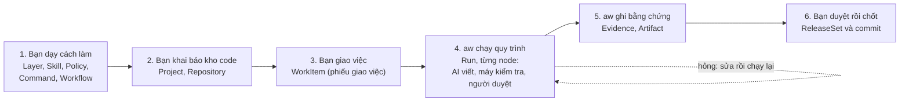
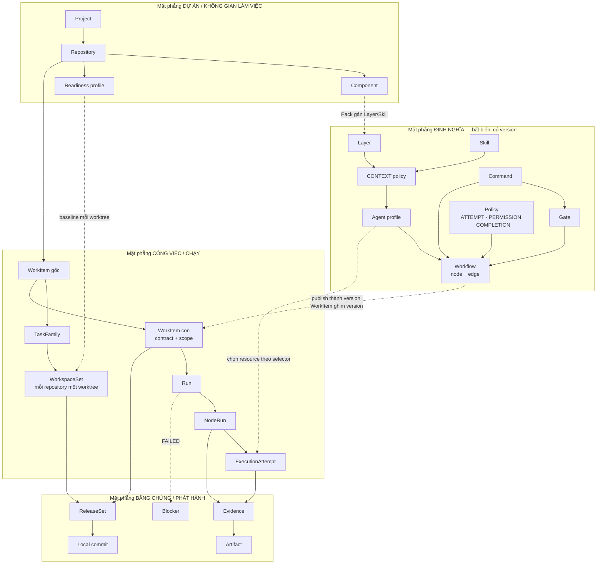
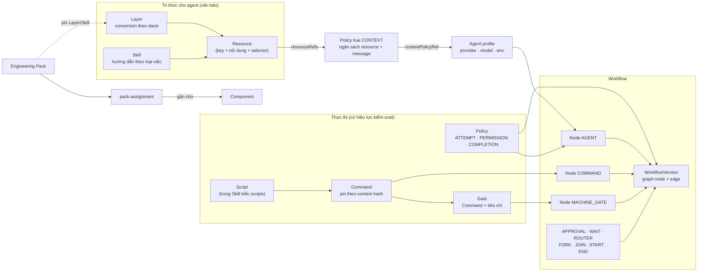
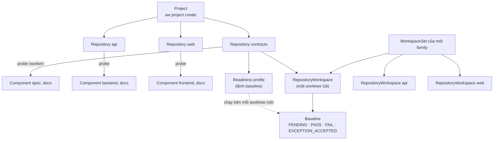
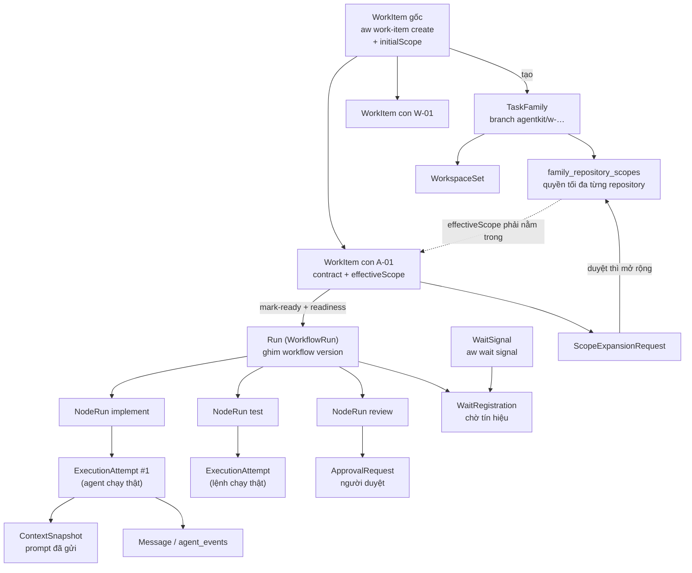
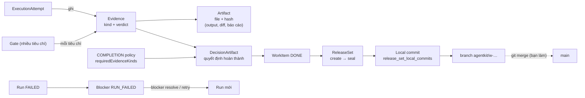
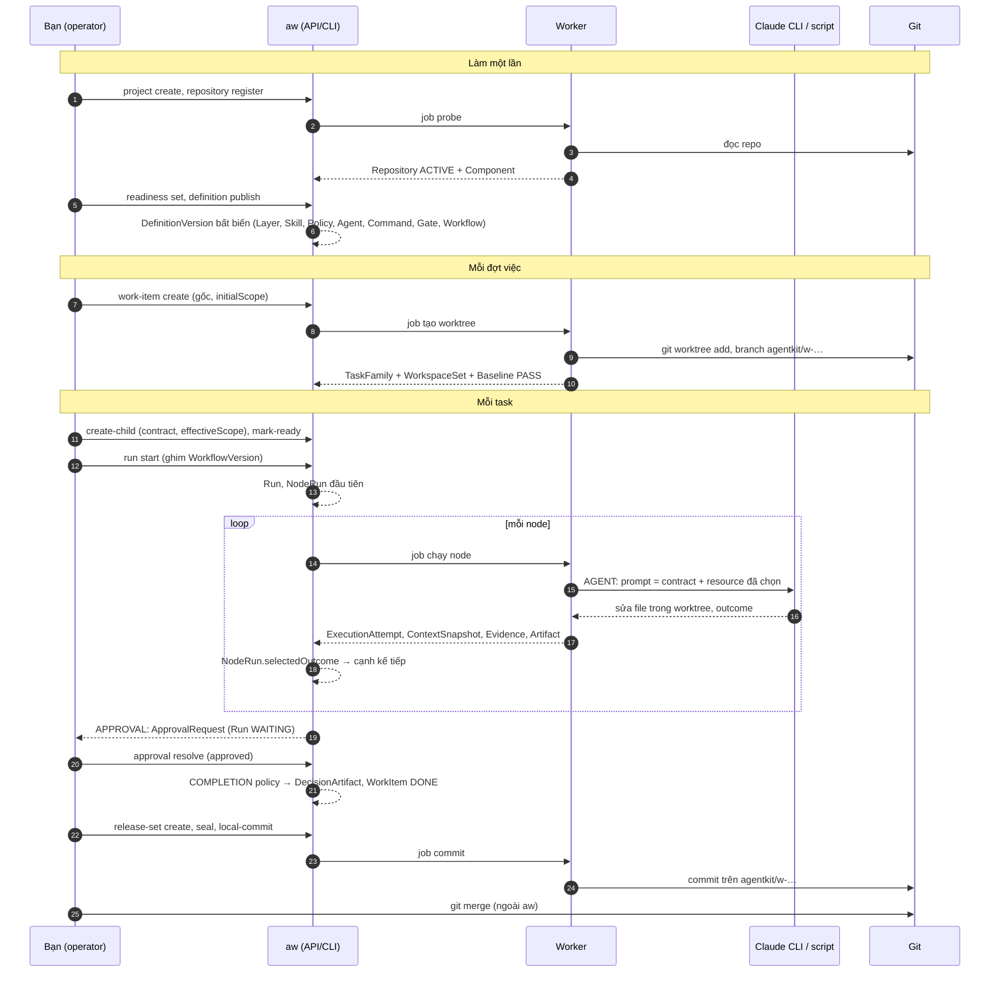

# Thực thể của Agent Kit (`aw`): quan hệ, nguồn gốc, chức năng

**Người mới: đọc [mục 0](#0-dành-cho-người-mới-đọc-phần-này-trước) rồi [mục 6](#6-vòng-đời-một-task-thực-thể-nào-xuất-hiện-khi-nào); phần còn lại để tra cứu.**

Tài liệu này trả lời ba câu hỏi cho từng thực thể: **nó là gì và dùng để làm gì**, **ai/lệnh nào sinh ra nó**, và **nó nối
với thực thể nào**. Tên thực thể và bảng lưu trữ lấy từ mã nguồn (`internal/…` và
[docs/architecture/03-system-architecture.md](../architecture/03-system-architecture.md)); ví dụ lấy từ hai hướng dẫn
[todolist](todolist-spring-react/README.md) và [issue tracker](issue-tracker/README.md).

## Mục lục

- [0. Dành cho người mới: đọc phần này trước](#0-dành-cho-người-mới-đọc-phần-này-trước)
- [1. Bức tranh lớn: bốn mặt phẳng](#1-bức-tranh-lớn-bốn-mặt-phẳng)
- [2. Mặt phẳng định nghĩa](#2-mặt-phẳng-định-nghĩa)
- [3. Mặt phẳng dự án và không gian làm việc](#3-mặt-phẳng-dự-án-và-không-gian-làm-việc)
- [4. Mặt phẳng công việc và chạy](#4-mặt-phẳng-công-việc-và-chạy)
- [5. Mặt phẳng bằng chứng và phát hành](#5-mặt-phẳng-bằng-chứng-và-phát-hành)
- [6. Vòng đời một task: thực thể nào xuất hiện khi nào](#6-vòng-đời-một-task-thực-thể-nào-xuất-hiện-khi-nào)
- [7. Thực thể hạ tầng (ít khi phải đụng tới)](#7-thực-thể-hạ-tầng-ít-khi-phải-đụng-tới)
- [8. Ba quy tắc giúp nhớ](#8-ba-quy-tắc-giúp-nhớ)

---

## 0. Dành cho người mới: đọc phần này trước

Nếu bạn chưa từng dùng `aw`, **chỉ cần đọc mục 0 và mục 6**. Các mục 1–5 và 7 là tra cứu chi tiết khi cần.

### 0.1 Hình dung bằng một công ty phần mềm nhỏ

`aw` giống một công ty nhỏ trong đó **AI là nhân viên**, còn bạn là **trưởng nhóm** giao việc và duyệt kết quả.

| Trong công ty | Trong `aw` | Một câu giải thích |
| --- | --- | --- |
| Dự án, kho code của công ty | **Project**, **Repository** | Project là cái ô lớn; Repository là một kho Git bạn cho `aw` làm việc. |
| Khu vực trong kho (thư mục `backend/`, `frontend/`) | **Component** | `aw` tự nhận ra, dùng để biết "đang sửa vùng nào". |
| Sổ tay quy ước ("ở đây viết Java thế này") | **Layer**, **Skill** | Văn bản hướng dẫn cho AI; Layer theo công nghệ, Skill theo loại việc ("cách review"). |
| Nhân viên AI cùng bộ sổ tay của họ | **Agent profile** | Chọn model nào, được đọc sổ tay nào. |
| Quy trình làm việc (viết → test → sếp duyệt) | **Workflow** | Sơ đồ các bước, mỗi bước là một **node** do AI, máy hay người làm. |
| Phép thử tự động ("test phải xanh") | **Command**, **Gate** | Script kiểm tra; Gate cho kết quả có tên ("không lộ mật khẩu: đạt"). |
| Nội quy ("tối đa 3 lần sửa", "xong là phải có người duyệt") | **Policy** | Luật cho số lần thử, quyền hạn, điều kiện "xong". |
| Phiếu giao việc (làm gì, thế nào là xong, được đụng vào đâu) | **WorkItem** | Có mô tả, tiêu chí nghiệm thu và **scope** (quyền). |
| Bàn làm việc riêng cho mỗi đợt việc | **Worktree** (trong TaskFamily) | Bản sao Git để AI sửa thoải mái, không đụng kho gốc của bạn. |
| Một lần thực hiện phiếu theo quy trình | **Run** | Chạy workflow trên một WorkItem; hỏng thì chạy lại, vẫn cùng phiếu. |
| Biên bản "đã làm gì, kết quả ra sao" | **Evidence**, **Artifact** | Bằng chứng từng bước; Artifact là file kèm theo (log, diff). |
| Chốt kết quả vào lịch sử | **ReleaseSet**, **Local commit** | Gom thay đổi thành một commit Git thật, sau khi bạn duyệt. |

### 0.2 Bản đồ đơn giản nhất

Đọc theo hàng ngang: **dạy một lần (1–2), rồi lặp lại 3 → 6 cho mỗi việc**. Bước 1 và 2 làm một lần cho mỗi project;
hầu hết thời gian bạn chỉ làm bước 3 và 6.

### 0.3 Một ví dụ nhỏ: "thêm bình luận cho issue"

| Bạn làm | Thực thể được sinh ra | Ý nghĩa |
| --- | --- | --- |
| Đăng ký ba repository `contracts`, `api`, `web` | 1 Project, 3 Repository, các Component (`spec`, `backend`, `frontend`…) | `aw` biết có kho nào, vùng nào |
| Chạy `aw-publish.py` | Layer, Skill, Agent, Command, Workflow (mỗi thứ một *version*) | "Dạy" xong cách làm; từ nay sửa gì cũng ra version mới |
| Tạo "đợt việc" | 1 WorkItem gốc + TaskFamily + 3 worktree | Chỗ làm việc riêng, kho gốc an toàn |
| Giao task T-02 "viết API bình luận" | 1 WorkItem con (contract + scope: chỉ ghi `backend/` của `api`) | Phiếu giao việc có giới hạn quyền |
| Bắt đầu chạy | 1 Run, rồi nhiều NodeRun (`implement`, `test`, `review`…) | Mỗi bước của quy trình là một NodeRun |
| Test đỏ → AI sửa → test xanh | Nhiều ExecutionAttempt, nhiều Evidence | Mỗi lần thử thật đều được ghi lại |
| Bạn bấm duyệt | ApprovalRequest được trả lời | Người quyết định ở bước cần người |
| Chốt kết quả | ReleaseSet → Local commit | Thành commit Git thật trên nhánh `agentkit/w-…` |

### 0.4 Năm điều nên nhớ

1. **Định nghĩa có version, không sửa tại chỗ.** Muốn đổi cách làm: publish version mới. Việc đang chạy không bị ảnh hưởng.
2. **WorkItem là việc cần làm, Run là một lần chạy.** Một WorkItem có thể có nhiều Run (chạy lại sau khi hỏng).
3. **Quyền đi từ trên xuống.** Đợt việc có trần quyền, mỗi task nhận phần nhỏ hơn; AI ghi ngoài phần được phép là bị chặn (`SCOPE_VIOLATION`).
4. **AI đề xuất, bằng chứng mới quyết định.** AI sửa file; máy kiểm tra sinh Evidence; có đủ Evidence và người duyệt thì mới có commit.
5. **`aw` không push và không merge.** Nó dừng ở commit cục bộ; gộp vào `main` là việc của bạn bằng Git.

Từ khóa gặp nhiều nhất khi đọc hướng dẫn: **node** (một bước trong workflow), **outcome** (kết quả của một node, quyết định đi
cạnh nào tiếp), **scope** (quyền đọc/ghi trên repository và thư mục), **verdict** (kết luận đạt hoặc không của một Evidence).

---

## 1. Bức tranh lớn: bốn mặt phẳng

`aw` chia thực thể thành bốn nhóm, mỗi nhóm trả lời một câu hỏi và được **sinh bằng một cách khác nhau**:

| Mặt phẳng | Trả lời | Sinh bằng | Tính chất |
| --- | --- | --- | --- |
| **Định nghĩa** | "Làm theo quy trình nào, agent biết gì, máy kiểm tra gì?" | `aw definition create/publish` (script `aw-publish.py`) | Bất biến theo version; viết một lần, dùng nhiều lần |
| **Dự án / không gian làm việc** | "Làm trên repository nào, ở đâu trên đĩa?" | `aw project create`, `aw repository register`, và worker | Phản ánh Git thật của bạn |
| **Công việc / chạy** | "Việc gì, chạy workflow nào, đang ở bước nào?" | `aw work-item create…`, `aw run start`, và worker | Có trạng thái, thay đổi liên tục |
| **Bằng chứng / phát hành** | "Chứng minh đã làm đúng, rồi thành commit thật" | Worker ghi sau mỗi node; `aw release-set …` | Chỉ thêm, không sửa |

Mũi tên liền là quan hệ "chứa/sinh ra/dùng", mũi tên chấm là quan hệ "tham chiếu lúc chạy".

---

## 2. Mặt phẳng định nghĩa

| Thực thể | Chức năng | Sinh ra thế nào |
| --- | --- | --- |
| **Definition** và **DefinitionVersion** | Vỏ chung của mọi thứ ở mặt phẳng này. `Definition` là *tên* (ví dụ `trk-agent-api`); mỗi lần publish nội dung mới sinh **một version bất biến** có `versionId`. Version cũ không bao giờ đổi, nên run cũ vẫn chạy đúng như lúc bắt đầu. | `aw definition create` rồi `aw definition publish` (bảng `definitions`, `definition_versions`). `aw-publish.py` làm cả hai và chỉ tạo version mới cho đúng file đã đổi. Xem sự khác nhau giữa hai version bằng `aw version diff`. |
| **Layer** | Quy ước theo **stack công nghệ** ("Spring Boot đặt controller ở đâu", "React gọi API thế nào"). Chỉ là văn bản; không thực thi. | Bạn viết file JSON gồm danh sách resource; publish. Dùng lại giữa các project qua kit (`kit-layer-stack-spring-sqlite`). |
| **Skill** | Hướng dẫn theo **loại công việc** ("cách review", "cách viết spec"), hoặc chứa **script** cho Command (skill kiểu `scripts`). | Như Layer. Skill chung nằm ở `kit/skills/`; skill riêng nằm trong thư mục project. |
| **Resource** và **Selector** | Một mẩu nội dung có `key`, kèm điều kiện được nạp: `componentTags` (vùng code), `blockKinds` (MAKER/CHECKER), `riskClasses`. Selector là lý do agent ở `backend` không đọc quy ước của `frontend`. | Nằm trong Layer/Skill; engine so selector với task lúc tạo prompt. |
| **Engineering Pack** và **pack-assignment** | Gói pin một tập Layer/Skill rồi **gán cho một Component** để ghi nhận và hiển thị. Runtime **không** đọc nó để chọn resource (việc đó do CONTEXT policy + selector). | `aw definition publish` (loại pack) rồi `aw pack-assignment assign` (bảng `component_pack_assignments`). |
| **Policy** | Luật, chia loại: **ATTEMPT** (retry, timeout, ngân sách vòng sửa), **PERMISSION** (cách ly, quyền, ghi nhiều repository), **COMPLETION** (thế nào là "xong": đủ loại evidence nào, có người duyệt không), **CONTEXT** (tập resource ứng viên của một agent). | Publish như mọi định nghĩa. `kit/policies/` có bản mẫu. |
| **Agent profile** | "Một nhân viên AI": provider (`claude`), model, biến môi trường cho phép, và CONTEXT policy của nó. | Publish; `aw-publish.py` sinh luôn CONTEXT policy riêng cho từng agent. |
| **Command** | Một script có version, **pin theo content hash**: sửa script là ra version khác, run đang chạy không bị đổi dưới chân. Có `repository` mà nó chạy trong đó, `envAllowlist`, timeout, giới hạn output. | Publish từ file script (`commands/*.sh`). Mẫu chung ở `kit/commands/`; `from kit:<id>` tạo nhiều bản gắn repository khác nhau. |
| **Gate** | Một Command kèm **danh sách tiêu chí** (`evidenceKey`), mỗi tiêu chí cho verdict riêng. Gate là cách một lệnh duy nhất trả về nhiều bằng chứng có tên (`NO_SECRET_FILES`, `SPEC_VALID`). | Publish, trỏ tới Command. |
| **Workflow / WorkflowVersion** | Graph **node và edge**: ai làm gì, theo thứ tự nào, khi lỗi đi đâu. Node có các loại `AGENT` (MAKER/CHECKER), `COMMAND`, `MACHINE_GATE`, `APPROVAL`, `WAIT`, `ROUTER`, `FORK`/`JOIN`, `START`/`END`. Là thực thể **theo project**, không chia sẻ chung như Layer/Skill. | Viết file graph JSON; publish (`workflow_definitions`, `workflow_versions`). Workflow mẫu chung nằm ở `kit/workflows/` dưới dạng template. |
| **Adapter build** | Danh tính của chính binary provider (Claude CLI): hash file thực thi, giao thức, năng lực. Để phát hiện CLI bị đổi giữa chừng (`ADAPTER_BUILD_DRIFT`). | Worker/`aw doctor` ghi khi thấy executable; `aw adapter probe/register`. |
| **Kit** | Không phải thực thể trong database mà là **kho nguồn dùng chung** trong repo `aw`. Publish một lần cho cả bản cài, id có tiền tố `kit-`. | `aw-publish.py` đọc `kit/kit.json` và các project `from kit`. |

**Cách các thứ ráp thành prompt:** khi một node `AGENT` chạy, engine lấy *tập ứng viên* từ CONTEXT policy của agent,
lọc bằng Selector so với WorkItem (component, vai trò, rủi ro), sắp theo thứ tự ưu tiên, rồi đóng gói cùng contract của
WorkItem thành prompt. Kết quả được lưu thành **ContextSnapshot** (mục 4) để sau này biết agent đã được nói gì.

---

## 3. Mặt phẳng dự án và không gian làm việc

| Thực thể | Chức năng | Sinh ra thế nào |
| --- | --- | --- |
| **Project** | Đơn vị quản lý cao nhất: mọi thứ theo project (repository, workflow, WorkItem) nằm trong một project. | `aw project create` (`init-project.sh` gọi). |
| **Repository** | Một Git repo **cục bộ** đã đăng ký, có `defaultRef` (nhánh gốc) và đường dẫn tuyệt đối. Id là **duy nhất trên cả bản cài**. | `aw repository register` ghi bản đăng ký; worker chạy **probe** (kiểm tra Git, đọc cấu trúc) rồi chuyển `ACTIVE` hoặc `BLOCKED`. `add-repository.sh` gọi và chờ. |
| **Component** | Thư mục cấp một của repository (`backend`, `frontend`, `spec`, `docs`). Là **đơn vị gắn** Layer/Skill, scope và Pack. | **Tự phát hiện** khi probe: bạn không tạo tay. Thêm thư mục mới và probe lại thì có component mới. |
| **Readiness profile** | Lệnh kiểm tra *của chính repository* (ví dụ `mvn -q -B test`), chạy trên mỗi worktree mới trước khi nhận task. Mục đích: worktree đã đỏ từ đầu thì không đổ lỗi cho agent. | `aw repository readiness set` (mỗi lần đổi là version mới, mọi baseline cũ hết hiệu lực). |
| **Baseline** | Kết quả chạy readiness profile trên **một worktree cụ thể**: `PENDING`, `PASS`, `FAIL`, `EXCEPTION_ACCEPTED`, hoặc `NOT_REQUIRED` (repo không có profile). `FAIL` chặn task cho tới khi sửa hoặc người vận hành chấp nhận ngoại lệ. | Worker tự chạy khi worktree được tạo (`readiness_baseline_attempts`); ngoại lệ do `aw repository readiness accept-exception`. |
| **RepositoryWorkspace / WorkspaceSet** | Một **worktree Git thật** cho một repository trên một branch `agentkit/w-…`; **WorkspaceSet** gom các worktree của một family (mỗi repository một cái). Agent chỉ làm trong đây, không bao giờ trong repo gốc của bạn. | Worker tạo khi WorkItem **gốc** được tạo (`workspace_sets`, `repository_workspaces`); `aw workspace-set release` thu hồi. `aw repository-workspace diff/log/source` để xem. |

---

## 4. Mặt phẳng công việc và chạy

| Thực thể | Chức năng | Sinh ra thế nào |
| --- | --- | --- |
| **WorkItem gốc** | Điểm bắt đầu của một "đợt việc". Việc tạo ra nó **cũng tạo hạ tầng làm việc**: một TaskFamily và các worktree. Khai `initialScope` ở đây (repository nào, READ hay WRITE): đó là **trần quyền** của cả đợt. | `aw work-item create` (`create-root.sh`). Một đợt/tính năng nên có một gốc riêng. |
| **TaskFamily** | "Nhóm làm việc" gắn với gốc: sở hữu **branch `agentkit/w-…`** và WorkspaceSet. Mọi WorkItem con dùng chung worktree của family. | Sinh cùng WorkItem gốc; `aw task-family show` để xem `scopeVersion`. |
| **family_repository_scopes** | Quyền được duyệt của family trên từng repository. Con **không được** khai quyền vượt trần này, nếu không bị từ chối: `child effective scope exceeds approved family scope`. | Đặt từ `initialScope`; thay đổi bằng scope expansion. |
| **WorkItem con** | Một **task** có **contract**: `behavior`, `acceptanceCriteria`, `verificationSpec`, `riskLevel`, và `effectiveScope` (repository, quyền, thư mục được ghi). Một workflow chạy trên nó; có thể có nhiều run (chạy lại sau khi hỏng). | `aw work-item create-child` (`run-task.sh` gọi từ file JSON). Phải `mark-ready` và qua `work-item readiness` (contract đủ trường, baseline cho phép) mới chạy được. |
| **Run (WorkflowRun)** | Một lần chạy workflow trên WorkItem, **ghim version workflow** tại lúc tạo WorkItem: publish workflow mới không đổi run đang có. Trạng thái `RUNNING`, `SUCCEEDED`, `FAILED`, `CANCELLING`… | `aw run start --workflow-version-id`. Hủy: `aw run cancel`. Xem: `aw run show/timeline/graph`. |
| **NodeRun** | Một lần **kích hoạt một node** trong run (có số `vòng`: node `implement` ở vòng 0, 1, 2 là ba NodeRun). Có `selectedOutcome` quyết định đi cạnh nào. | Engine sinh khi token đi tới node. |
| **ExecutionAttempt** | Một lần **thực thi thật** của node `AGENT` hoặc `COMMAND`: tiến trình Claude CLI hoặc script. Có `failureCode` (`SCOPE_VIOLATION`, `VALIDATION_FAILED`, `EXECUTION_FAILED`…), mức dùng token/chi phí. Một NodeRun có thể có nhiều attempt nếu policy cho retry. | Worker sinh khi chạy node; `ATTEMPT policy` quyết định số lần, timeout, ngân sách. |
| **ContextSnapshot** | Bản chụp **đúng những gì agent đã nhận** cho attempt đó: resource nào được chọn, hash, kích thước, có `CLAUDE.md` không. Dùng để giải thích "vì sao agent làm vậy". | Sinh khi attempt AGENT bắt đầu; `aw context-snapshot show`. |
| **Message / agent_events** | **Message** là lời của người vận hành và hệ thống gắn WorkItem (phản hồi khi duyệt, ghi chú khi chạy lại); được đưa vào prompt (có ngân sách `messageBudget`). **agent_events** là luồng sự kiện agent in ra (đọc bằng `agent-log.py`). | `aw message append`; node `APPROVAL` và `retry-task.sh` cũng thêm message. |
| **ApprovalRequest** | Một câu hỏi chờ **người** trả lời ở node `APPROVAL`, kèm các outcome hợp lệ (`approved`, `rejected`, `revise`…). Run dừng ở `WAITING` tới khi có quyết định. | Engine sinh khi token tới node; `aw approval resolve` (`review-task.sh` gọi). |
| **WaitRegistration / WaitSignal** | Node `WAIT` đăng ký "đợi tín hiệu tên X"; **WaitSignal** là sự kiện bên ngoài (CI xanh) gửi tới. Có khóa idempotency nên gửi lại không tiến hai lần; có timeout. | Đăng ký do engine; tín hiệu do `aw wait signal --signal-key …`. |
| **BranchToken** | Dấu vết "nhánh nào đang ở node nào" khi `FORK` chia song song và `JOIN` gom lại. | Engine, nội bộ. |
| **ScopeExpansionRequest** | Đề nghị **mở rộng trần quyền** của family giữa chừng (thêm repository READ/WRITE). Có người duyệt/từ chối; duyệt xong tăng `scopeVersion` và worker tạo thêm worktree. | `aw scope-expansion request` rồi `approve`/`reject`/`withdraw`. |

**Điểm hay nhầm.** WorkItem ≠ Run. WorkItem là *việc cần làm* (contract, scope), sống lâu; Run là *một lần chạy workflow* trên
việc đó. WorkItem bị chặn (`BLOCKED`) vì run `FAILED` rồi chạy lại là **cùng WorkItem, Run mới**. Còn **attempt ≠ NodeRun**: NodeRun là "node này
đã được kích hoạt", attempt là "đã thử chạy nó một lần".

---

## 5. Mặt phẳng bằng chứng và phát hành

| Thực thể | Chức năng | Sinh ra thế nào |
| --- | --- | --- |
| **Evidence** | Bằng chứng một bước đã diễn ra, có **`kind`** (`AGENT_EXECUTION`, `COMMAND_EXECUTION`, hoặc `evidenceKey` của Gate như `NO_SECRET_FILES`) và **verdict** (`RECORDED`, `SUCCEEDED`, `FAILED`, `PASS`, `FAIL`). Là cái mà COMPLETION policy đếm để quyết định "xong". | Worker ghi sau mỗi attempt/gate. `aw evidence list/show/verify` (`verify` kiểm lại hash). |
| **Artifact** | **File thật** do bước sinh ra: output lệnh, diff, báo cáo, transcript, kèm hash. Evidence trỏ tới artifact. Lưu dưới `AW_ARTIFACT_ROOT`; **không** nằm trong backup database (phải sao riêng). | Worker ghi; `aw artifact get/list`. |
| **DecisionArtifact** | Bản ghi *quyết định có kiểu* của policy (hoàn thành, phục hồi): đầu vào, version policy, kết quả. Cho phép trả lời "vì sao run được coi là xong". | Engine ghi khi đánh giá COMPLETION. |
| **Blocker** | Lý do một WorkItem **bị chặn** và không thể chạy tiếp cho tới khi gỡ: `RUN_FAILED`, `ADAPTER_BUILD_DRIFT`, baseline đỏ… Cố ý **không tự biến mất**: người vận hành phải nhìn thấy. | Engine sinh khi run hỏng/điều kiện vi phạm; gỡ bằng `aw blocker resolve` (`retry-task.sh` gỡ khi chạy lại). |
| **ReleaseSet** | Gom **mọi thay đổi trong các worktree của family** thành một đối tượng phát hành: tạo (`create`), niêm phong (`seal`, hash cố định), rồi tạo commit. Có thể `abandon`. Mỗi repository có thay đổi là một dòng trong `release_set_repositories`. | `aw release-set create/seal` (`commit-task.sh` làm cả chuỗi). |
| **Local commit** | **Commit Git thật** trên branch `agentkit/w-…` của family, có marker `Release-Set-Local-Commit-Marker` trong message để truy ngược về ReleaseSet. `aw` **không push, không merge**: gộp vào `main` là việc của Git/bạn. | `aw release-set local-commit` (và `local-commit status`). |

**Vì sao commit chỉ sau khi người duyệt?** Task xong ≠ đã phát hành. `COMPLETION policy` quyết định đủ bằng chứng chưa; người
duyệt xem diff; chỉ khi đó `commit-task.sh` mới tạo ReleaseSet. Tách như vậy để một run hỏng hay bị từ chối không
bao giờ để lại commit nửa vời.

---

## 6. Vòng đời một task: thực thể nào xuất hiện khi nào

Thứ tự này cũng là cách đọc **vì sao một thực thể phải có trước thực thể khác**: không có Repository `ACTIVE` thì không tạo được
gốc; không có gốc thì không có worktree; không có worktree thì WorkItem con không chạy được; không có Evidence thì COMPLETION
policy không cho `DONE`; không có `DONE` và người duyệt thì không có ReleaseSet.

---

## 7. Thực thể hạ tầng (ít khi phải đụng tới)

Các bảng này làm cho hệ thống **chạy bền, an toàn và xem được**; bạn thường chỉ thấy chúng qua lỗi hoặc `aw doctor`.

| Thực thể | Chức năng |
| --- | --- |
| **DurableJob** | Hàng đợi việc bền cho worker: probe repository, tạo worktree, chạy baseline, chạy node, commit. Có lease và token nên worker chết thì việc được nhận lại. |
| **CommandReceipt** | Biên nhận **idempotency** của mọi lệnh ghi (khóa `--idempotency-key`): gửi lại cùng lệnh trả kết quả cũ, không tạo thứ hai. Đây là lý do `run-task.sh` chạy lại nguyên văn thì "replay" thay vì tạo WorkItem mới. |
| **WriteLease / fence** | Khóa ghi trên worktree: mỗi lúc chỉ một attempt được ghi vào một workspace; token "fence" ngăn tiến trình cũ ghi đè. |
| **ExecutionManifest / RunManifestAmendment** | Bản ghi bất biến của **mọi version đã ghim** cho run (workflow, policy, adapter, context) kèm hash; amendment là phần bổ sung có duyệt (ví dụ sau scope expansion). |
| **Checkpoint** | Điểm lưu của attempt để phục hồi. |
| **DomainEvent / Outbox** | Nhật ký sự kiện chỉ thêm, đánh số tăng đơn điệu; nền cho SSE (`aw events watch`) và cho projection. |
| **Projection** (`projection_rows`, `projection_checkpoints`…) | Các bảng **dựng sẵn từ nhật ký sự kiện** cho UI/API đọc nhanh (kanban, danh sách). Hỏng thì `aw projection rebuild`, không mất dữ liệu gốc. |
| **SafeSettings** | Cấu hình vận hành được lưu và có kiểm soát (`aw settings show/update`). |
| **ReleaseSetLocalCommit lease** | Chặn hai lần commit đồng thời cho cùng family. |

---

## 8. Ba quy tắc giúp nhớ

1. **Định nghĩa bất biến, công việc có trạng thái.** Muốn đổi cách làm thì publish **version mới**; run đang chạy vẫn dùng version
   cũ vì WorkItem/Run ghim version. Muốn việc khác đi thì tạo WorkItem mới. Chẳng có thao tác "sửa tại chỗ" định nghĩa.
2. **Quyền đi từ trên xuống: gốc → con → từng node.** `initialScope` của gốc là trần; `effectiveScope` của WorkItem con phải
   nằm trong trần; agent chỉ được ghi trong phần WRITE của scope đó; ghi ra ngoài là `SCOPE_VIOLATION`. Muốn hơn thì xin
   `ScopeExpansionRequest` và có người duyệt.
3. **Agent chỉ đề xuất, bằng chứng mới quyết định.** Agent sửa file; lệnh/gate máy sinh Evidence; COMPLETION policy đếm
   Evidence; người duyệt xem diff; rồi mới có commit. Mỗi mắt xích có thực thể riêng để truy ngược về sau.
