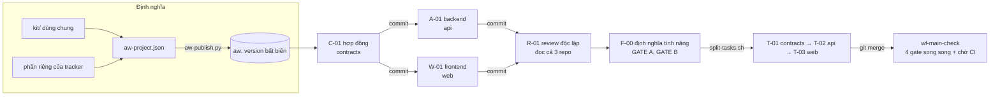

# Xây một sản phẩm hoàn chỉnh bằng Agent Kit (`aw`) — Issue tracker 3 repository

Hướng dẫn từng bước, từ một thư mục trống đến một sản phẩm chạy được: **issue tracker** gồm ba repository, do AI agent
(Claude CLI) viết, máy kiểm tra, người duyệt, `aw` ghi bằng chứng và tạo commit. Khác với
[hướng dẫn todolist](../todolist-spring-react/README.md) (một repository, một ứng dụng nhỏ), ví dụ này dùng gần như
**mọi cơ chế của `aw` cùng lúc**: nhiều repository, hợp đồng làm gốc, task chạy song song, reviewer độc lập, đổi
yêu cầu giữa chừng, kiểm tra nhánh chính có chờ tín hiệu CI.

> Người mới với `aw`: đọc [aw-entities.md](../aw-entities.md) (các thực thể, quan hệ và vòng đời, có sơ đồ) trước khi vào các bước.

Mọi thứ dùng chung (script vận hành, policy, skill, workflow mẫu, Layer của stack) lấy từ [`kit/`](../../../kit/README.md).
Thư mục này chỉ giữ phần **riêng của issue tracker**: [`aw-project.json`](aw-project.json), ba Layer hợp đồng, một skill,
năm workflow, năm script kiểm tra, sáu file WorkItem mẫu và [`repo-template/`](repo-template) (khung ban đầu của ba repository).

## Mục lục

- [0. Phạm vi kiểm chứng](#0-phạm-vi-kiểm-chứng)
- [1. Sản phẩm và cách chia](#1-sản-phẩm-và-cách-chia)
- [2. Bước 0 — Môi trường](#2-bước-0--môi-trường)
- [3. Bước 1 — Dựng ba repository](#3-bước-1--dựng-ba-repository)
- [4. Bước 2 — Tạo project, đăng ký repository, readiness](#4-bước-2--tạo-project-đăng-ký-repository-readiness)
- [5. Bước 3 — Định nghĩa: kit + phần riêng, rồi publish](#5-bước-3--định-nghĩa-kit--phần-riêng-rồi-publish)
- [6. Bước 4 — Hợp đồng trước (C-01)](#6-bước-4--hợp-đồng-trước-c-01)
- [7. Bước 5 — Backend và frontend song song (A-01, W-01)](#7-bước-5--backend-và-frontend-song-song-a-01-w-01)
- [8. Bước 6 — Review độc lập (R-01)](#8-bước-6--review-độc-lập-r-01)
- [9. Bước 7 — Đổi yêu cầu: tính năng bình luận (F-00, T-01…T-03)](#9-bước-7--đổi-yêu-cầu-tính-năng-bình-luận-f-00-t-01t-03)
- [10. Bước 8 — Merge và kiểm tra nhánh chính](#10-bước-8--merge-và-kiểm-tra-nhánh-chính)
- [11. Bước 9 — Vận hành: hủy, chạy lại, sao lưu, UI](#11-bước-9--vận-hành-hủy-chạy-lại-sao-lưu-ui)
- [12. Bài học từ lần chạy thật](#12-bài-học-từ-lần-chạy-thật)
- [13. Bản đồ: tính năng `aw` được dùng ở đâu](#13-bản-đồ-tính-năng-aw-được-dùng-ở-đâu)

---

## 0. Phạm vi kiểm chứng

Bản này được chạy thật trên **Linux** (container, sandbox có proxy chặn một phần mạng), `aw` build từ repo này, Claude
CLI 2.1.292 (`sonnet`, `acceptEdits`, effort `medium`, ngân sách 3 USD mỗi attempt), JDK 21, Maven, Node 22, npm 10,
`jq` 1.7, Python 3.11.

**Đã chạy thật với agent thật** (transcript trong tài liệu lấy từ các lần chạy này):

| Việc | Kết quả |
| --- | --- |
| Tạo project, đăng ký 3 repository, readiness profile, publish (kit + riêng) | Chạy; publish lại không đổi gì |
| C-01: hợp đồng OpenAPI (2 vòng sửa vì lint, rồi qua compat, người duyệt) | Chạy, commit ở `contracts` |
| A-01 (api) ‖ W-01 (web): hai task song song, mỗi task một repository | Chạy; mỗi task có một vòng sửa vì test đỏ; web có thêm một vòng vì conformance |
| R-01: reviewer độc lập (CHECKER) + người duyệt | Chạy; xem 8.2 về hai lần hỏng đầu |
| F-00 → tài liệu tính năng → T-01 (contracts), T-02 (api), T-03 (web) | Chạy; T-02 có một vòng sửa vì gate đỏ |
| Merge ba repository, `mvn test` (25 test), `npm test` (28 test), `npm run build` | Xanh |
| `wf-main-check`: `FORK` 4 gate → `JOIN` → `WAIT` tín hiệu CI, cả khi đỏ (`.env` lọt vào) lẫn khi xanh | Chạy |
| Hủy run, hủy WorkItem, chạy lại trên chính WorkItem, `aw-maintenance backup/restore` | Chạy |

Chi phí provider báo cáo cho toàn bộ phần này: **xấp xỉ 7 USD** (cộng các lần chạy của run thành công và run hỏng, chưa
kể một run W-01 bị hủy giữa chừng).

**Chưa chạy** (đừng coi là đã kiểm chứng):

- **Cypress/e2e**: tải binary Cypress bị chặn trong môi trường này. Cách thêm node e2e nằm ở
  [add-e2e-cypress-node.md](../todolist-spring-react/add-e2e-cypress-node.md) (chỉ là tài liệu, chưa chạy).
- **`ENFORCED_ISOLATED` / sandbox**: `aw doctor` báo `ENFORCED_ISOLATED is not available in this environment`. Mọi lần
  chạy ở đây dùng `OPERATOR_TRUSTED_LOCAL`.
- **Windows, macOS**, **Codex**, chế độ quyền khác `acceptEdits`.
- **Giao diện web của `aw`** thao tác bằng tay: UI được build và `aw serve --ui-dist` chạy thử trên loopback, nhưng chưa
  có ai bấm qua từng màn hình trong lần chạy này.
- **Scope expansion** và **`aw version diff`** không chạy lại ở ví dụ này: xem
  [operations.md](../todolist-spring-react/operations.md) (mục 6; `aw version diff` ở mục về thay đổi quy trình), đã kiểm chứng ở đó. Ví dụ này
  dùng cách khác để cấp quyền nhiều repository: khai scope ngay lúc tạo gốc (mục 10.1).
- Ứng dụng sinh ra **chưa chạy end-to-end trên trình duyệt**: backend và frontend được kiểm bằng test của chúng và bằng
  script conformance, chưa có kiểm tra tự động nối frontend với backend thật.

---

## 1. Sản phẩm và cách chia

Issue tracker: tạo, xem, sửa, đổi trạng thái (`OPEN → IN_PROGRESS → DONE`), xóa, lọc issue; đợt sau thêm bình luận trên
từng issue. Ba repository:

| Repository | Nội dung | Component | Ai viết | Kiểm tra bằng |
| --- | --- | --- | --- | --- |
| `contracts` | `spec/openapi.json` (hợp đồng API) và `docs/features/…` | `spec`, `docs` | agent `contract` | `cmd-contract-lint`, `cmd-contract-compat` |
| `api` | Java 21, Spring Boot, SQLite, Flyway (`backend/`) | `backend`, `docs` | agent `api` | `cmd-api-test` (Maven), `cmd-api-conformance` |
| `web` | React, Vite, TypeScript (`frontend/`) | `frontend`, `docs` | agent `web` | `cmd-web-test` (npm), `cmd-web-conformance` |

**Hợp đồng là gốc.** `api` và `web` không bao giờ nói chuyện trực tiếp: cả hai chỉ đối chiếu với `spec/openapi.json`.
Nhờ vậy hai task chạy song song được, và có máy kiểm tra thay vì lời hứa: `api-conformance` so route trong code với
spec, `web-conformance` so mọi lời gọi `fetch` với spec; `contract-compat` chặn thay đổi phá vỡ hợp đồng đã commit.



Một quyết định thiết kế quan trọng, rút ra từ lần chạy thật: **một WorkItem chỉ có một nhánh ghi** (xem 12). Muốn song
song ở hai repository, tạo hai WorkItem anh em (mỗi cái một repository), không đặt hai agent ghi vào hai repository
trong cùng một WorkItem bằng `FORK`.

---

## 2. Bước 0 — Môi trường

Công cụ, cách build `aw` và cách chạy `aw serve`/`aw worker` giống hệt hướng dẫn todolist:
[mục 2 của README todolist](../todolist-spring-react/README.md#2-bước-1--chuẩn-bị-môi-trường-và-repository). Ở đây chỉ
ghi những gì khác hoặc đáng nhắc:

```bash
go build -o ~/bin/aw ./cmd/aw && go build -o ~/bin/aw-maintenance ./cmd/aw-maintenance
export KIT=~/src/aw/kit  GUIDE=~/src/aw/docs/guides/issue-tracker  AW_KIT=$KIT
export PATH="$KIT/scripts:$PATH"
export AW_DB=~/aw/aw.db AW_ARTIFACT_ROOT=~/aw/artifacts AW_WORKSPACE_ROOT=~/aw/workspaces
aw worker --db "$AW_DB" --artifact-root "$AW_ARTIFACT_ROOT" --workspace-root "$AW_WORKSPACE_ROOT" \
  --claude-executable "$(command -v claude)" --env-allowlist PATH,HOME \
  --claude-permission-mode acceptEdits --claude-effort medium --claude-max-budget-usd 3 &
```

`AW_KIT` bắt buộc khi chạy tay các script của kit (script lệnh nhúng thư viện từ đó). `aw doctor` phải `HEALTHY`:

```text
status: HEALTHY
  - provider:claude [CAPABILITY] HEALTHY: observed executable fingerprint sha256:a967e7b1…
  - provider_environment:claude [CAPABILITY] HEALTHY: … inherits only the variable names: HOME, PATH
  - isolation_enforcement [CAPABILITY] HEALTHY: OPERATOR_TRUSTED_LOCAL isolation is enforceable; ENFORCED_ISOLATED is
    not available in this environment (no real OS-level sandbox yet) and any node pinned to it fails close
```

> **Mạng.** Agent chỉ thấy `PATH` và `HOME`, nên `mvn`/`npm` trong **Command** (không phải agent) cần biến proxy và CA
> nếu máy bạn đi qua proxy. `kit/scripts/aw-publish.py` đã thêm `http_proxy`, `https_proxy`, `no_proxy`,
> `NODE_EXTRA_CA_CERTS`, `SSL_CERT_FILE` vào `envAllowlist` mặc định của Command. Máy không có proxy thì không ảnh hưởng gì.

Muốn xem bảng điều khiển: build UI (`cd web && pnpm install && pnpm build`) rồi
`aw serve … --ui-dist web/dist --port 18080` và mở `http://127.0.0.1:18080/ui/` **trên cùng máy**. `aw serve` chỉ bind
loopback và từ chối `Host` lạ (`{"error":"invalid_host"}`), và UI không có đăng nhập: đừng mở nó ra ngoài mạng.

---

## 3. Bước 1 — Dựng ba repository

Khung ban đầu (CLAUDE.md, `.gitignore`, `pom.xml` + migration baseline + test khung cho `api`, `spec/openapi.json` rỗng
cho `contracts`) nằm ở [`repo-template/`](repo-template). Mỗi repository là một Git repo thường, nhánh `main`:

```bash
for r in contracts api web; do
  mkdir -p ~/work/$r && cp -R "$GUIDE/repo-template/$r/." ~/work/$r/
  mv ~/work/$r/gitignore ~/work/$r/.gitignore          # tên không có dấu chấm để không bị ignore khi nằm trong repo aw
  git -C ~/work/$r init -q -b main && git -C ~/work/$r add -A && git -C ~/work/$r commit -qm "Khung tracker-$r"
done
```

Hai điều cần để `aw` làm việc được ở repository này: mỗi repository có **ít nhất một commit** trên `defaultRef`, và
thư mục cấp một là **component** (`spec`, `backend`, `frontend`, `docs`): đó là đơn vị mà Layer, scope và pack gắn vào.
`CLAUDE.md` của mỗi repo chỉ nói ngắn gọn "repo này thuộc hợp đồng nào, đừng commit"; quy ước thật nằm trong Layer.

---

## 4. Bước 2 — Tạo project, đăng ký repository, readiness

```bash
mkdir -p ~/aw/tracker && cd ~/aw/tracker              # nơi đặt aw-state.json
init-project.sh tracker contracts ~/work/contracts    # repository chính
add-repository.sh api ~/work/api
add-repository.sh web ~/work/web
```

```text
repository contracts: ACTIVE
  component spec (spec)
  component docs (docs)
repository api: ACTIVE
  component docs (docs)
  component backend (backend)
repository web: ACTIVE
  component docs (docs)
  component frontend (frontend)
```

Id repository là **duy nhất trên cả bản cài**, nên đừng đặt `api` nếu một project khác đã dùng; ở đây mỗi bản cài chỉ
có một tracker. `aw-state.json` ghi `projectId` và repository chính để các script sau dùng.

**Readiness profile** là lệnh mà `aw` chạy trên mỗi worktree mới (baseline) trước khi giao task, để một worktree đã đỏ từ
đầu không bị đổ lỗi cho agent:

```bash
jq -n '{verification: {executable: "python3", argv: ["-c", "import json; json.load(open(\"spec/openapi.json\"))"], timeoutSeconds: 60}}' \
  | aw repository readiness set --idempotency-key readiness-contracts contracts
jq -n '{verification: {executable: "sh", argv: ["-c", "cd backend && mvn -q -B test"], timeoutSeconds: 900}}' \
  | aw repository readiness set --idempotency-key readiness-api api
```

Ở lần chạy này chỉ `contracts` và `api` có profile; `web` không đặt (baseline của nó báo `NOT_REQUIRED`). Repository không có
profile thì không bị chặn gì; muốn baseline cho `web`, thêm một profile tương tự với `setup` cài npm và `verification` là `npm test`.

---

## 5. Bước 3 — Định nghĩa: kit + phần riêng, rồi publish

Toàn bộ định nghĩa nằm trong một file khai báo, [`aw-project.json`](aw-project.json). Đọc nó từ trên xuống:

```json
{
  "prefix": "trk-",
  "repository": "contracts",
  "kit": {"path": "../../../kit/kit.json", "version": "1"},
  "provider": {"key": "claude", "model": "sonnet", "configIdentity": "trk-claude", "envAllowlist": ["HOME", "PATH"]},
  …
}
```

- **`kit`**: nhận về từ kho dùng chung các thứ đã có version và dùng lại được: Layer stack
  (`layer-stack-spring-sqlite`, `layer-stack-react-vite`), skill `skill-maker`, `skill-feature-flow`, `skill-review`,
  `skill-code-review`, các policy `attempt`/`permission`/`completion`, và hai workflow mẫu. Chúng được publish **một lần
  cho cả bản cài** với tiền tố `kit-`; project thứ hai publish lại sẽ thấy `0 version mới` (đã kiểm chứng ở todolist).
- **Layer riêng** (3 file trong [`definitions/layers/`](definitions/layers)): `layer-openapi-contract` (cách viết hợp đồng,
  thay đổi chỉ cộng thêm), `layer-api-contract-first` và `layer-web-contract-first` (hiện thực **đúng** hợp đồng,
  không thêm endpoint). Mỗi Layer chọn theo `componentTags`, nên agent ở `backend` không nhận quy ước của `frontend`.
- **Pack** gán Layer vào component: `pack-contracts → spec`, `pack-api → backend`, `pack-web → frontend`. Đây là cách
  một agent nhận đúng tri thức mà không ai phải liệt kê tay trong từng task.
- **Agent** (mỗi cái một `CONTEXT policy` = danh sách resource của riêng nó): `agent-contract`, `agent-api`, `agent-web`,
  `agent-reviewer` (không nhận quy trình viết code của `skill-maker`; nhận Layer, skill review và `rules.threat-model`) và bảy agent của luồng định nghĩa tính năng (agent luồng và `agent-reviewer` lấy bản mẫu của kit bằng `"from": "kit"`, project chỉ cộng phần riêng bằng `addResources`). Mọi agent nhận thêm `rules.decisions` và `rules.finish` (skill `skill-dev-rules` của kit); agent viết code nhận thêm `rules.no-shortcuts`, `rules.principles`, `rules.stable-artifacts`; agent có thể hỏi người nhận `ask.analysis-first`, `ask.question-groups` (skill `skill-ask`). Agent BRAINSTORM nhận thêm `skill-brainstorm` (vấn đề gốc, phương án, giả định), agent SPEC nhận `skill-spec` (thách thức phạm vi, phủ tình huống), agent DESIGN nhận `skill-design` (kiểm chứng khẳng định về code, đánh đổi, phản biện), agent FRAME và PLAN nhận `skill-plan` (chọn lane có bằng chứng, plan đủ cụ thể; PLAN dùng chung `design.verify-claims`). Agent viết code (`agent-api`, `agent-web`, BUILD) nhận `skill-build`, `skill-debug` (vòng sửa) và `skill-test`; `agent-contract` nhận `skill-debug`. Agent SYNC nhận `skill-docs` (khi nào và cách cập nhật tài liệu). Năm layer của kit chắt lọc từ ClaudeKit đi theo component: `layer-api-design` (`backend`, `spec`), `layer-sql-quality` và `layer-backend-security` (`backend`), `layer-react-quality` và `layer-frontend-testing` (`frontend`); selector `componentTags` giữ cho agent `api` không nhận quy ước React và ngược lại. `agent-reviewer` nhận `skill-code-review` (đã ghim theo ClaudeKit: dò edge case, danh sách rà) và `skill-security` (chỉ khi task có `riskLevel: HIGH`). Các skill này chắt lọc từ ClaudeKit, xem `origin` trong `kit.json`.
- **Command và Gate**: lệnh nào thuộc repository nào được khai ở đây. Script riêng (`contract-lint.sh`, `api-conformance.sh`…)
  nằm ở [`commands/`](commands); ba script chung (`secrets-gate`, `reject`, `check-feature-docs`) và hai runner
  `cmd-maven-test`/`cmd-npm-test` lấy từ kit. Có **ba gate bí mật** (một mỗi repository) và một gate `spec hợp lệ`.
- **Workflow**: năm cái riêng và bốn cái lấy từ kit, cộng bốn bản của hai workflow mẫu V10-14 (`wf-task-delivery-plus-api|web`: thêm node chẩn đoán khi gate đỏ và review độc lập; `wf-bugfix-api|web`: test tái hiện phải đỏ trước khi sửa; xem [kit/README](../../../kit/README.md#workflow-mẫu-có-chẩn-đoán-review-độc-lập-và-sửa-lỗi-v10-14)). Hai cơ chế của kit làm việc này gọn:
  - `{"id": "cmd-api-test", "from": "kit:cmd-maven-test", "repository": "api"}`: **một mẫu, nhiều bản** gắn vào repository khác nhau.
  - `{"id": "wf-task-delivery-api", "from": "kit:wf-task-delivery", "bind": {"command:cmd-gate1": "cmd-api-test", …}}`:
    **một workflow mẫu, nhiều bản** gắn Command khác nhau (contracts / api / web), thay vì copy ba lần.
  - `argRepositories: ["contracts"]` trên `cmd-api-conformance`: script nhận thêm đường dẫn worktree của `contracts`
    làm tham số, để đọc `spec/openapi.json` mà không cần ghi vào repo đó.

Kiểm tra trước, rồi publish:

```bash
aw-publish.py --check "$GUIDE/aw-project.json"
aw-publish.py "$GUIDE/aw-project.json"
```

```text
CẢNH BÁO: skills/skill-code-review: giấy phép chưa xác định (origin: claudekit/code-review 2.0.0 …) — xác nhận trước khi chia sẻ
OK: …/issue-tracker/aw-project.json hợp lệ (11 agent, 12 command, 9 workflow; kit 1.5.0)
```

Cảnh báo giấy phép là chủ ý: skill `code-review` do người dùng cung cấp, chưa rõ giấy phép nên kit đánh dấu `UNKNOWN`.
`aw-publish.py` in ra từng định nghĩa kèm id (`LAYER trk-layer-openapi-contract ccdba512-…`) và `Xong. Trạng thái đã
ghi vào ./aw-state.json`. Sửa một file rồi publish lại chỉ tạo **version mới** của đúng cái đã đổi.

> Một WorkItem **ghim** version workflow tại lúc tạo. Publish workflow mới không ảnh hưởng WorkItem đang chạy; muốn dùng
> bản mới thì tạo WorkItem mới (hoặc, với `run-task.sh`, đổi nội dung task để khóa idempotency khác đi).

---

## 6. Bước 4 — Hợp đồng trước (C-01)

Tạo gốc (một TaskFamily, mỗi repository một worktree và một branch `agentkit/w-…`), rồi chạy task hợp đồng:

```bash
create-root.sh "Đợt MVP: issue tracker" api=WRITE web=WRITE   # contracts WRITE; api, web WRITE ở gốc
run-task.sh "$GUIDE/work-items/c-01-contract.json" wf-contract-change
```

```text
root 49e4370b-…   family 0656f9b0-…
workspace: READY
baseline api: PASS
baseline contracts: PASS
baseline web: NOT_REQUIRED
```

**Quyền ở gốc là trần của cả đợt.** Repository bổ sung mặc định chỉ READ; task con muốn ghi vào `api` hay `web` thì gốc phải khai
`api=WRITE`, `web=WRITE`. Nếu quên, tạo task con bị từ chối: `child effective scope exceeds approved family scope`. Gốc chỉ để
kiểm tra (mục 10.2) thì READ là đủ.

[`c-01-contract.json`](work-items/c-01-contract.json) là một **WorkItem**: `effectiveScope` (chỉ `contracts`, chỉ thư mục
`spec`, quyền WRITE), `behavior`, `verificationSpec` và các `acceptanceCriteria`. `wf-contract-change` là:
`contract` (AGENT) → `lint` (COMMAND) → `compat` (COMMAND) → `review` (APPROVAL của người), với đường `needs-info`
nếu agent cần hỏi lại.

```text
Run: 25dbcd50-…  state: RUNNING
  #2 contract (vòng 0): SUCCEEDED done
  #3 lint (vòng 0): SUCCEEDED failed          ← máy từ chối, lỗi trả về cho agent
  #4 contract (vòng 1): SUCCEEDED done
  #5 lint (vòng 1): SUCCEEDED failed
  #6 contract (vòng 2): SUCCEEDED done
  #7 lint (vòng 2): SUCCEEDED passed
  #8 compat (vòng 0): SUCCEEDED passed
  #9 review (vòng 0): WAITING
  provider báo cáo: 55615 token vào, 17458 token ra, 0.4894 USD
  CHỜ DUYỆT node review: review-task.sh 25dbcd50-… <approved|rejected|revise> ["phản hồi"]
```

Đây là chỗ thấy rõ giá trị của kiểm tra bằng máy: hai lần agent viết spec chưa hợp lệ (lint bắt được), không ai phải đọc
hộ. `evidence list` cho thấy từng lần: `COMMAND_EXECUTION FAILED, FAILED, SUCCEEDED, SUCCEEDED`. Xem spec trong worktree
(`worktree-path.sh contracts`), rồi duyệt và commit:

```bash
review-task.sh 25dbcd50-… approved "Hợp đồng đủ 6 operation"
commit-task.sh "C-01: hợp đồng API cho quản lý issue"
# repository contracts: {"state":"COMMITTED","parentVcsObjectId":"e8fc7e6…","resultVcsObjectId":"f598e9b…"}
```

`commit-task.sh` tạo một ReleaseSet, seal rồi tạo **local commit thật** trên branch của family, mỗi repository có thay đổi
một commit, bỏ qua repository không đổi. `aw` không push và không merge (mục 10).

---

## 7. Bước 5 — Backend và frontend song song (A-01, W-01)

Hai WorkItem anh em, mỗi cái một repository, cùng đọc hợp đồng đã commit. Mở hai terminal (hoặc chạy nền):

```bash
run-task.sh "$GUIDE/work-items/a-01-api.json" wf-api-feature  &
run-task.sh "$GUIDE/work-items/w-01-web.json" wf-web-feature  &
wait
```

Scope của A-01: `api` WRITE (chỉ thư mục `backend`), `contracts` READ (để đọc hợp đồng). Của W-01: `web` WRITE (chỉ `frontend`), `contracts` READ. Hai task không có quyền gì trên repository của nhau. `wf-api-feature` =
`implement` (AGENT) → `test` (COMMAND `mvn test`) → `conformance` (COMMAND) → `end`; thất bại ở `test` hay
`conformance` thì quay lại `implement` kèm lỗi, tối đa theo `policy-attempt`.

```text
A-01   #2 implement: done  #3 test: failed  #4 implement: done  #5 test: passed  #6 conformance: passed  → SUCCEEDED
       70341 token vào, 32707 token ra, 0.7456 USD
W-01   #2 implement  #3 test: failed  #5 test: passed  #6 conformance: failed  #8 test: passed  #9 conformance: passed
       57505 token vào, 7004 token ra, 0.4195 USD
```

W-01 là ví dụ đáng xem: test của chính agent đã xanh, nhưng `web-conformance` vẫn bắt được lời gọi API lệch hợp đồng,
nên có thêm một vòng sửa. **Không có node `GATE 2` ở đây**: với task có `policy-completion-human`, bước duyệt diff và
commit làm bằng `review-task.sh`/`commit-task.sh` sau khi run xong, như ở C-01.

Khi cả hai xong, `commit-task.sh` commit một lần cho cả hai repository:

```text
repository api: COMMITTED   (8971f33)
repository web: COMMITTED   (64df325)
```

> **Thứ tự quan trọng.** Task đọc một repository mà repository đó còn **thay đổi chưa commit** từ task khác sẽ bị
> `SCOPE_VIOLATION` (xem 8.2). Quy tắc: xong task thì commit, rồi mới chạy task sau hoặc review.

---

## 8. Bước 6 — Review độc lập (R-01)

### 8.1 Workflow

`wf-code-review`: `ai-review` (AGENT, vai **CHECKER**, chỉ đọc) → `review` (APPROVAL của người). Reviewer là một agent
khác (`agent-reviewer`) với tri thức khác: không có `skill-maker` (cách viết code), mà có `skill-review` và `skill-code-review`
(lấy từ kho kit: bộ checklist chắt lọc từ skill `code-review` của claudekit). Scope: cả ba repository đều **READ**.

```bash
run-task.sh "$GUIDE/work-items/r-01-review.json" wf-code-review
review-task.sh <runId> approved "Đồng ý, các điểm Minor ghi nhận cho vòng sau"
```

Reviewer phải kết thúc bằng một **marker outcome** (`approved` hoặc `rework`). Kết luận thật của lần chạy này (rút gọn
bằng `agent-log.py <runId>`):

```text
Phát hiện (không có Critical hay Important):
- [Minor] frontend/src/hooks/useIssues.ts:32-64 — `create` và `changeStatus` dùng `filter` từ closure …
- [Minor] frontend/src/App.test.tsx:113-126 — chỉ có test hiển thị `detail` của Problem cho đường POST …
- [Minor] backend/…/IssueService.java:54 — PUT bỏ qua `priority` khi null … chưa có test.
Đối chiếu acceptance criteria: 1. Backend: đúng 6 operation … 2. Frontend … 3. Phạm vi: không có file ngoài phạm vi.
Chưa kiểm chứng được vì chỉ đọc: chưa chạy `mvn test`, `npm test`; chưa xem `git diff`.
```

Lưu ý phần cuối: reviewer **nói rõ cái gì nó không kiểm chứng được** (không có quyền chạy lệnh). Đó là thông tin mà
người duyệt cần, và là lý do review của agent không thay cho gate chạy máy.

### 8.2 Hai lần hỏng trước khi qua

1. **`SCOPE_VIOLATION`**: lần đầu chạy review khi A-01/W-01 chưa commit. `aw` phát hiện thay đổi (30 path) trong repository
   mà task chỉ có quyền READ và hủy attempt. Sửa: commit trước, rồi chạy review. WorkItem hỏng được hủy bằng
   `aw work-item cancel --reason … --yes <id>` và tạo lại với tiêu đề khác (khóa idempotency khác).
2. **`VALIDATION_FAILED`**: agent đã review xong nhưng tin nhắn **cuối** không có marker (nó viết "marker ở tin trước").
   `aw` chỉ đọc tin cuối. Sửa hai tầng: `skill-review` nay nói rõ "marker phải ở cuối chính tin nhắn cuối cùng", và
   `retry-task.sh <workItemId> "ghi chú"` chạy lại **trên chính WorkItem đó** (lịch sử và evidence ở một chỗ, blocker cũ
   được gỡ). Lần retry qua, `approved`, chi phí 0.3562 USD.

---

## 9. Bước 7 — Đổi yêu cầu: tính năng bình luận (F-00, T-01…T-03)

Yêu cầu mới giữa chừng: "bình luận trên từng issue". Quy trình không đổi; đây là cách `aw` chứng minh nó xử lý được thay
đổi trên hệ thống đã có.

### 9.1 Định nghĩa tính năng (F-00) — hai cổng người

```bash
create-root.sh "…"            # hoặc dùng lại gốc hiện có
run-task.sh "$GUIDE/work-items/feature-comments.json" wf-feature-definition
```

`wf-feature-definition` (workflow mẫu của kit): `brainstorm` (AGENT) → `spec` (AGENT) → **GATE A** (người duyệt spec) →
`design` (AGENT) → `check-docs` (COMMAND: mọi tài liệu và `tasks.json` đúng schema) → **GATE B** (người duyệt thiết kế).
Scope chỉ cho ghi tài liệu (`docs` ở `contracts`); `api` và `web` là READ để agent đọc code hiện có khi thiết kế.

```text
#2 brainstorm: done   #3 spec: done   #4 gate-a: WAITING          ← 02-spec.md: 12 quy tắc BR-1…BR-12, 14 AC Given/When/Then
review-task.sh 4dd24e8c-… approved "Spec đủ, duyệt"
#5 design: done   #6 check-docs: passed   #7 gate-b: WAITING      ← 03-design.md + tasks.json (T-01, T-02, T-03)
```

Spec do agent viết có cả các hạn chế đã biết (BR-12: chưa có xác thực nên ai cũng xóa được mọi bình luận) và phạm vi
**ngoài** (sửa bình luận, phân trang): người duyệt đọc những dòng này, không chỉ đọc phần "sẽ làm".

**Checklist cho người duyệt GATE A** (đọc `02-spec.md`; duyệt `approved`, hoặc `revise` kèm phản hồi cụ thể):

1. **Phạm vi và lý do**: spec nêu cái gì đã có, thay đổi tối thiểu và chế độ phạm vi (giữ, thu hẹp, mở rộng) mà agent chọn. Bạn đồng ý với chế độ đó không? Phần "ngoài phạm vi" có đúng ý bạn không?
2. **Quyết định agent tự chốt**: mỗi quyết định ghi rõ ai chốt. Cái nào là của agent mà bạn chưa đồng ý thì `revise` ngay ở đây, vì thiết kế và task sẽ dựa vào nó.
3. **Acceptance criteria**: có đường lỗi và giá trị biên (rỗng, dài tối đa, không tồn tại) hay chỉ có đường thành công? Mỗi AC có kiểm chứng được bằng một test tự động không?
4. **Tình huống bị bỏ**: mục "Hạn chế đã biết" liệt kê các tình huống không thành AC. Có cái nào bạn thấy phải thành AC không?
5. **Quy tắc và AC khớp nhau**: mỗi quy tắc nghiệp vụ có ít nhất một AC; không có hai AC mâu thuẫn.

**Checklist cho người duyệt GATE B** (đọc `03-design.md` và `tasks.json`; duyệt `approved`, hoặc `revise` kèm phản hồi cụ thể):

1. **Khẳng định về code có kiểm chứng**: các tên file, hàm, endpoint trong thiết kế có kèm `file:dòng` không? Chỗ nào còn `[CHƯA XÁC MINH]` thì thiết kế dựa vào thứ chưa ai kiểm.
2. **Quyết định và phương án đã loại**: mỗi quyết định quan trọng nêu ít nhất hai phương án, đánh đổi và lý do loại. Bạn có đồng ý với đánh đổi đó không?
3. **Luồng dữ liệu, rủi ro, hoàn tác, tương thích ngược**: có đủ bốn mục này không, và rủi ro cao có cách giảm cụ thể không?
4. **Phản biện**: mục "Phản biện" ghi điểm yếu nào đã sửa, điểm nào chấp nhận (lý do), điểm nào bác (nguồn kiểm chứng), và kết luận GO, CAUTION hay STOP. CAUTION thì điều kiện có chấp nhận được không?
5. **`tasks.json`**: thứ tự theo phụ thuộc; không hai task cùng sửa một file hoặc một migration; mỗi task có hành vi, AC đo được, mức rủi ro; số task ít nhất có thể (mỗi task là một lần review và một commit).

Sau GATE B, commit
tài liệu rồi chia việc:

```bash
commit-task.sh "F-00: tài liệu tính năng bình luận"
split-tasks.sh comments ~/aw/tasks        # sinh T-01.json, T-02.json, T-03.json từ docs/features/comments/tasks.json
```

`split-tasks.sh` đọc `tasks.json` đã duyệt và sinh một WorkItem cho mỗi task; trường `repository` của từng task quyết
định repository ghi, repository còn lại thành READ.

### 9.2 Ba task: hợp đồng → backend → frontend

```bash
run-task.sh ~/aw/tasks/T-01.json wf-task-delivery-contracts   # duyệt, rồi commit-task.sh
run-task.sh ~/aw/tasks/T-02.json wf-task-delivery-api         # duyệt, rồi commit-task.sh
run-task.sh ~/aw/tasks/T-03.json wf-task-delivery-web         # duyệt, rồi commit-task.sh
```

`wf-task-delivery-*` (một mẫu, ba bản gắn lệnh): `frame` (AGENT, chọn lane) → `plan` → `build` → `gate1` (COMMAND build+test) →
`quality` (COMMAND tĩnh) → `gate2` (người duyệt diff). T-01 xong ngay (hợp đồng lên `0.2.0`, chỉ cộng thêm: `contract-compat`
PASS). T-02 là ví dụ vòng sửa:

```text
#4 build: done  #5 gate1: failed  #6 build (vòng 1): done  #7 gate1: passed  #8 quality: passed  #9 gate2: WAITING
provider báo cáo: 116603 token vào, 28605 token ra, 0.9484 USD
```

Kết quả: bảng `comments` (migration `V3`, khóa ngoại `ON DELETE CASCADE`), 14 test bình luận ngoài 10 test issue, và
28 test frontend (có `CommentForm`).

### 9.3 Vì sao T-02 và T-03 chạy **tuần tự**

Lần đầu tôi chạy T-02 ‖ T-03 như A-01 ‖ W-01. **Cả hai hỏng** vì `SCOPE_VIOLATION`: bước `frame` của T-02 ghi
`docs/features/comments/tasks/T-02/frame.md` trong worktree `api`, và attempt `frame` của T-03 chạy cùng lúc thấy file đó
ở một repository mà nó chỉ có quyền READ (và ngược lại). A-01 ‖ W-01 chạy được vì scope của chúng **không có quyền gì** trên repository của nhau (chỉ `contracts` READ);
`split-tasks.sh` thì cấp READ cho **mọi** repository khác, nên mỗi task thấy repository của task kia.

Cách xử lý đúng quy trình: xóa file dở của task kia trong worktree (`rm` trong `worktree-path.sh web`), `retry-task.sh`
T-02 một mình, duyệt, **commit**, rồi `retry-task.sh` T-03 (`FORCE=1 commit-task.sh` vì T-03 còn BLOCKED mà chưa có gì
để commit). **Quy tắc rút ra: hai task anh em chỉ song song an toàn khi scope của chúng không chạm repository mà task kia ghi. Task do `split-tasks.sh` sinh (READ mọi repository khác, ghi `docs/` ngay bước đầu) thì chạy tuần tự; muốn song song, sửa `effectiveScope` của các file task cho hẹp lại.**

---

## 10. Bước 8 — Merge và kiểm tra nhánh chính

### 10.1 Merge là việc của Git

`aw` không push và không merge. Mỗi repository có một branch `agentkit/w-…` chứa các commit đã tạo; gộp bằng Git:

```bash
for r in contracts api web; do
  git -C ~/work/$r merge --no-ff $(git -C ~/work/$r branch --list 'agentkit/w-*' | tr -d '+* ') -m "Merge đợt MVP + bình luận"
done
```

Rồi chạy thật trên nhánh chính (đây là kiểm tra của người/CI, không phải của `aw`):

```text
mvn -B test     → CommentApiTests 14, IssueApiTests 10, TrackerApplicationTests 1: Failures 0, Errors 0, Skipped 0
npm test        → Test Files 4 passed, Tests 28 passed
npm run build   → dist/assets/index-….js 148.57 kB, built in 11.70s
```

### 10.2 `wf-main-check`

Một WorkItem chỉ đọc trên một gốc **mới** tách từ nhánh chính của cả ba repository, scope READ cả ba. Muốn gốc mới thấy cả
ba repository thì khai ngay lúc tạo gốc: `create-root.sh "…" api web` (nếu quên, `aw` từ chối:
`child effective scope exceeds approved family scope`).

```bash
create-root.sh "Kiểm tra nhánh chính (ba repository)" api web
run-task.sh "$GUIDE/work-items/main-check.json" wf-main-check
```

```text
#3 fork: SUCCEEDED
#4 secrets-api: passed   #5 secrets-contracts: passed   #6 secrets-web: passed   #7 spec: passed     ← bốn MACHINE_GATE song song
#4 join: joined
#5 ci: WAITING
  evidence NO_SECRET_FILES: PASS   NO_SECRET_FILES: PASS   NO_SECRET_FILES: PASS   SPEC_VALID: PASS
  CHỜ TÍN HIỆU node ci: aw wait signal --signal-key ci-green --idempotency-key <khóa> db5fad99-… 7ca7a4b4-…
```

Run đứng ở `WAIT` đến khi CI (hoặc bạn) báo xanh. Ở đây "CI" là các lệnh ở 10.1, rồi:

```bash
aw wait signal --signal-key ci-green --idempotency-key ci-build-1 \
  --payload '{"build":"local: mvn test 25 pass; npm test 28 pass; npm run build ok"}' db5fad99-… 7ca7a4b4-…
# {"state":"CONSUMED","won":true,"advanced":true,"nextNodeKey":"end"}   → run SUCCEEDED
```

### 10.3 Khi một gate đỏ

Commit nhầm `backend/.env` vào `api/main`, tạo gốc mới, chạy lại:

```text
Run: 82772149-…  state: FAILED
  #4 secrets-api (vòng 0): FAILED
  #5 secrets-contracts: passed   #6 secrets-web: passed   #7 spec: passed
  evidence NO_SECRET_FILES: FAIL     ← repository api; hai cái còn lại PASS
  BLOCKER RUN_FAILED đang mở
```

Run **không tới được node `WAIT`**: tín hiệu CI không thể "mua" một gate đỏ. Gỡ file (`git rm`), tạo gốc mới, chạy lại:
bốn gate PASS, gửi tín hiệu `ci-build-2` → `CONSUMED`.

---

## 11. Bước 9 — Vận hành: hủy, chạy lại, sao lưu, UI

- **Hủy run:** `aw run cancel <runId>` → `{"state":"CANCELLING",…}`. **Hủy WorkItem:**
  `aw work-item cancel --reason "…" --yes <workItemId>` → `"status": "CANCELLED"` (không có cờ `--project-id`). Đã dùng
  cho W-01 lần đầu (npm treo vì thiếu CA, xem 12) và R-01 lần đầu.
- **Chạy lại:** `retry-task.sh <workItemId> ["ghi chú cho agent"]` chạy lại trên chính WorkItem, **từ đầu workflow** (không
  tiếp nối node hỏng), worktree không bị reset: hoàn tác những gì run mới không nên thấy trước khi gọi.
- **Xem agent đã nói gì:** `agent-log.py <runId> [--node …] [--all] [--denied]` (đọc thẳng database, chỉ đọc;
  `aw` CLI hiện chưa có lệnh đọc lời của agent). `show-run.sh`, `watch-run.sh` in timeline, evidence, việc đang chờ người.
- **Sao lưu:** `aw-maintenance backup --db "$AW_DB" --out ~/aw/backup` ghi `snapshot.db` + `manifest.json` (193 artifact).
  **Artifact và worktree không nằm trong đó**: sao chép `$AW_ARTIFACT_ROOT` riêng, rồi `restore`:

  ```bash
  cp -R "$AW_ARTIFACT_ROOT" ~/aw/restored-artifacts
  aw-maintenance restore --backup ~/aw/backup --into ~/aw/restored --artifact-root ~/aw/restored-artifacts
  # aw-maintenance: restore verified clean — every manifest entry is present and intact
  ```

  Nếu quên bước `cp`, `restore` báo thẳng `193 missing and 0 corrupt artifact(s)`: không im lặng.

Phần vận hành còn lại (scope expansion, baseline đỏ, worker chết, nâng cấp `aw`) ở
[operations.md](../todolist-spring-react/operations.md).

---

## 12. Bài học từ lần chạy thật

Mỗi mục là một lỗi **của hướng dẫn hoặc kit**, đã được sửa trong repo này sau khi gặp:

| Hiện tượng | Nguyên nhân | Sửa |
| --- | --- | --- |
| Hai agent ghi hai repository trong **một** WorkItem bằng `FORK` → `CONFLICT` | Một WorkItem chỉ có một nhánh ghi | Hai WorkItem anh em (mục 1, 7) |
| `aw definition validate`: "workflow targets 2 repositories … no PERMISSION policy grants `INTEGRATION_MULTI_REPOSITORY_WRITE`" | Workflow đụng nhiều repository cần policy cho phép | `policy-permission-multirepo`, gắn qua `bind` |
| `npm install` treo, rồi `SELF_SIGNED_CERT` | Command không có biến proxy/CA | Allowlist mặc định có thêm biến proxy/CA; `npm-test.sh` phát hiện lỗi mạng và thoát bằng **lỗi môi trường** (`aw_env_fail`), không gửi cho agent như lỗi code |
| Agent bị sai khi sửa "lỗi" thật ra là lỗi môi trường | Lỗi môi trường và lỗi code trộn nhau | `skill-maker`: dòng `MÔI TRƯỜNG:` nghĩa là dừng và hỏi (`needs_info`), không sửa code |
| `web-conformance` báo sai `/api/issues/1`, `/api/issues{}` | Chuẩn hóa path chưa đủ | Sửa hàm `norm` (template literal, id số) |
| Test của testing-library in mã màu ANSI, làm hỏng so khớp | Output có màu | `lib.sh` đặt `NO_COLOR`, `CI=true`, `FORCE_COLOR=0`, `COLORS=false` |
| `dev.routing-table` (bảng định tuyến của todolist) lọt vào reviewer | Chọn resource theo cả skill | Tách skill riêng; agent chọn `skill#key` cụ thể |
| Review trước khi commit → `SCOPE_VIOLATION` | Repository READ còn thay đổi chưa commit | Commit trước (mục 7) |
| Review xong nhưng `VALIDATION_FAILED` | Tin cuối thiếu marker outcome | `skill-review` nhắc rõ; `retry-task.sh` (8.2) |
| T-02 ‖ T-03 cùng `SCOPE_VIOLATION` | Task anh em ghi `docs/` vào repository của nhau khi chồng thời gian | Chạy tuần tự (9.3) |
| `create-root.sh` mới không thấy repository thứ hai/ba | Scope gốc chỉ có repository chính | Truyền `api web` khi tạo gốc (10.2) |
| Task T-02 bị từ chối ngay: `child effective scope exceeds approved family scope` (hướng dẫn cũ ghi gốc `api web`, chỉ READ) | Gốc chỉ cho READ trên `api` | Gốc đợt MVP khai `api=WRITE web=WRITE` (mục 6); phát hiện khi chạy bộ đo V10 |
| `provenance.license` bị `aw` từ chối | `provenance` chỉ nhận `owner/source/revision/lastVerified` | Giấy phép/xuất xứ chuyển sang `kit.json`; lint của `aw-publish.py` chặn trường lạ |
| Layer kit đặt `layer-react-vite` trùng id project todolist | Id định nghĩa duy nhất cả bản cài | Đổi thành `layer-stack-react-vite` |

---

## 13. Bản đồ: tính năng `aw` được dùng ở đâu

| Tính năng | Dùng ở | Kiểm chứng |
| --- | --- | --- |
| Project, nhiều repository, component | Mục 4 | Chạy thật |
| Readiness profile, baseline | Mục 4, `create-root.sh` | Chạy thật (`PASS`, `NOT_REQUIRED`) |
| Layer / Skill / Pack theo component | Mục 5 | Chạy thật |
| CONTEXT policy theo agent, `skill#key` | Mục 5 | Chạy thật |
| Kit dùng chung: `from kit`, `from kit:<id>`, `bind`, `argRepositories` | Mục 5 | Chạy thật + `kit/tests/check-kit.sh` |
| Workflow: `AGENT` MAKER, `COMMAND` + vòng sửa | C-01, A-01, W-01, T-0x | Chạy thật |
| `AGENT` CHECKER (độc lập) | R-01 | Chạy thật |
| `APPROVAL` (duyệt, từ chối, sửa, `needs-info`) | C-01, R-01, GATE A/B, `gate2` | Chạy thật (`approved`); `rejected`/`revise` xem todolist |
| `FORK`/`JOIN`, `MACHINE_GATE`, `ROUTER`, `WAIT` signal | `wf-main-check` | Chạy thật, đỏ lẫn xanh |
| Completion policy, evidence, assurance | Mọi run | Chạy thật (`evidence list`) |
| WorkItem gốc / con, TaskFamily, worktree mỗi repository | Mục 6–10 | Chạy thật |
| Scope, `SCOPE_VIOLATION`, `READ` repository khác | 7, 8.2, 9.3 | Chạy thật (lỗi thật) |
| ReleaseSet → local commit | `commit-task.sh` | Chạy thật |
| Hủy run/WorkItem, `retry`, blocker | 8.2, 9.3, 11 | Chạy thật |
| Pin version workflow vào WorkItem | Mục 5 | Quan sát thật |
| Backup / restore | Mục 11 | Chạy thật |
| UI (`aw serve --ui-dist`) | Mục 2 | Build và serve; chưa thao tác từng màn hình |
| Scope expansion, `version diff`, baseline đỏ, worker chết | — | Xem operations.md (agent giả lập) |
| `ENFORCED_ISOLATED` (sandbox thật) | — | **Chưa có** trong môi trường này |
| Cypress / e2e | — | **Chưa chạy** (mạng chặn) |
