# Phát triển phần mềm với Agent Kit (`aw`) — ví dụ Todolist (Spring Boot + SQLite + React)

Tài liệu này mô tả một quy trình tổng quát gồm 8 bước. Quy trình bắt đầu từ việc mô tả cách team đang làm việc, sau
đó biến cách làm đó thành workflow của `aw` để AI agent (Claude CLI) làm theo một cách có kiểm soát: agent viết code,
máy kiểm tra, người duyệt, `aw` ghi lại bằng chứng và tạo commit. Mỗi bước đều có ví dụ chạy thật trên project
**todolist** (backend Java Spring Boot + SQLite, frontend ReactJS).

- **Phần 1** là bức tranh tổng thể: 8 bước, các khái niệm của `aw`, và agent thực sự nhận được gì.
- **Phần 2** là cài đặt: công cụ, repository, Claude CLI, `aw serve` / `aw worker`, project.
- **Phần 3, [Cách định nghĩa workflow cho project bất kỳ](#3-cách-định-nghĩa-workflow-cho-project-bất-kỳ)**, là phần
  dùng lại được cho project khác. Phần này đi từ bảng quy trình nghiệp vụ, qua ánh xạ sang node, tri thức của agent và
  script kiểm tra, tới bước publish bằng một file khai báo.
- **Phần 4** là công việc hằng ngày: viết task, chạy, duyệt, commit, merge.
- **Phần 5 và [operations.md](operations.md)** là vận hành: thay đổi quy trình, xem trạng thái, xử lý sự cố, bảo trì.

Bộ công cụ trong thư mục này **không gắn với todolist**. Mọi thứ riêng của todolist nằm trong
[`aw-project.json`](aw-project.json) và các file mà nó trỏ tới. Các script trong `scripts/` đọc file khai báo đó. Với
project khác, bạn copy `scripts/` rồi viết `aw-project.json` của riêng mình (mục 3.5).

> **Phạm vi kiểm chứng.** Mọi lệnh, file JSON và script ở đây đã được chạy với binary `aw` build từ commit `9e720ac`
> của nhánh `master`, trên Windows 10 trong Git Bash, từ một bản cài mới tinh.
>
> - **Chạy thật, từ đầu tới cuối:** Claude CLI 2.1.288 (`sonnet`; `opus` cho BRAINSTORM, SPEC, DESIGN), JDK 21,
>   Maven 3.9.9, Node 24, npm 11, `jq` 1.7.1. Gồm: tạo project, readiness profile, publish; đợt MVP (BE-01, FE-01,
>   FE-02, FS-01); tính năng "hạn chót" (F-00 rồi bốn task do agent chia); commit, merge; kiểm tra nhánh chính cả khi
>   xanh lẫn khi đỏ. Ứng dụng todolist do agent viết build được, test xanh, và API của nó đã được gọi thử. Transcript ở
>   Phần 4 và ở [feature-task-flow.md](feature-task-flow.md) lấy từ lần chạy này.
> - **Chạy với agent giả lập** (một chương trình nói đúng giao thức stream-json của Claude CLI và làm theo kịch bản):
>   những nhánh mà agent thật không tự đi vào theo yêu cầu. Gồm: vòng sửa hết ngân sách, sửa ngoài scope, NEEDS_INFO,
>   tài liệu sai schema, hủy run, worker chết, CLI đổi version, baseline đỏ, scope expansion; tức phần lớn
>   [operations.md](operations.md). Trong các lần chạy đó, script của node COMMAND là bản thế thân.
> - **Chưa chạy ở bản cập nhật này:** Linux và macOS (các script là script POSIX, bản trước của hướng dẫn chạy trên
>   Linux); chế độ quyền khác `acceptEdits`; Codex.
>
> Lần chạy thật cũng làm lộ ra vài lỗi của chính hướng dẫn, đã được sửa trước khi viết lại tài liệu: test của khung
> backend không chạy được trên Windows, script kiểm tra in lỗi ra stdout nên agent không nhận được, hướng dẫn của
> bước PLAN không đủ mạnh nên agent viết luôn code. Chúng được nhắc lại ở đúng chỗ vì là bài học dùng chung.

## Mục lục

- [1. Tổng quan](#1-tổng-quan)
- [2. Bước 1 — Chuẩn bị môi trường và repository](#2-bước-1--chuẩn-bị-môi-trường-và-repository)
- [3. Cách định nghĩa workflow cho project bất kỳ](#3-cách-định-nghĩa-workflow-cho-project-bất-kỳ)
  - [3.1 Bước 2 — Mô tả quy trình nghiệp vụ](#31-bước-2--mô-tả-quy-trình-nghiệp-vụ)
  - [3.2 Bước 3 — Ánh xạ sang node của aw](#32-bước-3--ánh-xạ-sang-node-của-aw)
  - [3.3 Bước 4 — Chuẩn bị tri thức cho agent](#33-bước-4--chuẩn-bị-tri-thức-cho-agent)
  - [3.4 Bước 5 — Chuẩn bị phần thực thi](#34-bước-5--chuẩn-bị-phần-thực-thi)
  - [3.5 Bước 6 — Khai báo và publish](#35-bước-6--khai-báo-và-publish)
  - [3.6 Tham chiếu các loại node](#36-tham-chiếu-các-loại-node)
  - [3.7 Checklist trước khi chạy task đầu tiên](#37-checklist-trước-khi-chạy-task-đầu-tiên)
- [4. Bước 7 — Viết task và chạy](#4-bước-7--viết-task-và-chạy)
- [5. Bước 8 — Vận hành và thay đổi](#5-bước-8--vận-hành-và-thay-đổi)
- [6. Giới hạn cần biết](#6-giới-hạn-cần-biết)
- [Chạy thử quy trình hai tầng tính năng → task (tài liệu riêng)](feature-task-flow.md)
- [Vận hành hằng ngày: xem trạng thái, xử lý sự cố, bảo trì (tài liệu riêng)](operations.md)
- [Thêm node test e2e bằng Cypress vào workflow (tài liệu riêng)](add-e2e-cypress-node.md)
- [Phụ lục A: các file trong thư mục này](#phụ-lục-a-các-file-trong-thư-mục-này)
- [Phụ lục B: quy ước viết sơ đồ Mermaid](#phụ-lục-b-quy-ước-viết-sơ-đồ-mermaid)

---

## 1. Tổng quan

### 1.1 Quy trình 8 bước

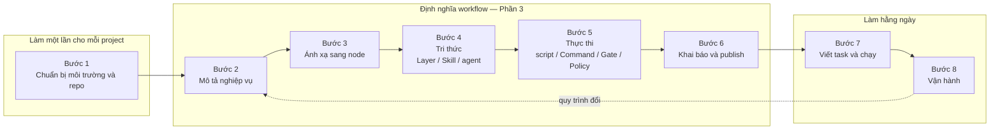

| Bước | Trả lời câu hỏi | Đầu ra | Trong ví dụ todolist |
|---|---|---|---|
| 1. Chuẩn bị | `aw` chạy ở đâu, làm việc trên repository nào? | `aw serve`/`aw worker`, project, repository `ACTIVE`, readiness profile, `aw-state.json` | [Phần 2](#2-bước-1--chuẩn-bị-môi-trường-và-repository), `init-project.sh` |
| 2. Mô tả nghiệp vụ | Việc đi qua những bước nào, ai làm, ai quyết định, thế nào là xong? | Bảng quy trình | [3.1](#31-bước-2--mô-tả-quy-trình-nghiệp-vụ) |
| 3. Ánh xạ sang node | Bước nào do agent, máy hay người làm? Lặp và dừng thế nào? | Sơ đồ node/edge, completion policy | [3.2](#32-bước-3--ánh-xạ-sang-node-của-aw), `definitions/workflows/` |
| 4. Tri thức | Ở mỗi bước, trong mỗi vùng code, agent cần biết gì? | Layer, Skill, selector, danh sách resource của từng agent | [3.3](#33-bước-4--chuẩn-bị-tri-thức-cho-agent), `definitions/layers/`, `definitions/skills/` |
| 5. Thực thi | Máy kiểm tra bằng lệnh gì? Agent được làm gì? | Script, Command, Gate, Policy | [3.4](#34-bước-5--chuẩn-bị-phần-thực-thi), `commands/`, `definitions/policies/` |
| 6. Khai báo, publish | — | `aw-project.json`, các version đã publish | [3.5](#35-bước-6--khai-báo-và-publish), `aw-publish.py` |
| 7. Chạy task | — | WorkItem, run, evidence, local commit | [Phần 4](#4-bước-7--viết-task-và-chạy) |
| 8. Vận hành | Quy trình hay tri thức thay đổi thì làm gì? Có sự cố thì làm gì? | Version mới, project mới | [Phần 5](#5-bước-8--vận-hành-và-thay-đổi), [operations.md](operations.md) |

Bước 1 làm một lần cho mỗi máy và mỗi project. Bước 2–6 là phần **định nghĩa workflow**: làm một lần cho mỗi project
và làm lại mỗi khi quy trình thay đổi. Bước 7 lặp lại hằng ngày.

### 1.2 Khái niệm của `aw` dùng trong hướng dẫn

| Khái niệm | Ý nghĩa | Trong todolist |
|---|---|---|
| Project | Đơn vị quản lý cao nhất | `todolist` |
| Repository | Git repo cục bộ đã đăng ký (đường dẫn tuyệt đối) | `todolist`: một repo, ba thư mục `backend/`, `frontend/`, `docs/` |
| Component | Thư mục cấp 1 mà probe tự phát hiện | `backend`, `frontend`, `docs` |
| Readiness profile | Lệnh kiểm tra của chính repository, chạy trên mỗi worktree mới **trước** khi nhận task (baseline) | `mvn -q -B test` trong `backend/` |
| **Layer** | Convention theo *stack công nghệ*; chỉ là văn bản, không thực thi | `layer-java-spring-boot`, `layer-sqlite`, `layer-react-vite` |
| **Skill** | Hướng dẫn theo *loại công việc*, hoặc script cho Command | `skill-todolist-dev`, `skill-feature-flow`, `skill-review`, `scripts` |
| Selector | Điều kiện để một resource của Layer/Skill được nạp: vùng code, vai trò, mức rủi ro | `componentTags: ["backend"]`, `blockKinds: ["CHECKER"]` |
| Engineering Pack | Gói pin một tập Layer/Skill cho một component (chỉ để ghi nhận) | `pack-backend`, `pack-frontend` |
| CONTEXT policy | Tập resource mà một agent *có thể* nhận, ngân sách cho resource và cho message | `ctx-<agent>`, mỗi agent một policy |
| Agent profile | Provider, model, biến môi trường và CONTEXT policy của một agent | 9 agent: `agent-dev`, `agent-reviewer`, 7 agent `agent-flow-*` |
| Command | Script thực thi có version, pin theo content hash | `cmd-backend-test`, `cmd-gate1`, `cmd-quality-check`… |
| Gate | Một Command kèm danh sách tiêu chí; mỗi tiêu chí cho một verdict | `gate-quality`, `gate-secrets` |
| Policy | ATTEMPT / PERMISSION / COMPLETION / CONTEXT | retry và timeout, isolation, điều kiện "xong" |
| Workflow | Graph node và edge có version, scope project | `wf-backend-feature`, `wf-task-delivery`, `wf-main-check`… |
| WorkItem gốc | Tạo TaskFamily, worktree và branch `agentkit/w-…` riêng | "Todolist MVP", "Tính năng: hạn chót cho todo" |
| WorkItem con | Một task có contract; một workflow chạy trên nó, có thể nhiều run | BE-01, FE-01, F-00, T-01… |
| Evidence | Bằng chứng mỗi node đã chạy (verdict và artifact) | `COMMAND_EXECUTION`, `AGENT_EXECUTION`, `NO_SECRET_FILES` |
| Blocker | Lý do một WorkItem bị chặn, phải gỡ mới chạy tiếp | `RUN_FAILED`, `ADAPTER_BUILD_DRIFT` |
| ReleaseSet | Gom thay đổi của family thành local commit thật | Mỗi task một commit |

Mọi `definitionId` thật đều có tiền tố của project (`todo-`), ví dụ `todo-agent-dev`. Lý do ở mục 3.5.

### 1.3 Agent thực sự nhận được gì

Mọi thiết kế ở Phần 3 đều xuất phát từ những gì một attempt AGENT nhận được.

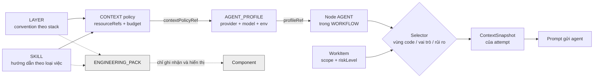

1. **Prompt là một JSON có thứ tự cố định**, ghi vào stdin của Claude CLI:

   | Trường | Nội dung |
   |---|---|
   | `hardConstraints` | Các resource `HARD_CONSTRAINT`, đứng đầu prompt |
   | `taskContract` | `title`, `behavior`, `acceptanceCriteria`, `verificationSpec`, `riskLevel` của WorkItem; `allowedOutcomes` là các outcome node cho phép; `outcomeProtocol` là cách báo outcome (chỉ có khi node có hơn một outcome) |
   | `checkFailures` | Chỉ có khi một bước kiểm tra vừa gửi agent quay lại: bước nào (`what`), vì sao (`why`: phần cuối output của lệnh), phải làm gì (`fix`), và baseline của repository lúc đó |
   | `resources` | Các resource còn lại theo thứ tự `REQUIRED_PROCEDURE` → `GUIDANCE` → `REFERENCE` |
   | `messages` | Message của WorkItem: phản hồi của người duyệt, câu trả lời cho câu hỏi, ghi chú khi chạy lại |
   | `omittedMessages` | Những message bị lược vì vượt ngân sách (chỉ còn id, không còn nội dung) |
   | `closingChecklist` | Nhắc lại key của các `hardConstraints` và các outcome, ở cuối prompt |

   Engine tự điền danh sách outcome và cú pháp marker. Skill **không** cần chép lại chúng; Skill chỉ nói *khi nào*
   chọn outcome nào.
2. **Thư mục làm việc.** Agent `MAKER` chạy trong worktree của repository có quyền WRITE và đọc được mọi file ở đó,
   nên tài liệu đặt trong repo (ví dụ `docs/`) là một kênh tri thức. Agent `CHECKER` chỉ có quyền đọc và bắt đầu trong
   một thư mục trống. Trong cả hai trường hợp, system prompt nêu đường dẫn tuyệt đối của từng repository kèm quyền
   (`READ_WRITE` / `READ_ONLY`).
3. **Resource nào được nạp do hai thứ quyết định:** `resourceRefs` của CONTEXT policy (tập ứng viên) và `selector`
   của từng resource so với task đang chạy (mục 3.3). Engineering Pack và pack-assignment được lưu, version hóa và
   hiện trên UI, nhưng runtime **không** đọc chúng để chọn resource.
4. **File `CLAUDE.md` ở gốc repository** do chính Claude CLI tự nạp, ngoài prompt. `aw` ghi tên, hash và kích thước
   của nó vào ContextSnapshot, và đánh dấu khi nó vượt 16 KB. Giữ file này ngắn; quy ước chi tiết đặt trong Layer/Skill.
5. **Biến môi trường của tiến trình agent** chỉ gồm những tên có trong *cả* `envAllowlist` của agent profile *và*
   `aw worker --env-allowlist` (mục 2.4). Mặc định là rỗng.
6. **Agent sửa được file, nhưng không chạy được lệnh** khi worker dùng `--claude-permission-mode acceptEdits`: mọi
   lệnh shell bị từ chối vì không có ai phê duyệt. Trong lần chạy thật, agent thử `mvn -B test` ba lần, bị từ chối cả
   ba, rồi kết thúc và ghi rõ là chưa tự kiểm tra được. Việc kiểm tra thuộc về bước COMMAND đứng ngay sau agent;
   kết quả đỏ được gửi lại cho agent qua `checkFailures`.

Hệ quả: những gì agent cần biết phải nằm ở một trong bốn chỗ. Đó là resource của nó, contract hoặc message của
WorkItem, file trong repository, hoặc output của bước kiểm tra vừa fail.

---

## 2. Bước 1 — Chuẩn bị môi trường và repository

### 2.1 Công cụ cần có

| Công cụ | Dùng cho | Ghi chú |
|---|---|---|
| `aw` (build từ repo này) | control plane | Xem 2.2 để có UI |
| Git | repo và worktree | Trên Windows: Git for Windows, kèm Git Bash |
| `bash`, `jq`, `python3`, `sha256sum` | các script trong `scripts/` và script kiểm tra | Trên Windows chạy trong **Git Bash**; gọi `python` thay cho `python3` |
| Claude CLI | agent | Đã đăng nhập; đường dẫn tuyệt đối tới file thực thi |
| Toolchain của project | build/test | Todolist: JDK 21 + Maven 3.9, Node 20 trở lên + npm |

Hướng dẫn chạy được trên Linux, macOS và Windows. Trên Windows có ba điểm khác, được nhắc lại ở đúng chỗ:

- Mọi lệnh gõ trong Git Bash. `aw` là chương trình Windows nên đường dẫn truyền cho nó có dạng `C:/Users/…`
  (lấy bằng `cygpath -m <đường dẫn>`); riêng các mục trong `PATH` giữ dạng `/c/Users/…`.
- Worker Windows không chạy được file `.sh`. `aw-publish.py` tự bọc mỗi script thành một file `.cmd` chạy nguyên văn
  script đó bằng `sh.exe` của Git for Windows (mục 3.4). Bạn không phải viết script hai lần.
- Tiến trình nào cũng cần thêm vài biến hệ thống (`SystemRoot`, `USERPROFILE`…). `aw-publish.py` tự thêm chúng vào
  khai báo; bạn thêm chúng vào `--env-allowlist` của worker (mục 2.5).

### 2.2 Build `aw` kèm UI

Binary phát hành (`cmd/aw-release-build`) đã nhúng sẵn UI. Nếu tự build từ source, build UI riêng rồi truyền
`--ui-dist`:

```bash
cd /path/to/aw-tqunglnh
go build -o ~/bin/aw ./cmd/aw                                  # Windows: -o ~/bin/aw.exe
go build -o ~/bin/aw-maintenance ./cmd/aw-maintenance          # sao lưu, khôi phục (operations.md mục 7.3)
(cd web && pnpm install --frozen-lockfile && pnpm build)       # tạo web/dist
```

### 2.3 Tạo repository todolist

Thư mục `repo-template/` chứa một khung đã kiểm chứng:

- backend Spring Boot 3.5 + SQLite + Flyway, có một test (`mvn -B test` pass trên Linux và Windows);
- `gitignore`;
- `CLAUDE.md`: vài dòng cho Claude CLI biết repository này được phát triển qua `aw` (mục 1.3).

```bash
GUIDE=/path/to/aw-tqunglnh/docs/guides/todolist-spring-react
mkdir -p ~/work/todolist && cd ~/work/todolist
git init -b main
cp -R "$GUIDE/repo-template/." .
mv gitignore .gitignore
mkdir -p frontend docs
echo "# Frontend (React + Vite)" > frontend/README.md
echo "# Tài liệu" > docs/README.md
echo "# Todolist" > README.md
(cd backend && mvn -B -q test)          # kiểm tra khung backend chạy được trên máy bạn
git add -A && git commit -m "Khung todolist: backend Spring Boot + SQLite, thư mục frontend"
```

Với một project bất kỳ, repository cần thỏa bốn điều sau:

- **Thư mục cấp 1 là đơn vị scope và đơn vị tri thức.** Khi đăng ký repository, probe biến mỗi thư mục cấp 1 (không
  bắt đầu bằng dấu chấm) thành một Component. Git không lưu thư mục rỗng, nên mỗi thư mục cần ít nhất một file. `pathScopes` của task là tiền tố đường dẫn,
  và selector `componentTags` chọn tri thức theo tên Component. Hãy chia repo sao cho mỗi task gói gọn trong một vài
  thư mục cấp 1.
- **`.gitignore` phải bỏ qua mọi output build** (todolist: `target/`, `node_modules/`, `dist/`, `data/`, `*.db`).
  `aw` dùng `git status` để biết agent hay command đã sửa gì. File build không bị ignore sẽ bị tính là thay đổi và có
  thể vi phạm scope.
- **Test của repository phải xanh trước khi giao việc cho agent**, và chạy được bằng một lệnh. Lệnh đó thành readiness
  profile (mục 2.7).
- **Commit trước khi tạo WorkItem gốc.** Worktree của TaskFamily được tạo từ commit hiện tại của nhánh mặc định.

> Hai chi tiết của khung backend đáng biết nếu bạn tự dựng project khác với SQLite:
>
> - Mỗi lớp test dùng một file SQLite trong thư mục tạm của JUnit, và `src/test/resources/junit-platform.properties`
>   tắt việc JUnit dọn thư mục đó. Không có dòng này, test fail trên Windows vì không xóa được file database mà Spring
>   context còn đang mở.
> - `TodoApplication` tạo thư mục `data/` trước khi khởi động: SQLite không tự tạo thư mục chứa file database.

### 2.4 Claude CLI: môi trường, quyền, effort, ngân sách

`aw` gọi thẳng file thực thi của Claude CLI, theo dạng
`claude -p --input-format text --output-format stream-json --verbose --model <model> …`. Không cần script bọc. Bốn
thứ dưới đây do **người vận hành** quyết định khi khởi động worker; chúng không nằm trong definition nào.

| Cờ của `aw worker` | Ý nghĩa | Dùng trong hướng dẫn |
|---|---|---|
| `--claude-executable` | Đường dẫn tuyệt đối tới Claude CLI. Hash của file này được pin vào workflow (mục 3.4) | `$(command -v claude)`; Windows: `C:/Users/<bạn>/.local/bin/claude.exe` |
| `--env-allowlist` | **Trần** các biến môi trường mà tiến trình con được thừa hưởng | Xem bên dưới |
| `--claude-permission-mode` | Chế độ quyền của Claude CLI cho mọi task | `acceptEdits` |
| `--claude-effort` | Mức suy luận: `low`, `medium`, `high`, `xhigh`, `max` | `medium` |
| `--claude-max-budget-usd` | Số tiền tối đa **một attempt** được tiêu; CLI tự dừng khi chạm trần | `3` |

**Biến môi trường.** Tiến trình agent bắt đầu với môi trường rỗng. Nó nhận một biến khi tên biến đó có trong cả hai
danh sách, viết giống hệt nhau:

- `provider.envAllowlist` trong [`aw-project.json`](aw-project.json), thành `envAllowlist` của mọi agent profile:
  `["HOME", "PATH"]`. Trên Windows `aw-publish.py` cộng thêm `USERPROFILE`, `APPDATA`, `LOCALAPPDATA`, `SystemRoot`,
  `SystemDrive`, `ComSpec`, `PATHEXT`, `TEMP`, `TMP`, `ProgramData`, `ProgramFiles`.
- `aw worker --env-allowlist`: liệt kê đúng các tên trên.

Claude CLI cần `HOME` (Windows: `USERPROFILE`) để tìm thông tin đăng nhập và `PATH` để tìm `git`. `aw doctor` chạy
thử `--version` của CLI trong đúng môi trường đó và báo `PROVIDER_ENV_INSUFFICIENT` nếu thiếu.

Script của node COMMAND và MACHINE_GATE không dùng hai danh sách trên: chúng nhận các biến mà chính Command khai
(`envAllowlist` của Command, mục 3.4).

**Quyền.** Không có chế độ quyền, Claude CLI chạy không tương tác sẽ từ chối mọi thao tác ghi file trong worktree,
vì worktree nào cũng mới và chưa được "tin cậy". `acceptEdits` cho phép agent tạo và sửa file; lệnh shell vẫn bị từ
chối. Đây là mức hướng dẫn này dùng và đã chạy thật: agent viết code, workflow chạy test. Các chế độ rộng hơn
(`auto`, `bypassPermissions`) cho agent tự chạy lệnh, đổi lại là không còn ai chặn một lệnh nguy hiểm. Đây là lựa
chọn về an toàn của bạn, không phải của workflow.

> Alpha chỉ có isolation `OPERATOR_TRUSTED_LOCAL`: agent và mọi script chạy dưới chính user của bạn, không có
> sandbox. Phạm vi sửa của agent được **kiểm tra sau khi chạy** (`SCOPE_VIOLATION`), không bị chặn trước.

**Model theo từng agent** nằm trong `aw-project.json` (khóa `model` của `provider` và của từng agent, mục 3.5).
Effort và ngân sách áp dụng chung cho mọi agent của worker.

### 2.5 Khởi động `aw serve` và `aw worker`

```bash
mkdir -p ~/aw/install/artifacts ~/aw/install/workspaces
export AW_DB=~/aw/install/aw.db AW_ARTIFACT_ROOT=~/aw/install/artifacts AW_WORKSPACE_ROOT=~/aw/install/workspaces
export AW_CLAUDE_EXECUTABLE=$(command -v claude)
export AW_ENV_ALLOWLIST=PATH,HOME

# Terminal 1 (không bắt buộc: chỉ cần khi dùng UI hoặc HTTP API)
aw serve --db "$AW_DB" --artifact-root "$AW_ARTIFACT_ROOT" --workspace-root "$AW_WORKSPACE_ROOT" \
  --port 18080 --claude-executable "$AW_CLAUDE_EXECUTABLE" --env-allowlist "$AW_ENV_ALLOWLIST" \
  --ui-dist /path/to/aw-tqunglnh/web/dist
# Terminal 2
aw worker --db "$AW_DB" --artifact-root "$AW_ARTIFACT_ROOT" --workspace-root "$AW_WORKSPACE_ROOT" \
  --claude-executable "$AW_CLAUDE_EXECUTABLE" --env-allowlist "$AW_ENV_ALLOWLIST" \
  --claude-permission-mode acceptEdits --claude-effort medium --claude-max-budget-usd 3

aw doctor        # status: HEALTHY, và dòng provider_environment:claude HEALTHY
```

Trên Windows (Git Bash) ba dòng `export` là:

```bash
export AW_DB=$(cygpath -m ~/aw/install/aw.db) AW_ARTIFACT_ROOT=$(cygpath -m ~/aw/install/artifacts) \
       AW_WORKSPACE_ROOT=$(cygpath -m ~/aw/install/workspaces)
export AW_CLAUDE_EXECUTABLE=$(cygpath -m "$(command -v claude)")
export AW_ENV_ALLOWLIST=PATH,HOME,USERPROFILE,APPDATA,LOCALAPPDATA,SystemRoot,SystemDrive,ComSpec,PATHEXT,TEMP,TMP,ProgramData,ProgramFiles
```

Ghi chú:

- Mọi lệnh `aw` đọc `AW_DB`, `AW_ARTIFACT_ROOT`, `AW_WORKSPACE_ROOT`, `AW_CLAUDE_EXECUTABLE`, `AW_ENV_ALLOWLIST` từ môi
  trường, nên terminal nào dùng để chạy script ở các phần sau cũng cần năm biến này. `aw serve` và `aw worker` nhận
  chúng qua cờ như trên.
- `aw worker` là nơi mọi việc thật sự chạy: probe repository, tạo worktree, chạy baseline, chạy node, cập nhật bảng.
  Các lệnh `aw` khác chỉ ghi yêu cầu vào database. Không có worker thì không có gì tiến triển.
- `PATH` của terminal chạy worker phải có `git`, `jq`, `mvn`, `node`, `npm`: script kiểm tra thừa hưởng `PATH` đó.
- Claude CLI tự cập nhật sẽ làm lệch hash đã pin (`ADAPTER_BUILD_DRIFT`, [operations.md mục 5.6](operations.md#56-claude-cli-thay-đổi-sau-khi-đăng-ký-adapter_build_drift)).
  Nên trỏ tới một bản CLI cố định.

### 2.6 Tạo project và đăng ký repository

Các script lưu trạng thái (project id, version id, WorkItem gốc hiện tại) vào `aw-state.json` **ở thư mục hiện tại**.
Mỗi project nên có một thư mục vận hành riêng:

```bash
export PATH="$GUIDE/scripts:$PATH"                 # Windows: "$(cygpath -u "$GUIDE")/scripts:$PATH"
mkdir -p ~/aw/todolist && cd ~/aw/todolist
init-project.sh todolist todolist "$HOME/work/todolist"     # Windows: "$(cygpath -m ~/work/todolist)"
# repository todolist: ACTIVE
#   component backend (backend)
#   component docs (docs)
#   component frontend (frontend)
# projectId=d552145e-…  → ./aw-state.json
```

[`init-project.sh`](scripts/init-project.sh) `<tên project> <repositoryId> <đường dẫn tuyệt đối> [nhánh mặc định]`
làm ba việc: tạo project, đăng ký repository, rồi chờ probe xong. Script chạy lại an toàn. Nếu repository bị `BLOCKED`,
xem [operations.md mục 5.8](operations.md#58-repository-blocked-sau-khi-đăng-ký).

Nếu đã chạy `aw serve`, **mở trình duyệt tại <http://127.0.0.1:18080/ui/projects>**. UI chỉ bind loopback, nên hãy mở
trên chính máy chạy `aw serve`.

| Màn hình | Đường dẫn | Nội dung |
|---|---|---|
| Projects | `/ui/projects` | Danh sách project, trạng thái `ACTIVE` |
| Overview | `/ui/projects/<id>` | Repository `todolist` ACTIVE, ref `main`, số component/blocker |
| Components | `/ui/projects/<id>/components` | `backend`, `frontend`, `docs` (kind `DIRECTORY`), nút **Assign Pack** |
| Board | `/ui/projects/<id>/board` | Kanban BACKLOG / READY / ACTIVE / BLOCKED / DONE, nút New WorkItem |
| Task | `/ui/projects/<id>/tasks/<workItemId>` | Overview, Graph & Timeline, Workspace, Evidence, Chat của một WorkItem |
| Definitions | `/ui/definitions`, `/ui/projects/<id>/definitions` | Lọc theo 9 loại definition, xem version |
| Doctor | `/ui/doctor` | Các check liveness/readiness/capability |
| Adapter Builds | `/ui/system/adapters` | Adapter build đã đăng ký cho Claude |

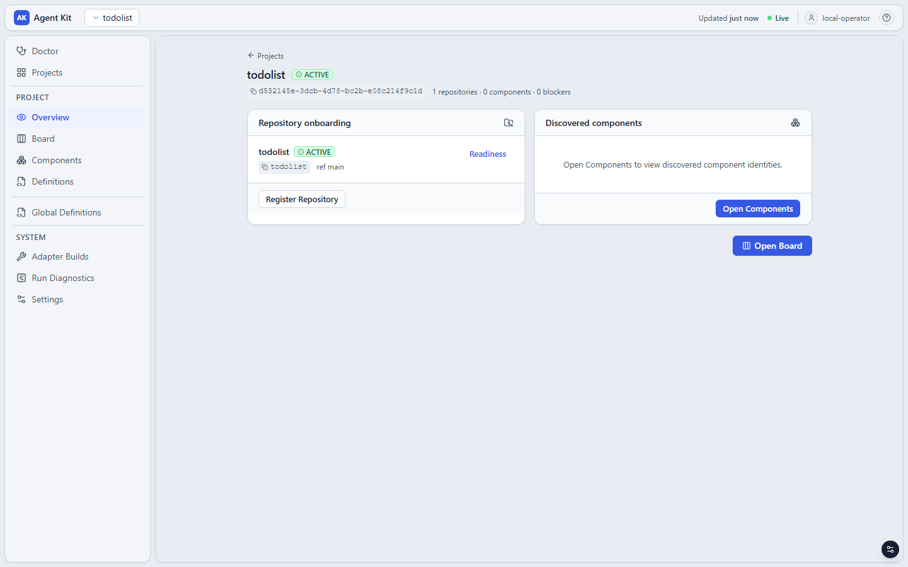
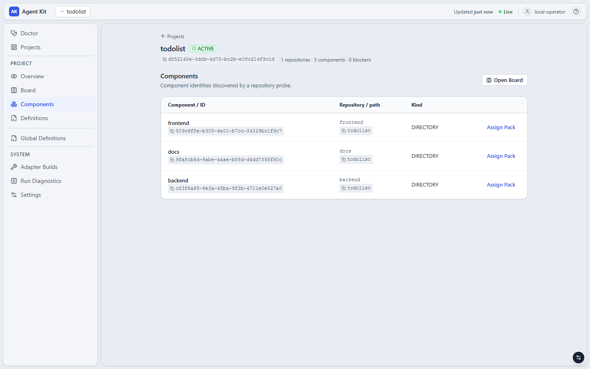
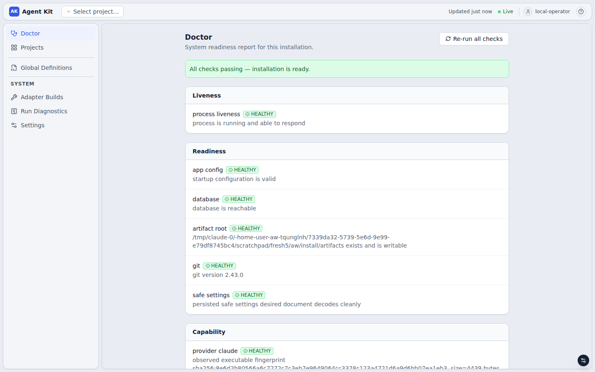

### 2.7 Readiness profile và baseline

Trước khi giao việc cho agent, khai báo **lệnh kiểm tra của chính repository**. `aw` chạy lệnh đó trên mỗi worktree
mới, trước khi task nào đụng tới nó. Lần chạy đó là **baseline**. Task có quyền ghi chỉ được nhận khi baseline xanh.
Nhờ vậy, khi test đỏ sau khi agent sửa, cả bạn và agent đều biết lỗi là do task, không phải có từ trước.

```bash
# Linux, macOS
jq -n '{verification: {executable: "sh", argv: ["-c", "cd backend && mvn -q -B test"], timeoutSeconds: 900}}' \
  | aw repository readiness set --idempotency-key readiness-1 todolist
# Windows
jq -n '{verification: {executable: "cmd", argv: ["/c", "cd backend && mvn -q -B test"], timeoutSeconds: 900}}' \
  | aw repository readiness set --idempotency-key readiness-1 todolist
# {"repositoryId":"todolist","profileVersion":1,"baselineJobsEnqueued":0}
```

- Lệnh là `executable` + `argv`, chạy ở **gốc worktree**, với một môi trường cố định (`PATH`, `HOME` và vài biến hệ
  thống). Có thể thêm `setup` (ví dụ cài dependency) chạy trước `verification`.
- `aw repository readiness show todolist` cho biết baseline của từng worktree: `PENDING`, `PASS`, `FAIL`,
  `EXCEPTION_ACCEPTED`, hoặc `NOT_REQUIRED` khi repository không có profile.
- `create-root.sh` (mục 4.1) chờ baseline xong rồi mới trả về. Baseline `FAIL` thì xử lý theo
  [operations.md mục 5.7](operations.md#57-baseline-của-repository-đỏ).
- Đổi profile làm mọi baseline cũ hết hiệu lực và chạy lại trên mọi worktree đang `READY`.

Repository không có profile thì không bị chặn gì; mọi thứ khác trong hướng dẫn vẫn chạy.

---

## 3. Cách định nghĩa workflow cho project bất kỳ

Phần này gồm năm bước (Bước 2–6 của quy trình). Mỗi bước có ba phần: việc cần làm cho một project bất kỳ, mẫu đầu ra,
và ví dụ todolist. Đầu ra cuối cùng là một thư mục khai báo:

```text
<thư mục khai báo của project>/
├── aw-project.json              # Bước 6: khai báo mọi thứ bên dưới, có tiền tố riêng
├── definitions/
│   ├── workflows/*.json         # Bước 3: graph node/edge, tham chiếu bằng {"$ref": ...}
│   ├── layers/*.json            # Bước 4: convention theo stack
│   ├── skills/*.json            # Bước 4: hướng dẫn theo loại việc / theo bước
│   └── policies/*.json          # Bước 5: attempt, permission, completion
├── commands/*.sh                # Bước 5: script cho node COMMAND và cho Gate
└── scripts/                     # copy nguyên từ thư mục này: aw-publish.py, run-task.sh…
```

### 3.1 Bước 2 — Mô tả quy trình nghiệp vụ

Viết quy trình ra bảng **trước khi** đụng tới `aw`, bằng ngôn ngữ nghiệp vụ, không nhắc tới node. Bảng phải trả lời
được các câu hỏi sau:

1. **Một lần chạy xử lý đơn vị việc nào?** Ví dụ: một tính năng, một task, một bug. Trong `aw`, một WorkItem có đúng
   một contract, một scope và một workflow version. Có hai trường hợp phải tách quy trình thành nhiều tầng, mỗi tầng
   một workflow:
   - số việc con chỉ biết được giữa chừng (ví dụ sau bước thiết kế mới biết có mấy task);
   - các việc con cần scope khác nhau.
2. **Mỗi bước do ai làm: AI, máy hay người?** "Máy" là lệnh chạy được và trả mã thoát, ví dụ build, test, lint, kiểm
   tra schema.
3. **Đầu ra của bước là gì và nằm ở đâu?** Nên là file cụ thể trong repo, để bước sau và người duyệt đọc được.
4. **Khi nào bước được coi là xong?** Cần một điều kiện kiểm chứng được.
5. **Không đạt thì sao?** Quay lại bước nào, tối đa mấy lần, hay dừng hẳn. Thiếu thông tin thì hỏi ai.
6. **Bước cần tri thức gì?** Ví dụ convention, quy tắc nghiệp vụ, tài liệu hệ thống. Phần này là đầu vào cho Bước 4.
7. **Cả quy trình "xong" khi có bằng chứng gì, ai xác nhận?** Phần này là đầu vào cho completion policy.

Mẫu bảng:

| # | Bước | Ai làm | Đầu vào | Đầu ra (file, nơi lưu) | Xong khi | Không đạt / thiếu thông tin | Tri thức cần |
|---|---|---|---|---|---|---|---|
| 1 | | AI / máy / người | | | | quay lại #…, tối đa … lần / dừng / hỏi … | |

**Ví dụ todolist.** Quy trình của team cho một tính năng. Nhánh nét đứt NEEDS_INFO là "thiếu hoặc mâu thuẫn
thông tin thì dừng lại hỏi", áp dụng ở SPEC, FRAME và BUILD:

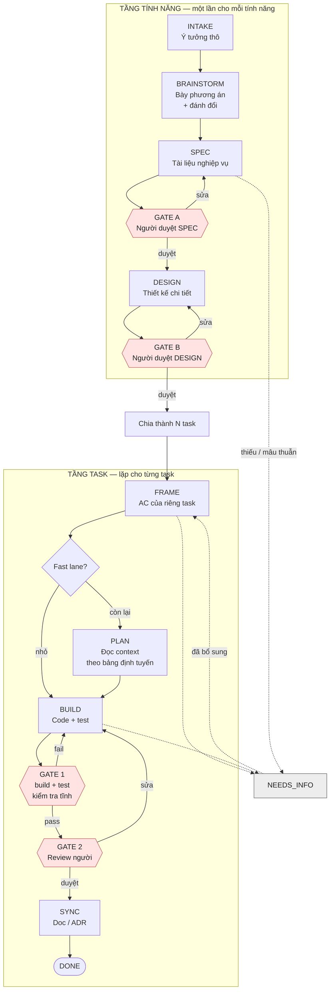

| # | Bước | Ai làm | Đầu ra | Xong khi | Không đạt / thiếu thông tin | Tri thức cần |
|---|---|---|---|---|---|---|
| 1 | Tiếp nhận yêu cầu (INTAKE) | PO | Mô tả ý tưởng, thư mục `docs/features/<slug>` | — | — | — |
| 2 | Phân tích phương án (BRAINSTORM) | AI | `01-brainstorm.md` | Có 2–4 phương án và một đề xuất | — | Cách viết phân tích, tổng quan hệ thống |
| 3 | Viết spec (SPEC) | AI | `02-spec.md` (BR, AC Given/When/Then) | Mỗi AC kiểm chứng được bằng test | Thiếu thông tin → hỏi PO, chờ trả lời | Cách viết spec, cách hỏi |
| 4 | Duyệt spec (GATE A) | PO | Quyết định | Duyệt | Sửa → #3, tối đa 3 lần; từ chối → dừng | — |
| 5 | Thiết kế, chia task (DESIGN) | AI | `03-design.md`, `tasks.json` | Đủ file, `tasks.json` đúng schema (máy kiểm tra) | Sai schema → #5, tối đa 5 lần | Hợp đồng API, tổng quan hệ thống |
| 6 | Duyệt thiết kế (GATE B) | Tech lead | Quyết định | Duyệt | Sửa → #5, tối đa 3 lần; từ chối → dừng | — |
| 7 | Làm rõ task, phân loại nhỏ/lớn (FRAME, Fast lane?) | AI | `tasks/<id>/frame.md` | AC riêng của task rõ ràng | Thiếu thông tin → hỏi | Tiêu chí task nhỏ |
| 8 | Lập kế hoạch, chỉ task lớn (PLAN) | AI | `tasks/<id>/plan.md` | — | — | Bảng "khu vực → cần đọc gì" |
| 9 | Code và test (BUILD) | AI | Code, test | — | Thiếu thông tin → hỏi | Convention của vùng code, Definition of Done |
| 10 | Build, test, kiểm tra tĩnh (GATE 1) | Máy | Kết quả | Mã thoát 0 | Đỏ → #9 kèm log lỗi, tối đa 5 lần rồi dừng | — |
| 11 | Review code (GATE 2) | Reviewer | Quyết định | Duyệt | Sửa → #9, tối đa 3 lần; từ chối → dừng | — |
| 12 | Cập nhật tài liệu, ADR (SYNC) | AI | `docs/`, `docs/adr/` | — | — | Cách viết ADR |
| 13 | Commit, merge (DONE) | Người | Commit, merge vào `main` | — | — | — |
| 14 | Kiểm tra nhánh chính sau merge | Máy + CI | Kết quả các cổng | Mọi cổng xanh, CI xanh | Đỏ → sửa trên nhánh chính, kiểm tra lại | — |

Từ câu hỏi 1: số task chỉ biết sau #5, và mỗi task có scope riêng (`backend`, `frontend`). Vì vậy quy trình có **hai
tầng**, cộng một bước kiểm tra riêng sau merge:

- **tầng tính năng** (#1–6): một WorkItem cho mỗi tính năng;
- **tầng task** (#7–12): một WorkItem cho mỗi task;
- **kiểm tra nhánh chính** (#14): một WorkItem chỉ đọc, sau mỗi lần merge.

Với việc nhỏ đã rõ yêu cầu, team dùng một quy trình rút gọn: code và test, máy kiểm tra, có thể thêm AI review và
người review.

### 3.2 Bước 3 — Ánh xạ sang node của aw

#### Bảng quyết định

| Bước nghiệp vụ có tính chất | Dùng | Lưu ý |
|---|---|---|
| AI tạo hoặc sửa file (code, tài liệu) | `AGENT`, role `MAKER` | Một agent dùng cho mọi vùng code được; tri thức theo vùng do selector chọn (3.3) |
| AI tự chọn nhánh (phân loại, "thiếu thông tin") | `AGENT` có nhiều outcome | Engine tự đưa danh sách outcome và cú pháp marker vào prompt |
| Máy kiểm tra **sau** khi AI sửa (build, test, lint, schema) | `COMMAND` có `failureOutcome` | Mã thoát khác 0 đi theo cạnh `failureOutcome` về lại agent, kèm output của lệnh trong `checkFailures` |
| Máy kiểm tra không được phép sửa gì, nhiều tiêu chí | `MACHINE_GATE` | Chỉ đọc; mỗi tiêu chí một evidence. Chỉ dùng trên family **chưa có local commit** (mục 6) |
| AI review độc lập | `AGENT`, role `CHECKER` | Chỉ đọc; đặt sau MAKER được. Lý do `rework` của nó hiện chưa tới được maker (mục 6), nên cho kết quả đi tiếp tới người duyệt |
| Người duyệt, quyết định, trả lời câu hỏi | `APPROVAL` | Outcome tùy ý, `authorizedRoles`, hạn chót kèm `escalationOutcome`, `cyclePolicy` cho vòng lặp |
| Chờ sự kiện bên ngoài (CI, deploy) | `WAIT` mode `SIGNAL` | Gửi tín hiệu bằng `aw wait signal` |
| Chạy song song | `FORK` / `JOIN` | Các nhánh không được cùng ghi một repository (`CONFLICT`) |
| Rẽ nhánh theo điều kiện | `APPROVAL` (người chọn) hoặc `AGENT` nhiều outcome | `ROUTER` chỉ được một outcome |
| Dừng vì bị từ chối hoặc hết số vòng sửa | `COMMAND` chạy script thoát mã 1, **không** khai `failureOutcome` | Không nối `rejected` thẳng tới END, vì END được tính là hoàn thành |
| Sinh nhiều việc con | Ngoài engine: script đọc file kết quả rồi tạo WorkItem | Không có node sinh WorkItem |
| Commit, merge | Ngoài workflow: ReleaseSet → local commit, merge bằng git | `aw` không push hay merge |
| Đầu vào của quy trình (ý tưởng, ticket) | `contract.behavior` và message của WorkItem | Không cần node |

#### Quy tắc của graph

- Workflow gồm `nodes`, `edges` và `completionPolicyRef`. Node `START` có outcome `next`; node `END` không có outcome.
- **Mọi outcome của một node phải có đúng một edge đi ra.** Thiếu edge là lỗi khi validate hoặc publish.
- Node `AGENT`, `COMMAND`, `MACHINE_GATE` phải pin **đúng một** policy ATTEMPT và **đúng một** policy PERMISSION.
- **Bước kiểm tra quay lại maker.** Khai `"failureOutcome": "failed"` trong cấu hình `command` (hoặc `machineGate`),
  và node có đúng hai outcome: một cho đạt, một cho không đạt. Chỉ lỗi **chức năng** (lệnh tự thoát với mã khác 0,
  gate cho `FAIL`) đi theo `failureOutcome`. Lỗi **kỹ thuật** (timeout, không chạy được lệnh, vi phạm scope) vẫn làm
  attempt `FAILED`.
- **Vòng lặp phải có giới hạn.** Một node trong vòng khai `cyclePolicy: {maxIterations, escalationOutcome}`, trong
  đó `escalationOutcome` là outcome có edge đi **ra khỏi** vòng. Không có thì không publish được. `maxIterations: 3`
  trên maker nghĩa là maker chạy tối đa 4 lần (vòng 0 tới 3); lần kích hoạt thứ 5 bị `SKIPPED` và đi theo
  `escalationOutcome`. Agent không bao giờ tự chọn outcome này.
- **AGENT có hơn một outcome** phải kết thúc bằng đúng một marker
  `<agentkit-outcome>{"schemaVersion":1,"outcome":"..."}</agentkit-outcome>`. Thiếu marker, sai định dạng, in hai lần
  hoặc giá trị ngoài danh sách đều làm attempt `FAILED` với `OUTCOME_REJECTED`. AGENT chỉ có một outcome thì không cần
  marker.
- **Completion policy được xét khi run tới END**, và chỉ tính evidence của run hiện tại. Một bước kiểm tra mà lần chạy
  *cuối cùng* của nó đỏ thì không thỏa completion; "đỏ → sửa → xanh" thì thỏa.
- **Workflow có scope project.** Dùng workflow của project A cho WorkItem của project B sẽ bị từ chối lúc `run start`.

#### Chọn completion policy

| Muốn "xong" nghĩa là | Policy | Ví dụ todolist |
|---|---|---|
| Có evidence của các node COMMAND | `{"requiredEvidenceKinds": ["COMMAND_EXECUTION"]}` | [`policy-completion`](definitions/policies/policy-completion.json) |
| Có test **và** người đã quyết định | `requiredAssurance` gồm `UNIT` (hoặc `STATIC`) và `HUMAN` với `requiredApprovals` | [`policy-completion-reviewed`](definitions/policies/policy-completion-reviewed.json), [`policy-completion-feature`](definitions/policies/policy-completion-feature.json) |
| Mọi tiêu chí của các gate đều đạt | `requiredEvidenceKinds` liệt kê `evidenceKey` của từng tiêu chí | [`policy-completion-main-check`](definitions/policies/policy-completion-main-check.json) |

Các mức của `requiredAssurance` là `STATIC`, `LINT`, `UNIT`, `INTEGRATION`, `E2E`, `HUMAN`. Mức `HUMAN` chỉ kiểm tra
**đã có người đủ quyền quyết định**, không xét quyết định là gì. Vì vậy ý nghĩa "từ chối" phải nằm ở graph (nhánh
`reject`), không nằm ở completion policy.

#### Ví dụ todolist: ánh xạ bảng nghiệp vụ ở 3.1

| # | Bước nghiệp vụ | Trong `aw` | Vì sao |
|---|---|---|---|
| 1 | Tiếp nhận | `contract.behavior` của WorkItem `F-00` (mẫu [`feature-due-date.json`](work-items/feature-due-date.json)) | Đầu vào của run |
| 2 | Phân tích | `AGENT brainstorm` (outcome `done`) | AI tạo file |
| 3 | Spec | `AGENT spec` (`done`, `needs_info`) | AI tự quyết "thiếu thông tin" nên cần hai outcome |
| 3' | Hỏi PO | `APPROVAL needs-info` (`provided`, `abandon`); câu trả lời thành message | Người trả lời, có hạn chót, có lối thoát |
| 4 | Duyệt spec | `APPROVAL gate-a` (`approved`, `revise`, `rejected`), `cyclePolicy` tối đa 3 | Người quyết định, vòng sửa có giới hạn |
| 5 | Thiết kế | `AGENT design`, rồi `COMMAND check-docs` có `failureOutcome` quay lại `design` | Máy kiểm tra schema trước khi người duyệt; sai thì agent tự sửa |
| 6 | Duyệt thiết kế | `APPROVAL gate-b` | |
| — | Từ chối, bỏ dở, hết vòng sửa | `COMMAND reject` (thoát mã 1) | Để run kết thúc `FAILED` |
| — | Chia task | `split-tasks.sh` đọc `tasks.json`, sinh một file WorkItem cho mỗi task | Không có node sinh WorkItem |
| 7 | Làm rõ, phân loại | `AGENT frame` (`fast`, `full`, `needs_info`) | `ROUTER` không rẽ nhánh được, nên agent chọn |
| 8 | Kế hoạch | `AGENT plan`, chỉ trên nhánh `full` | |
| 9 | Code và test | `AGENT build` (`done`, `needs_info`), `cyclePolicy` tối đa 5 | |
| 10 | Build, test, kiểm tra tĩnh | `COMMAND gate1` rồi `COMMAND quality`, cả hai có `failureOutcome` quay lại `build` | Cổng chính thức, sinh evidence, lỗi được gửi lại cho agent |
| 11 | Review code | `APPROVAL gate2` | |
| 12 | Tài liệu | `AGENT sync`, chỉ sửa `docs/` | |
| 13 | Commit, merge | `commit-task.sh` sau mỗi WorkItem; merge bằng git | Nằm ngoài workflow |
| 14 | Kiểm tra nhánh chính | Workflow riêng `wf-main-check`: `FORK` → hai `MACHINE_GATE` → `JOIN` → `WAIT` | Chỉ đọc, chạy trên một gốc mới tách từ nhánh chính |

Kết quả là ba workflow chính, cộng ba workflow rút gọn.

**Tầng tính năng:** [`wf-feature-definition.json`](definitions/workflows/wf-feature-definition.json). Completion:
`STATIC` (evidence của `check-docs`) cộng `HUMAN`.

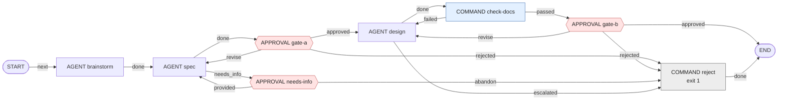

**Tầng task:** [`wf-task-delivery.json`](definitions/workflows/wf-task-delivery.json). Completion: `UNIT` (evidence
của `gate1` và `quality`) cộng `HUMAN`.

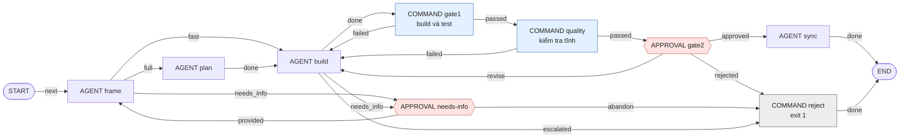

**Kiểm tra nhánh chính:** [`wf-main-check.json`](definitions/workflows/wf-main-check.json). Completion: đủ ba
evidence `NO_DISABLED_TESTS`, `MIGRATION_VERSIONS_UNIQUE`, `NO_SECRET_FILES`.

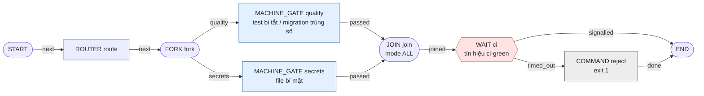

Hai gate ở đây không khai `failureOutcome`: không có maker nào để quay lại. Một tiêu chí `FAIL` làm run `FAILED`,
kèm evidence nêu rõ tiêu chí nào và vì sao.

**Quy trình rút gọn cho việc nhỏ** có ba workflow:

- [`wf-backend-feature`](definitions/workflows/wf-backend-feature.json) và
  [`wf-frontend-feature`](definitions/workflows/wf-frontend-feature.json): một agent làm, một COMMAND test, test đỏ
  thì quay lại agent, tối đa 3 vòng sửa.
- [`wf-fullstack-review`](definitions/workflows/wf-fullstack-review.json): thêm một agent review độc lập và một cổng
  người duyệt.

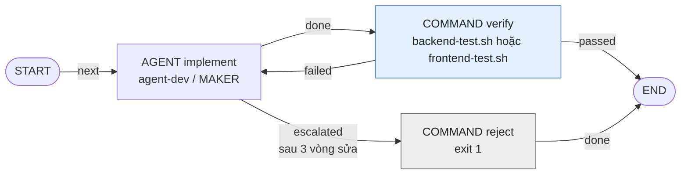

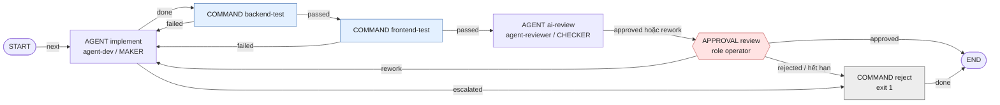

Cả hai outcome của `ai-review` đều dẫn tới người duyệt. Kết luận của AI reviewer là thông tin cho người duyệt đọc
(tab Chat của task trên UI), không phải một cổng tự động: lý do `rework` của nó chưa được engine chuyển cho maker
(mục 6). Người duyệt chép điều cần sửa vào phản hồi khi chọn `rework`.

Giải thích chi tiết những chỗ phải thiết kế khác sơ đồ nghiệp vụ nằm trong [feature-task-flow.md](feature-task-flow.md),
mục 2.

### 3.3 Bước 4 — Chuẩn bị tri thức cho agent

#### Layer, Skill, Pack, CONTEXT policy

| | Layer | Skill | Engineering Pack | CONTEXT policy |
|---|---|---|---|---|
| Trả lời câu hỏi | "Stack này viết thế nào?" | "Loại việc hay bước này làm thế nào?" | "Component này dùng bộ convention nào?" | "Agent này có thể nhận những resource nào, bao nhiêu?" |
| Trường nội dung | `convention` | `instruction` | `dependencies` (pin Layer/Skill/Pack) | `resourceRefs`, `budget`, `messages` |
| Có thực thi không | Không | Không; script trong Skill chỉ chạy khi một Command pin nó | Không | Không |
| Ảnh hưởng prompt | Qua CONTEXT policy và selector | Qua CONTEXT policy và selector | Không | **Có** |

#### Quy tắc viết một resource

```json
{"key": "spring.testing", "priority": "GUIDANCE", "selector": {"componentTags": ["backend"]},
 "convention": "Test bằng JUnit 5 + spring-boot-starter-test ...",
 "provenance": {"owner": "team-backend", "source": "docs/guides/todolist-spring-react", "revision": "v2",
                "lastVerified": "2026-10-04T00:00:00Z"}}
```

- **`key` phải duy nhất trong tập resource mà một agent nhận.** Đặt tiền tố theo nguồn, ví dụ `spring.`, `sqlite.`,
  `react.`, `dev.`, `flow.`, `review.`.
- **`priority`** quyết định vị trí trong prompt và khả năng bị cắt:
  - `HARD_CONSTRAINT` vào `hardConstraints` ở đầu prompt, luôn được nạp; vượt budget thì attempt fail chứ không cắt.
    Chỉ dùng cho điều tuyệt đối không được phá; publish cảnh báo khi một agent nhận quá 15 cái.
  - `REQUIRED_PROCEDURE` → `GUIDANCE` → `REFERENCE` được nạp theo thứ tự này cho tới khi hết budget.
- **Phải có `"global": true` hoặc `selector` không rỗng.**
- **`provenance`** bắt buộc có `owner`, `source`, và một trong `lastVerified` / `revision`. `lastVerified` viết theo
  RFC 3339 (`2026-10-04T00:00:00Z`). Resource quá 180 ngày chưa rà lại làm `aw-publish.py` in `CẢNH BÁO`.
- **`budget.maxTokens` của CONTEXT policy được tính bằng byte.** Tiếng Việt UTF-8 tốn 2–3 byte cho mỗi ký tự có dấu,
  nên hãy để budget rộng. Mặc định của `aw-publish.py` là 65536.

#### Selector: một agent, tri thức theo vùng code

Một resource khai *khi nào* nó áp dụng. Engine so selector với task đang chạy và chỉ nạp resource khớp. Mọi chiều
khai trong selector phải khớp (AND); trong một chiều, khớp một giá trị là đủ (OR).

| Chiều | So với | Ví dụ trong todolist |
|---|---|---|
| `componentTags` | Tên các Component mà scope của WorkItem chạm tới | `["backend"]`: `spring.project-structure`, `sqlite.*`; `["frontend"]`: `react.*` |
| `pathTags` | Tiền tố đường dẫn so với `pathScopes` của WorkItem | (không dùng; cần khi vùng tri thức nhỏ hơn một thư mục cấp 1) |
| `blockKinds` | Vai trò của node: `MAKER` hoặc `CHECKER` | `["MAKER"]`: `dev.implement-feature`; `["CHECKER"]`: `review.*` |
| `riskClasses` | `riskLevel` của contract | `["HIGH"]`: `dev.high-risk-extra` |
| `taskKinds` | `ROOT` hoặc `CHILD` | (không dùng) |

Nhờ vậy todolist chỉ cần **một** agent lập trình, `agent-dev`, cho cả backend và frontend: CONTEXT policy của nó chứa
cả ba Layer, còn selector quyết định task nào thấy gì. Kết quả thật của ba task:

| Task | Scope | `hardConstraints` | `resources` |
|---|---|---|---|
| BE-01 | `backend` | `dev.definition-of-done`, `spring.rest-api`, `sqlite.datasource` | `dev.implement-feature`, `spring.project-structure`, `sqlite.migrations`, `spring.testing`, `dev.stack-overview` |
| FE-01 | `frontend` | `dev.definition-of-done`, `react.api-client`, `spring.rest-api` | `dev.implement-feature`, `react.project-structure`, `react.testing`, `dev.stack-overview` |
| FS-01, node `ai-review` | `backend`, `frontend` | thêm `review.read-only` | thêm `review.checklist`; **không** có `dev.implement-feature` |

`spring.rest-api` là `global` vì cả hai phía cần cùng một hợp đồng API.

Một WorkItem có scope **không** khai `pathScopes` chạm tới mọi Component, nên nhận mọi resource gắn `componentTags`.
Một scope chỉ có một mục cho mỗi repository: WorkItem `F-00` (ghi `docs/`) không nhận resource của `backend` hay
`frontend`. Vì vậy `dev.stack-overview` là resource `global` mô tả tổng quan cho các bước phân tích và thiết kế, còn
agent tự đọc code trong worktree khi cần chi tiết.

#### Khi nào vẫn cần agent riêng

Selector không phân biệt được **bước** của quy trình: BRAINSTORM, SPEC, DESIGN, FRAME, PLAN, BUILD, SYNC đều là
`MAKER` trên cùng một WorkItem. Mỗi bước cần một bộ hướng dẫn khác thì mỗi bước một agent profile, mỗi agent một danh
sách resource. Agent riêng cũng là cách đặt **model** theo bước. Trong `aw-project.json`:

```json
{"id": "agent-flow-spec", "name": "Agent: SPEC", "model": "opus",
 "resources": ["skill-feature-flow#flow.working-rules", "skill-feature-flow#flow.needs-info",
               "skill-feature-flow#flow.spec", "skill-todolist-dev#dev.stack-overview"]}
```

`"layer-sqlite"` lấy mọi resource của Layer đó. `"skill-feature-flow#flow.spec"` chỉ lấy một resource.
`aw-publish.py` tự tính content hash và dựng CONTEXT policy `ctx-<agent>`.

**Hướng dẫn của một bước phải nói rõ ranh giới của bước đó.** Agent nào cũng nhận `taskContract` của *cả* task.
Trong lần chạy thật đầu tiên, agent của bước PLAN đọc contract rồi viết luôn toàn bộ code và test, không viết
`plan.md`: hướng dẫn của bước khi đó chỉ là một resource `REQUIRED_PROCEDURE` nằm giữa các convention về code. Bản
hiện tại sửa hai chỗ, và ở task kế tiếp PLAN chỉ viết `plan.md`:

- hướng dẫn của mỗi bước là `HARD_CONSTRAINT`, mở đầu bằng tên bước và danh sách file được phép tạo hoặc sửa, ví dụ
  "Giai đoạn của bạn: PLAN. Bạn KHÔNG hiện thực task. File duy nhất được tạo hoặc sửa: …/plan.md";
- `flow.working-rules` nói rõ `taskContract` mô tả toàn bộ task, còn mỗi agent chỉ làm một giai đoạn.

Scope của WorkItem không thay được ranh giới này: scope áp dụng cho cả WorkItem, không theo từng node.

Với **AGENT có nhiều outcome**, resource của bước đó chỉ cần nói *khi nào* chọn outcome nào ("`needs_info` khi thiếu
thông tin…"). Danh sách outcome và cú pháp marker do engine đưa vào `taskContract`.

#### Ngân sách message

Mỗi vòng sửa thêm message vào WorkItem. `"messageBudget": {"maxBytes": 32768, "keepLatest": 2}` trong
`aw-project.json` giới hạn phần message trong prompt: message ghim (`--pinned`) và 2 message mới nhất luôn được giữ
nguyên văn, phần còn lại được nạp từ mới tới cũ cho tới khi hết 32 KB. Chi tiết và số đo ở
[operations.md mục 2](operations.md#2-message-và-context-của-agent).

#### Tài liệu có sẵn (Confluence, PDF, Word…)

Chuyển tài liệu sang văn bản thuần (Markdown), rồi đặt theo độ ổn định và độ dài:

| Loại tri thức | Đặt ở đâu | Cách agent nhận |
|---|---|---|
| Quy tắc ngắn, ổn định, áp dụng mọi lúc (convention, Definition of Done, ràng buộc bảo mật) | Resource của Layer/Skill, gắn selector theo vùng | Có trong prompt khi task chạm vùng đó |
| Tài liệu dài (đặc tả hệ thống, API, mô hình dữ liệu, ADR) | File trong `docs/` của repository | Agent tự đọc file; một resource kiểu "bảng định tuyến" chỉ cho agent khu vực nào thì đọc file nào |
| Yêu cầu và quyết định riêng của một task | `contract` hoặc message của WorkItem | Có trong `taskContract` và `messages` |
| Vài dòng định hướng chung cho mọi phiên | `CLAUDE.md` ở gốc repository | Claude CLI tự nạp; `aw` ghi hash và kích thước |

Mỗi resource giữ `provenance.source` trỏ về tài liệu gốc và `lastVerified`, để biết khi nào cần rà lại.

#### Ví dụ todolist

Layer ([`definitions/layers/`](definitions/layers/)):

| Layer | Resource | Priority | Selector | Nội dung chính |
|---|---|---|---|---|
| `layer-java-spring-boot` | `spring.project-structure` | REQUIRED_PROCEDURE | `backend` | Java 21, Spring Boot 3.5, Maven, package `com.example.todo`, các tầng controller/service/repository/domain/dto |
| | `spring.rest-api` | HARD_CONSTRAINT | global | Hợp đồng `/api/todos` (GET/POST/PUT/PATCH toggle/DELETE), validate, ProblemDetail, cổng 8080 |
| | `spring.testing` | GUIDANCE | `backend` | JUnit 5, MockMvc, file SQLite tạm qua `@TempDir` |
| `layer-sqlite` | `sqlite.datasource` | HARD_CONSTRAINT | `backend` | `sqlite-jdbc`, `SQLiteDialect`, `jdbc:sqlite:./data/todolist.db`, `ddl-auto=validate` |
| | `sqlite.migrations` | REQUIRED_PROCEDURE | `backend` | Flyway `V<n>__*.sql`, bảng `todos`, không sửa migration cũ |
| `layer-react-vite` | `react.project-structure` | REQUIRED_PROCEDURE | `frontend` | React + TS + Vite trong `frontend/`, `src/api`, `src/components`, `src/hooks` |
| | `react.api-client` | HARD_CONSTRAINT | `frontend` | Một module `src/api/todos.ts`, đường dẫn tương đối `/api/todos`, proxy Vite tới 8080 |
| | `react.testing` | GUIDANCE | `frontend` | Vitest + Testing Library + jsdom; `npm test` = `vitest run`; `npm run build` phải pass |

Skill ([`definitions/skills/`](definitions/skills/)):

| Skill | Resource | Ghi chú |
|---|---|---|
| `skill-todolist-dev` | `dev.implement-feature` (REQUIRED_PROCEDURE, `MAKER`) | Quy trình của maker: đọc `checkFailures` trước, sửa tối thiểu, viết test, không git commit, chỉ sửa trong scope |
| | `dev.definition-of-done` (HARD_CONSTRAINT, global) | Không stub, không tắt test, không commit secret, `*.db` hay thư mục build |
| | `dev.high-risk-extra` (GUIDANCE, `riskClasses: HIGH`) | Chỉ nạp khi contract có `riskLevel: HIGH` |
| | `dev.stack-overview` (REFERENCE, global) | Tổng quan ba thư mục, cho các bước không gắn với một vùng code |
| `skill-review` | `review.read-only` (HARD_CONSTRAINT, `CHECKER`) | Chỉ đọc; repository nằm ở đường dẫn trong system prompt |
| | `review.checklist` (REQUIRED_PROCEDURE, `CHECKER`) | Đối chiếu từng acceptance criteria; khi nào `approved`, khi nào `rework` |
| `skill-feature-flow` | `flow.working-rules` (HARD_CONSTRAINT) | Mỗi agent chỉ làm một giai đoạn; thư mục tài liệu; cách đọc `allowedOutcomes`; không commit |
| | `flow.brainstorm`, `flow.spec`, `flow.design`, `flow.frame`, `flow.plan`, `flow.build`, `flow.sync` (HARD_CONSTRAINT) | Hướng dẫn của từng giai đoạn: file được phép tạo hoặc sửa, nội dung cần viết, khi nào chọn outcome nào |
| | `flow.needs-info` (REQUIRED_PROCEDURE) | Cách dừng để hỏi: ghi `needs-info.md`, outcome `needs_info` |
| | `flow.routing-table` (REQUIRED_PROCEDURE) | Bảng "khu vực thay đổi → thư mục/tài liệu cần đọc trước" |

Agent và resource (khai báo trong `agents` của [`aw-project.json`](aw-project.json)):

| Agent | Dùng ở node | Model | Resource ứng viên |
|---|---|---|---|
| `agent-dev` | `implement` của ba workflow rút gọn | sonnet | Ba Layer; `skill-todolist-dev` |
| `agent-reviewer` | `ai-review` | sonnet | `skill-review`; ba Layer; `skill-todolist-dev` |
| `agent-flow-brainstorm` | `brainstorm` | opus | `flow.working-rules`, `flow.brainstorm`, `dev.stack-overview` |
| `agent-flow-spec` | `spec` | opus | `flow.working-rules`, `flow.needs-info`, `flow.spec`, `dev.stack-overview` |
| `agent-flow-design` | `design` | opus | `flow.working-rules`, `flow.design`, ba Layer, `dev.stack-overview` |
| `agent-flow-frame` | `frame` | sonnet | `flow.working-rules`, `flow.needs-info`, `flow.frame` |
| `agent-flow-plan` | `plan` | sonnet | `flow.working-rules`, `flow.routing-table`, `flow.plan`, ba Layer |
| `agent-flow-build` | `build` | sonnet | `flow.working-rules`, `flow.needs-info`, `flow.build`, ba Layer, `dev.definition-of-done`, `dev.high-risk-extra` |
| `agent-flow-sync` | `sync` | sonnet | `flow.working-rules`, `flow.sync` |

Sau khi chạy một task, kiểm tra agent thực sự nhận resource nào trong ContextSnapshot của attempt:

```bash
snap=$(aw run timeline <runId> | jq -r '[.entries[] | select(.kind=="EXECUTION_ATTEMPT" and .nodeKey=="implement")][0].contextSnapshotId')
aw context-snapshot show --project-id "$(jq -r .projectId aw-state.json)" <workItemId> "$snap" | jq -c '[.resourceRefs[].resourceKey]'
# ["dev.definition-of-done","spring.rest-api","sqlite.datasource","dev.implement-feature",
#  "spring.project-structure","sqlite.migrations","spring.testing","dev.stack-overview"]
```

Đây là kết quả thật của task BE-01 (`riskLevel: MEDIUM`, scope `backend`): không có resource `react.*`, và
`dev.high-risk-extra` bị loại vì task không phải `HIGH`.

### 3.4 Bước 5 — Chuẩn bị phần thực thi

#### Script cho node COMMAND

Đặt script trong `commands/` và khai báo trong `scriptSkills` của `aw-project.json`. `aw-publish.py` biến mỗi file
thành một resource của một Skill (key là tên file), rồi tạo Command pin đúng `version + key + content hash` của file
đó. Hợp đồng của một script:

| Điều kiện | Chi tiết |
|---|---|
| Thư mục làm việc | Gốc worktree của repository `cwdRepositoryTarget` (mặc định là `repository` của manifest). Script tự `cd` vào thư mục con |
| Tham số | `$1` luôn là `run`, vì `argv` không được rỗng. Script bỏ qua tham số này |
| Kết quả | Mã thoát 0 là đạt. Khác 0: nếu node khai `failureOutcome` thì run đi theo cạnh đó; nếu không thì attempt `FAILED` → thử lại theo ATTEMPT policy → node `FAILED` → run `FAILED` |
| **Lỗi phải nằm ở stderr** | Khi lệnh fail, agent nhận **4 KiB cuối của stderr** (chỉ dùng stdout khi stderr rỗng). Maven in lỗi ra stdout còn stderr chỉ có cảnh báo của JVM, nên script phải gom output và in phần lỗi cô đọng ra stderr; tắt màu (`NO_COLOR=1`) để mã màu ANSI không chiếm chỗ. Xem [`backend-test.sh`](commands/backend-test.sh), [`frontend-test.sh`](commands/frontend-test.sh) |
| Evidence | Lệnh chạy xong, đạt hay không, đều để lại evidence `COMMAND_EXECUTION` kèm mã thoát, stdout và stderr |
| Output | Lệnh thoát mã 0 mà output bị cắt vì vượt `maxOutputBytes` (mặc định 4 MiB) bị coi là lỗi kỹ thuật. Dùng chế độ im lặng (`-q`) |
| Biến môi trường | Chỉ các biến trong `envAllowlist` của Command. Mặc định: `PATH`, `HOME`, `JAVA_HOME`, `MAVEN_OPTS`, `JAVA_TOOL_OPTIONS`, `HTTP_PROXY`, `HTTPS_PROXY`, `NO_PROXY`; trên Windows cộng các biến hệ thống (2.4) |
| Mạng | `network: "ALLOWED"` (ví dụ tải dependency) **bắt buộc** Command pin một PERMISSION policy cấp `NETWORK_ACCESS`. Thiếu thì node fail ngay với `VALIDATION_FAILED`. `aw-publish.py --check` bắt lỗi này |
| Phạm vi sửa | File script tạo ra cũng bị kiểm tra theo scope của WorkItem. Output build phải nằm trong `.gitignore` |
| Một lần thử | Bước kiểm tra cho kết quả xác định, nên pin `policy-attempt-once` (`maxAttempts: 1`): thử lại một test đỏ chỉ tốn thời gian |

**Windows.** Worker Windows không spawn được file `.sh`. Khi `aw version --json` báo `os` là `windows`,
`aw-publish.py` publish mỗi `x.sh` dưới dạng `x.cmd`: vài dòng đầu là lệnh `cmd` tìm `sh.exe` của Git for Windows
(qua `git --exec-path`) rồi gọi nó trên chính file đó; phần còn lại là nguyên văn script. Cùng một file `.sh` chạy trên
cả ba hệ điều hành. Script chỉ nên dùng những gì Git Bash có sẵn (`sh`, `grep`, `sed`, `awk`, `git`) cộng các công cụ
bạn đã cài (`jq`, `mvn`, `npm`).

#### Script cho MACHINE_GATE

Gate là một Command chạy ở chế độ chỉ đọc và trả verdict cho từng tiêu chí.

| Điều kiện | Chi tiết |
|---|---|
| Thư mục làm việc | Một thư mục scratch trống, không phải repository |
| Tham số | `$1` là `run`; `$2` là đường dẫn worktree của repository. Khai `"repositoryArg": true` cho Command trong `aw-project.json` |
| Kết quả | **Một dòng JSON trên stdout**: `{"<evidenceKey>": {"verdict": "PASS" \| "FAIL" \| "ERROR", "detail": "…"}}`, đủ mọi `evidenceKey` mà Gate khai. Mã thoát 0 |
| Chỉ đọc | Repository thay đổi sau khi gate chạy thì attempt `FAILED` với `SCOPE_VIOLATION`. Dùng `git --no-optional-locks` để git không ghi gì |
| Evidence | Mỗi tiêu chí một evidence, `kind` là `evidenceKey`, `verdict` là verdict của tiêu chí |

Gate khai trong `gates` của `aw-project.json`: Command của nó và danh sách tiêu chí. Completion policy đòi các
`evidenceKey` đó. Xem [`quality-gate.sh`](commands/quality-gate.sh) và [`secrets-gate.sh`](commands/secrets-gate.sh).

#### Policy

| File | Category | Nội dung | Dùng ở |
|---|---|---|---|
| [`policy-attempt.json`](definitions/policies/policy-attempt.json) | ATTEMPT | 2 lần, backoff 10 giây, timeout 30 phút | Node AGENT |
| [`policy-attempt-once.json`](definitions/policies/policy-attempt-once.json) | ATTEMPT | 1 lần, timeout 30 phút | Node COMMAND, MACHINE_GATE |
| [`policy-permission.json`](definitions/policies/policy-permission.json) | PERMISSION | `OPERATOR_TRUSTED_LOCAL` | Mọi node AGENT/COMMAND/MACHINE_GATE |
| [`policy-permission-network.json`](definitions/policies/policy-permission-network.json) | PERMISSION | Thêm `grantedCapabilities: ["NETWORK_ACCESS"]` | Pin trong **Command** cần mạng |
| [`policy-completion*.json`](definitions/policies/) | COMPLETION | Xem 3.2 | `completionPolicyRef` của workflow |

`timeoutSeconds` của policy ATTEMPT cũng là thời gian một attempt giữ khóa ghi worktree nếu worker chết giữa chừng
([operations.md mục 5.5](operations.md#55-worker-chết-khi-agent-đang-chạy)). Đặt bằng thời gian dài nhất bạn chấp
nhận cho một lần agent chạy, không dài hơn.

#### Provider và adapter build

Workflow pin một adapter build, tức danh tính của bộ provider, executable, protocol và capability. Mỗi lần admit một
node AGENT, worker đo lại các trường dưới đây và so sánh. Lệch thì node bị chặn với blocker `ADAPTER_BUILD_DRIFT`.

| Trường | Giá trị đúng (`aw-publish.py` tự điền) |
|---|---|
| Executable path | Đường dẫn tuyệt đối của Claude CLI, giống `--claude-executable` (biến `AW_CLAUDE_EXECUTABLE`) |
| Nội dung executable | SHA-256 của **file Claude CLI** |
| Protocol | `claude-stream-json/v1` |
| Capability | start/resume/cancel và 9 canonical event kinds |
| OS | `os` trong `aw version --json` |
| Toolchain | `goVersion` trong `aw version --json` (phiên bản Go build ra `aw`) |

Vì hash là của chính file CLI, **mỗi lần Claude CLI được cập nhật là một lần drift**. Cách xử lý ở
[operations.md mục 5.6](operations.md#56-claude-cli-thay-đổi-sau-khi-đăng-ký-adapter_build_drift).

#### Ví dụ todolist

| Command | Script | Mạng | Dùng ở |
|---|---|---|---|
| `cmd-backend-test` | [`backend-test.sh`](commands/backend-test.sh): `mvn -B -q test` trong `backend/` | ALLOWED | `wf-backend-feature`, `wf-fullstack-review` |
| `cmd-frontend-test` | [`frontend-test.sh`](commands/frontend-test.sh): `npm ci` (hoặc `npm install`), `npm test`, `npm run build` | ALLOWED | `wf-frontend-feature`, `wf-fullstack-review` |
| `cmd-gate1` | [`gate1.sh`](commands/gate1.sh): test phần code đã đổi, hoặc tất cả nếu không đổi code | ALLOWED | `wf-task-delivery` |
| `cmd-quality-check` | [`quality-check.sh`](commands/quality-check.sh): không có test bị tắt, không sửa migration đã commit | NONE | `wf-task-delivery` |
| `cmd-check-feature-docs` | [`check-feature-docs.sh`](commands/check-feature-docs.sh): đủ tài liệu, `tasks.json` đúng schema | NONE | `wf-feature-definition` |
| `cmd-reject` | [`reject.sh`](commands/reject.sh): `exit 1` | NONE | Mọi nhánh dừng |
| `cmd-quality-gate`, `cmd-secrets-gate` | [`quality-gate.sh`](commands/quality-gate.sh), [`secrets-gate.sh`](commands/secrets-gate.sh) | NONE | Gate `gate-quality`, `gate-secrets` của `wf-main-check` |

Vì sao `quality` ở tầng task là COMMAND mà không phải MACHINE_GATE: xem mục 6.

### 3.5 Bước 6 — Khai báo và publish

#### `aw-project.json`

Một file khai báo mọi thứ của project. Ví dụ đầy đủ: [`aw-project.json`](aw-project.json) của todolist.

| Khóa | Nội dung | Mặc định |
|---|---|---|
| `prefix` | Tiền tố ghép vào **mọi** `definitionId` | `""` |
| `repository` | `repositoryId` dùng cho `cwdRepositoryTarget` của Command và khi gán Pack | bắt buộc |
| `provider` | `{key, model, configIdentity, envAllowlist}` của mọi agent | `claude`, `sonnet`, `<prefix>claude`, `[]` |
| `contextBudgetBytes` | Budget resource của CONTEXT policy mỗi agent | `65536` |
| `messageBudget` | `{maxBytes, keepLatest}`: ngân sách message của mọi agent | không giới hạn |
| `layers[]`, `skills[]` | `{id, name, file}`; file có mảng `resources` | |
| `scriptSkills[]` | `{id, name, owner, files[]}`; mỗi file là một resource, key là tên file | |
| `packs[]` | `{id, name, include[], assignTo[]}`; `assignTo` là tên component | |
| `policies[]` | `{id, name, file}` | |
| `agents[]` | `{id, name, resources[]}`, có thể thêm `model`, `envAllowlist`, `messageBudget`, `toolRefs`, `contextBudgetBytes`, `maxTokens` | |
| `commands[]` | `{id, name, script: "<scriptSkill>#<file>", network, policies[]}`, có thể thêm `repositoryArg`, `repository`, `envAllowlist`, `timeoutSeconds`, `maxOutputBytes` | `network: "NONE"` |
| `gates[]` | `{id, name, command, criteria: [{name, evidenceKey}]}` | |
| `workflows[]` | `{id, name, template}` | |

#### Template workflow

Template là document WORKFLOW bình thường. Chỗ nào cần pin một definition khác thì ghi `{"$ref": "<loại>:<id>"}`,
với id **không có tiền tố**:

```json
{"key": "implement", "type": "AGENT", "outcomes": ["done", "escalated"],
 "cyclePolicy": {"maxIterations": 3, "escalationOutcome": "escalated"},
 "agent": {"profileRef": {"$ref": "agent:agent-dev"},
           "policyRefs": [{"$ref": "policy:policy-attempt"}, {"$ref": "policy:policy-permission"}],
           "adapterBuildId": {"$ref": "adapter"}, "role": "MAKER"}},
{"key": "verify", "type": "COMMAND", "outcomes": ["passed", "failed"],
 "command": {"commandRef": {"$ref": "command:cmd-backend-test"},
             "policyRefs": [{"$ref": "policy:policy-attempt-once"}, {"$ref": "policy:policy-permission"}],
             "failureOutcome": "failed"}}
```

| `$ref` | Thay bằng |
|---|---|
| `agent:<id>`, `command:<id>`, `gate:<id>`, `policy:<id>`, `workflow:<id>`, `layer:<id>`, `skill:<id>`, `pack:<id>` | `{"kind": …, "definitionId": "<prefix><id>", "versionId": "<version vừa publish>"}` |
| `adapter` | Id của adapter build khớp với `AW_CLAUDE_EXECUTABLE` |

#### Vì sao cần `prefix`

`definitionId` là **duy nhất trên toàn bản cài**, kể cả WORKFLOW (dù WORKFLOW có scope project). Tạo trùng bị từ chối
với `CONFLICT … persistent record already exists`. Mỗi project dùng một tiền tố riêng (todolist dùng `todo-`) thì hai
project có thể cùng đặt tên `agent-dev` trong file khai báo mà không đụng nhau.

#### Kiểm tra rồi publish

```bash
cd ~/aw/todolist                                   # thư mục có aw-state.json (2.6)
aw-publish.py "$GUIDE/aw-project.json" --check     # chỉ kiểm tra file khai báo, không gọi aw
aw-publish.py "$GUIDE/aw-project.json"             # cần AW_CLAUDE_EXECUTABLE và các biến AW_* như 2.5
# Windows: python "$GUIDE/scripts/aw-publish.py" "$GUIDE/aw-project.json"
```

`--check` bắt các lỗi hay gặp trước khi gọi `aw`:

- file không tồn tại, id trùng;
- tham chiếu `$ref` hoặc resource không có thật, resource key trùng trong một agent;
- Command cần mạng mà thiếu policy; Gate trỏ tới Command chưa khai báo hoặc thiếu tiêu chí;
- outcome không có edge, node thiếu policy;
- COMMAND hoặc MACHINE_GATE có nhiều outcome mà không khai `failureOutcome`, hoặc khai `failureOutcome` mà không có
  đúng hai outcome; ROUTER có nhiều outcome.

Ví dụ:

```text
Khai báo chưa hợp lệ:
  - agents/agent-flow-plan: skill-feature-flow không có resource 'flow.planning'
  - commands/cmd-gate1: network ALLOWED cần một PERMISSION policy cấp NETWORK_ACCESS trong 'policies'
  - workflows/wf-task-delivery: node 'gate2' có outcome 'revise' nhưng không có edge
```

Khi publish, script làm theo đúng thứ tự phụ thuộc: Layer, Skill, script skill → Engineering Pack → Policy → mỗi
agent một CONTEXT policy và một AGENT_PROFILE → Command → Gate → adapter build → Workflow (giải `$ref`, chạy
`aw definition validate`, rồi publish) → gán Pack cho component.

Output thật (rút gọn):

```text
OK: …/aw-project.json hợp lệ (9 agent, 8 command, 6 workflow)
== Layer / Skill
  LAYER            todo-layer-java-spring-boot          360afc1e-9933-4478-88d1-33eb81fd8911
  …
== Agent (mỗi agent một CONTEXT policy = bảng định tuyến của bước đó)
  POLICY           todo-ctx-agent-dev                   02761c08-244e-4fe0-bb08-d39a93964302
  AGENT_PROFILE    todo-agent-dev                       b75f8325-b68f-42dd-b17d-a9e0fcfc35f7
  …
== Command
  COMMAND          todo-cmd-backend-test                7979f9d5-121f-4880-9dfb-27cd555268fa
  …
== Gate
  GATE             todo-gate-quality                    b5b0fc15-065b-42b4-9c63-d2782901dfdf
  GATE             todo-gate-secrets                    a26f75bc-c287-4202-a99f-132d3954f41a
== Adapter build
  ADAPTER          sha256:4f33dc015f8bce16dde055ebf33579ca5e298010f815a084018d00caa14dd152
== Workflow (scope project)
  WORKFLOW         todo-wf-backend-feature              3bd124ee-c0ec-433f-8b0e-937fe8e6c27a
  …
== Gán Engineering Pack cho component
  pack-backend -> component backend
  pack-frontend -> component frontend
Xong. Trạng thái đã ghi vào ./aw-state.json
(6.7s)
```

Script **idempotent**. Idempotency key được suy ra từ nội dung, nên chạy lại khi không đổi gì sẽ trả đúng các version
cũ. Sửa một file thì chỉ nó và những gì phụ thuộc vào nó lên version mới. Ví dụ đã chạy: đổi `timeoutSeconds` của
`policy-attempt` và một resource của `layer-sqlite` tạo version mới cho đúng hai definition đó, các agent dùng
Layer đó, `pack-backend`, và năm workflow dùng chúng; `wf-main-check`, các Command, Gate và Skill giữ nguyên version.

`aw-state.json` giữ `projectId`, `prefix`, `adapterBuild`, WorkItem gốc hiện tại (`root`), và version id của từng
definition theo loại. Ví dụ `.definitions.WORKFLOW["wf-task-delivery"].versionId`. Các script ở Phần 4 đọc file này
nên bạn không phải chép id bằng tay.

Kiểm tra trên UI ở **Global Definitions** (và **Definitions** của project cho workflow):

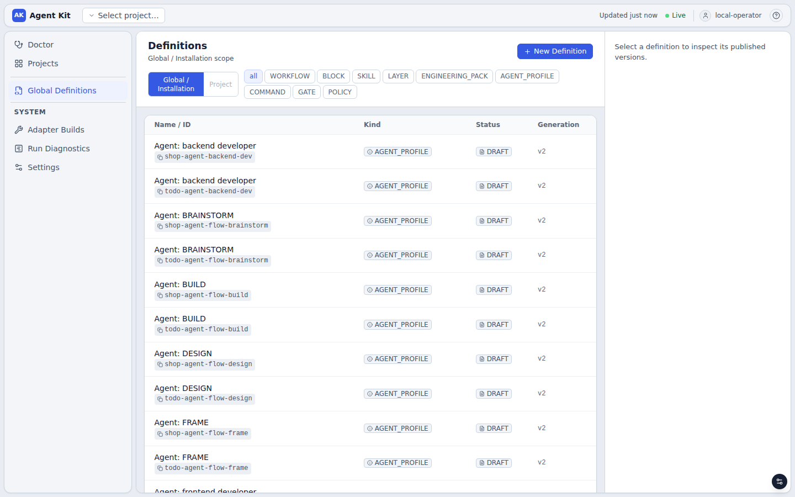

### 3.6 Tham chiếu các loại node

Mọi loại node dưới đây đều có trong sáu workflow của todolist và đã chạy.

| Loại | Cấu hình | Outcome | Dùng ở |
|---|---|---|---|
| `START` | — | `["next"]` | Mọi workflow |
| `END` | — | không có | Mọi workflow |
| `AGENT` | `agent: {profileRef, policyRefs, adapterBuildId, role: "MAKER"\|"CHECKER"}`, `cyclePolicy` nếu là đầu vòng lặp | Tùy ý; hơn một outcome thì cần marker | `implement`, `ai-review`, các bước `flow` |
| `COMMAND` | `command: {commandRef, policyRefs, failureOutcome?}` | Một; hoặc hai khi có `failureOutcome` | `verify`, `gate1`, `quality`, `check-docs`, `reject` |
| `MACHINE_GATE` | `machineGate: {gateRef, policyRefs, failureOutcome?}` | Một; hoặc hai khi có `failureOutcome` | `quality`, `secrets` của `wf-main-check` |
| `APPROVAL` | `approval: {authorizedRoles, timeoutSeconds, escalationOutcome, requestedEvidenceKinds}`, `cyclePolicy` | Tùy ý | `review`, `gate-a`, `gate-b`, `gate2`, `needs-info` |
| `WAIT` | `wait: {mode: "SIGNAL", signalName, timeoutSeconds, completionOutcome, timeoutOutcome}` | `completionOutcome` và `timeoutOutcome` | `ci` của `wf-main-check` |
| `ROUTER` | — | **Chỉ một** | `route` của `wf-main-check` (điểm nối, không rẽ nhánh) |
| `FORK` | — | Mỗi outcome là một nhánh song song | `fork` của `wf-main-check` |
| `JOIN` | `join: {mode: "ALL"}` | `joined` | `join` của `wf-main-check` |

Ví dụ `APPROVAL` có vòng sửa giới hạn, trích từ `wf-task-delivery`:

```json
{"key": "gate2", "type": "APPROVAL", "outcomes": ["approved", "revise", "rejected"],
 "approval": {"authorizedRoles": ["operator"], "timeoutSeconds": 604800,
              "escalationOutcome": "rejected", "requestedEvidenceKinds": ["COMMAND_EXECUTION"]},
 "cyclePolicy": {"maxIterations": 3, "escalationOutcome": "rejected"}}
```

- `authorizedRoles`: chỉ principal có role `operator` (mặc định của `local-operator`) được quyết định. Alpha chỉ có
  một người vận hành, nên mọi cổng (PO, tech lead, reviewer) đều do người này quyết định. Vẫn nên tách thành nhiều
  node để timeline ghi rõ cổng nào đã duyệt.
- `timeoutSeconds` và `escalationOutcome`: không ai quyết định trong 7 ngày thì tự đi nhánh `rejected`.
- `cyclePolicy`: lần kích hoạt đầu là vòng 0, mỗi lần `revise` tăng thêm 1. Khi vượt `maxIterations`, node bị
  `SKIPPED` và tự đi theo `escalationOutcome`.

Một vòng lặp chỉ cần một `cyclePolicy`. Trong `wf-fullstack-review`, node `review` không có `cyclePolicy` riêng vì
vòng `review → implement` đã bị chặn bởi `cyclePolicy` của `implement`.

### 3.7 Checklist trước khi chạy task đầu tiên

- [ ] Mỗi bước trong bảng nghiệp vụ (3.1) đã có node, hoặc có lý do rõ ràng để nằm ngoài engine.
- [ ] Mọi outcome có edge. Mọi vòng lặp có `cyclePolicy`. Mọi nhánh dừng đi qua một COMMAND thoát mã khác 0.
- [ ] Mỗi bước kiểm tra sau agent có `failureOutcome` quay lại agent, và script in lỗi ra **stderr**.
- [ ] Mỗi resource có selector đúng vùng của nó, hoặc `global`. Mỗi bước cần hướng dẫn riêng có agent riêng.
- [ ] Không có key trùng trong một agent; tổng dung lượng nằm trong budget; ít `HARD_CONSTRAINT`.
- [ ] Script của Command chạy được bằng tay ở gốc worktree. Command cần mạng có policy `NETWORK_ACCESS`.
- [ ] `.gitignore` bỏ qua mọi output build. Repository đã commit. Readiness profile đã đặt và baseline xanh.
- [ ] `aw doctor` `HEALTHY`, có dòng `provider_environment:claude HEALTHY`.
- [ ] `aw-publish.py --check` sạch, publish xong, workflow hiện trên UI.
- [ ] Chạy thử một task nhỏ, xem `show-run.sh` và ContextSnapshot (3.3).

---

## 4. Bước 7 — Viết task và chạy

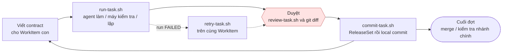

### 4.1 WorkItem gốc

```bash
create-root.sh "Todolist MVP"            # mỗi đợt việc hoặc mỗi tính năng một gốc
# root 66316ba9-505f-49d0-812a-0e26e4f21246
# family 745cdcd4-bce8-420e-ad06-9975f9b0d34c
# workspace: READY
# baseline: PASS
```

[`create-root.sh`](scripts/create-root.sh) `"<tiêu đề>" [repositoryId READ bổ sung…]` tạo một TaskFamily. Family có
Git worktree riêng trên branch `agentkit/w-…`, tách từ commit hiện tại của nhánh mặc định. Mọi WorkItem con dùng chung
worktree này. Script chờ worker tạo xong worktree (`workspace: READY`) và chạy xong baseline (`baseline: PASS`,
mục 2.7); trước đó `aw run start` bị từ chối. Gốc hiện tại được ghi vào `aw-state.json`; tạo gốc mới thì các lệnh sau
sẽ dùng gốc mới.

### 4.2 Contract của WorkItem con

```json
{"title": "BE-01: REST API CRUD cho Todo",
 "parentJoinPolicy": "ALL_CHILDREN_DONE",
 "effectiveScope": [{"repositoryId": "todolist", "access": "WRITE", "reason": "Chỉ sửa backend", "pathScopes": ["backend"]}],
 "contract": {"schemaVersion": 1, "behavior": "...", "verificationSpec": "...", "riskLevel": "MEDIUM",
   "acceptanceCriteria": [{"description": "...", "verificationRef": "COMMAND_EXECUTION"}],
   "workflowVersionId": "WORKFLOW_VERSION_ID"}}
```

- `behavior`, `verificationSpec`, `riskLevel` và `acceptanceCriteria` là bắt buộc; thiếu thì `readiness` báo
  `problems`. Agent nhận chúng nguyên văn trong `taskContract`, nên hãy viết rõ như viết ticket cho người.
- `pathScopes` là **tiền tố đường dẫn**, không phải glob. `"backend"` khớp `backend/...`. Bỏ `pathScopes` nghĩa là
  toàn bộ repository. Scope làm hai việc: giới hạn chỗ agent được sửa (sửa ngoài scope là `SCOPE_VIOLATION`), và chọn
  tri thức theo vùng (mục 3.3). Một scope chỉ có một mục cho mỗi repository.
- `riskLevel` được dùng làm `riskClass` cho selector. Ví dụ, `HIGH` nạp thêm `dev.high-risk-extra`.
- `workflowVersionId` do `run-task.sh` điền. Contract **pin** workflow version: WorkItem này chạy bao nhiêu lần cũng
  dùng đúng version đó.

Backlog mẫu ([`work-items/`](work-items/)):

| File | Workflow | Scope |
|---|---|---|
| [`be-01-todo-api.json`](work-items/be-01-todo-api.json) | `wf-backend-feature` | `backend` |
| [`fe-01-scaffold.json`](work-items/fe-01-scaffold.json) | `wf-frontend-feature` | `frontend` |
| [`fe-02-todo-ui.json`](work-items/fe-02-todo-ui.json) | `wf-frontend-feature` | `frontend` |
| [`fs-01-created-at.json`](work-items/fs-01-created-at.json) | `wf-fullstack-review` | `backend`, `frontend` |
| [`feature-due-date.json`](work-items/feature-due-date.json) | `wf-feature-definition` | `docs` |
| [`main-check.json`](work-items/main-check.json) | `wf-main-check` | toàn repository, chỉ đọc |

### 4.3 Chạy task

```bash
run-task.sh "$GUIDE/work-items/be-01-todo-api.json" wf-backend-feature
```

[`run-task.sh`](scripts/run-task.sh) `<file WorkItem> <workflow id trong aw-project.json>` làm các bước sau:

1. Lấy version của workflow từ `aw-state.json`.
2. Tạo WorkItem con dưới gốc hiện tại.
3. Nếu có `MESSAGE="…"`, gửi nó thành message.
4. Kiểm tra `readiness`, rồi `mark-ready`.
5. `aw run start`.
6. [`watch-run.sh`](scripts/watch-run.sh) chờ tới khi run kết thúc **hoặc cần người** (cổng duyệt, tín hiệu, blocker),
   rồi [`show-run.sh`](scripts/show-run.sh) in trạng thái.

Output thật của BE-01, chạy với Claude CLI và Maven thật:

```text
WorkItem: 0804fab9-5767-4e93-9343-e7142985bb25
{"ready":true,"problems":null}
Run: 9940861d-6bd5-473d-8cc1-a44e554fa4ee  state: SUCCEEDED
  #1 start (vòng 0): SUCCEEDED next
  #2 implement (vòng 0): SUCCEEDED done
  #3 verify (vòng 0): SUCCEEDED failed
  #4 implement (vòng 1): SUCCEEDED done
  #5 verify (vòng 1): SUCCEEDED failed
  #6 implement (vòng 2): SUCCEEDED done
  #7 verify (vòng 2): SUCCEEDED passed
  #8 end (vòng 0): SUCCEEDED
  provider báo cáo: 93908 token vào, 19526 token ra, 0.7815 USD
  evidence AGENT_EXECUTION: RECORDED
  evidence COMMAND_EXECUTION: FAILED
  evidence AGENT_EXECUTION: RECORDED
  evidence COMMAND_EXECUTION: FAILED
  evidence AGENT_EXECUTION: RECORDED
  evidence COMMAND_EXECUTION: SUCCEEDED
```

Cách đọc:

- Mỗi dòng `#n` là một lần node được kích hoạt. `verify … failed` không phải lỗi của run: bước kiểm tra chạy xong, kết
  quả là "không đạt", và run đi theo cạnh `failed` về lại `implement` (vòng 1, vòng 2).
- Agent viết code trong 85 giây, thử `mvn -B test` và bị từ chối (mục 1.3), rồi kết thúc. `verify` chạy Maven thật:
  10 test lỗi vì Hibernate `validate` không khớp kiểu cột của SQLite. Agent sửa ở vòng 1; còn 6 test lỗi vì cách lưu
  `Instant`; sửa tiếp ở vòng 2; xanh. Toàn bộ mất 3 phút 42 giây, không cần người.
- `provider báo cáo` là tổng token và chi phí của mọi lần agent chạy trong run, do Claude CLI tự báo.
- Run tới `END` thì completion policy được xét: lần chạy cuối của `verify` đạt, nên WorkItem `DONE`.

**Agent đã nói gì.** `aw` chưa có lệnh nào đọc lời của agent (tab Chat chỉ có message của người vận hành).
[`agent-log.py`](scripts/agent-log.py) đọc thẳng database và in thông điệp cuối của từng lần agent chạy:

```bash
agent-log.py 9940861d-6bd5-473d-8cc1-a44e554fa4ee --denied
```

```text
== #2 implement (vòng 0) attempt 1: SUCCEEDED  [361185 token vào, 13389 token ra, 0.3360 USD]
Tôi đã viết xong code nhưng chưa chạy được `mvn -B test`, nên chưa biết build và test có pass hay không. Cả ba lần
chạy lệnh Maven đều bị chặn vì cần phê duyệt (Bash, Bash kèm `-f`, PowerShell), và phiên này không tương tác …
-- 1 lần gọi công cụ bị từ chối vì cần phê duyệt:
   Bash {"command": "mvn -B test -f …/backend/pom.xml", "timeout": 500000}

== #6 implement (vòng 2) attempt 1: SUCCEEDED  [387980 token vào, 3632 token ra, 0.2308 USD]
… The report in `target/surefire-reports` showed 6 of the 9 tests in `TodoControllerTests` erroring with
`JpaSystemException: Could not convert 'java.time.Instant' to 'java.lang.String'` …
```

Số token "vào" ở đây gồm cả phần đọc từ cache, nên lớn hơn dòng `provider báo cáo`.

Theo dõi trên UI: **Board**, mở thẻ rồi xem **Graph & Timeline** (từng node và attempt, kèm mức dùng của run),
**Evidence**, **Chat** (message gửi cho agent), **Workspace** (diff giữa các revision đã commit).

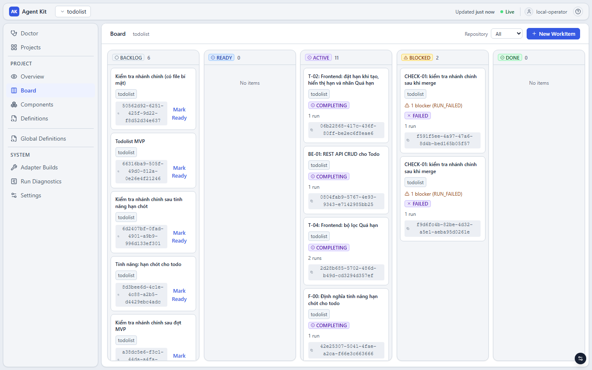
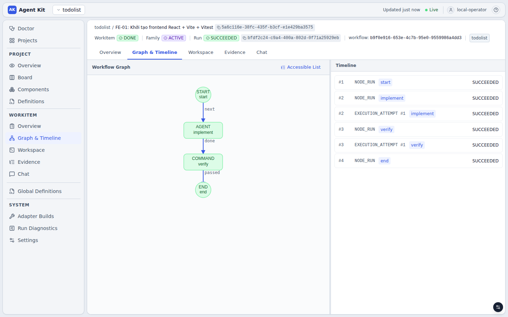

Trên Board, thẻ của task đã xong đứng ở cột `ACTIVE` với nhãn `COMPLETING` (mục 6). Trạng thái thật nằm ở đầu trang
task (`WorkItem DONE`, `Run SUCCEEDED`) và ở `aw work-item show`.

### 4.4 Quyết định ở node APPROVAL

Workflow có người duyệt dừng lại ở cổng. Output thật của FS-01 (`wf-fullstack-review`):

```text
Run: 3b520418-77bb-4401-b7b6-9f2f310d6bbb  state: RUNNING
  #1 start (vòng 0): SUCCEEDED next
  #2 implement (vòng 0): SUCCEEDED done
  #3 backend-test (vòng 0): SUCCEEDED passed
  #4 frontend-test (vòng 0): SUCCEEDED passed
  #5 ai-review (vòng 0): SUCCEEDED approved
  #6 review (vòng 0): WAITING
  provider báo cáo: 67718 token vào, 9494 token ra, 0.4922 USD
  …
  CHỜ DUYỆT node review: review-task.sh 3b520418-77bb-4401-b7b6-9f2f310d6bbb <approved|rejected|rework> ["phản hồi"]
```

Trước khi quyết định, đọc kết luận của AI reviewer và review thay đổi (4.5):

```bash
agent-log.py 3b520418-77bb-4401-b7b6-9f2f310d6bbb --node ai-review
```

```text
== #5 ai-review (vòng 0) attempt 1: SUCCEEDED  [291864 token vào, 2879 token ra, 0.2316 USD]
Review of FS-01 (hiển thị thời gian tạo của todo): both acceptance criteria are met, and I found nothing that needs
rework. I did not run the tests myself, because the review is read-only and git was blocked.

**Acceptance criteria**
1. **Backend test, `createdAt` in ISO-8601:** `TodoControllerTests.listIncludesCreatedAtInIso8601Utc` calls
   `GET /api/todos`. It asserts every `createdAt` ends with `Z` and parses with `Instant.parse`. …
**Minor, not blocking**
- `formatRelativeTime` returns 'vừa xong' for under 5 seconds and uses `Date.now()` once at render, so the text
  doesn't refresh until the next render. …
```

Sau đó quyết định:

```bash
review-task.sh 3b520418-… rework "Thêm test frontend cho trường hợp todo vừa tạo dưới 5 giây (hiển thị 'vừa xong'), và cập nhật thời gian tương đối mỗi 60 giây mà không cần tải lại trang."
```

[`review-task.sh`](scripts/review-task.sh) `<runId> <outcome> ["phản hồi"]` làm ba việc:

1. Append phản hồi thành message của WorkItem.
2. Gọi `aw approval resolve` cho approval đang chờ.
3. Chờ tới khi run kết thúc hoặc dừng ở cổng tiếp theo (`watch-run.sh`), rồi in trạng thái.

Output thật:

```text
Đã chọn 'rework' cho node review; chờ run chạy tiếp...
  #6 review (vòng 0): SUCCEEDED rework
  #7 implement (vòng 1): SUCCEEDED done
  #8 backend-test (vòng 1): SUCCEEDED passed
  #9 frontend-test (vòng 1): SUCCEEDED passed
  #10 ai-review (vòng 1): SUCCEEDED approved
  #11 review (vòng 1): WAITING
```

Ở vòng 1, phản hồi nằm trong `messages` của prompt, và cũng hiện ở tab **Chat**. Tiếp theo:

- `approved` → `#12 end`, WorkItem `DONE`, rồi commit (4.6).
- `rejected` → node `reject` chạy và run `FAILED`; WorkItem `BLOCKED`. Dọn worktree
  (`git -C "$WT" checkout -- . && git -C "$WT" clean -fd -- backend frontend`), rồi `aw work-item cancel` để bỏ hẳn
  hoặc `retry-task.sh` để làm lại ([operations.md mục 5.3](operations.md#53-dừng-một-run-bỏ-một-task)).

Cùng script này dùng cho mọi cổng: `gate-a`, `gate-b`, `gate2` (`approved|revise|rejected`), và `needs-info`
(`provided|abandon`; nội dung phản hồi là câu trả lời cho câu hỏi của agent).

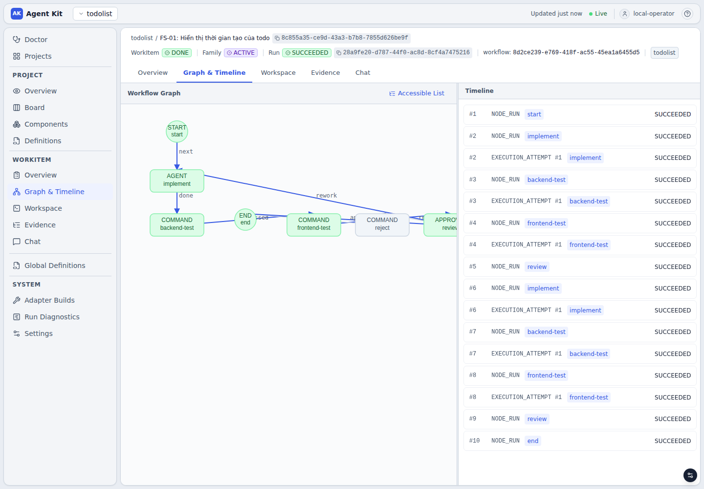
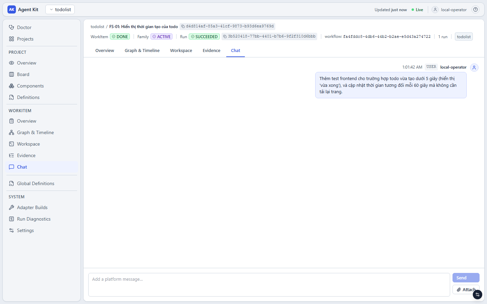

### 4.5 Review thay đổi

Thay đổi của agent nằm **chưa commit** trong worktree của family:

```bash
WT=$(worktree-path.sh)
git -C "$WT" status --porcelain        # gồm cả file mới (untracked)
git -C "$WT" diff
(cd "$WT/backend" && mvn spring-boot:run)       # tự chạy thử nếu muốn
```

Ba nguồn để review một task:

- **Diff** trong worktree, như trên. Tab **Workspace** trên UI chỉ so sánh giữa hai revision đã commit, nên không
  thấy thay đổi đang chờ.
- **Lời của agent**: `agent-log.py <runId>` (4.3). Agent thường nói rõ điều nó chưa kiểm chứng được.
- **Kết quả kiểm tra**: evidence của các bước COMMAND, kể cả những lần đỏ
  ([operations.md mục 3](operations.md#3-evidence-và-artifact)).

Muốn bỏ một phần thay đổi thì hoàn tác trực tiếp trong worktree (`git -C "$WT" checkout -- <file>`), hoặc chọn
`rework`/`revise` kèm phản hồi.

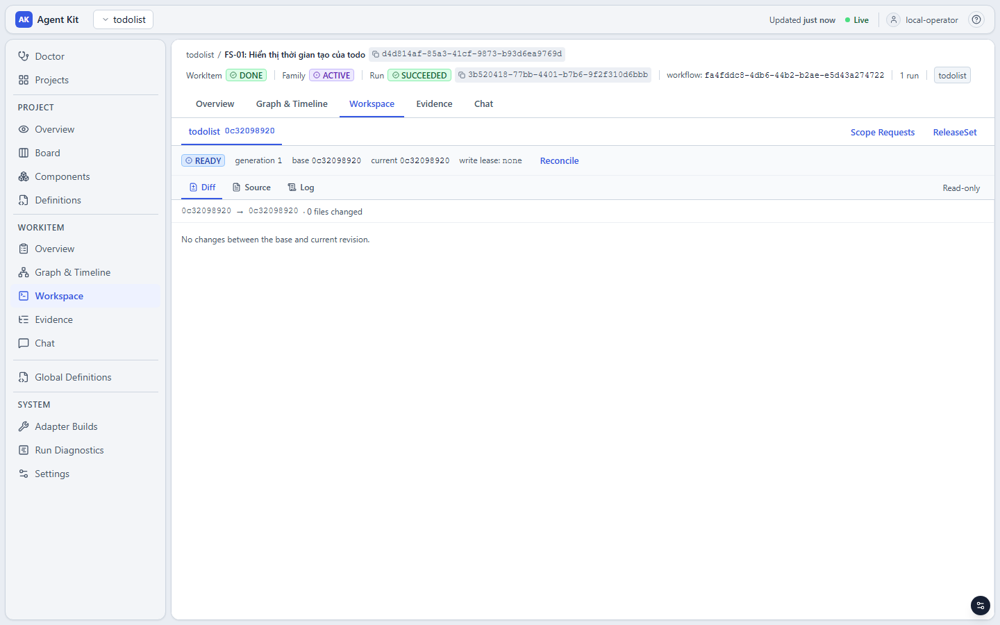

### 4.6 Commit — sau MỖI task, trước task tiếp theo

```bash
AUTHOR_NAME="Tên bạn" AUTHOR_EMAIL="ban@example.com" commit-task.sh "FS-01: hiển thị thời gian tạo của todo"
# {"state":"COMMITTED","parentVcsObjectId":"359b6bed…","resultVcsObjectId":"3362c96b…"}
```

[`commit-task.sh`](scripts/commit-task.sh) thực hiện đúng chuỗi lệnh `aw` cho local commit:

```bash
aw workspace-set show --project-id "$PROJECT_ID" "$FAMILY_ID"     # repositoryWorkspaceId, version, currentRevision
echo '{"repositories":[{"repositoryId":"todolist","baseVcsObjectId":"<rev>","resultVcsObjectId":"<rev>","verdict":"PASS"}]}' \
  | aw release-set create --project-id "$PROJECT_ID" --family-id "$FAMILY_ID" --idempotency-key rs-1
aw release-set seal --expected-version 1 --idempotency-key seal-1 --yes <releaseSetId>
aw release-set local-commit --project-id "$PROJECT_ID" --release-set-id <releaseSetId> \
  --repository-workspace-id <rwId> --expected-release-set-version 2 --expected-workspace-version <v> \
  --author-name "..." --author-email "..." --message "..." --idempotency-key commit-1 --yes --wait --wait-timeout 5m
```

Commit là một `git add -A && git commit` thật trên branch `agentkit/w-…`. Message có kèm marker
`[Release-Set-Local-Commit-Marker: sha256:…]`, và commit xuất hiện ngay trong repo gốc (`git log agentkit/w-…`).
Không có gì bị push.

**Vì sao phải commit sau mỗi task:** thay đổi chưa commit của task trước vẫn nằm trong worktree. Task sau có scope
khác (ví dụ FE sau BE) sẽ thấy chúng là thay đổi ngoài scope và fail với `SCOPE_VIOLATION`. Worktree không có thay đổi
thì script dừng với thông báo, không tạo ReleaseSet thừa.

Chỉ commit khi run đã `SUCCEEDED` và bạn đồng ý với diff. Script từ chối commit khi family còn task `ACTIVE` hoặc
`BLOCKED` (một run có thể `FAILED` ở bước đứng sau cổng duyệt cuối); `FORCE=1` bỏ qua kiểm tra này.

### 4.7 Khi run FAILED

Run kết thúc `FAILED` khi vòng sửa hết ngân sách (`cyclePolicy`), khi người duyệt chọn `rejected`, hoặc khi có lỗi
kỹ thuật (vi phạm scope, timeout, provider trả lỗi). WorkItem chuyển sang `BLOCKED` với blocker `RUN_FAILED`, và
`show-run.sh` in sẵn lệnh cần gõ. Bạn chạy lại **trên chính WorkItem đó**.

Chạy thật: giữa tính năng "hạn chót", tài khoản Claude hết hạn mức của phiên, và run của T-04 hỏng ngay ở node đầu:

```text
Run: 69d8a3e7-6f59-4fe9-a0c4-6a676c0d1715  state: FAILED
  #1 start (vòng 0): SUCCEEDED next
  #2 frame (vòng 0): FAILED
  attempt frame #1: FAILED EXECUTION_FAILED
  provider báo cáo: 0 token vào, 0 token ra, 0 USD
  BLOCKER RUN_FAILED đang mở
  Run FAILED. Xem lỗi rồi chạy lại trên chính WorkItem này:
    retry-task.sh 2d28b685-5702-486d-b49d-cd3294d357ef ["ghi chú cho agent"]
$ agent-log.py 69d8a3e7-6f59-4fe9-a0c4-6a676c0d1715
== #2 frame (vòng 0) attempt 1: FAILED  [0 token vào, 0 token ra, 0.0000 USD]
You've hit your session limit · resets 5:30am (Asia/Barnaul)
```

Sau khi hạn mức được đặt lại:

```text
$ retry-task.sh 2d28b685-5702-486d-b49d-cd3294d357ef
Đã gỡ blocker 69d8a3e7-6f59-4fe9-a0c4-6a676c0d1715-run-failed-blocker
Run: 8e283828-2edd-4963-acfe-2297162bb97a  state: RUNNING
  #1 start (vòng 0): SUCCEEDED next
  #2 frame (vòng 0): SUCCEEDED fast
  #3 build (vòng 0): SUCCEEDED done
  #4 gate1 (vòng 0): SUCCEEDED failed
  #5 build (vòng 1): SUCCEEDED done
  #6 gate1 (vòng 1): SUCCEEDED passed
  #7 quality (vòng 0): SUCCEEDED passed
  #8 gate2 (vòng 0): WAITING
```

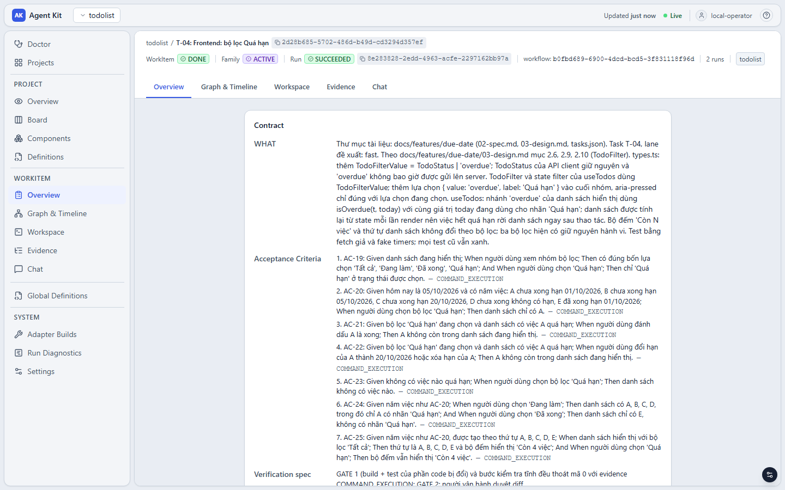

[`retry-task.sh`](scripts/retry-task.sh) `<workItemId> ["ghi chú cho agent"]` in lỗi của các bước kiểm tra trong run
trước, gỡ blocker, gửi ghi chú của bạn thành message, rồi start run mới với đúng workflow version đã pin. Ba điều
cần biết:

- Worktree **không** được reset: run mới làm tiếp trên những gì run trước để lại.
- Run mới chạy lại workflow **từ đầu**, không chạy tiếp từ node bị hỏng. Các agent thấy phần việc đã có và không làm
  lại, nhưng mỗi node vẫn tốn một lần gọi model.
- Khi vòng sửa hết ngân sách (agent không sửa nổi lỗi), script in gộp output của các lần kiểm tra đỏ trước khi chạy
  lại, ví dụ `4 lệnh thoát mã 1: FAIL src/…`. Kèm một ghi chú chỉ hướng cho agent; chạy lại y nguyên thường cho kết
  quả y nguyên.

Chi tiết và các tình huống khác (vi phạm scope, hủy run, worker chết, Claude CLI đổi version) ở
[operations.md mục 5](operations.md#5-khi-có-sự-cố).

Muốn bổ sung chỉ dẫn mà không sửa contract: `MESSAGE="…" run-task.sh …` khi chạy lần đầu, phản hồi của
`review-task.sh`, ghi chú của `retry-task.sh`, hoặc `aw message append` bất kỳ lúc nào
([operations.md mục 2](operations.md#2-message-và-context-của-agent)).

### 4.8 Ví dụ todolist từ đầu tới cuối

**Đợt MVP, dùng các workflow rút gọn:**

```bash
create-root.sh "Todolist MVP"
run-task.sh "$GUIDE/work-items/be-01-todo-api.json" wf-backend-feature
commit-task.sh "BE-01: REST API CRUD cho Todo"           # sau khi review diff (4.5)
run-task.sh "$GUIDE/work-items/fe-01-scaffold.json" wf-frontend-feature
commit-task.sh "FE-01: khung frontend React + Vite + Vitest"
run-task.sh "$GUIDE/work-items/fe-02-todo-ui.json" wf-frontend-feature
commit-task.sh "FE-02: giao diện quản lý todo"
run-task.sh "$GUIDE/work-items/fs-01-created-at.json" wf-fullstack-review
review-task.sh <run> rework "phản hồi"                   # hoặc approved ngay (4.4)
review-task.sh <run> approved
commit-task.sh "FS-01: hiển thị thời gian tạo của todo"
```

Kết quả thật của đợt này (Claude CLI 2.1, `sonnet`, effort `medium`; Maven và npm thật):

| Task | Diễn biến | Thời gian chạy | Chi phí provider báo |
|---|---|---|---|
| BE-01 | `implement` 3 lần: `verify` đỏ 2 lần rồi xanh | 3 phút 42 giây | 0,78 USD |
| FE-01 | `implement` 1 lần, `verify` xanh (`npm install`, `vitest`, `vite build`) | 1 phút 58 giây | 0,20 USD |
| FE-02 | `implement` 1 lần, `verify` xanh | 1 phút 47 giây | 0,29 USD |
| FS-01 | `implement`, hai bước test, `ai-review` `approved`; người duyệt `rework` một lần; vòng 2 xanh; `approved` | 2 phút 30 giây + 2 phút 08 giây | 0,91 USD |

```text
3362c96 FS-01: hiển thị thời gian tạo của todo [Release-Set-Local-Commit-Marker: sha256:…]
359b6be FE-02: giao diện quản lý todo [Release-Set-Local-Commit-Marker: sha256:…]
dd3acc9 FE-01: khung frontend React + Vite + Vitest [Release-Set-Local-Commit-Marker: sha256:…]
0f77ca1 BE-01: REST API CRUD cho Todo [Release-Set-Local-Commit-Marker: sha256:…]
0c32098 Khung todolist: backend Spring Boot + SQLite, thư mục frontend
```

**Một tính năng, dùng quy trình hai tầng:**

```bash
create-root.sh "Tính năng: hạn chót cho todo"
run-task.sh "$GUIDE/work-items/feature-due-date.json" wf-feature-definition
review-task.sh <run> provided "Chỉ cần ngày, không cần giờ."      # nếu SPEC hỏi (NEEDS_INFO)
review-task.sh <run> approved                                     # GATE A
review-task.sh <run> approved                                     # GATE B
commit-task.sh "F-00: định nghĩa tính năng hạn chót"
split-tasks.sh due-date                                           # → ./tasks/due-date/T-01.json, T-02.json…
run-task.sh tasks/due-date/T-01.json wf-task-delivery             # review-task.sh … gate2, rồi commit-task.sh
run-task.sh tasks/due-date/T-02.json wf-task-delivery
```

Timeline thật, tài liệu agent viết ra và ảnh chụp nằm trong [feature-task-flow.md](feature-task-flow.md). Ở lần chạy
thật, DESIGN chia tính năng thành bốn task (một backend, ba frontend); F-00 và bốn task tốn 7,63 USD.

Cả hai đợt cộng lại: 9 WorkItem, 35 lần agent chạy, 9,81 USD theo số provider báo, khoảng 45 phút máy chạy. Kết quả
là một ứng dụng todolist có CRUD, bộ lọc, thời gian tạo và hạn chót, với 10 commit, hơn 1 100 dòng tài liệu trong
`docs/` (spec, thiết kế, kế hoạch từng task, một ADR), và test backend lẫn frontend xanh trên nhánh chính.

Muốn quay lại làm việc trên một gốc cũ, gọi `create-root.sh` với **đúng tiêu đề cũ**: script không tạo gốc mới mà đưa
gốc đó về làm gốc hiện tại trong `aw-state.json`.

### 4.9 Kết thúc đợt: merge, kiểm tra nhánh chính, thu hồi worktree

**Merge.** `aw` không merge hay push. Branch của family là một branch Git bình thường trong repository của bạn:

```bash
cd ~/work/todolist
git worktree list                      # tìm branch agentkit/w-… của family
git merge --no-ff agentkit/w-<...> -m "Merge đợt MVP"
(cd backend && mvn spring-boot:run)           # http://localhost:8080/api/todos
(cd frontend && npm install && npm run dev)   # http://localhost:5173, proxy /api tới 8080
```

Backend do agent viết trong đợt MVP, chạy thật sau khi merge:

```text
POST /api/todos {"title": "…"}        → 201, Location: /api/todos/1
POST /api/todos {"title": ""}         → 400 {"type":"about:blank","title":"Bad Request","status":400,…}
PATCH /api/todos/1/toggle             → 200 {"id":1,…,"completed":true,"createdAt":"2026-10-04T18:04:46.712082Z",…}
GET /api/todos?status=active          → []
GET /api/todos/999                    → 404
DELETE /api/todos/1                   → 204
```

**Kiểm tra nhánh chính.** Có những lỗi chỉ lộ ra sau khi gộp (hai nhánh cùng thêm migration `V2`, một file `.env` lọt
vào). `wf-main-check` chạy hai MACHINE_GATE song song trên một worktree mới tách từ nhánh chính, rồi chờ CI:

```bash
create-root.sh "Kiểm tra nhánh chính sau đợt MVP"
run-task.sh "$GUIDE/work-items/main-check.json" wf-main-check
```

```text
Run: 69b99d36-ebc9-4f93-b35a-6679f05ce317  state: RUNNING
  #1 start (vòng 0): SUCCEEDED next
  #2 route (vòng 0): SUCCEEDED next
  #3 fork (vòng 0): SUCCEEDED
  #4 quality (vòng 0): SUCCEEDED passed
  #4 join (vòng 0): SUCCEEDED joined
  #5 ci (vòng 0): WAITING
  #5 secrets (vòng 0): SUCCEEDED passed
  evidence NO_SECRET_FILES: PASS
  evidence MIGRATION_VERSIONS_UNIQUE: PASS
  evidence NO_DISABLED_TESTS: PASS
  CHỜ TÍN HIỆU node ci: aw wait signal --signal-key ci-green --idempotency-key <khóa> 69b99d36-… 6531cc89-…
```

Run đứng ở node `WAIT` tới khi có tín hiệu từ bên ngoài, tối đa 24 giờ. CI (hoặc bạn) gửi tín hiệu khi build xanh:

```bash
aw wait signal --signal-key ci-green --idempotency-key ci-build-41 \
  --payload '{"build":"https://ci.example/todolist/41"}' 69b99d36-… 6531cc89-…
# {"state":"CONSUMED","won":true,"advanced":true,"nextNodeKey":"end"}
watch-run.sh 69b99d36-…                # state: SUCCEEDED, WorkItem DONE
```

`--signal-key` là danh tính của sự kiện thật (ở đây là tên tín hiệu của node); `--idempotency-key` là khóa của lần
gọi. Khi một gate không đạt, run `FAILED` và evidence nêu rõ tiêu chí nào, vì sao. Kết quả chạy thật sau khi một file
`.env` bị commit nhầm vào nhánh chính:

```text
Run: 8fc281aa-95e7-4cfc-b94e-8fc25dca8529  state: FAILED
  #3 fork (vòng 0): SUCCEEDED
  #4 quality (vòng 0): SUCCEEDED passed
  #4 join (vòng 0): FAILED
  #5 secrets (vòng 0): FAILED
  attempt secrets #1: FAILED EXECUTION_FAILED
  evidence NO_SECRET_FILES: FAIL
  evidence MIGRATION_VERSIONS_UNIQUE: PASS
  evidence NO_DISABLED_TESTS: PASS
$ aw artifact get --project-id "$P" --output - <workItemId> <evidenceId của NO_SECRET_FILES> <artifactId>
{"overallVerdict":"FAIL","criteria":[{"name":"Không có file bí mật hay file database","evidenceKey":"NO_SECRET_FILES",
 "verdict":"FAIL","detail":"file không được có: .env "}]}
```

Ba điều cần biết về bước này:

- Worktree của một gốc là ảnh chụp nhánh chính **lúc tạo gốc**. Sửa nhánh chính xong thì tạo gốc mới rồi chạy lại;
  `retry-task.sh` trên WorkItem cũ vẫn thấy commit cũ.
- Lỗi làm **test đỏ** bị bắt sớm hơn, ngay khi tạo gốc: với hai migration cùng số `V2`, `create-root.sh` dừng ở
  `baseline: FAIL` vì Flyway từ chối khởi động (mục 2.7). Các gate ở đây bắt những thứ test không bắt.
- Đừng commit output build. Khi `backend/target/` lọt vào Git, baseline sửa các file đó trong worktree, và mọi node
  chỉ đọc sau đó (gate, CHECKER) `FAILED` với `SCOPE_VIOLATION` kèm danh sách file bị đổi.

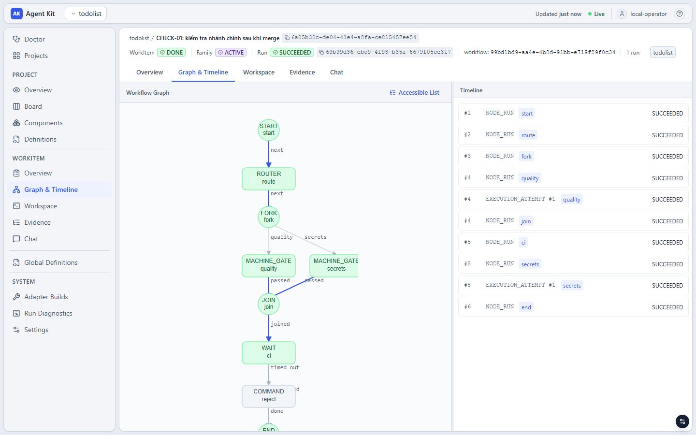

**Thu hồi worktree.** Family đã merge không cần worktree nữa
([operations.md mục 7.4](operations.md#74-thu-hồi-worktree-của-family-đã-xong)).

**Đợt tiếp theo:** tạo WorkItem gốc mới (`create-root.sh`), để family mới có worktree tách từ `main` đã merge.

---

## 5. Bước 8 — Vận hành và thay đổi

### 5.1 Khi tri thức hoặc quy trình thay đổi

Definition là bất biến theo version. Sửa file (Layer, Skill, policy, script trong `commands/`, template workflow, hoặc
`aw-project.json`) rồi chạy lại `aw-publish.py`. Kết quả:

- Run cũ vẫn giữ đúng version đã pin lúc bắt đầu.
- WorkItem đã tạo vẫn pin workflow version cũ, kể cả khi chạy lại bằng `retry-task.sh`.
- `run-task.sh` luôn lấy version mới nhất từ `aw-state.json`, nên WorkItem tạo sau đó dùng version mới.

Nếu thay đổi là ở **quy trình** (thêm bước, thêm cổng), quay lại Bước 2: sửa bảng nghiệp vụ trước, rồi mới sửa graph.

Một số tùy biến hay gặp:

| Muốn | Sửa |
|---|---|
| Thêm bước lint/format | Thêm script vào `commands/` và `scriptSkills`, khai báo Command, chèn node COMMAND có `failureOutcome` vào template |
| Thêm bước test e2e (Cypress) | Làm theo [add-e2e-cypress-node.md](add-e2e-cypress-node.md): script dựng ứng dụng, Layer cho agent, Command, node `e2e` trước `gate2` |
| Thêm cổng duyệt cho workflow ngắn | Chèn node APPROVAL như `wf-fullstack-review`, đổi `completionPolicyRef` sang `policy-completion-reviewed` |
| Model khác cho một bước | Khóa `model` của agent tương ứng trong `agents` |
| Tri thức riêng cho một vùng code mới | Thêm resource với `"selector": {"componentTags": ["<tên thư mục>"]}` hoặc `pathTags` |
| Hướng dẫn riêng cho task rủi ro cao | Thêm resource với `"selector": {"riskClasses": ["HIGH"]}` |
| Nhiều vòng sửa hơn | Tăng `cyclePolicy.maxIterations` của node đầu vòng lặp |
| Agent chạy lâu hơn | Policy ATTEMPT mới với `timeoutSeconds` lớn hơn, pin vào node cần |
| Bỏ một bước cho việc nhỏ | Copy template, nối lại edge, khai báo thành workflow khác trong `workflows` |

Sau khi publish, `aw-publish.py` in `CẢNH BÁO` nếu có resource quá hạn rà soát hoặc quá nhiều `HARD_CONSTRAINT`.

**Tri thức cũng phải được bảo trì như code.** Trong lần chạy thật, sau khi tính năng "hạn chót" thêm trường `dueDate`
và một endpoint mới, agent SYNC kết thúc bằng một dòng nhắc: "resource `spring.rest-api` cần được cập nhật để thêm
trường `dueDate` và endpoint mới; việc này không thuộc phạm vi của task". Resource đó là `HARD_CONSTRAINT` mô tả hợp
đồng API cho mọi task sau; để nguyên thì agent kế tiếp nhận một hợp đồng đã cũ. Sửa Layer, đặt `lastVerified` mới,
chạy lại `aw-publish.py`.

### 5.2 So sánh version

```bash
aw definition versions --kind WORKFLOW --project-id "$(jq -r .projectId aw-state.json)" todo-wf-backend-feature
aw version diff --project-id "$(jq -r .projectId aw-state.json)" <versionIdA> <versionIdB> \
  | jq -r '.sourceDiff[] | select(.op != "equal") | "\(.op)\t\(.text)"'
```

Chi tiết ở [operations.md mục 1.3](operations.md#13-catalog-definition-và-version).

### 5.3 Nhiều project trên một bản cài

Mỗi project cần ba thứ riêng: thư mục khai báo, `prefix`, và file trạng thái.

```bash
mkdir -p ~/aw/shop && cd ~/aw/shop
init-project.sh shop shop "$HOME/work/shop"
aw-publish.py ~/projects/shop-aw/aw-project.json         # prefix "shop-" trong file khai báo
create-root.sh "Đợt 1"
run-task.sh <file WorkItem của shop> <workflow id trong file khai báo của shop>
```

Có thể dùng chung một thư mục vận hành, miễn là đặt `AW_STATE=./aw-state-shop.json` cho mọi lệnh của project đó.
Workflow có scope project: dùng workflow của todolist cho WorkItem của `shop` bị từ chối lúc `run start`.

### 5.4 Vận hành hằng ngày

Xem trạng thái, gửi thêm thông tin cho agent, đọc evidence và mã nguồn, xử lý sự cố, mở rộng scope, sao lưu:
[operations.md](operations.md). Bảng tra nhanh "hiện tượng → nguyên nhân → cách xử lý" ở
[mục 5.10](operations.md#510-bảng-tra) của tài liệu đó.

---

## 6. Giới hạn cần biết

Các giới hạn dưới đây đều đã gặp khi kiểm chứng. Thiết kế của sáu workflow mẫu đã tránh chúng.

**Của bản build đã kiểm chứng (lỗi hoặc thiếu, có thể được sửa ở bản sau):**

- **Không có lệnh `aw` nào đọc lời của agent.** Tóm tắt cuối phiên, câu hỏi, kết luận review của agent không nằm trong
  message, evidence hay UI. Hướng dẫn này đọc chúng bằng `agent-log.py`, một script đọc thẳng database.
- **Lý do `rework` của agent CHECKER không tới được maker.** Output của agent không được đưa vào `messages` hay
  `checkFailures`. Nối `rework` thẳng về maker thì maker chạy lại mà không biết phải sửa gì. Vì vậy trong
  `wf-fullstack-review` cả hai outcome của `ai-review` đều đi tới người duyệt.
- **MACHINE_GATE fail không kèm lý do trong family đã có local commit.** Revision mà `aw` ghi cho worktree không tiến
  lên sau local commit, nên gate thấy worktree "lệch" và dừng. Vì vậy kiểm tra tĩnh ở tầng task là một COMMAND
  (`quality-check.sh`), còn MACHINE_GATE chỉ dùng trong `wf-main-check`, chạy trên một gốc mới chưa có commit nào.
- **Board không chuyển thẻ sang `DONE`.** Thẻ của WorkItem đã xong đứng ở `ACTIVE` / `COMPLETING`. Trạng thái thật đọc
  bằng `aw work-item show` hoặc ở đầu trang task trên UI ([operations.md mục 1.4](operations.md#14-bảng-việc-và-workitem)).
- **Hủy run khi agent đang ghi làm hỏng family.** Worktree bị cách ly và `reconcile` không đưa được family trở lại.
  Chỉ hủy run khi nó đang chờ ở một cổng duyệt ([operations.md mục 5.3 và 5.4](operations.md#53-dừng-một-run-bỏ-một-task)).
- **Worker chết giữa lúc agent chạy** giữ khóa worktree tới hết `timeoutSeconds` của attempt cộng 2 phút
  ([operations.md mục 5.5](operations.md#55-worker-chết-khi-agent-đang-chạy)).

**Của thiết kế hiện tại:**

- **Không có sandbox.** Agent và command chạy dưới user của bạn (`OPERATOR_TRUSTED_LOCAL`). `networkAccess` chỉ là khai
  báo kèm kiểm tra quyền, không chặn mạng thật. Scope được kiểm tra sau khi chạy.
- **Agent không tự chạy được lệnh** ở chế độ `acceptEdits`. Mọi phản hồi "code có chạy không" đi qua bước kiểm tra
  của workflow, mỗi vòng tốn một lần agent chạy lại từ đầu (không nối tiếp phiên cũ).
- **Chạy lại là chạy lại từ đầu.** Run mới của một WorkItem bắt đầu ở `START`, kể cả khi run trước hỏng ở node cuối.
- **Hạn mức của provider nằm ngoài `aw`.** Hết hạn mức giữa chừng thì attempt `FAILED` và run `FAILED`; không có tự
  động chờ rồi thử lại ([operations.md mục 5.9](operations.md#59-provider-hết-hạn-mức-hoặc-trả-lỗi)).
- **Ranh giới giữa các bước là lời dặn, không phải cơ chế.** Scope áp dụng cho cả WorkItem, nên một bước chỉ được
  viết tài liệu vẫn *có thể* sửa code. Viết ranh giới thành `HARD_CONSTRAINT` (mục 3.3) và kiểm tra bằng diff khi
  duyệt.
- **Một worktree cho mỗi family, làm tuần tự.** Chạy task con lần lượt, commit sau mỗi task.
- **`ROUTER` chỉ một outcome; không có node sinh WorkItem.** FORK với các nhánh cùng ghi một repository báo `CONFLICT`.
- **Một scope chỉ có một mục cho mỗi repository**, và `pathScopes` của WorkItem đã tạo không đổi được.
- **WorkItem pin workflow version.** Publish workflow mới không ảnh hưởng WorkItem đã tạo; muốn dùng version mới thì
  tạo WorkItem mới.
- **Pack assignment chỉ để ghi nhận.** CONTEXT policy và selector mới quyết định prompt. `budget.maxTokens` tính bằng
  byte.
- **Claude CLI cập nhật là `ADAPTER_BUILD_DRIFT`** ([operations.md mục 5.6](operations.md#56-claude-cli-thay-đổi-sau-khi-đăng-ký-adapter_build_drift)).
- **Không có push hay PR.** Kết quả là commit cục bộ trên branch `agentkit/w-…`; bạn tự merge.

---

## Phụ lục A: các file trong thư mục này

```text
todolist-spring-react/
├── README.md                         # tài liệu này
├── feature-task-flow.md              # chạy thử quy trình hai tầng tính năng → task, chi tiết thiết kế
├── operations.md                     # vận hành: xem trạng thái, sự cố, scope expansion, bảo trì
├── add-e2e-cypress-node.md           # hướng dẫn thêm node test e2e (Cypress) vào wf-task-delivery
├── aw-project.json                   # khai báo của project todolist (prefix "todo-")
├── definitions/
│   ├── layers/                       # 3 Layer: Spring Boot, SQLite, React/Vite (resource gắn selector theo vùng)
│   ├── skills/                       # skill-todolist-dev, skill-feature-flow, skill-review
│   ├── policies/                     # attempt(-once), permission(-network), completion(-reviewed, -feature, -main-check)
│   └── workflows/                    # template ($ref): wf-backend-feature, wf-frontend-feature, wf-fullstack-review,
│                                     #   wf-feature-definition, wf-task-delivery, wf-main-check
├── commands/                         # script của Command: backend-test, frontend-test, gate1, quality-check,
│                                     #   check-feature-docs, reject; script của Gate: quality-gate, secrets-gate
├── scripts/                          # dùng chung cho mọi project (đọc aw-project.json / aw-state.json)
│   ├── init-project.sh               # Bước 1: project + repository → aw-state.json
│   ├── aw-publish.py                 # Bước 6: kiểm tra (--check) và publish mọi definition
│   ├── aw-resource-hashes.py         # content hash của resource Layer/Skill (aw-publish.py dùng)
│   ├── create-root.sh                # Bước 7: WorkItem gốc (family, worktree), chờ worktree và baseline
│   ├── run-task.sh                   # tạo WorkItem con + chạy workflow
│   ├── watch-run.sh                  # chờ run tới lúc cần người, rồi gọi show-run.sh
│   ├── show-run.sh                   # timeline, chi phí, evidence, việc đang chờ người
│   ├── agent-log.py                  # lời của agent trong một run (đọc thẳng database)
│   ├── review-task.sh                # quyết định node APPROVAL
│   ├── retry-task.sh                 # chạy lại trên cùng WorkItem sau khi run FAILED hoặc bị hủy
│   ├── worktree-path.sh              # đường dẫn worktree của family
│   ├── commit-task.sh                # ReleaseSet → local commit
│   └── split-tasks.sh                # tasks.json → các file WorkItem
├── work-items/                       # BE-01, FE-01, FE-02, FS-01, F-00 (feature-due-date), CHECK-01 (main-check)
├── repo-template/                    # khung repo todolist: backend chạy được, CLAUDE.md, gitignore
└── images/                           # ảnh chụp UI
```

Biến môi trường dùng chung cho các script:

| Biến | Ý nghĩa |
|---|---|
| `AW` | Đường dẫn binary `aw`; mặc định `aw` trên `PATH` |
| `AW_STATE` | File trạng thái; mặc định `./aw-state.json` |
| `AW_DB`, `AW_ARTIFACT_ROOT`, `AW_WORKSPACE_ROOT` | Giống `aw serve`/`aw worker`; mọi lệnh `aw` đọc |
| `AW_CLAUDE_EXECUTABLE`, `AW_ENV_ALLOWLIST` | Giống `--claude-executable`, `--env-allowlist`; `aw-publish.py`, `aw doctor` và `aw node-run retry-blocked` cần |
| `MESSAGE` | `run-task.sh`: message gửi trước khi chạy |
| `WAIT_SECONDS` | `watch-run.sh` (và các script gọi nó): thời gian chờ tối đa, mặc định 2700 |
| `BASELINE_WAIT_SECONDS` | `create-root.sh`: thời gian chờ baseline tối đa, mặc định 1800 |
| `AUTHOR_NAME`, `AUTHOR_EMAIL` | `commit-task.sh`; mặc định lấy từ `git config` |
| `FORCE` | `commit-task.sh`: đặt `1` để commit dù family còn task chưa xong |

Tài liệu vận hành chung: [docs/operator](../../operator/00-start-here.md).

## Phụ lục B: quy ước viết sơ đồ Mermaid

Sơ đồ trong tài liệu là khối code `mermaid` để GitHub tự vẽ. Các sơ đồ theo cùng một quy ước:

- Nhãn node luôn nằm trong dấu nháy kép, xuống dòng bằng `<br/>`: `BU["BUILD<br/>Code + test"]`.
- Nhãn cạnh dạng `-->|"done"|`, nét đứt dạng `-.->|"đã bổ sung"|`.
- Trong nhãn không dùng dấu phẩy, dấu hai chấm hay dấu chấm phẩy; thay bằng `/`, "và", hoặc xuống dòng `<br/>`.
- Trong nhãn không viết dấu gạch dưới trực tiếp; dùng mã thực thể `#95;` của Mermaid. Ví dụ outcome `needs_info`
  được viết là `-->|"needs#95;info"|` và vẫn hiển thị là `needs_info`.
- Id node viết hoa, ngắn (`ST`, `BU`, `G1`); không dùng `end` hay `start` làm id. Node bắt đầu/kết thúc dùng
  `ST(["START"])`, `EN(["END"])`.
- Một cạnh mỗi dòng. Không bắt đầu nhãn bằng "số + dấu chấm" (ví dụ `"1. Chuẩn bị"`), vì một số bản Mermaid hiểu đó
  là danh sách Markdown.
- Hình dạng: `["..."]` cho AGENT/COMMAND, `{{"..."}}` cho cổng (APPROVAL, WAIT), `{"..."}` cho điểm rẽ nhánh.
  Màu đặt bằng `classDef` + `class` ở cuối khối.
