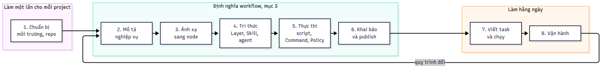
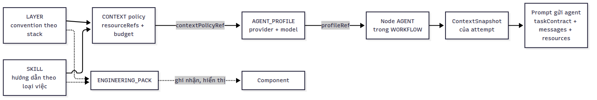
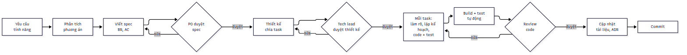
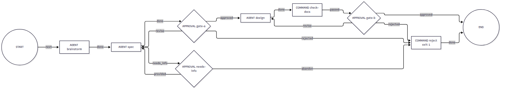
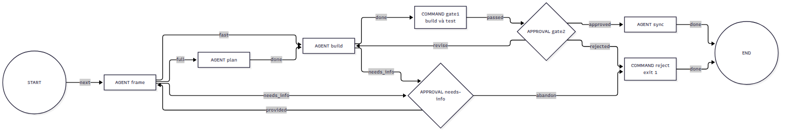
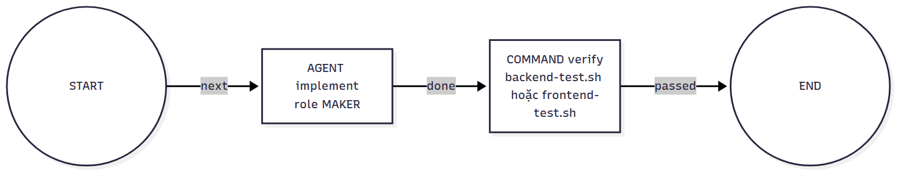
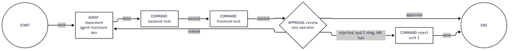
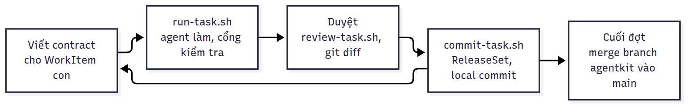

# Từ quy trình nghiệp vụ tới workflow trên Agent Kit (`aw`) — ví dụ Todolist (Spring Boot + SQLite + React)

Tài liệu này mô tả một quy trình tổng quát gồm 8 bước. Quy trình bắt đầu từ việc mô tả cách team đang làm việc, sau
đó biến cách làm đó thành workflow của `aw` để AI agent (Claude CLI) làm theo một cách có kiểm soát. Mỗi bước đều có
ví dụ chạy thật trên project **todolist** (backend Java Spring Boot + SQLite, frontend ReactJS).

- **Phần 1** là bức tranh tổng thể: 8 bước, các khái niệm của `aw`, và agent thực sự nhận được gì.
- **Phần 3, [Cách định nghĩa workflow cho project bất kỳ](#3-cách-định-nghĩa-workflow-cho-project-bất-kỳ)**, là phần
  dùng lại được cho project khác. Phần này đi từ bảng quy trình nghiệp vụ, qua ánh xạ sang node, tri thức của agent và
  script kiểm tra, tới bước publish bằng một file khai báo.
- **Phần 2, 4 và 5** là cài đặt, chạy task hằng ngày và vận hành.

Bộ công cụ trong thư mục này **không gắn với todolist**. Mọi thứ riêng của todolist nằm trong
[`aw-project.json`](aw-project.json) và các file mà nó trỏ tới. Các script trong `scripts/` đọc file khai báo đó. Với
project khác, bạn copy `scripts/` rồi viết `aw-project.json` của riêng mình (mục 3.5).

> **Phạm vi kiểm chứng.** Các lệnh, file JSON và script ở đây đã được chạy với binary `aw` build từ commit `7d0fb4c`
> (Alpha, Linux, Go 1.27), dùng Maven/Java 21 và Node 22 thật, trên các bản cài mới tinh. Phần đã chạy gồm:
> - tạo project, `aw-publish.py` publish toàn bộ definition (chạy lại không đổi gì thì trả đúng version cũ);
> - một project thứ hai với tiền tố khác trên cùng bản cài;
> - cả 5 workflow mẫu, gồm các nhánh `approved`, `rework`/`revise`, `rejected`, `needs_info`, lane `fast`/`full`,
>   và GATE 1 fail;
> - local commit;
> - các thử nghiệm riêng cho node `FORK`/`JOIN`, `WAIT`, `ROUTER`.
>
> **Phần chưa kiểm chứng:** agent dùng khi chạy thử là chương trình giả lập nói đúng giao thức stream-json của Claude
> CLI, không phải Claude CLI thật. Chính báo cáo Alpha cũng ghi "Live provider compatibility: UNVERIFIED"
> ([alpha-release-report](../../release/alpha-release-report.md)). Vì vậy phần cấu hình Claude CLI thật (wrapper,
> `.claude/settings.json`, Stop hook) là khuyến nghị, chưa có transcript chạy thật.

## Mục lục

- [1. Tổng quan](#1-tổng-quan)
- [2. Bước 1 — Chuẩn bị môi trường và repository](#2-bước-1--chuẩn-bị-môi-trường-và-repository)
- [3. Cách định nghĩa workflow cho project bất kỳ](#3-cách-định-nghĩa-workflow-cho-project-bất-kỳ)
  - [3.1 Bước 2 — Mô tả quy trình nghiệp vụ](#31-bước-2--mô-tả-quy-trình-nghiệp-vụ)
  - [3.2 Bước 3 — Ánh xạ sang node của aw](#32-bước-3--ánh-xạ-sang-node-của-aw)
  - [3.3 Bước 4 — Chuẩn bị tri thức cho agent](#33-bước-4--chuẩn-bị-tri-thức-cho-agent)
  - [3.4 Bước 5 — Chuẩn bị phần thực thi](#34-bước-5--chuẩn-bị-phần-thực-thi)
  - [3.5 Bước 6 — Khai báo và publish](#35-bước-6--khai-báo-và-publish)
  - [3.6 Tham chiếu các loại node](#36-tham-chiếu-các-loại-node)
  - [3.7 Checklist trước khi chạy task đầu tiên](#37-checklist-trước-khi-chạy-task-đầu-tiên)
- [4. Bước 7 — Viết task và chạy](#4-bước-7--viết-task-và-chạy)
- [5. Bước 8 — Vận hành và thay đổi](#5-bước-8--vận-hành-và-thay-đổi)
- [6. Giới hạn của Alpha cần biết](#6-giới-hạn-của-alpha-cần-biết)
- [Chạy thử quy trình hai tầng tính năng → task (tài liệu riêng)](feature-task-flow.md)
- [Phụ lục A: các file trong thư mục này](#phụ-lục-a-các-file-trong-thư-mục-này)
- [Phụ lục B: sửa và vẽ lại sơ đồ](#phụ-lục-b-sửa-và-vẽ-lại-sơ-đồ)

---

## 1. Tổng quan

### 1.1 Quy trình 8 bước



| Bước | Trả lời câu hỏi | Đầu ra | Trong ví dụ todolist |
|---|---|---|---|
| 1. Chuẩn bị | `aw` chạy ở đâu, làm việc trên repository nào? | `aw serve`/`aw worker`, project, repository `ACTIVE`, `aw-state.json` | [Phần 2](#2-bước-1--chuẩn-bị-môi-trường-và-repository), `init-project.sh` |
| 2. Mô tả nghiệp vụ | Việc đi qua những bước nào, ai làm, ai quyết định, thế nào là xong? | Bảng quy trình | [3.1](#31-bước-2--mô-tả-quy-trình-nghiệp-vụ) |
| 3. Ánh xạ sang node | Bước nào do agent, máy hay người làm? Lặp và dừng thế nào? | Sơ đồ node/edge, completion policy | [3.2](#32-bước-3--ánh-xạ-sang-node-của-aw), `definitions/workflows/` |
| 4. Tri thức | Ở mỗi bước, agent cần biết gì? | Layer, Skill, danh sách resource của từng agent | [3.3](#33-bước-4--chuẩn-bị-tri-thức-cho-agent), `definitions/layers/`, `definitions/skills/` |
| 5. Thực thi | Máy kiểm tra bằng lệnh gì? Agent được làm gì? | Script, Command, Policy, wrapper provider | [3.4](#34-bước-5--chuẩn-bị-phần-thực-thi), `commands/`, `definitions/policies/` |
| 6. Khai báo, publish | — | `aw-project.json`, các version đã publish | [3.5](#35-bước-6--khai-báo-và-publish), `aw-publish.py` |
| 7. Chạy task | — | WorkItem, run, evidence, local commit | [Phần 4](#4-bước-7--viết-task-và-chạy) |
| 8. Vận hành | Quy trình hay tri thức thay đổi thì làm gì? | Version mới, project mới | [Phần 5](#5-bước-8--vận-hành-và-thay-đổi) |

Bước 1 làm một lần cho mỗi máy và mỗi project. Bước 2–6 là phần **định nghĩa workflow**: làm một lần cho mỗi project
và làm lại mỗi khi quy trình thay đổi. Bước 7 lặp lại hằng ngày.

### 1.2 Khái niệm của `aw` dùng trong hướng dẫn

| Khái niệm | Ý nghĩa | Trong todolist |
|---|---|---|
| Project | Đơn vị quản lý cao nhất | `todolist` |
| Repository | Git repo cục bộ đã đăng ký (đường dẫn tuyệt đối) | `todolist`: một repo, hai thư mục `backend/`, `frontend/` |
| Component | Thư mục cấp 1 mà probe tự phát hiện | `backend`, `frontend` |
| **Layer** | Convention theo *stack công nghệ*; chỉ là văn bản, không thực thi | `layer-java-spring-boot`, `layer-sqlite`, `layer-react-vite` |
| **Skill** | Hướng dẫn theo *loại công việc*, hoặc script cho Command | `skill-todolist-dev`, `skill-feature-flow`, `scripts` |
| Engineering Pack | Gói pin một tập Layer/Skill cho một component (chỉ để ghi nhận) | `pack-backend`, `pack-frontend` |
| CONTEXT policy | Chọn chính xác resource nào của Layer/Skill đi vào prompt | `ctx-<agent>`, mỗi agent một policy |
| Agent profile | Provider, model và CONTEXT policy của một agent | 10 agent, ví dụ `agent-backend-dev`, `agent-flow-build` |
| Command | Script thực thi có version, pin theo content hash | `cmd-backend-test`, `cmd-gate1`, `cmd-reject`… |
| Policy | ATTEMPT / PERMISSION / COMPLETION / CONTEXT | retry và timeout, isolation, điều kiện "xong" |
| Workflow | Graph node và edge có version, scope project | `wf-backend-feature`, `wf-task-delivery`… |
| WorkItem gốc | Tạo TaskFamily, worktree và branch `agentkit/w-…` riêng | "Todolist MVP", "Tính năng: hạn chót cho todo" |
| WorkItem con | Một task có contract; một workflow chạy trên nó | BE-01, FE-01, F-00, T-01… |
| Evidence | Bằng chứng mỗi node đã chạy (verdict và artifact) | `COMMAND_EXECUTION` |
| ReleaseSet | Gom thay đổi của family thành local commit thật | Mỗi task một commit |

Mọi `definitionId` thật đều có tiền tố của project (`todo-`), ví dụ `todo-agent-backend-dev`. Lý do ở mục 3.5.

### 1.3 Agent thực sự nhận được gì

Mọi thiết kế ở Phần 3 đều xuất phát từ những gì một attempt AGENT nhận được. Các điểm dưới đây đã kiểm chứng bằng
cách cho agent giả lập ghi lại prompt.



1. **Prompt là một JSON gồm `taskContract`, `messages` và `resources`.**
   - `taskContract`: contract của WorkItem.
   - `messages`: mọi message đã append vào WorkItem, theo thứ tự thời gian, gồm phản hồi của người duyệt và câu trả
     lời cho câu hỏi.
   - `resources`: resource của Layer/Skill.

   Prompt **không** có danh sách outcome mà node cho phép, và không có đường dẫn tới repository chỉ đọc (READ).
2. **Agent chạy với thư mục làm việc là worktree của repository có quyền WRITE.** Nó đọc được mọi file trong worktree
   đó, nên tài liệu đặt trong repo (ví dụ `docs/`) là một kênh tri thức.
3. **Resource nào được nạp chỉ do `resourceRefs` của CONTEXT policy quyết định.** Agent profile trỏ tới CONTEXT
   policy đó. Engineering Pack và pack-assignment được lưu, version hóa và hiện trên UI (tab Components), nhưng runtime
   Alpha **không** đọc chúng để chọn resource.
4. **Selector của resource chỉ có hai chiều có hiệu lực lúc chạy:** `taskKinds` (`ROOT`/`CHILD`) và `riskClasses`
   (`LOW`/`MEDIUM`/`HIGH`, lấy từ `riskLevel` của contract). Ba chiều `componentTags`, `pathTags`, `blockKinds` hợp lệ
   khi publish nhưng runtime chưa điền ngữ cảnh cho chúng, nên **resource dùng ba chiều này luôn bị loại**.
5. **File đính kèm message được chuyển nguyên văn nếu là text.** PDF được chuyển dưới dạng byte thô, nên trên thực tế
   agent không đọc được nội dung PDF.

Hệ quả: những gì agent cần biết phải nằm ở một trong ba chỗ. Đó là resource của nó, contract hoặc message của
WorkItem, hoặc file trong repository WRITE.

---

## 2. Bước 1 — Chuẩn bị môi trường và repository

### 2.1 Công cụ cần có

| Công cụ | Dùng cho | Ghi chú |
|---|---|---|
| `aw` (build từ repo này) | control plane | Xem 2.2 để có UI |
| Git | repo và worktree | |
| `jq`, `python3`, `bash`, `sha256sum` | các script trong `scripts/` | |
| Claude CLI | agent thật | Gọi qua wrapper (2.4) |
| Toolchain của project | build/test | Todolist: Java 21 + Maven 3.9 (đã chạy với OpenJDK 21.0.11), Node 22 + npm (đã chạy với Node 22.22) |

### 2.2 Build `aw` kèm UI

Binary phát hành (`cmd/aw-release-build`) đã nhúng sẵn UI. Nếu tự build từ source, build UI riêng rồi truyền
`--ui-dist`:

```bash
cd /path/to/aw-tqunglnh
go build -o ~/bin/aw ./cmd/aw
(cd web && pnpm install --frozen-lockfile && pnpm build)      # tạo web/dist
```

### 2.3 Tạo repository todolist

Thư mục `repo-template/` chứa một khung đã kiểm chứng:

- backend Spring Boot 3.5 + SQLite + Flyway (`mvn test` pass);
- `gitignore`;
- `.claude/settings.json`: quyền cho Claude CLI (xem 2.4);
- `.claude/hooks/stop-gate.sh`: Stop hook chạy test trước khi agent được phép kết thúc (xem 3.4).

```bash
GUIDE=/path/to/aw-tqunglnh/docs/guides/todolist-spring-react
mkdir -p ~/work/todolist && cd ~/work/todolist
git init -b main
cp -R "$GUIDE/repo-template/." .
mv gitignore .gitignore
mkdir -p frontend docs && echo "# Frontend (React + Vite)" > frontend/README.md
echo "# Todolist" > README.md
(cd backend && mvn -B -q test)          # kiểm tra khung backend chạy được trên máy bạn
git add -A && git commit -m "Khung todolist: backend Spring Boot + SQLite, thư mục frontend"
```

Với một project bất kỳ, repository cần thỏa ba điều sau:

- **Thư mục cấp 1 là đơn vị scope.** Khi đăng ký repository, probe biến mỗi thư mục cấp 1 (không bắt đầu bằng dấu
  chấm) thành một Component. `pathScopes` của task cũng là tiền tố đường dẫn. Hãy chia repo sao cho mỗi task gói gọn
  trong một vài thư mục cấp 1.
- **`.gitignore` phải bỏ qua mọi output build** (todolist: `target/`, `node_modules/`, `dist/`, `data/`, `*.db`).
  `aw` dùng `git status` để biết agent hay command đã sửa gì. File build không bị ignore sẽ bị tính là thay đổi và có
  thể vi phạm scope.
- **Commit trước khi tạo WorkItem gốc.** Worktree của TaskFamily được tạo từ commit hiện tại của nhánh mặc định.

### 2.4 Wrapper cho Claude CLI (bắt buộc)

Trên Alpha, tiến trình agent được spawn với **environment rỗng**: không có `PATH`, không có `HOME`. Cờ
`aw worker --env-allowlist` không áp dụng cho agent. Claude CLI cần `HOME` để tìm thông tin đăng nhập (`~/.claude`),
và cần `PATH` để chạy `git`, `java`, `mvn`, `node`, `npm`. Ngoài ra `aw` gọi CLI theo dạng
`claude -p --input-format text --output-format stream-json --verbose --model <model>` và **không** truyền permission
mode. Ở chế độ `-p`, nếu không cấu hình thêm thì agent không được sửa file hay chạy lệnh.

Giải pháp là dùng [`scripts/claude-for-aw.sh`](scripts/claude-for-aw.sh) làm "executable" của provider:

```bash
mkdir -p ~/aw && cp "$GUIDE/scripts/claude-for-aw.sh" ~/aw/claude-for-aw.sh
# Sửa HOME, PATH, CLAUDE_BIN trong file cho đúng máy bạn, rồi:
~/aw/claude-for-aw.sh --version          # phải in ra phiên bản Claude CLI
```

Wrapper đặt `HOME`/`PATH`, giữ nguyên lời gọi `--version` (aw dùng nó để probe), và thêm
`--permission-mode acceptEdits`.

Quyền chạy lệnh Bash nằm trong `.claude/settings.json` của repository (đã có trong `repo-template/`):

- **cho phép** `./mvnw`, `mvn`, `npm`, `npx`, `node`…;
- **cấm** `git commit/push/checkout/reset`, `rm -rf` và đọc `.env`, vì commit là việc của `aw` sau khi người duyệt
  đồng ý.

> Alpha chỉ có isolation `OPERATOR_TRUSTED_LOCAL`: agent chạy dưới chính user của bạn, không có sandbox. Danh sách
> allow/deny ở trên là hàng rào chính, hãy giữ nó chặt.

### 2.5 Khởi động `aw serve` và `aw worker`

```bash
mkdir -p ~/aw/install/artifacts ~/aw/install/workspaces
export AW_DB=~/aw/install/aw.db AW_ARTIFACT_ROOT=~/aw/install/artifacts AW_WORKSPACE_ROOT=~/aw/install/workspaces
export CLAUDE_EXECUTABLE=$HOME/aw/claude-for-aw.sh

# Terminal 1
aw serve --db "$AW_DB" --artifact-root "$AW_ARTIFACT_ROOT" --workspace-root "$AW_WORKSPACE_ROOT" \
  --port 18080 --claude-executable "$CLAUDE_EXECUTABLE" --ui-dist /path/to/aw-tqunglnh/web/dist
# Terminal 2
aw worker --db "$AW_DB" --artifact-root "$AW_ARTIFACT_ROOT" --workspace-root "$AW_WORKSPACE_ROOT" \
  --claude-executable "$CLAUDE_EXECUTABLE"

aw doctor        # status: HEALTHY
```

`--claude-executable` phải giống nhau trên cả `serve` và `worker`, và phải là **đường dẫn tuyệt đối** của wrapper.
Mọi terminal dùng để chạy script ở các phần sau cần cùng các biến `AW_DB`, `AW_ARTIFACT_ROOT`, `AW_WORKSPACE_ROOT` và
`CLAUDE_EXECUTABLE`.

### 2.6 Tạo project và đăng ký repository

Các script lưu trạng thái (project id, version id, WorkItem gốc hiện tại) vào `aw-state.json` **ở thư mục hiện tại**.
Mỗi project nên có một thư mục vận hành riêng:

```bash
export PATH="$GUIDE/scripts:$PATH"
mkdir -p ~/aw/todolist && cd ~/aw/todolist
init-project.sh todolist todolist "$HOME/work/todolist"
# repository todolist: ACTIVE
#   component frontend (frontend)
#   component backend (backend)
# projectId=27cf7e5c-…  → ./aw-state.json
```

[`init-project.sh`](scripts/init-project.sh) `<tên project> <repositoryId> <đường dẫn tuyệt đối> [nhánh mặc định]`
làm ba việc: tạo project, đăng ký repository, rồi chờ probe xong. Script chạy lại an toàn. Nếu repository bị `BLOCKED`,
hãy kiểm tra đường dẫn và xem `aw worker` có đang chạy không.

Giờ **mở trình duyệt tại <http://127.0.0.1:18080/ui/projects>**. UI chỉ bind loopback, nên hãy mở trên chính máy chạy
`aw serve`.

| Màn hình | Đường dẫn | Nội dung |
|---|---|---|
| Projects | `/ui/projects` | Danh sách project, trạng thái `ACTIVE` |
| Overview | `/ui/projects/<id>` | Repository `todolist` ACTIVE, ref `main`, số component/blocker |
| Components | `/ui/projects/<id>/components` | `backend`, `frontend` (kind `DIRECTORY`), nút **Assign Pack** |
| Board | `/ui/projects/<id>/board` | Kanban BACKLOG / READY / ACTIVE / BLOCKED / DONE, nút New WorkItem |
| Definitions | `/ui/definitions`, `/ui/projects/<id>/definitions` | Lọc theo 9 loại definition, xem version |
| Doctor | `/ui/doctor` | Các check liveness/readiness/capability |
| Adapter Builds | `/ui/system/adapters` | Adapter build đã đăng ký cho Claude |


---

## 3. Cách định nghĩa workflow cho project bất kỳ

Phần này gồm năm bước (Bước 2–6 của quy trình). Mỗi bước có ba phần: việc cần làm cho một project bất kỳ, mẫu đầu ra,
và ví dụ todolist. Đầu ra cuối cùng là một thư mục khai báo:

```text
<thư mục khai báo của project>/
├── aw-project.json              # Bước 6: khai báo mọi thứ bên dưới, có tiền tố riêng
├── definitions/
│   ├── workflows/*.json         # Bước 3: graph node/edge, tham chiếu bằng {"$ref": ...}
│   ├── layers/*.json            # Bước 4: convention theo stack
│   ├── skills/*.json            # Bước 4: hướng dẫn theo loại việc / theo bước
│   └── policies/*.json          # Bước 5: attempt, permission, completion
├── commands/*.sh                # Bước 5: script cho node COMMAND
└── scripts/                     # copy nguyên từ thư mục này: aw-publish.py, run-task.sh…
```

### 3.1 Bước 2 — Mô tả quy trình nghiệp vụ

Viết quy trình ra bảng **trước khi** đụng tới `aw`, bằng ngôn ngữ nghiệp vụ, không nhắc tới node. Bảng phải trả lời
được các câu hỏi sau:

1. **Một lần chạy xử lý đơn vị việc nào?** Ví dụ: một tính năng, một task, một bug. Trong `aw`, một WorkItem có đúng
   một contract, một scope và một workflow version. Có hai trường hợp phải tách quy trình thành nhiều tầng, mỗi tầng
   một workflow:
   - số việc con chỉ biết được giữa chừng (ví dụ sau bước thiết kế mới biết có mấy task);
   - các việc con cần scope khác nhau.
2. **Mỗi bước do ai làm: AI, máy hay người?** "Máy" là lệnh chạy được và trả mã thoát, ví dụ build, test, lint, kiểm
   tra schema.
3. **Đầu ra của bước là gì và nằm ở đâu?** Nên là file cụ thể trong repo, để bước sau và người duyệt đọc được.
4. **Khi nào bước được coi là xong?** Cần một điều kiện kiểm chứng được.
5. **Không đạt thì sao?** Quay lại bước nào, tối đa mấy lần, hay dừng hẳn. Thiếu thông tin thì hỏi ai.
6. **Bước cần tri thức gì?** Ví dụ convention, quy tắc nghiệp vụ, tài liệu hệ thống. Phần này là đầu vào cho Bước 4.
7. **Cả quy trình "xong" khi có bằng chứng gì, ai xác nhận?** Phần này là đầu vào cho completion policy.

Mẫu bảng:

| # | Bước | Ai làm | Đầu vào | Đầu ra (file, nơi lưu) | Xong khi | Không đạt / thiếu thông tin | Tri thức cần |
|---|---|---|---|---|---|---|---|
| 1 | | AI / máy / người | | | | quay lại #…, tối đa … lần / dừng / hỏi … | |

**Ví dụ todolist.** Quy trình của team cho một tính năng:



| # | Bước | Ai làm | Đầu ra | Xong khi | Không đạt / thiếu thông tin | Tri thức cần |
|---|---|---|---|---|---|---|
| 1 | Tiếp nhận yêu cầu | PO | Mô tả ý tưởng, thư mục `docs/features/<slug>` | — | — | — |
| 2 | Phân tích phương án | AI | `01-brainstorm.md` | Có 2–4 phương án và một đề xuất | — | Cách viết phân tích |
| 3 | Viết spec | AI | `02-spec.md` (BR, AC Given/When/Then) | Mỗi AC kiểm chứng được bằng test | Thiếu thông tin → hỏi PO, chờ trả lời | Cách viết spec, cách hỏi |
| 4 | Duyệt spec | PO | Quyết định | Duyệt | Sửa → #3, tối đa 3 lần; từ chối → dừng | — |
| 5 | Thiết kế, chia task | AI | `03-design.md`, `tasks.json` | Đủ file, `tasks.json` đúng schema | — | Convention Spring/SQLite/React |
| 6 | Duyệt thiết kế | Tech lead | Quyết định | Duyệt | Sửa → #5, tối đa 3 lần; từ chối → dừng | — |
| 7 | Làm rõ task, phân loại nhỏ/lớn | AI | `tasks/<id>/frame.md` | AC riêng của task rõ ràng | Thiếu thông tin → hỏi | Tiêu chí task nhỏ |
| 8 | Lập kế hoạch (chỉ task lớn) | AI | `tasks/<id>/plan.md` | — | — | Bảng "khu vực → cần đọc gì" |
| 9 | Code và test | AI | Code, test | Test xanh trên máy | Thiếu thông tin → hỏi | Convention, Definition of Done |
| 10 | Build và test tự động | Máy | Kết quả test | Mã thoát 0 | Đỏ → #9 | — |
| 11 | Review code | Reviewer | Quyết định | Duyệt | Sửa → #9, tối đa 3 lần; từ chối → dừng | — |
| 12 | Cập nhật tài liệu, ADR | AI | `docs/`, `docs/adr/` | — | — | Cách viết ADR |
| 13 | Commit, merge | Người | Commit, merge vào `main` | — | — | — |

Từ câu hỏi 1: số task chỉ biết sau #5, và mỗi task có scope riêng (`backend`, `frontend`). Vì vậy quy trình có **hai
tầng**:

- **tầng tính năng** (#1–6): một WorkItem cho mỗi tính năng;
- **tầng task** (#7–12): một WorkItem cho mỗi task.

Với việc nhỏ đã rõ yêu cầu, team dùng một quy trình rút gọn: code và test, máy kiểm tra, có thể thêm người review.

### 3.2 Bước 3 — Ánh xạ sang node của aw

#### Bảng quyết định

| Bước nghiệp vụ có tính chất | Dùng | Lưu ý (Alpha) |
|---|---|---|
| AI tạo hoặc sửa file (code, tài liệu) | `AGENT`, role `MAKER` | Mỗi bước nên có agent profile riêng (3.3) |
| AI tự chọn nhánh (phân loại, "thiếu thông tin") | `AGENT` có nhiều outcome | Agent phải in marker outcome; Skill phải liệt kê outcome hợp lệ (3.3) |
| Máy kiểm tra **sau** khi AI sửa (build, test, lint, schema) | `COMMAND` | Chỉ một outcome. Mã thoát khác 0 thì **cả run FAILED**, không có cạnh "fail", và output không được lưu |
| Máy kiểm tra trên trạng thái **chưa** bị sửa | `MACHINE_GATE` | Read-only nghiêm ngặt: diff của scope phải rỗng. Chạy trong thư mục scratch, stdout là JSON verdict |
| AI review độc lập | `AGENT`, role `CHECKER` | Read-only nghiêm ngặt như trên, nên không đặt sau MAKER trong cùng run |
| Người duyệt, quyết định, trả lời câu hỏi | `APPROVAL` | Outcome tùy ý, `authorizedRoles`, hạn chót kèm `escalationOutcome`, `cyclePolicy` cho vòng lặp |
| Chờ sự kiện bên ngoài | `WAIT` mode `SIGNAL` | Gửi tín hiệu bằng `aw wait signal` |
| Rẽ nhánh theo điều kiện | `APPROVAL` (người chọn) hoặc `AGENT` nhiều outcome | `ROUTER` chỉ được một outcome |
| Chạy song song | `FORK` / `JOIN` | Các nhánh không được cùng ghi một repository (`CONFLICT`) |
| Dừng vì bị từ chối | `COMMAND` chạy script thoát mã 1 | Không nối `rejected` thẳng tới END, vì END được tính là hoàn thành |
| Sinh nhiều việc con | Ngoài engine: script đọc file kết quả rồi tạo WorkItem | Alpha không có node sinh WorkItem |
| Commit, merge | Ngoài workflow: ReleaseSet → local commit, merge bằng git | `aw` không push hay merge |
| Đầu vào của quy trình (ý tưởng, ticket) | `contract.behavior` và message của WorkItem | Không cần node |

#### Quy tắc của graph

- Workflow gồm `nodes`, `edges` và `completionPolicyRef`. Node `START` có outcome `next`; node `END` không có outcome.
- **Mọi outcome của một node phải có đúng một edge đi ra.** Thiếu edge là lỗi khi validate hoặc publish.
- Node `AGENT`, `COMMAND`, `MACHINE_GATE` phải pin **đúng một** policy ATTEMPT và **đúng một** policy PERMISSION.
  Thiếu thì node không bao giờ được lên lịch.
- **AGENT có hơn một outcome** phải kết thúc bằng đúng một dòng
  `<agentkit-outcome>{"schemaVersion":1,"outcome":"..."}</agentkit-outcome>`. Các trường hợp sau đều làm attempt
  **FAILED**: thiếu marker, marker sai định dạng, in hai lần, hoặc giá trị ngoài danh sách. AGENT chỉ có một outcome
  thì không cần marker.
- **Vòng lặp phải có giới hạn.** Một node trong vòng khai `cyclePolicy: {maxIterations, escalationOutcome}`, trong
  đó `escalationOutcome` là outcome có edge đi **ra khỏi** vòng. Không có `cyclePolicy` thì không publish được.
- **Không có cạnh "fail" cho COMMAND.** Vòng "đỏ → sửa" phải nằm trong phiên agent, ví dụ bằng Stop hook (3.4).
  COMMAND là cổng chính thức đứng sau.
- **MACHINE_GATE và CHECKER không đặt sau MAKER trong cùng run**, vì chúng đòi diff so với base revision của run phải
  rỗng. Kiểm tra bằng người thì dùng APPROVAL. Kiểm tra bằng AI độc lập thì làm ở một WorkItem riêng, sau khi đã
  commit.
- **Completion policy được xét khi run tới END.** Nhánh `REWORK` của completion (edge `COMPLETION_REWORK`) chỉ xảy ra
  khi đã tới END. Run bị FAILED giữa chừng thì không tới END. Edge `COMPLETION_REWORK` hợp lệ theo schema nhưng chưa
  được kiểm chứng trong hướng dẫn này.
- **Workflow có scope project.** Dùng workflow của project A cho WorkItem của project B sẽ bị từ chối lúc `run start`.

#### Chọn completion policy

| Muốn "xong" nghĩa là | Policy | Ví dụ todolist |
|---|---|---|
| Có evidence của các node COMMAND | V1: `{"requiredEvidenceKinds": ["COMMAND_EXECUTION"]}` | [`policy-completion`](definitions/policies/policy-completion.json) |
| Có test **và** người đã quyết định | V2: `requiredAssurance` gồm `UNIT` (hoặc `STATIC`) và `HUMAN` với `requiredApprovals` | [`policy-completion-reviewed`](definitions/policies/policy-completion-reviewed.json), [`policy-completion-feature`](definitions/policies/policy-completion-feature.json) |

Các mức của V2 là `STATIC`, `LINT`, `UNIT`, `INTEGRATION`, `E2E`, `HUMAN`. Mức `HUMAN` chỉ kiểm tra **đã có người đủ
quyền quyết định**, không xét quyết định là gì. Vì vậy ý nghĩa "từ chối" phải nằm ở graph (nhánh `reject`), không nằm
ở completion policy.

#### Ví dụ todolist: ánh xạ bảng nghiệp vụ ở 3.1

| # | Bước nghiệp vụ | Trong `aw` | Vì sao |
|---|---|---|---|
| 1 | Tiếp nhận | `contract.behavior` của WorkItem `F-00` (mẫu [`feature-due-date.json`](work-items/feature-due-date.json)) | Đầu vào của run |
| 2 | Phân tích | `AGENT brainstorm` (outcome `done`) | AI tạo file |
| 3 | Spec | `AGENT spec` (outcome `done`, `needs_info`) | AI tự quyết "thiếu thông tin" nên cần hai outcome |
| 3' | Hỏi PO | `APPROVAL needs-info` (`provided`, `abandon`); câu trả lời thành message | Người trả lời, có hạn chót, có lối thoát |
| 4 | Duyệt spec | `APPROVAL gate-a` (`approved`, `revise`, `rejected`), `cyclePolicy` tối đa 3 | Người quyết định, vòng sửa có giới hạn |
| 5 | Thiết kế | `AGENT design`, rồi `COMMAND check-docs` | Thêm một bước máy kiểm tra trước khi người duyệt |
| 6 | Duyệt thiết kế | `APPROVAL gate-b` | |
| — | Từ chối, bỏ dở | `COMMAND reject` (thoát mã 1) | Để run kết thúc FAILED |
| — | Chia task | `split-tasks.sh` đọc `tasks.json`, sinh một file WorkItem cho mỗi task | Không có node sinh WorkItem |
| 7 | Làm rõ, phân loại | `AGENT frame` (`fast`, `full`, `needs_info`) | `ROUTER` không rẽ nhánh được, nên agent chọn |
| 8 | Kế hoạch | `AGENT plan`, chỉ trên nhánh `full` | |
| 9 | Code và test | `AGENT build` (`done`, `needs_info`) và Stop hook | Stop hook tạo vòng "đỏ → sửa" trong phiên agent |
| 10 | Build và test | `COMMAND gate1` | Cổng chính thức, sinh evidence |
| 11 | Review code | `APPROVAL gate2` | CHECKER không đặt sau MAKER được |
| 12 | Tài liệu | `AGENT sync`, chỉ sửa `docs/` | |
| 13 | Commit, merge | `commit-task.sh` sau mỗi WorkItem; merge bằng git | Nằm ngoài workflow |

Kết quả là hai workflow, mỗi tầng một workflow.

Tầng tính năng: [`wf-feature-definition.json`](definitions/workflows/wf-feature-definition.json). Completion:
`STATIC` (evidence của `check-docs`) cộng `HUMAN`.



Tầng task: [`wf-task-delivery.json`](definitions/workflows/wf-task-delivery.json). Completion: `UNIT` (evidence của
`gate1`) cộng `HUMAN`.



Quy trình rút gọn cho việc nhỏ có ba workflow:

- [`wf-backend-feature`](definitions/workflows/wf-backend-feature.json) và
  [`wf-frontend-feature`](definitions/workflows/wf-frontend-feature.json): một agent làm, một COMMAND test.
- [`wf-fullstack-review`](definitions/workflows/wf-fullstack-review.json): thêm cổng duyệt, có vòng `rework`
  tối đa 2 lần.





Giải thích chi tiết những chỗ phải thiết kế khác sơ đồ nghiệp vụ nằm trong [feature-task-flow.md](feature-task-flow.md),
mục 2. Các chỗ đó là: lane fast/full do agent chọn, GATE 1 hai lớp, NEEDS_INFO, và chia task.

### 3.3 Bước 4 — Chuẩn bị tri thức cho agent

#### Layer, Skill, Pack, CONTEXT policy

| | Layer | Skill | Engineering Pack | CONTEXT policy |
|---|---|---|---|---|
| Trả lời câu hỏi | "Stack này viết thế nào?" | "Loại việc hay bước này làm thế nào?" | "Component này dùng bộ convention nào?" | "Attempt này nạp chính xác resource nào?" |
| Trường nội dung | `convention` | `instruction` | `dependencies` (pin Layer/Skill/Pack) | `resourceRefs`, `budget`, `selector` |
| Có thực thi không | Không | Không; script trong Skill chỉ chạy khi một Command pin nó | Không | Không |
| Ảnh hưởng prompt | Qua CONTEXT policy | Qua CONTEXT policy | Không (Alpha) | **Có** |

#### Quy tắc viết một resource

```json
{"key": "spring.rest-api", "priority": "HARD_CONSTRAINT", "global": true, "selector": {},
 "convention": "REST API của Todo nằm dưới /api/todos ...",
 "provenance": {"owner": "team-backend", "source": "docs/guides/todolist-spring-react", "revision": "v1"}}
```

- **`key` phải duy nhất trong tập resource mà một agent nhận.** Hai resource cùng key, khác nội dung, có một cái là
  `HARD_CONSTRAINT` thì resolver báo conflict và attempt không được lên lịch. Đặt tiền tố theo nguồn, ví dụ `spring.`,
  `sqlite.`, `react.`, `dev.`, `flow.`.
- **`priority`** quyết định thứ tự nạp và khả năng bị cắt:
  - `HARD_CONSTRAINT` luôn được nạp; vượt budget thì attempt fail chứ không cắt.
  - `REQUIRED_PROCEDURE` → `GUIDANCE` → `REFERENCE` được nạp theo thứ tự này cho tới khi hết budget.
- **Phải có `global: true` hoặc `selector` không rỗng.** Chỉ `taskKinds` và `riskClasses` có hiệu lực lúc chạy
  (1.3).
- **`provenance`** bắt buộc có `owner`, `source`, và một trong `lastVerified`/`revision`. Thiếu là lỗi publish.
- **`budget.maxTokens` của CONTEXT policy hiện được hiểu là số byte.** Tiếng Việt UTF-8 tốn 2–3 byte cho mỗi ký tự có
  dấu, nên hãy để budget rộng. Mặc định của `aw-publish.py` là 65536.

#### Mỗi bước một agent, mỗi agent một danh sách resource

Vì selector không phân biệt được bước, cách duy nhất để mỗi bước đọc một bộ hướng dẫn khác nhau là: **mỗi bước có
một agent profile riêng, trỏ tới một CONTEXT policy riêng**. Trong `aw-project.json`, bạn chỉ cần khai báo danh sách
resource của từng agent. `aw-publish.py` tự tính content hash và dựng CONTEXT policy `ctx-<agent>`.

```json
{"id": "agent-flow-plan", "name": "Agent: PLAN",
 "resources": ["skill-feature-flow#flow.outcome-protocol", "skill-feature-flow#flow.routing-table",
               "skill-feature-flow#flow.plan", "layer-java-spring-boot", "layer-sqlite", "layer-react-vite"]}
```

`"layer-sqlite"` lấy mọi resource của Layer đó. `"skill-feature-flow#flow.plan"` chỉ lấy một resource.

Với **AGENT có nhiều outcome**, Skill phải làm hai việc:

- Có một resource `HARD_CONSTRAINT` mô tả cú pháp marker. Todolist dùng `flow.outcome-protocol`.
- Resource của từng bước ghi rõ outcome được phép, ví dụ "Giai đoạn FRAME (outcome cho phép: fast, full,
  needs_info)".

#### Tài liệu có sẵn (Confluence, PDF, Word…)

Agent không đọc được PDF đính kèm, và không biết đường dẫn của repository READ (1.3). Vì vậy hãy chuyển tài liệu sang
văn bản thuần (Markdown), rồi đặt theo độ ổn định và độ dài:

| Loại tri thức | Đặt ở đâu | Cách agent nhận |
|---|---|---|
| Quy tắc ngắn, ổn định, áp dụng mọi lúc (convention, Definition of Done, ràng buộc bảo mật) | Resource của Layer/Skill | Luôn có trong prompt |
| Tài liệu dài (đặc tả hệ thống, API, mô hình dữ liệu, ADR) | File trong `docs/` của repository WRITE | Agent tự đọc file; một resource kiểu "bảng định tuyến" chỉ cho agent khu vực nào thì đọc file nào |
| Yêu cầu và quyết định riêng của một task | `contract` hoặc message của WorkItem | Có trong `taskContract` và `messages` |

Mỗi resource giữ `provenance.source` trỏ về tài liệu gốc (trang Confluence, file Word) và `revision`, để biết khi nào
cần cập nhật.

#### Ví dụ todolist

Layer ([`definitions/layers/`](definitions/layers/)):

| Layer | Resource | Priority | Nội dung chính |
|---|---|---|---|
| `layer-java-spring-boot` | `spring.project-structure` | REQUIRED_PROCEDURE | Java 21, Spring Boot 3.5, Maven, package `com.example.todo`, các tầng controller/service/repository/domain/dto |
| | `spring.rest-api` | HARD_CONSTRAINT | Hợp đồng `/api/todos` (GET/POST/PUT/PATCH toggle/DELETE), validate, ProblemDetail, cổng 8080 |
| | `spring.testing` | GUIDANCE | JUnit 5, MockMvc, SQLite file tạm, `./mvnw -B test` |
| `layer-sqlite` | `sqlite.datasource` | HARD_CONSTRAINT | `sqlite-jdbc`, `SQLiteDialect`, `jdbc:sqlite:./data/todolist.db`, `ddl-auto=validate` |
| | `sqlite.migrations` | REQUIRED_PROCEDURE | Flyway `V<n>__*.sql`, bảng `todos`, không sửa migration cũ |
| `layer-react-vite` | `react.project-structure` | REQUIRED_PROCEDURE | React + TS + Vite trong `frontend/`, `src/api`, `src/components`, `src/hooks` |
| | `react.api-client` | HARD_CONSTRAINT | Một module `src/api/todos.ts`, đường dẫn tương đối `/api/todos`, proxy Vite tới 8080 |
| | `react.testing` | GUIDANCE | Vitest + Testing Library + jsdom; `npm test` = `vitest run`; `npm run build` phải pass |

Skill ([`definitions/skills/`](definitions/skills/)):

| Skill | Resource | Ghi chú |
|---|---|---|
| `skill-todolist-dev` | `dev.implement-feature` (REQUIRED_PROCEDURE) | Quy trình MAKER: đọc contract và messages, sửa tối thiểu, viết test, tự chạy test, không git commit, chỉ sửa trong scope |
| | `dev.definition-of-done` (HARD_CONSTRAINT) | Không stub, không tắt test, không commit secret, `*.db` hay thư mục build |
| | `dev.high-risk-extra` (GUIDANCE, `riskClasses: ["HIGH"]`) | Chỉ nạp khi contract có `riskLevel: HIGH` |
| `skill-feature-flow` | `flow.outcome-protocol` (HARD_CONSTRAINT) | Cú pháp marker outcome, không commit |
| | `flow.needs-info` | Cách dừng để hỏi: ghi `needs-info.md`, outcome `needs_info` |
| | `flow.brainstorm`, `flow.spec`, `flow.design`, `flow.frame`, `flow.plan`, `flow.build`, `flow.sync` | Hướng dẫn và outcome hợp lệ của từng giai đoạn |
| | `flow.routing-table` | Bảng "khu vực thay đổi → thư mục/tài liệu cần đọc trước" |

Agent và resource (khai báo trong `agents` của [`aw-project.json`](aw-project.json)):

| Agent | Dùng ở node | Resource |
|---|---|---|
| `agent-backend-dev` | `implement` của `wf-backend-feature` | Layer Spring, SQLite; `skill-todolist-dev` |
| `agent-frontend-dev` | `implement` của `wf-frontend-feature` | Layer React; `skill-todolist-dev` |
| `agent-fullstack-dev` | `implement` của `wf-fullstack-review` | Ba Layer; `skill-todolist-dev` |
| `agent-flow-brainstorm` | `brainstorm` | `flow.outcome-protocol`, `flow.brainstorm` |
| `agent-flow-spec` | `spec` | `flow.outcome-protocol`, `flow.needs-info`, `flow.spec` |
| `agent-flow-design` | `design` | `flow.outcome-protocol`, `flow.design`, ba Layer |
| `agent-flow-frame` | `frame` | `flow.outcome-protocol`, `flow.needs-info`, `flow.frame` |
| `agent-flow-plan` | `plan` | `flow.outcome-protocol`, `flow.routing-table`, `flow.plan`, ba Layer |
| `agent-flow-build` | `build` | `flow.outcome-protocol`, `flow.needs-info`, `flow.build`, ba Layer, `dev.definition-of-done`, `dev.high-risk-extra` |
| `agent-flow-sync` | `sync` | `flow.outcome-protocol`, `flow.sync` |

Sau khi chạy một task, kiểm tra agent thực sự nhận resource nào trong ContextSnapshot của attempt:

```bash
snap=$(aw run timeline <runId> | jq -r '.entries[] | select(.kind=="EXECUTION_ATTEMPT" and .nodeKey=="implement") | .contextSnapshotId')
aw context-snapshot show --project-id "$(jq -r .projectId aw-state.json)" <workItemId> "$snap" | jq -c '[.resourceRefs[].resourceKey]'
# ["dev.definition-of-done","spring.rest-api","sqlite.datasource","dev.implement-feature",
#  "spring.project-structure","sqlite.migrations","spring.testing"]
```

Đây là kết quả thật của task BE-01 (`riskLevel: MEDIUM`). Thứ tự theo priority. `dev.high-risk-extra` bị loại vì task
không phải `HIGH`.

### 3.4 Bước 5 — Chuẩn bị phần thực thi

#### Script cho node COMMAND

Đặt script trong `commands/` và khai báo trong `scriptSkills` của `aw-project.json`. `aw-publish.py` biến mỗi file
thành một resource của một Skill (key là tên file), rồi tạo Command pin đúng `version + key + content hash` của file
đó. Hợp đồng của một script:

| Điều kiện | Chi tiết |
|---|---|
| Thư mục làm việc | Gốc worktree của repository `cwdRepositoryTarget` (mặc định là `repository` của manifest). Script tự `cd` vào thư mục con |
| Tham số | `$1` luôn là `run`, vì `argv` không được rỗng. Script bỏ qua tham số này |
| Kết quả | Mã thoát 0 là pass. Khác 0 thì attempt FAILED → thử lại theo ATTEMPT policy → node FAILED → run FAILED. Alpha không lưu output khi fail |
| Output | Vượt `maxOutputBytes` (mặc định 4 MiB) bị coi là fail. Dùng chế độ im lặng (`-q`) |
| Biến môi trường | Chỉ các biến trong `envAllowlist` của Command được truyền. Mặc định: `PATH`, `HOME`, `JAVA_HOME`, `MAVEN_OPTS`, `JAVA_TOOL_OPTIONS`, `HTTP_PROXY`, `HTTPS_PROXY`, `NO_PROXY` |
| Mạng | `network: "ALLOWED"` (ví dụ tải dependency) **bắt buộc** Command pin một PERMISSION policy cấp `NETWORK_ACCESS`. Thiếu thì node fail ngay với `VALIDATION_FAILED`. `aw-publish.py --check` bắt lỗi này |
| Phạm vi sửa | File script tạo ra cũng bị kiểm tra theo scope của WorkItem. Output build phải nằm trong `.gitignore` |

#### Policy

| File | Category | Nội dung | Dùng ở |
|---|---|---|---|
| [`policy-attempt.json`](definitions/policies/policy-attempt.json) | ATTEMPT | 2 lần, backoff 10 giây, timeout 30 phút | Mọi node AGENT/COMMAND (bắt buộc) |
| [`policy-permission.json`](definitions/policies/policy-permission.json) | PERMISSION | `OPERATOR_TRUSTED_LOCAL` | Mọi node AGENT/COMMAND (bắt buộc) |
| [`policy-permission-network.json`](definitions/policies/policy-permission-network.json) | PERMISSION | Thêm `grantedCapabilities: ["NETWORK_ACCESS"]` | Pin trong **Command** cần mạng |
| [`policy-completion*.json`](definitions/policies/) | COMPLETION | Xem 3.2 | `completionPolicyRef` của workflow |

#### Provider và adapter build

Workflow pin một adapter build, tức danh tính của bộ provider, executable, protocol và capability. Mỗi lần admit một
node AGENT, worker đo lại các trường dưới đây và so sánh. Lệch thì sinh blocker `ADAPTER_BUILD_DRIFT`.

| Trường | Giá trị đúng (`aw-publish.py` tự điền) |
|---|---|
| Executable path | Đường dẫn tuyệt đối của wrapper, giống `--claude-executable` (biến `CLAUDE_EXECUTABLE`) |
| Nội dung executable | SHA-256 của **file wrapper** |
| Protocol | `claude-stream-json/v1` |
| Capability | start/resume/cancel và 9 canonical event kinds |
| OS | `os` trong `aw version --json` |
| Toolchain | **`goVersion` trong `aw version --json`** (phiên bản Go build ra `aw`, không phải phiên bản Claude CLI) |

Sửa wrapper hoặc đổi đường dẫn thì phải chạy lại `aw-publish.py`. Script sẽ đăng ký adapter build mới và publish
workflow mới trỏ tới nó. `aw` chỉ băm file wrapper, nên nâng cấp Claude CLI phía sau wrapper **không** bị coi là
drift.

#### Vòng lặp trong phiên agent: Stop hook

COMMAND fail làm cả run FAILED (3.2). Vì vậy vòng "test đỏ → sửa tiếp" nên chạy **bên trong** phiên agent.
[`repo-template/.claude/hooks/stop-gate.sh`](repo-template/.claude/hooks/stop-gate.sh) được đăng ký làm Stop hook
trong `.claude/settings.json`. Mỗi khi agent định kết thúc, hook làm như sau:

1. Nếu `backend/` hoặc `frontend/` có thay đổi, chạy test của phần đó.
2. Nếu `tasks.json` có thay đổi, kiểm tra schema.
3. Nếu fail, trả mã 2. Claude Code khi đó đưa log lỗi lại cho agent sửa tiếp.

Hook chặn tối đa 3 lần. Logic của script đã được thử bằng tay. Việc Claude CLI thật gọi hook **chưa kiểm chứng**.

#### Ví dụ todolist

| Command | Script | Mạng | Dùng ở |
|---|---|---|---|
| `cmd-backend-test` | [`commands/backend-test.sh`](commands/backend-test.sh): `cd backend && ./mvnw -B -q test` | ALLOWED | `wf-backend-feature`, `wf-fullstack-review` |
| `cmd-frontend-test` | [`commands/frontend-test.sh`](commands/frontend-test.sh): `npm ci && npm test && npm run build` | ALLOWED | `wf-frontend-feature`, `wf-fullstack-review` |
| `cmd-gate1` | [`commands/gate1.sh`](commands/gate1.sh): test phần code đã đổi, hoặc tất cả nếu không đổi code | ALLOWED | `wf-task-delivery` |
| `cmd-check-feature-docs` | [`commands/check-feature-docs.sh`](commands/check-feature-docs.sh): đủ tài liệu, `tasks.json` đúng schema | NONE | `wf-feature-definition` |
| `cmd-reject` | [`commands/reject.sh`](commands/reject.sh): `exit 1` | NONE | Mọi nhánh từ chối |

### 3.5 Bước 6 — Khai báo và publish

#### `aw-project.json`

Một file khai báo mọi thứ của project. Ví dụ đầy đủ: [`aw-project.json`](aw-project.json) của todolist.

| Khóa | Nội dung | Mặc định |
|---|---|---|
| `prefix` | Tiền tố ghép vào **mọi** `definitionId` | `""` |
| `repository` | `repositoryId` dùng cho `cwdRepositoryTarget` của Command và khi gán Pack | bắt buộc |
| `provider` | `{key, model, configIdentity}` của mọi agent | `claude`, `sonnet`, `<prefix>claude` |
| `contextBudgetBytes` | Budget của CONTEXT policy mỗi agent | `65536` |
| `layers[]`, `skills[]` | `{id, name, file}`; file có mảng `resources` | |
| `scriptSkills[]` | `{id, name, owner, files[]}`; mỗi file là một resource, key là tên file | |
| `packs[]` | `{id, name, include[], assignTo[]}`; `assignTo` là tên component | |
| `policies[]` | `{id, name, file}` | |
| `agents[]` | `{id, name, resources[]}`, có thể thêm `model`, `toolRefs`, `contextBudgetBytes`, `maxTokens` | |
| `commands[]` | `{id, name, script: "<scriptSkill>#<file>", network, policies[]}`, có thể thêm `repository`, `envAllowlist`, `timeoutSeconds`, `maxOutputBytes` | `network: "NONE"` |
| `workflows[]` | `{id, name, template}` | |

#### Template workflow

Template là document WORKFLOW bình thường. Chỗ nào cần pin một definition khác thì ghi `{"$ref": "<loại>:<id>"}`,
với id **không có tiền tố**:

```json
{"key": "implement", "type": "AGENT", "outcomes": ["done"],
 "agent": {"profileRef": {"$ref": "agent:agent-backend-dev"},
           "policyRefs": [{"$ref": "policy:policy-attempt"}, {"$ref": "policy:policy-permission"}],
           "adapterBuildId": {"$ref": "adapter"}, "role": "MAKER"}}
```

| `$ref` | Thay bằng |
|---|---|
| `agent:<id>`, `command:<id>`, `policy:<id>`, `workflow:<id>`, `layer:<id>`, `skill:<id>`, `pack:<id>` | `{"kind": …, "definitionId": "<prefix><id>", "versionId": "<version vừa publish>"}` |
| `adapter` | Id của adapter build khớp với `CLAUDE_EXECUTABLE` |

#### Vì sao cần `prefix`

`definitionId` là **duy nhất trên toàn bản cài**, kể cả WORKFLOW (dù WORKFLOW có scope project). Tạo trùng thì Alpha
báo lỗi chung `sqlite: unexpected error`, không báo `CONFLICT`. Mỗi project dùng một tiền tố riêng (todolist dùng
`todo-`) thì hai project có thể cùng đặt tên `agent-backend-dev` trong file khai báo mà không đụng nhau. Điều này đã
kiểm chứng bằng project thứ hai, tiền tố `shop-`, trên cùng bản cài.

#### Kiểm tra rồi publish

```bash
cd ~/aw/todolist                                   # thư mục có aw-state.json (2.6)
aw-publish.py "$GUIDE/aw-project.json" --check     # chỉ kiểm tra file khai báo, không gọi aw
aw-publish.py "$GUIDE/aw-project.json"             # cần CLAUDE_EXECUTABLE và các biến AW_* như 2.5
```

`--check` bắt các lỗi hay gặp trước khi gọi `aw`:

- file không tồn tại, id trùng;
- tham chiếu `$ref` hoặc resource không có thật, resource key trùng trong một agent;
- Command cần mạng mà thiếu policy;
- outcome không có edge, node thiếu policy, COMMAND hoặc ROUTER có nhiều outcome.

Ví dụ:

```text
Khai báo chưa hợp lệ:
  - agents/agent-flow-plan: skill-feature-flow không có resource 'flow.planning'
  - commands/cmd-gate1: network ALLOWED cần một PERMISSION policy cấp NETWORK_ACCESS trong 'policies'
  - workflows/wf-task-delivery: node 'gate2' có outcome 'revise' nhưng không có edge
```

Khi publish, script làm theo đúng thứ tự phụ thuộc:

1. Layer, Skill, script skill.
2. Engineering Pack.
3. Policy.
4. Mỗi agent một CONTEXT policy và một AGENT_PROFILE.
5. Command.
6. Adapter build.
7. Workflow: giải `$ref`, chạy `aw definition validate`, rồi publish.
8. Gán Pack cho component.

Output thật (rút gọn):

```text
== Layer / Skill
  LAYER            todo-layer-java-spring-boot          4ee08e68-e90f-4b01-abef-c7c098b53d7e
  …
== Agent (mỗi agent một CONTEXT policy = bảng định tuyến của bước đó)
  POLICY           todo-ctx-agent-backend-dev           3e141cc4-0060-4764-b71a-68aaad5e27c4
  AGENT_PROFILE    todo-agent-backend-dev               2e15642e-5843-4965-a982-9e0858aa1a5d
  …
== Adapter build
  ADAPTER          sha256:554689107074abdead6be0a2c3ba6fc54d13b7447bbbefbecfb8b3d3823bf582
== Workflow (scope project)
  WORKFLOW         todo-wf-backend-feature              0e0e3f17-bf3b-45f7-89b9-472decd8ce65
  …
== Gán Engineering Pack cho component
  pack-backend -> component backend
  pack-frontend -> component frontend
Xong. Trạng thái đã ghi vào ./aw-state.json
(1.3s)
```

Script **idempotent**. Idempotency key được suy ra từ nội dung, nên chạy lại khi không đổi gì sẽ trả đúng các version
cũ; `aw-state.json` giống hệt trước (đã kiểm chứng). Sửa một file thì chỉ nó và những gì phụ thuộc vào nó lên version
mới. Ví dụ, sửa một Layer kéo theo CONTEXT policy và agent profile dùng Layer đó, các workflow dùng agent đó, và Pack
chứa Layer đó.

`aw-state.json` giữ `projectId`, `prefix`, `adapterBuild`, WorkItem gốc hiện tại (`root`), và version id của từng
definition theo loại. Ví dụ `.definitions.WORKFLOW["wf-task-delivery"].versionId`. Các script ở Phần 4 đọc file này
nên bạn không phải chép id bằng tay.

Kiểm tra trên UI ở **Global Definitions** (và **Definitions** của project cho workflow):


### 3.6 Tham chiếu các loại node

| Loại | Cấu hình | Outcome | Đã kiểm chứng trong hướng dẫn |
|---|---|---|---|
| `START` | — | `["next"]` | Có |
| `END` | — | không có | Có |
| `AGENT` | `agent: {profileRef, policyRefs, adapterBuildId, role: "MAKER"\|"CHECKER"}` | Tùy ý; hơn một outcome thì cần marker | MAKER: có. CHECKER: theo ràng buộc read-only (3.2) |
| `COMMAND` | `command: {commandRef, policyRefs}` | Đúng một | Có, cả trường hợp fail |
| `MACHINE_GATE` | `machineGate: {gateRef, policyRefs}`; stdout `{"<evidenceKey>": {"verdict": "PASS"\|"FAIL"\|"ERROR"}}` | `passed` trong quickstart | Không chạy lại ở đây; xem [quickstart](../../operator/01-quickstart.md) |
| `APPROVAL` | `approval: {authorizedRoles, timeoutSeconds, escalationOutcome, requestedEvidenceKinds}`, `cyclePolicy` | Tùy ý | Có: `approved`, `rework`/`revise`, `rejected` |
| `WAIT` | `wait: {mode: "SIGNAL", signalName, timeoutSeconds, completionOutcome, timeoutOutcome}` | `completionOutcome` và `timeoutOutcome` | Có, nhánh nhận tín hiệu: `aw wait signal --signal-key <K> --idempotency-key <X> <runId> <waitRegistrationId>` |
| `ROUTER` | — | **Chỉ một** (ADR-026) | Có: khai hai outcome bị từ chối khi validate |
| `FORK` | — | Mỗi outcome là một nhánh | Có, các nhánh chỉ đọc. Hai nhánh cùng ghi một repository → `CONFLICT` |
| `JOIN` | `join: {mode: "ALL"}` | `joined` trong thử nghiệm | Có |

Ví dụ `APPROVAL` có vòng sửa giới hạn, trích từ `wf-fullstack-review`:

```json
{"key": "review", "type": "APPROVAL", "outcomes": ["approved", "rework", "rejected"],
 "approval": {"authorizedRoles": ["operator"], "timeoutSeconds": 604800,
              "escalationOutcome": "rejected", "requestedEvidenceKinds": ["COMMAND_EXECUTION"]},
 "cyclePolicy": {"maxIterations": 2, "escalationOutcome": "rejected"}}
```

Các trường trong ví dụ:

- `authorizedRoles`: chỉ principal có role `operator` (mặc định của `local-operator`) được quyết định. Alpha chỉ có
  một người vận hành, nên mọi cổng (PO, tech lead, reviewer) đều do người này quyết định. Vẫn nên tách thành nhiều
  node để timeline ghi rõ cổng nào đã duyệt.
- `timeoutSeconds` và `escalationOutcome`: không ai quyết định trong 7 ngày thì tự đi nhánh `rejected`.
- `cyclePolicy`: lần kích hoạt đầu là vòng 0, mỗi lần `rework` tăng thêm 1. Khi vượt `maxIterations`, node bị
  SKIPPED và tự đi theo `escalationOutcome`.

### 3.7 Checklist trước khi chạy task đầu tiên

- [ ] Mỗi bước trong bảng nghiệp vụ (3.1) đã có node, hoặc có lý do rõ ràng để nằm ngoài engine.
- [ ] Mọi outcome có edge. Mọi vòng lặp có `cyclePolicy`. Mọi nhánh từ chối đi qua một COMMAND thoát mã khác 0.
- [ ] AGENT nhiều outcome: Skill liệt kê outcome hợp lệ, và agent có resource giao thức marker.
- [ ] Không có MACHINE_GATE hay CHECKER sau MAKER trong cùng run.
- [ ] Mỗi agent có danh sách resource riêng, không trùng key, tổng dung lượng nằm trong budget.
- [ ] Script của Command chạy được bằng tay ở gốc worktree. Command cần mạng có policy `NETWORK_ACCESS`.
- [ ] `.gitignore` bỏ qua mọi output build. Repository đã commit.
- [ ] `aw-publish.py --check` sạch, publish xong, workflow hiện trên UI.
- [ ] Chạy thử một task nhỏ, xem `aw run timeline` và ContextSnapshot (3.3).

---

## 4. Bước 7 — Viết task và chạy



### 4.1 WorkItem gốc

```bash
create-root.sh "Todolist MVP"            # mỗi đợt việc hoặc mỗi tính năng một gốc
# root 3287eb0c-1ceb-4f67-b781-cc8bd6d6dc91
# family 2586bf8e-95a3-49b4-bc3a-3239b46d5bdb
```

[`create-root.sh`](scripts/create-root.sh) `"<tiêu đề>" [repositoryId READ bổ sung…]` tạo một TaskFamily. Family có
Git worktree riêng trên branch `agentkit/w-…`, tách từ commit hiện tại của nhánh mặc định. Mọi WorkItem con dùng chung
worktree này. Gốc hiện tại được ghi vào `aw-state.json`; tạo gốc mới thì các lệnh sau sẽ dùng gốc mới.

### 4.2 Contract của WorkItem con

```json
{"title": "BE-01: REST API CRUD cho Todo",
 "parentJoinPolicy": "ALL_CHILDREN_DONE",
 "effectiveScope": [{"repositoryId": "todolist", "access": "WRITE", "reason": "Chỉ sửa backend", "pathScopes": ["backend"]}],
 "contract": {"schemaVersion": 1, "behavior": "...", "verificationSpec": "...", "riskLevel": "MEDIUM",
   "acceptanceCriteria": [{"description": "...", "verificationRef": "COMMAND_EXECUTION"}],
   "workflowVersionId": "WORKFLOW_VERSION_ID"}}
```

- `behavior`, `verificationSpec`, `riskLevel` và `acceptanceCriteria` là bắt buộc; thiếu thì `readiness` báo
  `problems`. Agent nhận chúng nguyên văn trong `taskContract`, nên hãy viết rõ như viết ticket cho người.
- `pathScopes` là **tiền tố đường dẫn**, không phải glob. `"backend"` khớp `backend/...`; `"**"` không có nghĩa
  wildcard. Bỏ `pathScopes` nghĩa là toàn bộ repository.
- `riskLevel` được dùng làm `riskClass` cho selector. Ví dụ, `HIGH` nạp thêm `dev.high-risk-extra`.
- `workflowVersionId` do `run-task.sh` điền. Contract **pin** workflow version, nên đổi workflow thì phải tạo WorkItem
  mới.

Backlog mẫu ([`work-items/`](work-items/)):

| File | Workflow | Scope |
|---|---|---|
| [`be-01-todo-api.json`](work-items/be-01-todo-api.json) | `wf-backend-feature` | `backend` |
| [`fe-01-scaffold.json`](work-items/fe-01-scaffold.json) | `wf-frontend-feature` | `frontend` |
| [`fe-02-todo-ui.json`](work-items/fe-02-todo-ui.json) | `wf-frontend-feature` | `frontend` |
| [`fs-01-created-at.json`](work-items/fs-01-created-at.json) | `wf-fullstack-review` | `backend`, `frontend` |
| [`feature-due-date.json`](work-items/feature-due-date.json) | `wf-feature-definition` | `docs` |

### 4.3 Chạy task

```bash
run-task.sh "$GUIDE/work-items/fs-01-created-at.json" wf-fullstack-review
```

[`run-task.sh`](scripts/run-task.sh) `<file WorkItem> <workflow id trong aw-project.json>` làm các bước sau:

1. Lấy version của workflow từ `aw-state.json`.
2. Tạo WorkItem con dưới gốc hiện tại.
3. Nếu có `MESSAGE="…"`, gửi nó thành message.
4. Kiểm tra `readiness`, rồi `mark-ready`.
5. `aw run start --wait` (thời gian chờ đặt bằng `WAIT`, mặc định `45m`).
6. In timeline và evidence. Nếu run đang dừng ở node APPROVAL, in lệnh duyệt kèm đúng các outcome của node đó.

Output thật:

```text
WorkItem: 1e0dfb81-836d-4491-8ed8-a82edd1e325b
{"ready":true,"problems":null}
Run: 775eae84-95a0-4f55-91ae-3502725b7b1a  state: RUNNING
  #1 start (vòng 0): SUCCEEDED next
  #2 implement (vòng 0): SUCCEEDED done
  #3 backend-test (vòng 0): SUCCEEDED passed
  #4 frontend-test (vòng 0): SUCCEEDED passed
  #5 review (vòng 0): WAITING
  evidence COMMAND_EXECUTION: SUCCEEDED
  evidence COMMAND_EXECUTION: SUCCEEDED
  CHỜ DUYỆT node review: review-task.sh 775eae84-… <approved|rejected|rework> ["phản hồi"]
```

Workflow không có APPROVAL (ví dụ `wf-backend-feature`) chạy một mạch tới `state: SUCCEEDED`.

Theo dõi trên UI: **Board** (card chuyển cột), mở card rồi xem **Graph & Timeline** (từng node và attempt),
**Evidence**, **Chat** (message gửi cho agent), **Workspace** (diff giữa các revision đã commit). Cột của Board có thể
hiện `COMPLETING` một lúc sau khi task đã `DONE`.


### 4.4 Quyết định ở node APPROVAL

Trước khi quyết định, hãy review thay đổi (4.5). Sau đó chạy:

```bash
review-task.sh 775eae84-… rework "Tooltip theo múi giờ trình duyệt."
```

[`review-task.sh`](scripts/review-task.sh) `<runId> <outcome> ["phản hồi"]` làm ba việc:

1. Append phản hồi thành message của WorkItem.
2. Gọi `aw approval resolve` cho approval đang chờ.
3. Chờ tới khi run kết thúc hoặc dừng ở cổng tiếp theo, rồi in timeline.

Output thật:

```text
  #5 review (vòng 0): SUCCEEDED rework
  #6 implement (vòng 1): SUCCEEDED done
  #7 backend-test (vòng 1): SUCCEEDED passed
  #8 frontend-test (vòng 1): SUCCEEDED passed
  #9 review (vòng 1): WAITING
```

Ở lần chạy lại, phản hồi nằm trong `messages` của prompt, và cũng hiện ở tab **Chat**. Tiếp theo:

- `approved` → `#10 end`, WorkItem `DONE`, rồi commit (4.6).
- `rejected` → `reject: FAILED`, run `FAILED`. Hoàn tác thay đổi trong worktree
  (`git -C "$WT" checkout -- . && git -C "$WT" clean -fd -- backend frontend`) trước khi chạy task khác.

Cùng script này dùng cho mọi cổng: `gate-a`, `gate-b`, `gate2` (`approved|revise|rejected`), và `needs-info`
(`provided|abandon`; nội dung phản hồi là câu trả lời cho câu hỏi của agent).


### 4.5 Review thay đổi

Thay đổi của agent nằm **chưa commit** trong worktree của family:

```bash
WT=$(worktree-path.sh)
git -C "$WT" status --porcelain        # gồm cả file mới (untracked)
git -C "$WT" diff
(cd "$WT/backend" && ./mvnw spring-boot:run)    # tự chạy thử nếu muốn
```

Tab **Workspace** trên UI chỉ so sánh giữa hai revision đã commit, nên không thấy thay đổi chưa commit. Với thay đổi
đang chờ review, hãy dùng git như trên. Muốn bỏ một phần thay đổi thì hoàn tác trực tiếp trong worktree
(`git -C "$WT" checkout -- <file>`), hoặc chọn `rework`/`revise` kèm phản hồi.


### 4.6 Commit — sau MỖI task, trước task tiếp theo

```bash
AUTHOR_NAME="Tên bạn" AUTHOR_EMAIL="ban@example.com" commit-task.sh "FS-01: hiển thị thời gian tạo"
# {"state":"COMMITTED","parentVcsObjectId":"39d48b7…","resultVcsObjectId":"1c5ff90…"}
```

[`commit-task.sh`](scripts/commit-task.sh) thực hiện đúng chuỗi lệnh `aw` cho local commit:

```bash
aw workspace-set show --project-id "$PROJECT_ID" "$FAMILY_ID"     # repositoryWorkspaceId, version, currentRevision
echo '{"repositories":[{"repositoryId":"todolist","baseVcsObjectId":"<rev>","resultVcsObjectId":"<rev>","verdict":"PASS"}]}' \
  | aw release-set create --project-id "$PROJECT_ID" --family-id "$FAMILY_ID" --idempotency-key rs-1
aw release-set seal --expected-version 1 --idempotency-key seal-1 --yes <releaseSetId>
aw release-set local-commit --project-id "$PROJECT_ID" --release-set-id <releaseSetId> \
  --repository-workspace-id <rwId> --expected-release-set-version 2 --expected-workspace-version <v> \
  --author-name "..." --author-email "..." --message "..." --idempotency-key commit-1 --yes --wait --wait-timeout 5m
```

Commit là một `git add -A && git commit` thật trên branch `agentkit/w-…`. Message có kèm marker
`[Release-Set-Local-Commit-Marker: sha256:…]`, và commit xuất hiện ngay trong repo gốc (`git log agentkit/w-…`).
Không có gì bị push.

**Vì sao phải commit sau mỗi task:** thay đổi chưa commit của task trước vẫn nằm trong worktree. Task sau có scope
khác (ví dụ FE sau BE) sẽ thấy chúng là thay đổi ngoài scope và fail với `PROVIDER_UNAVAILABLE`. Script từ chối commit
khi worktree không có thay đổi, vì Alpha xử lý trường hợp đó không tốt (5.4).

### 4.7 Khi task fail hoặc cần làm lại

- Run FAILED để WorkItem ở trạng thái `ACTIVE`, và không thể `run start` lại trên chính WorkItem đó. Hãy hủy nó rồi
  chạy lại. `run-task.sh` tạo WorkItem mới khi contract hoặc workflow version khác đi, nên chỉ cần đổi `title`:

  ```bash
  aw work-item cancel --reason "làm lại" --yes <workItemId>
  jq '.title += " (lần 2)"' task.json > task-2.json
  MESSAGE="Lần trước test fail: <log lỗi>" run-task.sh task-2.json wf-backend-feature
  ```

- Node COMMAND fail không để lại output trong `aw`. Tự chạy lại lệnh trong worktree để lấy log, ví dụ
  `cd "$(worktree-path.sh)/backend" && ./mvnw -B test`.
- Muốn bổ sung chỉ dẫn mà không sửa contract: append message **trước khi** chạy, hoặc gõ ở tab **Chat**:
  `echo "Dùng record Java cho DTO." | aw message append --project-id <projectId> --role USER <workItemId>`.

### 4.8 Ví dụ todolist từ đầu tới cuối

**Đợt MVP, dùng các workflow rút gọn:**

```bash
create-root.sh "Todolist MVP"
run-task.sh "$GUIDE/work-items/be-01-todo-api.json" wf-backend-feature
commit-task.sh "BE-01: REST API CRUD"            # sau khi review diff (4.5)
run-task.sh "$GUIDE/work-items/fe-01-scaffold.json" wf-frontend-feature
commit-task.sh "FE-01: khung frontend"
run-task.sh "$GUIDE/work-items/fe-02-todo-ui.json" wf-frontend-feature
commit-task.sh "FE-02: giao diện todo"
run-task.sh "$GUIDE/work-items/fs-01-created-at.json" wf-fullstack-review
review-task.sh <run> approved                    # hoặc rework "phản hồi" (4.4)
commit-task.sh "FS-01: hiển thị thời gian tạo"
```

Chỉ commit khi run đã `SUCCEEDED` và bạn đồng ý với diff. Run fail thì xử lý như 4.7.

**Một tính năng, dùng quy trình hai tầng:**

```bash
create-root.sh "Tính năng: hạn chót cho todo"
WAIT=60m run-task.sh "$GUIDE/work-items/feature-due-date.json" wf-feature-definition
review-task.sh <run> provided "Chỉ cần ngày, không cần giờ."      # trả lời NEEDS_INFO
review-task.sh <run> approved                                     # GATE A
review-task.sh <run> approved                                     # GATE B
commit-task.sh "F-00: định nghĩa tính năng hạn chót"
split-tasks.sh due-date                                           # → ./tasks/due-date/T-01.json, T-02.json
WAIT=60m run-task.sh tasks/due-date/T-01.json wf-task-delivery    # review-task.sh … gate2, rồi commit-task.sh
WAIT=60m run-task.sh tasks/due-date/T-02.json wf-task-delivery
```

Timeline thật, ảnh chụp và cách xử lý GATE 1 fail nằm trong [feature-task-flow.md](feature-task-flow.md).

### 4.9 Kết thúc đợt: merge vào `main`

```bash
cd ~/work/todolist
git worktree list                      # tìm branch agentkit/w-… của family
git merge --no-ff agentkit/w-<...>
(cd backend && ./mvnw spring-boot:run)        # http://localhost:8080/api/todos
(cd frontend && npm install && npm run dev)   # http://localhost:5173, proxy /api tới 8080
```

Đợt tiếp theo: tạo WorkItem gốc mới (`create-root.sh`), để family mới có worktree tách từ `main` đã merge.

---

## 5. Bước 8 — Vận hành và thay đổi

### 5.1 Khi tri thức hoặc quy trình thay đổi

Definition là bất biến theo version. Sửa file (Layer, Skill, policy, script trong `commands/`, template workflow, hoặc
`aw-project.json`) rồi chạy lại `aw-publish.py`. Kết quả:

- Run cũ vẫn giữ đúng version đã pin lúc bắt đầu.
- WorkItem đã tạo vẫn pin workflow version cũ.
- `run-task.sh` luôn lấy version mới nhất từ `aw-state.json`, nên task chạy sau đó dùng version mới.

Nếu thay đổi là ở **quy trình** (thêm bước, thêm cổng), quay lại Bước 2: sửa bảng nghiệp vụ trước, rồi mới sửa graph.

Một số tùy biến hay gặp:

| Muốn | Sửa |
|---|---|
| Thêm bước lint/format | Thêm script vào `commands/` và `scriptSkills`, khai báo Command, chèn node COMMAND vào template |
| Thêm cổng duyệt cho workflow ngắn | Chèn node APPROVAL như `wf-fullstack-review`, đổi `completionPolicyRef` sang `policy-completion-reviewed` |
| Agent hoặc model khác cho một bước | Thêm agent (hoặc khóa `model`) trong `agents`, đổi `profileRef` của node |
| Hướng dẫn riêng cho task rủi ro cao | Thêm resource với `"selector": {"riskClasses": ["HIGH"]}` |
| Retry nhiều hơn, timeout dài hơn | Thêm policy ATTEMPT mới và pin vào node cần |
| Bỏ một bước cho việc nhỏ | Copy template, nối lại edge, khai báo thành workflow khác trong `workflows` |

### 5.2 So sánh version

```bash
aw definition versions --kind WORKFLOW --project-id "$(jq -r .projectId aw-state.json)" todo-wf-backend-feature
curl -s "http://127.0.0.1:18080/projects/<projectId>/definitions/versions/diff?a=<versionIdA>&b=<versionIdB>" \
  | jq -r '.sourceDiff[] | select(.op != "equal") | "\(.op)\t\(.text)"'
# remove	          "adapterBuildId": "sha256:a344cb25…"
# add	          "adapterBuildId": "sha256:2dc6cbf5…"
```

`aw version diff`/`aw version show` không dùng được trong build này. Từ `version` bị lệnh `aw version` (in phiên bản
build) chiếm trước, nên luôn báo `version takes no arguments`. Dùng HTTP như trên, hoặc trang Definitions trên UI.

### 5.3 Nhiều project trên một bản cài

Mỗi project cần ba thứ riêng: thư mục khai báo, `prefix`, và file trạng thái.

```bash
mkdir -p ~/aw/shop && cd ~/aw/shop
init-project.sh shop shop "$HOME/work/shop"
aw-publish.py ~/projects/shop-aw/aw-project.json         # prefix "shop-" trong file khai báo
create-root.sh "Đợt 1"
run-task.sh <file WorkItem của shop> <workflow id trong file khai báo của shop>
```

Có thể dùng chung một thư mục vận hành, miễn là đặt `AW_STATE=./aw-state-shop.json` cho mọi lệnh của project đó. Đã
kiểm chứng:

- project `shop` với tiền tố `shop-` publish cùng bộ tên id với todolist mà không xung đột;
- dùng workflow của todolist cho WorkItem của `shop` bị từ chối lúc `run start`.

### 5.4 Xử lý sự cố (đã gặp thật)

| Hiện tượng | Nguyên nhân | Cách xử lý |
|---|---|---|
| Run `RUNNING` mãi, WorkItem `BLOCKED`, `aw run diagnostics` có blocker `ADAPTER_BUILD_DRIFT` | Adapter build sai `--toolchain`/`--os`, hoặc wrapper/đường dẫn đã đổi | Chạy lại `aw-publish.py`; `aw run cancel --reason … --yes <runId>`; `aw work-item cancel --reason … --yes <id>`; chạy lại task (WorkItem mới) |
| Node COMMAND fail ngay với `VALIDATION_FAILED` | `networkAccess: ALLOWED` mà Command không pin policy `NETWORK_ACCESS`; hoặc OS không khớp; hoặc `cwdRepositoryTarget` không thuộc scope | Sửa khai báo (`--check` bắt trường hợp đầu), publish lại |
| Node AGENT fail `PROVIDER_UNAVAILABLE` ngay sau khi agent chạy xong | Có thay đổi ngoài `pathScopes`, kể cả thay đổi **chưa commit của task trước** | `git -C "$WT" status`; commit task trước hoặc hoàn tác file ngoài scope; chạy task mới |
| AGENT fail `PROVIDER_UNAVAILABLE` mà worktree sạch | Claude CLI không chạy được (thiếu `HOME`/`PATH`, chưa đăng nhập, model sai) | Thử `env -i ~/aw/claude-for-aw.sh -p --output-format stream-json --verbose <<< 'hello'` |
| AGENT fail `OUTCOME_REJECTED` | Node nhiều outcome mà agent thiếu marker, in sai, hoặc in hai lần | Kiểm tra resource giao thức marker và danh sách outcome trong Skill |
| `aw: sqlite: unexpected error` khi `definition create` | `definitionId` đã tồn tại (kể cả ở project khác) | Dùng `prefix` riêng; `aw-publish.py` tự bỏ qua create khi đã có |
| `release-set local-commit --wait` timeout, local commit kẹt `REQUESTED` | Worktree không có gì để commit, job retry tới `DEAD` | `commit-task.sh` chặn trước trường hợp này. ReleaseSet đã seal thì không abandon được; tạo ReleaseSet mới |
| `run start`: `work item is not READY … is ACTIVE` | WorkItem đã có run fail | Hủy rồi tạo WorkItem mới (4.7) |
| `flag provided but not defined: -yes` | Lệnh không cần xác nhận | Bỏ `--yes` (ví dụ `work-item mark-ready`, `definition create`, `pack-assignment assign`, `release-set create`, `message append`) |
| `high-impact command requires confirmation` | Lệnh cần xác nhận | Thêm `--yes` (ví dụ `definition publish`, `adapter register`, `release-set seal`, `release-set local-commit`, `run cancel`, `work-item cancel`) |
| Node COMMAND `FAILED / EXECUTION_FAILED`, `aw evidence list` rỗng | Alpha không lưu evidence/output khi script thoát mã khác 0 | Tự chạy lại lệnh trong worktree để xem lỗi; chạy lại task với `MESSAGE="log lỗi"` |
| Board hiện `COMPLETING` trong khi chi tiết task là `DONE` | Projection của Kanban cập nhật chậm hơn | Xem chi tiết task hoặc `aw work-item show` |

Lệnh chẩn đoán chung: `aw run timeline <runId>`, `aw run diagnostics --project-id <projectId> <runId>`,
`aw evidence list --project-id <projectId> <workItemId>`, `aw doctor`. Xem thêm
[09-troubleshooting](../../operator/09-troubleshooting.md).

---

## 6. Giới hạn của Alpha cần biết

- **Chưa kiểm chứng với Claude CLI thật** (báo cáo Alpha: UNVERIFIED). Lần đầu chạy với CLI thật, hãy thử một task
  nhỏ, rồi xem `aw run timeline` và tab Chat. Hai điểm cần thử trước: marker outcome và Stop hook.
- **Không có sandbox.** Agent và command chạy dưới user của bạn (`OPERATOR_TRUSTED_LOCAL`). `networkAccess` chỉ là khai
  báo kèm kiểm tra quyền, không chặn mạng thật.
- **Một worktree cho mỗi family, làm tuần tự.** Chạy task con lần lượt, commit sau mỗi task.
- **COMMAND fail làm cả run FAILED** và không lưu output. Không có cạnh "fail".
- **MACHINE_GATE và CHECKER không quan sát được thay đổi của maker trong cùng run.**
- **`ROUTER` chỉ một outcome; không có node sinh WorkItem.** FORK với các nhánh cùng ghi một repository báo `CONFLICT`.
- **Prompt không cho agent biết outcome hợp lệ, không có repository READ, không đọc được PDF đính kèm** (1.3).
- **Pack assignment chỉ để ghi nhận.** CONTEXT policy mới quyết định prompt. Selector chỉ có `taskKinds`/`riskClasses`
  hiệu lực. `budget.maxTokens` tính bằng byte.
- **`definitionId` duy nhất trên toàn bản cài**, và tạo trùng báo lỗi chung.
- **`aw version diff/show` không gọi được** từ CLI; dùng HTTP hoặc UI (5.2).
- **Không có push hay PR.** Kết quả là commit cục bộ trên branch `agentkit/w-…`; bạn tự merge.

---

## Phụ lục A: các file trong thư mục này

```text
todolist-spring-react/
├── README.md                         # tài liệu này
├── feature-task-flow.md              # chạy thử quy trình hai tầng tính năng → task, chi tiết thiết kế
├── aw-project.json                   # khai báo của project todolist (prefix "todo-")
├── definitions/
│   ├── layers/                       # 3 Layer: Spring Boot, SQLite, React/Vite
│   ├── skills/                       # skill-todolist-dev, skill-feature-flow
│   ├── policies/                     # attempt, permission(-network), completion(-reviewed, -feature)
│   └── workflows/                    # template ($ref): wf-backend-feature, wf-frontend-feature,
│                                     #   wf-fullstack-review, wf-feature-definition, wf-task-delivery
├── commands/                         # script của Command: backend-test, frontend-test, gate1, check-feature-docs, reject
├── scripts/                          # dùng chung cho mọi project (đọc aw-project.json / aw-state.json)
│   ├── init-project.sh               # Bước 1: project + repository → aw-state.json
│   ├── aw-publish.py                 # Bước 6: kiểm tra (--check) và publish mọi definition
│   ├── aw-resource-hashes.py         # content hash của resource Layer/Skill (aw-publish.py dùng)
│   ├── claude-for-aw.sh              # wrapper Claude CLI (sửa HOME/PATH/CLAUDE_BIN)
│   ├── create-root.sh                # Bước 7: WorkItem gốc (family, worktree)
│   ├── run-task.sh                   # tạo WorkItem con + chạy workflow
│   ├── review-task.sh                # quyết định node APPROVAL
│   ├── worktree-path.sh              # đường dẫn worktree của family
│   ├── commit-task.sh                # ReleaseSet → local commit
│   └── split-tasks.sh                # tasks.json → các file WorkItem
├── work-items/                       # BE-01, FE-01, FE-02, FS-01, F-00 (feature-due-date)
├── repo-template/                    # khung repo todolist: backend chạy được, .claude/ (settings + Stop hook), gitignore
└── images/                           # ảnh chụp UI; diagrams/ chứa sơ đồ (.mmd nguồn + .png)
```

Biến môi trường dùng chung cho các script:

| Biến | Ý nghĩa |
|---|---|
| `AW` | Đường dẫn binary `aw`; mặc định `aw` trên `PATH` |
| `AW_STATE` | File trạng thái; mặc định `./aw-state.json` |
| `AW_DB`, `AW_ARTIFACT_ROOT`, `AW_WORKSPACE_ROOT` | Giống `aw serve`/`aw worker` |
| `CLAUDE_EXECUTABLE` | Giống `--claude-executable`; `aw-publish.py` cần biến này |
| `WAIT`, `MESSAGE` | `run-task.sh`: thời gian chờ, message gửi trước khi chạy |
| `AUTHOR_NAME`, `AUTHOR_EMAIL` | `commit-task.sh`; mặc định lấy từ `git config` |

Tài liệu vận hành chung: [docs/operator](../../operator/00-start-here.md).

## Phụ lục B: sửa và vẽ lại sơ đồ

Sơ đồ trong tài liệu là ảnh PNG, render từ nguồn Mermaid đặt cạnh ảnh trong
[`images/diagrams/`](images/diagrams/) (file `.mmd`). Lý do không nhúng Mermaid trực tiếp: GitHub báo
"Unable to render rich display" với một số khối Mermaid của bản trước, nên ảnh PNG cho kết quả ổn định ở mọi nơi xem.
Sau khi sửa file `.mmd`, render lại bằng
[mermaid-cli](https://github.com/mermaid-js/mermaid-cli):

```bash
cd docs/guides/todolist-spring-react/images/diagrams
for f in *.mmd; do npx -y @mermaid-js/mermaid-cli@12.0.0 -i "$f" -o "${f%.mmd}.png" -b white -s 2; done
```

Ảnh hiện tại được render bằng mermaid-cli 12.0.0. Nếu puppeteer không tải được Chrome, thêm `-p puppeteer.json` với
nội dung `{"executablePath": "<đường dẫn Chrome hoặc Chromium>"}`. Khi sửa `.mmd`, nên đặt nhãn trong dấu nháy kép
(`A["nhãn"]`, `-->|"outcome"|`) và không dùng `end` làm id node, vì đó là từ khóa của Mermaid.
