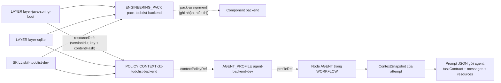
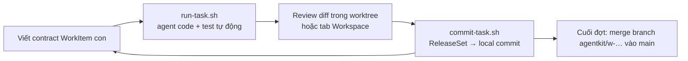
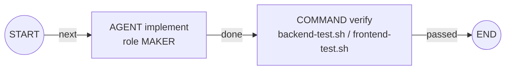
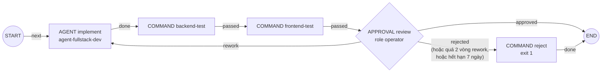

# Hướng dẫn: dùng Agent Kit (`aw`) xây dựng Todolist — Spring Boot + SQLite + React

Tài liệu này hướng dẫn từng bước áp dụng agent-workflow (`aw`) để một AI agent (Claude CLI) phát triển ứng dụng
todolist gồm **backend Java Spring Boot + SQLite** và **frontend ReactJS**, có kiểm soát: mỗi thay đổi đi qua một
workflow có version, được test tự động, được người vận hành review rồi mới thành commit.

Theo đúng yêu cầu, hướng dẫn **thiết lập Layer và Skill trước** (Phần 2), sau đó mới tới executable/workflow, chạy
task và **tùy biến workflow** (Phần 6).

> **Phạm vi kiểm chứng.** Mọi lệnh, file JSON và script trong thư mục này đã được chạy thật với binary `aw` build từ
> commit `7d0fb4c` (Alpha, Linux, Go 1.27) trên hai bản cài mới tinh, với Maven/Java 21 và Node 22 thật: publish
> toàn bộ definition, chạy WorkItem backend/frontend tới `SUCCEEDED`, local commit, và workflow tùy biến đi đủ ba
> nhánh `approved` / `rework` / `rejected`.
> **Phần chưa kiểm chứng được:** agent ở đây là chương trình giả lập nói đúng giao thức stream-json của Claude CLI
> (`cmd/fake-claude` của repo), không phải Claude CLI thật — chính báo cáo Alpha cũng ghi "Live provider
> compatibility: UNVERIFIED" ([alpha-release-report](../../release/alpha-release-report.md)). Phần cấu hình Claude
> CLI thật (mục 1.4) vì thế là khuyến nghị, chưa phải transcript đã chạy.

## Mục lục

- [0. Bức tranh tổng thể](#0-bức-tranh-tổng-thể)
- [1. Chuẩn bị môi trường và repository](#1-chuẩn-bị-môi-trường-và-repository)
- [2. Thiết lập Layer, Skill, Engineering Pack (làm trước)](#2-thiết-lập-layer-skill-engineering-pack-làm-trước)
- [3. Policy, Command và adapter build](#3-policy-command-và-adapter-build)
- [4. Workflow mặc định](#4-workflow-mặc-định)
- [5. Tạo task, chạy, review và commit](#5-tạo-task-chạy-review-và-commit)
- [6. Tùy biến workflow](#6-tùy-biến-workflow)
- [7. Xử lý sự cố (đã gặp thật)](#7-xử-lý-sự-cố-đã-gặp-thật)
- [8. Giới hạn của Alpha cần biết](#8-giới-hạn-của-alpha-cần-biết)
- [Phụ lục: các file trong thư mục này](#phụ-lục-các-file-trong-thư-mục-này)

---

## 0. Bức tranh tổng thể

### 0.1 Ánh xạ khái niệm của `aw` vào project todolist

| Khái niệm `aw` | Ý nghĩa | Trong todolist |
|---|---|---|
| Project | Đơn vị quản lý cao nhất | `todolist` |
| Repository | Git repo cục bộ đã đăng ký (đường dẫn tuyệt đối) | `todolist` (một repo, hai thư mục `backend/`, `frontend/`) |
| Component | Thư mục cấp 1 mà probe tự phát hiện | `backend`, `frontend` |
| **Layer** | Convention theo *stack công nghệ* (passive, không thực thi) | `layer-java-spring-boot`, `layer-sqlite`, `layer-react-vite` |
| **Skill** | Hướng dẫn theo *loại công việc*, hoặc script cho Command | `skill-todolist-dev` (quy trình làm task), `scripts-todolist` (script build/test) |
| **Engineering Pack** | Gói pin một tập Layer/Skill tương thích cho một component | `pack-todolist-backend`, `pack-todolist-frontend` |
| CONTEXT policy | "Tuyến" chọn chính xác resource nào của Layer/Skill đi vào prompt | `ctx-todolist-backend/frontend/fullstack` |
| Agent profile | Provider + model + context policy của một agent | `agent-backend-dev`, `agent-frontend-dev`, `agent-fullstack-dev` |
| Command | Script thực thi có version (pin theo content hash) | `cmd-backend-test`, `cmd-frontend-test`, `cmd-reject` |
| Policy | ATTEMPT / PERMISSION / COMPLETION / CONTEXT | retry+timeout, isolation, điều kiện "xong" |
| Workflow | Graph node + edge có version (scope project) | `wf-backend-feature`, `wf-frontend-feature`, `wf-fullstack-review` |
| WorkItem gốc | Tạo TaskFamily + worktree + branch `agentkit/w-…` riêng | "Todolist MVP" |
| WorkItem con | Một task có contract; workflow chạy trên nó | BE-01, FE-01, FE-02, FS-01 |
| Evidence | Bằng chứng mỗi node đã chạy (verdict + artifact) | `COMMAND_EXECUTION` |
| ReleaseSet | Gom thay đổi của family thành local commit thật | mỗi task một commit |

### 0.2 Layer/Skill thực sự đi tới agent như thế nào



Hai điểm quan trọng rút ra từ code và đã kiểm chứng khi chạy:

1. **Thứ quyết định agent nhận resource nào là `resourceRefs` của CONTEXT policy** mà agent profile trỏ tới. Engineering
   Pack và pack-assignment được lưu, version hóa và hiện trên UI (tab Components) để ghi nhận "component này dùng bộ
   convention nào", nhưng runtime Alpha **không** đọc pack-assignment để chọn resource. Vì vậy hướng dẫn này giữ cho
   Pack và Context policy luôn khớp nhau (cùng script publish).
2. Selector của resource chỉ có hai chiều thực sự có hiệu lực lúc chạy: `taskKinds` (WorkItem `ROOT`/`CHILD`) và
   `riskClasses` (`LOW`/`MEDIUM`/`HIGH` của contract). `componentTags`, `pathTags`, `blockKinds` hợp lệ khi publish
   nhưng runtime chưa điền ngữ cảnh cho chúng, nên **resource dùng ba chiều này sẽ luôn bị loại**. Hãy dùng
   `"global": true` hoặc `riskClasses`/`taskKinds`.

### 0.3 Vòng làm việc hằng ngày



---

## 1. Chuẩn bị môi trường và repository

### 1.1 Công cụ cần có

| Công cụ | Dùng cho | Ghi chú |
|---|---|---|
| `aw` (build từ repo này) | control plane | xem 1.2 để có UI |
| Git | repo + worktree | |
| Java 21 + Maven 3.9 | backend | test đã chạy với OpenJDK 21.0.11 |
| Node 22 + npm | frontend | test đã chạy với Node 22.22 |
| `jq`, `python3`, `bash`, `sha256sum` | các script trong `scripts/` | |
| Claude CLI | agent thật | gọi qua wrapper (1.4) |

### 1.2 Build `aw` kèm UI

Binary phát hành (`cmd/aw-release-build`) đã nhúng sẵn UI. Nếu tự build từ source thì build UI riêng rồi truyền
`--ui-dist`:

```bash
cd /path/to/aw-tqunglnh
go build -o ~/bin/aw ./cmd/aw
(cd web && pnpm install --frozen-lockfile && pnpm build)      # tạo web/dist
```

### 1.3 Tạo repository todolist

Thư mục `repo-template/` chứa khung đã kiểm chứng: backend Spring Boot 3.5 + SQLite + Flyway (`mvn test` pass),
`.gitignore`, và `.claude/settings.json` (quyền cho Claude CLI, xem 1.4).

```bash
GUIDE=/path/to/aw-tqunglnh/docs/guides/todolist-spring-react
mkdir -p ~/work/todolist && cd ~/work/todolist
git init -b main
cp -R "$GUIDE/repo-template/." .
mv gitignore .gitignore
mkdir -p frontend && echo "# Frontend (React + Vite)" > frontend/README.md
echo "# Todolist" > README.md
(cd backend && mvn -B -q test)          # kiểm tra khung backend chạy được trên máy bạn
git add -A && git commit -m "Khung todolist: backend Spring Boot + SQLite, thư mục frontend"
```

Vì sao cần những thứ này:

- **Hai thư mục cấp 1 `backend/` và `frontend/`**: khi đăng ký repository, probe của `aw` biến mỗi thư mục cấp 1
  (không bắt đầu bằng dấu chấm) thành một Component. Scope của từng task cũng dựa trên tiền tố đường dẫn này.
- **`.gitignore` phải có `target/`, `node_modules/`, `dist/`, `data/`, `*.db`**: `aw` dùng `git status` để kiểm tra
  agent/command đã sửa gì. File build không bị ignore sẽ bị tính là thay đổi và có thể vi phạm scope.
- **Commit trước khi tạo WorkItem gốc**: worktree của TaskFamily được tạo từ commit hiện tại của `main`. Thứ gì chưa
  commit sẽ không có trong worktree.

### 1.4 Wrapper cho Claude CLI (bắt buộc)

Đã kiểm chứng trên Alpha: tiến trình agent được spawn với **environment rỗng** (không `PATH`, không `HOME`). Cờ
`aw worker --env-allowlist` không áp dụng cho agent. Claude CLI cần `HOME` để tìm thông tin đăng nhập (`~/.claude`)
và `PATH` để chạy `git`, `java`, `mvn`, `node`, `npm`. Ngoài ra `aw` gọi CLI theo dạng
`claude -p --input-format text --output-format stream-json --verbose --model <model>` và **không** truyền permission
mode, nên ở chế độ `-p` agent sẽ không được sửa file hay chạy lệnh nếu không cấu hình thêm.

Giải pháp: dùng [`scripts/claude-for-aw.sh`](scripts/claude-for-aw.sh) làm "executable" của provider.

```bash
mkdir -p ~/aw && cp "$GUIDE/scripts/claude-for-aw.sh" ~/aw/claude-for-aw.sh
# Sửa HOME, PATH, CLAUDE_BIN trong file cho đúng máy bạn, rồi:
~/aw/claude-for-aw.sh --version          # phải in ra phiên bản Claude CLI
```

Wrapper đặt `HOME`/`PATH`, giữ nguyên lời gọi `--version` (aw dùng nó để probe), và thêm
`--permission-mode acceptEdits`. Quyền chạy lệnh Bash nằm trong `.claude/settings.json` của repository (đã có trong
`repo-template/`): cho phép `./mvnw`, `mvn`, `npm`, `npx`, `node`…; **cấm** `git commit/push/checkout/reset`,
`rm -rf` và đọc `.env`, vì commit là việc của `aw` sau khi người duyệt đồng ý.

> Alpha chỉ có isolation `OPERATOR_TRUSTED_LOCAL`: agent chạy dưới chính user của bạn, không có sandbox. Danh sách
> allow/deny ở trên là hàng rào chính, hãy giữ nó chặt.

### 1.5 Khởi động `aw serve` và `aw worker`

```bash
mkdir -p ~/aw/install/artifacts ~/aw/install/workspaces
export AW_DB=~/aw/install/aw.db AW_ARTIFACT_ROOT=~/aw/install/artifacts AW_WORKSPACE_ROOT=~/aw/install/workspaces
CLAUDE_EXECUTABLE=$HOME/aw/claude-for-aw.sh

# Terminal 1
aw serve --db "$AW_DB" --artifact-root "$AW_ARTIFACT_ROOT" --workspace-root "$AW_WORKSPACE_ROOT" \
  --port 18080 --claude-executable "$CLAUDE_EXECUTABLE" --ui-dist /path/to/aw-tqunglnh/web/dist
# Terminal 2
aw worker --db "$AW_DB" --artifact-root "$AW_ARTIFACT_ROOT" --workspace-root "$AW_WORKSPACE_ROOT" \
  --claude-executable "$CLAUDE_EXECUTABLE"

aw doctor        # status: HEALTHY
```

`--claude-executable` phải giống nhau trên cả `serve` và `worker`, và phải là **đường dẫn tuyệt đối** của wrapper.

### 1.6 Tạo project, đăng ký repository và mở UI

```bash
export PROJECT_ID=$(echo '{"name":"todolist"}' | aw project create --idempotency-key proj-todolist | jq -r .result.projectId)
echo '{"repositoryId":"todolist","name":"todolist","remoteLocator":"'"$HOME"'/work/todolist","defaultRef":"main"}' \
  | aw repository register --project-id "$PROJECT_ID" --idempotency-key repo-todolist
sleep 5
aw repository list "$PROJECT_ID" | jq -c '.repositories[] | {id, status}'     # {"id":"todolist","status":"ACTIVE"}
aw component list "$PROJECT_ID" | jq -c '.components[] | {name, path, id}'     # backend, frontend
```

Giờ **mở trình duyệt tại <http://127.0.0.1:18080/ui/projects>** (UI chỉ bind loopback, nên mở trên chính máy chạy
`aw serve`). Những gì bạn thấy ngay sau bước này:

| Màn hình | Đường dẫn | Nội dung |
|---|---|---|
| Projects | `/ui/projects` | danh sách project, trạng thái `ACTIVE` |
| Overview | `/ui/projects/<id>` | repository `todolist` ACTIVE, ref `main`, số component/blocker |
| Components | `/ui/projects/<id>/components` | `backend`, `frontend` (kind `DIRECTORY`), nút **Assign Pack** |
| Board | `/ui/projects/<id>/board` | Kanban BACKLOG / READY / ACTIVE / BLOCKED / DONE, nút New WorkItem |
| Definitions | `/ui/definitions`, `/ui/projects/<id>/definitions` | lọc theo 9 loại definition, xem version |
| Doctor | `/ui/doctor` | các check liveness/readiness/capability |
| Adapter Builds | `/ui/system/adapters` | adapter build đã đăng ký cho Claude |


---

## 2. Thiết lập Layer, Skill, Engineering Pack (làm trước)

Làm phần này **trước khi viết bất kỳ task nào**. Layer/Skill là "kiến thức" agent mang theo vào mọi attempt; một
workflow chỉ pin tới chúng gián tiếp (qua agent profile → context policy), nên khi chúng thay đổi thì cả chuỗi phía
sau phải publish version mới. Script ở 2.8 lo việc đó.

### 2.1 Layer, Skill, Pack, Context policy khác nhau thế nào

| | Layer | Skill | Engineering Pack | CONTEXT policy |
|---|---|---|---|---|
| Trả lời câu hỏi | "Stack này viết thế nào?" | "Loại việc này làm thế nào?" | "Component này dùng bộ convention nào?" | "Attempt này nạp chính xác resource nào?" |
| Trường nội dung | `convention` | `instruction` | `dependencies` (pin Layer/Skill/Pack) | `resourceRefs`, `budget`, `selector` |
| Có thực thi không | Không | Không (script trong Skill chỉ chạy khi một Command pin nó) | Không | Không |
| Ảnh hưởng prompt agent | qua context policy | qua context policy | không trực tiếp (Alpha) | **có** |

### 2.2 Quy tắc viết một resource

Mỗi resource của Layer/Skill có dạng:

```json
{"key": "spring.rest-api", "priority": "HARD_CONSTRAINT", "global": true, "selector": {},
 "convention": "REST API của Todo nằm dưới /api/todos ...",
 "provenance": {"owner": "team-backend", "source": "docs/guides/todolist-spring-react", "revision": "v1"}}
```

- **`key` duy nhất trên toàn bộ resource mà một context policy gom lại**: nếu hai resource cùng key nhưng khác nội dung
  và có một cái là `HARD_CONSTRAINT`, resolver báo conflict và attempt không được lên lịch. Hướng dẫn này dùng tiền tố
  `spring.`, `sqlite.`, `react.`, `dev.`.
- **`priority`** quyết định thứ tự và khả năng bị cắt:
  - `HARD_CONSTRAINT`: luôn được nạp; nếu tổng dung lượng vượt budget thì attempt fail thay vì cắt bớt.
  - `REQUIRED_PROCEDURE` → `GUIDANCE` → `REFERENCE`: nạp theo thứ tự này cho tới khi hết budget.
- **`global: true`** hoặc **`selector`** không rỗng (bắt buộc một trong hai). Chỉ `taskKinds` và `riskClasses` có
  hiệu lực lúc chạy (xem 0.2).
- **`provenance`** bắt buộc có `owner`, `source` và một trong `lastVerified`/`revision`. Thiếu là lỗi publish.
- **`budget.maxTokens`** của context policy hiện được hiểu là **số byte** (chưa có tokenizer). Tiếng Việt UTF-8 tốn 2–3
  byte mỗi ký tự có dấu, nên hãy để rộng (hướng dẫn dùng 65536).

### 2.3 Ba Layer cho todolist

| Layer | Resource | Priority | Nội dung chính |
|---|---|---|---|
| [`layer-java-spring-boot`](definitions/layers/layer-java-spring-boot.json) | `spring.project-structure` | REQUIRED_PROCEDURE | Java 21, Spring Boot 3.5, Maven, package `com.example.todo`, tầng controller/service/repository/domain/dto |
| | `spring.rest-api` | HARD_CONSTRAINT | Hợp đồng `/api/todos` (GET/POST/PUT/PATCH toggle/DELETE), validate, ProblemDetail, cổng 8080 |
| | `spring.testing` | GUIDANCE | JUnit 5, MockMvc, SQLite file tạm, `./mvnw -B test` |
| [`layer-sqlite`](definitions/layers/layer-sqlite.json) | `sqlite.datasource` | HARD_CONSTRAINT | `sqlite-jdbc`, `SQLiteDialect`, `jdbc:sqlite:./data/todolist.db`, `ddl-auto=validate` |
| | `sqlite.migrations` | REQUIRED_PROCEDURE | Flyway `V<n>__*.sql`, bảng `todos`, không sửa migration cũ |
| [`layer-react-vite`](definitions/layers/layer-react-vite.json) | `react.project-structure` | REQUIRED_PROCEDURE | React + TS + Vite trong `frontend/`, `src/api`, `src/components`, `src/hooks` |
| | `react.api-client` | HARD_CONSTRAINT | Một module `src/api/todos.ts`, đường dẫn tương đối `/api/todos`, proxy Vite tới 8080 |
| | `react.testing` | GUIDANCE | Vitest + Testing Library + jsdom, `npm test` = `vitest run`, `npm run build` phải pass |

Convention trong Layer khớp với khung ở `repo-template/` (đã kiểm chứng `mvn test` pass với Spring Boot 3.5.16,
`sqlite-jdbc`, `hibernate-community-dialects`, Flyway).

### 2.4 Skill

**[`skill-todolist-dev`](definitions/skills/skill-todolist-dev.json)**: hướng dẫn cho agent, áp dụng cho mọi task.

| Resource | Priority | Áp dụng | Nội dung |
|---|---|---|---|
| `dev.implement-feature` | REQUIRED_PROCEDURE | global | Quy trình MAKER: đọc contract + messages, sửa tối thiểu, viết test, tự chạy test, **không git commit/push**, chỉ sửa trong scope, tóm tắt cuối |
| `dev.definition-of-done` | HARD_CONSTRAINT | global | Không stub, không tắt test, không commit secret/`*.db`/thư mục build |
| `dev.high-risk-extra` | GUIDANCE | `selector.riskClasses: ["HIGH"]` | Chỉ nạp khi contract có `riskLevel: HIGH` |

**`scripts-todolist`**: Skill chứa script cho COMMAND node, được script publish dựng từ
[`scripts/backend-test.sh`](scripts/backend-test.sh), [`scripts/frontend-test.sh`](scripts/frontend-test.sh) và
[`scripts/reject.sh`](scripts/reject.sh). Skill này **không** đưa vào context policy: script chỉ thành hành động
khi một Command pin chính xác `ownerVersionId + resourceKey + contentHash` của nó.

### 2.5 Engineering Pack và gán cho component

```json
{"dependencies": [
  {"kind": "LAYER", "definitionId": "layer-java-spring-boot", "versionId": "<version id>"},
  {"kind": "LAYER", "definitionId": "layer-sqlite",           "versionId": "<version id>"},
  {"kind": "SKILL", "definitionId": "skill-todolist-dev",     "versionId": "<version id>"}]}
```

- `pack-todolist-backend` = Spring Boot + SQLite + skill dev → gán cho component `backend`.
- `pack-todolist-frontend` = React/Vite + skill dev → gán cho component `frontend`.

Gán bằng CLI (script làm sẵn) hoặc nút **Assign Pack** ở tab Components:

```bash
echo '{"packVersionId":"<pack version id>"}' | aw pack-assignment assign --idempotency-key assign-backend <componentId>
aw pack-assignment list <componentId>         # lịch sử gán + bản đang hiệu lực
```

Lịch sử gán là append-only (mỗi lần gán là một bản ghi mới có `effectiveAt`), dùng để trả lời "lúc T component này
theo convention version nào".

### 2.6 Context policy: tuyến đưa Layer/Skill vào prompt

```json
{"category": "CONTEXT",
 "context": {"selector": ["todolist-backend"], "budget": {"maxTokens": 65536},
   "resourceRefs": [
     {"ownerVersionId": "<layer version id>", "resourceKey": "spring.rest-api", "contentHash": "sha256:..."}]}}
```

Mỗi `resourceRef` là danh tính ADR-012 của một resource: **version id của Layer/Skill + key + content hash**. CLI
không in content hash của từng resource, nên thư mục này có
[`scripts/aw-resource-hashes.py`](scripts/aw-resource-hashes.py) tính đúng thuật toán của `aw` (SHA-256 của JSON
canonical gồm `convention|instruction`, `priority`, `global`, `selector`). Script đã được đối chiếu với code Go, kể cả
với hash có sẵn trong quickstart:

```bash
python3 scripts/aw-resource-hashes.py definitions/layers/layer-sqlite.json
# sqlite.datasource sha256:...
# sqlite.migrations sha256:...
```

Ba context policy được publish: `ctx-todolist-backend` (Spring + SQLite + skill), `ctx-todolist-frontend`
(React + skill), `ctx-todolist-fullstack` (tất cả, dùng ở Phần 6). Nếu hash sai, attempt fail lúc lên lịch với lỗi
`content hash ... no longer matches pinned hash`.

### 2.7 Agent profile

```json
{"providerKey": "claude", "model": "sonnet", "toolRefs": ["Read", "Edit", "Write", "Bash"],
 "contextPolicyRef": {"kind": "POLICY", "definitionId": "ctx-todolist-backend", "versionId": "<ctx version id>"},
 "compatibility": {"os": ["linux"]}, "budget": {"maxTokens": 200000}}
```

`model` được truyền thẳng cho `claude --model`, nên hãy đặt giá trị Claude CLI của bạn chấp nhận (biến
`CLAUDE_MODEL` của script, mặc định `sonnet`). `toolRefs` hiện chỉ được ghi nhận; quyền công cụ thật do
`.claude/settings.json` + wrapper quyết định.

### 2.8 Publish tất cả bằng một lệnh

```bash
cd ~/aw          # aw-ids.env sẽ được ghi ở thư mục hiện tại
export PROJECT_ID CLAUDE_EXECUTABLE=$HOME/aw/claude-for-aw.sh CLAUDE_MODEL=sonnet
"$GUIDE/scripts/publish-definitions.sh"
```

[`publish-definitions.sh`](scripts/publish-definitions.sh) làm theo đúng thứ tự phụ thuộc:

1. Layer ×3, Skill `skill-todolist-dev`, Skill `scripts-todolist`.
2. Engineering Pack ×2.
3. Context policy ×3 (tự tính `resourceRefs`).
4. Policy attempt/permission/network/completion.
5. Agent profile ×3.
6. Command ×3 (tự tính content hash của script).
7. Adapter build cho wrapper Claude (probe + register, xem 3.3).
8. Gán pack cho component `backend`/`frontend`.
9. Ghi mọi version id vào `aw-ids.env`, rồi publish hai workflow mặc định bằng `publish-workflow.sh` (Phần 4).

Script **idempotent**: idempotency key được suy ra từ nội dung document, nên chạy lại khi không đổi gì sẽ trả đúng các
version cũ (đã kiểm chứng: hai lần chạy liên tiếp cho ra `aw-ids.env` giống hệt). Sửa một Layer rồi chạy lại thì chỉ
Layer đó và các definition phụ thuộc nó (pack, context, agent profile, workflow) lên version mới.

Kiểm tra trên UI ở **Global Definitions** (và **Definitions** của project cho workflow):


### 2.9 Xác nhận agent thực sự nhận Layer/Skill nào

Sau khi chạy một task (Phần 5), xem ContextSnapshot của attempt `implement`:

```bash
snap=$(aw run timeline <runId> | jq -r '.entries[] | select(.kind=="EXECUTION_ATTEMPT" and .nodeKey=="implement") | .contextSnapshotId')
aw context-snapshot show --project-id "$PROJECT_ID" <workItemId> "$snap" | jq -c '[.resourceRefs[].resourceKey]'
```

Kết quả thật với task BE-01 (`riskLevel: MEDIUM`):

```json
["dev.definition-of-done","spring.rest-api","sqlite.datasource","dev.implement-feature","spring.project-structure","sqlite.migrations","spring.testing"]
```

Thứ tự đúng theo priority: HARD_CONSTRAINT → REQUIRED_PROCEDURE → GUIDANCE. `dev.high-risk-extra` bị loại vì task
không phải `HIGH`.

### 2.10 Sửa Layer/Skill về sau

Definition là bất biến theo version: sửa file JSON rồi chạy lại `publish-definitions.sh`. Run cũ vẫn giữ đúng version
đã pin lúc bắt đầu; WorkItem mới phải trỏ tới workflow version mới (`run-task.sh` tự lấy từ `aw-ids.env`).

---

## 3. Policy, Command và adapter build

### 3.1 Policy

| File | Category | Nội dung | Dùng ở |
|---|---|---|---|
| [`policy-attempt.json`](definitions/policies/policy-attempt.json) | ATTEMPT | 2 lần, backoff 10 giây, timeout 30 phút | mọi node AGENT/COMMAND (bắt buộc) |
| [`policy-permission.json`](definitions/policies/policy-permission.json) | PERMISSION | `OPERATOR_TRUSTED_LOCAL` | mọi node AGENT/COMMAND (bắt buộc) |
| [`policy-permission-network.json`](definitions/policies/policy-permission-network.json) | PERMISSION | thêm `grantedCapabilities: ["NETWORK_ACCESS"]` | pin trong **Command** cần mạng |
| [`policy-completion.json`](definitions/policies/policy-completion.json) | COMPLETION | cần evidence `COMMAND_EXECUTION` PASS | workflow mặc định |
| [`policy-completion-reviewed.json`](definitions/policies/policy-completion-reviewed.json) | COMPLETION | test PASS **và** người có role `operator` đã quyết định | workflow tùy biến |

Mỗi node AGENT/COMMAND/MACHINE_GATE phải pin **đúng một** ATTEMPT và **đúng một** PERMISSION policy. Thiếu thì node
không bao giờ được lên lịch.

### 3.2 Command

```json
{"executable": {"ownerVersionId": "<scripts-todolist version>", "resourceKey": "backend-test.sh", "contentHash": "sha256:..."},
 "argv": [{"kind": "LITERAL", "value": "run"}],
 "cwdRepositoryTarget": "todolist", "compatibility": {"os": ["linux"]},
 "envAllowlist": ["PATH", "HOME", "JAVA_HOME", "MAVEN_OPTS", "JAVA_TOOL_OPTIONS", "HTTP_PROXY", "HTTPS_PROXY", "NO_PROXY"],
 "networkAccess": "ALLOWED",
 "policyRefs": [{"kind": "POLICY", "definitionId": "policy-permission-network", "versionId": "<id>"}],
 "timeoutSeconds": 1800,
 "output": {"captureStdout": true, "captureStderr": true, "maxOutputBytes": 4194304}}
```

Những điều đã gặp thật khi kiểm chứng:

- `argv` không được rỗng (`argv is empty`). Script nhận `run` làm `$1` và bỏ qua.
- Script chạy với cwd là **gốc worktree** của repository `cwdRepositoryTarget`, nên `backend-test.sh` tự `cd backend`.
- `envAllowlist` của **chính Command** quyết định biến môi trường nào được truyền xuống; thiếu `PATH`/`HOME` thì
  `mvn`/`npm` không chạy được.
- `networkAccess: "ALLOWED"` (Maven/npm cần tải dependency) **bắt buộc** chính Command pin một PERMISSION policy cấp
  `NETWORK_ACCESS`; nếu không, node fail ngay với `VALIDATION_FAILED`.
- Output vượt `maxOutputBytes` bị coi là **thất bại** (không tin output đã bị cắt), nên script dùng `-q` và giới hạn
  4 MiB.
- Exit code khác 0 → attempt FAILED → retry theo ATTEMPT policy → node FAILED → run FAILED.

### 3.3 Adapter build cho Claude

Workflow pin một adapter build (danh tính của bộ provider + executable + protocol + capability). Mỗi lần admit một
node AGENT, worker đo lại và so sánh; lệch là blocker `ADAPTER_BUILD_DRIFT`. Các trường mà worker đo lại:

| Trường | Giá trị đúng |
|---|---|
| `--executable-path` | đường dẫn tuyệt đối của wrapper (giống `--claude-executable`) |
| nội dung file executable | SHA-256 của **file wrapper** |
| `--protocol-version` | `claude-stream-json/v1` |
| capability | `--supports-start --supports-resume --supports-cancel` + 9 canonical event kinds |
| `--os` | `os` trong `aw version --json` |
| `--toolchain` | **`goVersion` trong `aw version --json`** (phiên bản Go build ra `aw`, không phải phiên bản Claude CLI) |

Script đã làm đúng các điều trên. Nếu sửa wrapper hay đổi đường dẫn, hãy chạy lại `publish-definitions.sh`: script
đăng ký adapter build mới và publish workflow mới trỏ tới nó. Vì `aw` chỉ băm file wrapper, việc nâng cấp Claude CLI
phía sau wrapper **không** bị coi là drift; hãy tự chạy lại script sau mỗi lần nâng cấp CLI để ghi nhận.

---

## 4. Workflow mặc định



Hai workflow `wf-backend-feature` và `wf-frontend-feature` (scope project) được viết dưới dạng **template** có
placeholder `{{TEN_BIEN}}`: [`definitions/workflows/wf-backend-feature.json`](definitions/workflows/wf-backend-feature.json),
[`wf-frontend-feature.json`](definitions/workflows/wf-frontend-feature.json).
[`scripts/publish-workflow.sh`](scripts/publish-workflow.sh) thay placeholder bằng version id trong `aw-ids.env`,
chạy `aw definition validate`, rồi publish.

Vì sao chỉ có AGENT → COMMAND mà không có MACHINE_GATE hay agent CHECKER phía sau:

- MACHINE_GATE và AGENT role `CHECKER` là **read-only nghiêm ngặt**: diff của mọi repository trong scope so với base
  revision của run phải **hoàn toàn rỗng**. Mà maker vừa sửa code trong cùng worktree, nên đặt chúng sau maker trong
  cùng run sẽ luôn fail. Đây là ràng buộc thiết kế đã ghi trong `baocaov5checklist.md`, không phải bug.
- COMMAND thì chỉ bị kiểm tra "thay đổi có nằm trong write scope của WorkItem không", nên chạy test sau maker được.
- Kiểm tra bằng con người được làm ở bước review diff trước khi commit (Phần 5), hoặc bằng node APPROVAL (Phần 6).

---

## 5. Tạo task, chạy, review và commit

### 5.1 WorkItem gốc

```bash
"$GUIDE/scripts/create-root.sh"        # ghi ROOT_ID, FAMILY_ID vào aw-ids.env
```

WorkItem gốc ([`work-items/root.json`](work-items/root.json)) tạo một TaskFamily với một Git worktree riêng trên
branch `agentkit/w-…`, tách từ commit hiện tại của `main`. Mọi WorkItem con của nó dùng chung worktree này.

### 5.2 Viết contract cho WorkItem con

```json
{"title": "BE-01: REST API CRUD cho Todo",
 "parentJoinPolicy": "ALL_CHILDREN_DONE",
 "effectiveScope": [{"repositoryId": "todolist", "access": "WRITE", "reason": "Chỉ sửa backend", "pathScopes": ["backend"]}],
 "contract": {"schemaVersion": 1, "behavior": "...", "verificationSpec": "...", "riskLevel": "MEDIUM",
   "acceptanceCriteria": [{"description": "...", "verificationRef": "COMMAND_EXECUTION"}],
   "workflowVersionId": "WORKFLOW_VERSION_ID"}}
```

- `behavior`, `verificationSpec`, `riskLevel`, `acceptanceCriteria` là bắt buộc (thiếu thì `readiness` báo `problems`).
  Agent nhận chúng nguyên văn trong `taskContract` của prompt, nên hãy viết rõ ràng như viết ticket cho người.
- `pathScopes` là **tiền tố đường dẫn**, không phải glob: `"backend"` khớp `backend/...`; `"**"` không có nghĩa
  wildcard. Bỏ `pathScopes` nghĩa là toàn bộ repository.
- `riskLevel` được dùng làm `riskClass` cho selector (ví dụ `HIGH` nạp thêm `dev.high-risk-extra`).
- `workflowVersionId` được `run-task.sh` điền tự động. Contract **pin** workflow version: đổi workflow nghĩa là tạo
  WorkItem mới.

Backlog mẫu:

| File | Workflow | Scope |
|---|---|---|
| [`be-01-todo-api.json`](work-items/be-01-todo-api.json) | backend | `backend` |
| [`fe-01-scaffold.json`](work-items/fe-01-scaffold.json) | frontend | `frontend` |
| [`fe-02-todo-ui.json`](work-items/fe-02-todo-ui.json) | frontend | `frontend` |
| [`fs-01-created-at.json`](work-items/fs-01-created-at.json) | `WF_FULLSTACK_REVIEW` (Phần 6) | `backend`, `frontend` |

### 5.3 Chạy task

```bash
"$GUIDE/scripts/run-task.sh" "$GUIDE/work-items/be-01-todo-api.json" backend
```

[`run-task.sh`](scripts/run-task.sh) tạo WorkItem con, kiểm tra `readiness`, `mark-ready`, rồi
`aw run start --wait`. Output thật:

```
WorkItem: 848db62f-92ae-4812-98b4-ba560ee84b37
{"ready":true,"problems":null}
Run: ec9136b8-0cd2-42db-afd2-263cccec745a  state: SUCCEEDED
  implement #1: SUCCEEDED COMPLETED
  verify #1: SUCCEEDED COMPLETED
  evidence COMMAND_EXECUTION: SUCCEEDED
```

Theo dõi trên UI: **Board** (card di chuyển giữa các cột), mở card → **Graph & Timeline** (từng node/attempt),
**Evidence**, **Chat** (message gửi cho agent), **Workspace** (diff/source/log chỉ đọc giữa các revision).


### 5.4 Review thay đổi

Thay đổi của agent nằm **chưa commit** trong worktree của family. Xem bằng git:

```bash
WT=$("$GUIDE/scripts/worktree-path.sh")
git -C "$WT" status
git -C "$WT" diff                     # file đã sửa
git -C "$WT" diff --stat HEAD; git -C "$WT" status --porcelain   # file mới (untracked) cũng hiện ở đây
(cd "$WT/backend" && ./mvnw spring-boot:run)    # tự chạy thử nếu muốn
```

Tab **Workspace** trên UI chỉ so sánh giữa hai revision đã commit (không thấy thay đổi chưa commit), và ô "current"
hiện chưa cập nhật sau local commit. Với thay đổi đang chờ review, hãy dùng git như trên.

Nếu không chấp nhận một phần thay đổi: hoàn tác trực tiếp trong worktree (`git -C "$WT" checkout -- <file>` hoặc xóa
file mới), hoặc gửi phản hồi và tạo task mới (xem 5.6).


### 5.5 Commit — sau MỖI task, trước task tiếp theo

```bash
AUTHOR_NAME="Tên bạn" AUTHOR_EMAIL="ban@example.com" "$GUIDE/scripts/commit-task.sh" "BE-01: REST API CRUD cho Todo"
# {"state":"COMMITTED","parentVcsObjectId":"39d48b7…","resultVcsObjectId":"1c5ff90…"}
```

[`commit-task.sh`](scripts/commit-task.sh) thực hiện đúng chuỗi lệnh `aw` cho local commit:

```bash
aw workspace-set show --project-id "$PROJECT_ID" "$FAMILY_ID"     # repositoryWorkspaceId, version, currentRevision
echo '{"repositories":[{"repositoryId":"todolist","baseVcsObjectId":"<rev>","resultVcsObjectId":"<rev>","verdict":"PASS"}]}' \
  | aw release-set create --project-id "$PROJECT_ID" --family-id "$FAMILY_ID" --idempotency-key rs-1
aw release-set seal --expected-version 1 --idempotency-key seal-1 --yes <releaseSetId>
aw release-set local-commit --project-id "$PROJECT_ID" --release-set-id <releaseSetId> \
  --repository-workspace-id <rwId> --expected-release-set-version 2 --expected-workspace-version <v> \
  --author-name "..." --author-email "..." --message "..." --idempotency-key commit-1 --yes --wait --wait-timeout 5m
```

Commit là một `git add -A && git commit` thật trên branch `agentkit/w-…`, kèm marker
`[Release-Set-Local-Commit-Marker: sha256:…]` trong message, và xuất hiện ngay trong repo gốc
(`git log agentkit/w-…`). Không có gì bị push.

**Vì sao phải commit sau mỗi task:** thay đổi chưa commit của task trước vẫn nằm trong worktree. Task sau có scope
khác (ví dụ FE sau BE) sẽ thấy chúng là thay đổi ngoài scope và fail (đã gặp thật: `PROVIDER_UNAVAILABLE`, xem
Phần 7). Script từ chối commit khi worktree không có thay đổi, vì Alpha xử lý trường hợp đó không tốt (Phần 7).

### 5.6 Khi task fail hoặc cần làm lại

- Run FAILED để WorkItem ở trạng thái `ACTIVE`; không thể `run start` lại trên chính nó. Hủy nó rồi tạo task mới (sửa
  `title` hoặc contract, `run-task.sh` sẽ tạo WorkItem mới):

  ```bash
  aw work-item cancel --reason "làm lại với contract mới" --yes <workItemId>
  ```

- Muốn bổ sung chỉ dẫn cho agent mà không sửa contract: gửi message vào WorkItem **trước khi** chạy (agent nhận mọi
  message trong `messages` của prompt), hoặc gõ ở tab **Chat**:

  ```bash
  echo "Dùng record Java cho DTO, không dùng Lombok." | aw message append --project-id "$PROJECT_ID" <workItemId>
  ```

- Muốn có vòng "duyệt → yêu cầu sửa → agent làm lại" ngay trong một run: dùng workflow tùy biến ở Phần 6.

### 5.7 Thứ tự đề xuất và kết thúc đợt

```text
run-task BE-01 (backend) → review → commit-task
run-task FE-01 (frontend) → review → commit-task
run-task FE-02 (frontend) → review → commit-task
run-task FS-01 (WF_FULLSTACK_REVIEW) → duyệt trong workflow → commit-task
```

Cuối đợt, merge branch của family vào `main` của repo gốc:

```bash
cd ~/work/todolist
git worktree list                      # tìm branch agentkit/w-… của family
git merge --no-ff agentkit/w-<...>
(cd backend && ./mvnw spring-boot:run)  # http://localhost:8080/api/todos
(cd frontend && npm install && npm run dev)   # http://localhost:5173, proxy /api tới 8080
```

Đợt tiếp theo: tạo WorkItem gốc mới (`create-root.sh`), để family mới có worktree tách từ `main` đã merge.

---

## 6. Tùy biến workflow

### 6.1 Nguyên tắc soạn graph

- Workflow = `nodes` + `edges` + `completionPolicyRef`. Loại node (tập đóng): `START`, `END`, `AGENT`, `COMMAND`,
  `MACHINE_GATE`, `APPROVAL`, `WAIT`, `ROUTER`, `FORK`, `JOIN`.
- **Mọi outcome của một node phải có đúng một edge** đi ra (thiếu là lỗi khi validate/publish).
- **AGENT và COMMAND nên chỉ có một outcome.** Với nhiều outcome, AGENT phải tự in marker
  `<agentkit-outcome>{"schemaVersion":1,"outcome":"..."}</agentkit-outcome>` ở cuối, còn COMMAND không có cơ chế
  chọn outcome nên sẽ fail. Rẽ nhánh hãy đặt ở node APPROVAL.
- Node AGENT/COMMAND/MACHINE_GATE phải pin một ATTEMPT và một PERMISSION policy.
- Vòng lặp phải có giới hạn: một node trong vòng khai `cyclePolicy {maxIterations, escalationOutcome}`, với
  `escalationOutcome` là outcome có edge đi **ra ngoài** vòng.
- `ROUTER` trong Alpha chỉ được một outcome (ADR-026). `WAIT`, `FORK`/`JOIN` hợp lệ nhưng chưa được kiểm chứng trong
  hướng dẫn này.
- Viết workflow dưới dạng template có `{{BIEN}}` rồi publish:

  ```bash
  "$GUIDE/scripts/publish-workflow.sh" <template.json> <workflow-id> <BIEN_LUU_VERSION> ["Tên hiển thị"]
  ```

  Script chạy `aw definition validate` trước khi publish và in nguyên văn lỗi nếu graph sai.

### 6.2 Ví dụ: workflow fullstack có người duyệt và vòng rework

Template: [`definitions/workflows/wf-fullstack-review.json`](definitions/workflows/wf-fullstack-review.json).



Các phần tử tùy biến:

```json
{"key": "review", "type": "APPROVAL", "outcomes": ["approved", "rework", "rejected"],
 "approval": {"authorizedRoles": ["operator"], "timeoutSeconds": 604800,
              "escalationOutcome": "rejected", "requestedEvidenceKinds": ["COMMAND_EXECUTION"]},
 "cyclePolicy": {"maxIterations": 2, "escalationOutcome": "rejected"}}
```

- `approval.authorizedRoles`: chỉ principal có role `operator` (mặc định của `local-operator`) được quyết định.
- `approval.timeoutSeconds` + `escalationOutcome`: không ai quyết định trong 7 ngày thì tự đi nhánh `rejected`.
- `cyclePolicy` trên `review`: lần kích hoạt thứ 0 là lần duyệt đầu; mỗi lần `rework` tăng vòng lên 1. Khi vòng vượt
  `maxIterations` (tức sau 2 lần rework), `review` bị SKIPPED và tự đi theo `escalationOutcome` → `reject`.
- Node `reject` chạy [`reject.sh`](scripts/reject.sh) (thoát mã 1), nên run kết thúc **FAILED** một cách tường minh.
  Không thể cho `rejected` đi thẳng tới END: END sẽ được tính là hoàn thành.
- Completion policy [`policy-completion-reviewed.json`](definitions/policies/policy-completion-reviewed.json) dùng
  thang assurance V2:

  ```json
  {"category": "COMPLETION", "completion": {"requiredAssurance": [
    {"level": "UNIT", "requiredEvidenceKinds": ["COMMAND_EXECUTION"]},
    {"level": "HUMAN", "requiredApprovals": [{"authorizedRoles": ["operator"]}]}]}}
  ```

  Lưu ý từ code: điều kiện HUMAN chỉ kiểm tra **đã có người đủ quyền quyết định**, không xét quyết định là gì. Ý nghĩa
  "từ chối" vì thế phải nằm ở graph (nhánh `reject`), không phải ở completion policy.

### 6.3 Publish và chạy

```bash
"$GUIDE/scripts/publish-workflow.sh" "$GUIDE/definitions/workflows/wf-fullstack-review.json" \
  wf-fullstack-review WF_FULLSTACK_REVIEW "Workflow: fullstack + người duyệt"
WAIT=60m "$GUIDE/scripts/run-task.sh" "$GUIDE/work-items/fs-01-created-at.json" WF_FULLSTACK_REVIEW
```

Run dừng ở node `review` (`--wait` hết hạn là bình thường), script in lệnh duyệt:

```
Run: 28a9fe20-…  state: RUNNING
  implement #1: SUCCEEDED COMPLETED
  backend-test #1: SUCCEEDED COMPLETED
  frontend-test #1: SUCCEEDED COMPLETED
  CHỜ DUYỆT node review: review-task.sh 28a9fe20-… <approved|rework|rejected> ["phản hồi"]
```

Review diff như 5.4, rồi quyết định bằng [`review-task.sh`](scripts/review-task.sh). Script gửi phản hồi thành message
của WorkItem rồi gọi `aw approval resolve <runId> <approvalRequestId> --outcome … --expected-version 1`
(`approvalRequestId` lấy từ `aw run show <runId>`).

**Rework** (kết quả thật):

```bash
"$GUIDE/scripts/review-task.sh" <runId> rework "Tooltip phải hiển thị giờ theo múi giờ của trình duyệt."
```

```
  #5 review (vòng 0): SUCCEEDED rework
  #6 implement (vòng 1): SUCCEEDED done
  #7 backend-test (vòng 1): SUCCEEDED passed
  #8 frontend-test (vòng 1): SUCCEEDED passed
  #9 review (vòng 1): WAITING
```

Ở lần chạy lại, prompt của agent chứa phản hồi trong `messages`
(`"messages":[{"role":"USER","content":"Tooltip phải hiển thị giờ theo múi giờ của trình duyệt.\n"}]`), và phản hồi
cũng hiện ở tab **Chat**.

**Approved** → `#9 review (vòng 1): SUCCEEDED approved`, `#10 end`, WorkItem `DONE`. Sau đó `commit-task.sh` như thường.

**Rejected** → `review: SUCCEEDED rejected`, `reject: FAILED`, run `FAILED`. Hoàn tác thay đổi trong worktree
(`git -C "$WT" checkout -- . && git -C "$WT" clean -fd -- backend frontend`) trước khi chạy task khác.


### 6.4 Các kiểu tùy biến khác

| Muốn | Cách làm |
|---|---|
| Thêm bước lint/format | Thêm script vào `scripts/`, thêm vào Skill `scripts-todolist` trong `publish-definitions.sh`, tạo Command mới, chèn một node COMMAND giữa `implement` và `verify` |
| Chạy cả test backend lẫn frontend cho mọi task | Dùng chuỗi `backend-test → frontend-test` như `wf-fullstack-review`, bỏ node `review` |
| Agent khác cho từng loại việc | Tạo agent profile mới (model khác, context policy khác), đổi `profileRef` của node `implement` |
| Thêm convention cho task rủi ro cao | Thêm resource với `"selector": {"riskClasses": ["HIGH"]}` vào Skill/Layer; chỉ task `riskLevel: HIGH` nhận |
| Retry nhiều hơn / timeout dài hơn | Thêm ATTEMPT policy mới và pin vào node cần thiết |
| Thêm cổng duyệt cho task backend | Copy `wf-backend-feature.json`, chèn node APPROVAL như 6.2, đổi `completionPolicyRef` sang `policy-completion-reviewed` |
| Rework tự động khi completion trả `REWORK` | Edge `"kind": "COMPLETION_REWORK"` từ END về một node kèm `"reworkPolicy": {"maxIterations": n}` — hợp lệ theo schema nhưng chưa được kiểm chứng ở đây |

MACHINE_GATE chỉ phù hợp cho kiểm tra **không đọc thay đổi của maker trong cùng run** (xem Phần 4). Command của nó chạy
trong một thư mục scratch tạm, stdout phải là JSON `{"<evidenceKey>": {"verdict": "PASS"|"FAIL"|"ERROR"}}`. Xem
[quickstart](../../operator/01-quickstart.md).

### 6.5 So sánh và theo dõi version

```bash
aw definition versions --kind WORKFLOW --project-id "$PROJECT_ID" wf-backend-feature    # các version + id
curl -s "http://127.0.0.1:18080/projects/$PROJECT_ID/definitions/versions/diff?a=<versionIdA>&b=<versionIdB>" \
  | jq -r '.sourceDiff[] | select(.op != "equal") | "\(.op)\t\(.text)"'
```

Ví dụ thật (đổi adapter build):

```
remove	          "adapterBuildId": "sha256:a344cb25…"
add	          "adapterBuildId": "sha256:2dc6cbf5…"
```

`aw version diff`/`aw version show` không dùng được trong build này: từ `version` bị lệnh tiến trình `aw version`
(in phiên bản build) chiếm trước, nên luôn báo `version takes no arguments`. Dùng HTTP như trên hoặc trang
Definitions trên UI.

---

## 7. Xử lý sự cố (đã gặp thật)

| Hiện tượng | Nguyên nhân | Cách xử lý |
|---|---|---|
| Run `RUNNING` mãi, WorkItem `BLOCKED`, `aw run diagnostics` có blocker `ADAPTER_BUILD_DRIFT` | adapter build đăng ký sai `--toolchain`/`--os`, hoặc wrapper/đường dẫn đã đổi | chạy lại `publish-definitions.sh`; `aw run cancel --reason … --yes <runId>`; `aw work-item cancel --reason … --yes <id>`; chạy lại task (WorkItem mới) |
| Node COMMAND fail ngay với `VALIDATION_FAILED` | `networkAccess: ALLOWED` mà Command không pin policy cấp `NETWORK_ACCESS`; hoặc OS không khớp; hoặc `cwdRepositoryTarget` không nằm trong scope | sửa Command, publish lại |
| Node AGENT fail `PROVIDER_UNAVAILABLE` ngay sau khi agent chạy xong | có thay đổi ngoài `pathScopes` (kể cả thay đổi **chưa commit của task trước**) | `git -C "$WT" status`; commit task trước hoặc hoàn tác file ngoài scope; chạy task mới |
| AGENT fail `PROVIDER_UNAVAILABLE` mà worktree sạch | Claude CLI không chạy được (thiếu `HOME`/`PATH`, chưa đăng nhập, model sai) | thử `env -i ~/aw/claude-for-aw.sh -p --output-format stream-json --verbose <<< 'hello'` |
| `aw: sqlite: unexpected error` khi `definition create` | `definitionId` đã tồn tại (Alpha chưa trả `CONFLICT`) | bỏ qua bước create, chỉ publish version mới |
| `release-set local-commit --wait` timeout, local commit kẹt `REQUESTED` | worktree không có gì để commit: job retry tới `DEAD` | `commit-task.sh` chặn trước trường hợp này; ReleaseSet đã seal thì không abandon được, cứ tạo ReleaseSet mới |
| `run start`: `work item is not READY … is ACTIVE` | WorkItem đã có run fail | hủy và tạo WorkItem mới (5.6) |
| `flag provided but not defined: -yes` | lệnh không cần xác nhận | bỏ `--yes` (ví dụ `work-item mark-ready`, `definition create`, `pack-assignment assign`, `release-set create`, `message append`) |
| `high-impact command requires confirmation` | lệnh cần xác nhận | thêm `--yes` (ví dụ `definition publish`, `adapter register`, `release-set seal`, `release-set local-commit`, `run cancel`, `work-item cancel`) |
| Board hiện `COMPLETING` trong khi chi tiết task là `DONE` | projection của Kanban cập nhật chậm hơn | xem chi tiết task hoặc `aw work-item show` |

Lệnh chẩn đoán chung: `aw run timeline <runId>`, `aw run diagnostics --project-id "$PROJECT_ID" <runId>`,
`aw evidence list --project-id "$PROJECT_ID" <workItemId>`, `aw doctor`. Xem thêm
[09-troubleshooting](../../operator/09-troubleshooting.md).

---

## 8. Giới hạn của Alpha cần biết

- **Chưa kiểm chứng với Claude CLI thật** (báo cáo Alpha: UNVERIFIED). Hướng dẫn đã chạy với agent giả lập nói đúng
  giao thức; lần đầu chạy với CLI thật, hãy thử một task nhỏ và xem `aw run timeline`/tab Chat.
- **Không có sandbox**: agent và command chạy dưới user của bạn (`OPERATOR_TRUSTED_LOCAL`). `networkAccess` chỉ là
  khai báo + kiểm tra quyền, không chặn mạng thật.
- **Một worktree cho mỗi family, làm tuần tự**: chạy task con lần lượt, commit sau mỗi task.
- **MACHINE_GATE/CHECKER không quan sát được thay đổi của maker trong cùng run** (Phần 4).
- **Pack assignment chỉ để ghi nhận**; context policy mới quyết định prompt (0.2).
- **Selector**: chỉ `taskKinds`/`riskClasses` có hiệu lực lúc chạy.
- **`budget.maxTokens` tính bằng byte.**
- **`aw version diff/show` không gọi được** từ CLI; dùng HTTP/UI (6.5).
- Không có push/PR: kết quả là commit cục bộ trên branch `agentkit/w-…`; bạn tự merge.

---

## Phụ lục: các file trong thư mục này

```text
todolist-spring-react/
├── README.md                         # tài liệu này
├── definitions/
│   ├── layers/                       # 3 Layer (Spring Boot, SQLite, React/Vite)
│   ├── skills/skill-todolist-dev.json
│   ├── policies/                     # attempt, permission, permission-network, completion, completion-reviewed
│   └── workflows/                    # template: wf-backend-feature, wf-frontend-feature, wf-fullstack-review
├── work-items/                       # root + BE-01, FE-01, FE-02, FS-01
├── scripts/
│   ├── publish-definitions.sh        # publish toàn bộ definition + adapter build + gán pack
│   ├── publish-workflow.sh           # publish một workflow từ template {{BIEN}}
│   ├── create-root.sh                # WorkItem gốc (family/worktree)
│   ├── run-task.sh                   # tạo WorkItem con + chạy
│   ├── review-task.sh                # quyết định node APPROVAL (approved/rework/rejected)
│   ├── commit-task.sh                # ReleaseSet → local commit
│   ├── worktree-path.sh              # đường dẫn worktree của family
│   ├── aw-resource-hashes.py         # content hash của resource Layer/Skill
│   ├── claude-for-aw.sh              # wrapper Claude CLI (sửa HOME/PATH/CLAUDE_BIN)
│   └── backend-test.sh, frontend-test.sh, reject.sh   # script của các Command
├── repo-template/                    # khung repo todolist: backend đã chạy được, .claude/settings.json, gitignore
└── images/                           # ảnh chụp UI
```

Mọi script đọc/ghi `aw-ids.env` ở thư mục hiện tại (đổi bằng `OUT_ENV=...`) và dùng `aw` trên `PATH` (đổi bằng
`AW=...`). Tài liệu vận hành chung: [docs/operator](../../operator/00-start-here.md).
