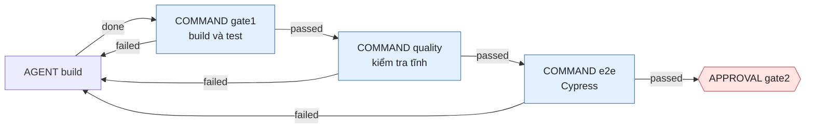

# Thêm node test e2e (Cypress) vào workflow của project

Tài liệu này hướng dẫn thêm **một node COMMAND `e2e`** vào workflow tầng task `wf-task-delivery`. Node chạy test
end-to-end bằng [Cypress](https://www.cypress.io/) trên ứng dụng todolist chạy thật (backend Spring Boot + SQLite và
frontend React/Vite). Test đỏ thì `aw` gửi lỗi của Cypress lại cho agent BUILD để sửa; test xanh thì task đi tiếp tới
cổng duyệt của người.

Tài liệu bổ sung cho [README.md](README.md) và dùng lại các khái niệm ở đó (node COMMAND mục 3.4, `failureOutcome` mục
3.2, publish mục 3.5). **Không sửa phần core engine**: mọi thay đổi chỉ là file khai báo, script và tri thức của agent
trong thư mục hướng dẫn này.

**Bố cục dùng trong tài liệu: Cypress nằm ở thư mục cấp 1 riêng `e2e/`**, ngang hàng với `backend/`, `frontend/`,
`docs/`, và có `package.json` riêng:

```text
todolist/
├── backend/            # Spring Boot + SQLite
├── frontend/           # React + Vite (không biết gì về Cypress)
├── e2e/                # Cypress
│   ├── package.json    #   devDependencies: cypress, typescript
│   ├── cypress.config.ts
│   ├── tsconfig.json
│   └── specs/*.cy.ts
└── docs/
```

> **Trạng thái kiểm chứng.** Đã chạy: `aw-publish.py --check` trên bản khai báo dựng từ chính các khối code trong tài
> liệu này (hợp lệ: 9 agent, 9 command, 6 workflow); `sh -n`; và luồng điều khiển của `e2e-test.sh` với `mvn`, `java`,
> `node`, `npm`, `npx` **giả lập** (nhánh đạt, nhánh Cypress đỏ, lỗi môi trường thiếu binary, thiếu `e2e/package.json`,
> thiếu spec, cổng bị chiếm; tiến trình backend/frontend được dọn sau mỗi lần). Đọc mã engine để xác nhận cách COMMAND nhận biến môi trường (mục 1.3).
>
> **Chưa chạy:** chưa publish lên một bản cài `aw` thật, chưa có lần chạy nào của node `e2e` với Cypress thật. Môi
> trường soạn tài liệu này chặn `download.cypress.io` và `cdn.cypress.io`, nơi Cypress tải file thực thi, nên không cài
> được binary. Mọi mục "Kỳ vọng" bên dưới là suy ra từ hành vi đã ghi trong README, không phải output thật. Khi chạy
> lần đầu trên máy có Cypress, hãy ghi lại sai khác và sửa tài liệu này.

## Mục lục

- [0. Thiết kế: node nằm ở đâu và vì sao](#0-thiết-kế-node-nằm-ở-đâu-và-vì-sao)
- [1. Chuẩn bị máy chạy worker](#1-chuẩn-bị-máy-chạy-worker)
- [2. Viết script của node: `commands/e2e-test.sh`](#2-viết-script-của-node-commandse2e-testsh)
- [3. Tri thức cho agent: Layer `layer-cypress-e2e`](#3-tri-thức-cho-agent-layer-layer-cypress-e2e)
- [4. Khai báo trong `aw-project.json`](#4-khai-báo-trong-aw-projectjson)
- [5. Thêm node vào `wf-task-delivery.json`](#5-thêm-node-vào-wf-task-deliveryjson)
- [6. (Tùy chọn) Cấm `.only` trong `quality-check.sh`](#6-tùy-chọn-cấm-only-trong-quality-checksh)
- [7. Kiểm tra và publish](#7-kiểm-tra-và-publish)
- [8. Task khởi tạo Cypress cho repository](#8-task-khởi-tạo-cypress-cho-repository)
- [9. Chạy một task thường và đọc kết quả](#9-chạy-một-task-thường-và-đọc-kết-quả)
- [10. Sự cố thường gặp](#10-sự-cố-thường-gặp)
- [11. Mở rộng](#11-mở-rộng)

---

## 0. Thiết kế: node nằm ở đâu và vì sao

Áp dụng bảng quyết định ở [README mục 3.2](README.md#32-bước-3--ánh-xạ-sang-node-của-aw):

| Câu hỏi | Quyết định | Lý do |
|---|---|---|
| Loại node | `COMMAND` có `failureOutcome` | Máy kiểm tra **sau** khi AI sửa; đỏ thì quay lại agent kèm output |
| Vì sao không phải `MACHINE_GATE` | — | Gate chạy chỉ đọc trong thư mục scratch, còn e2e phải cài `node_modules`, build jar, mở cổng mạng và ghi file tạm. Gate cũng không dùng được trên family đã có local commit ([README mục 6](README.md#6-giới-hạn-cần-biết)) |
| Vị trí | Sau `quality`, trước `gate2` | Test đơn vị (`gate1`) và kiểm tra tĩnh (`quality`) rẻ hơn nên chạy trước; e2e chậm nhất nên chạy khi các bước kia đã xanh, và trước khi người phải đọc diff |
| Đỏ thì sao | Cạnh `failed` về `build` | Dùng chung ngân sách vòng sửa `cyclePolicy` của `build` (tối đa 5 vòng, rồi `escalated` → `reject`) |
| Số lần thử | `policy-attempt-once` | Test e2e đỏ thử lại y nguyên chỉ tốn thời gian (README mục 3.4) |
| Mạng | `network: ALLOWED` + `policy-permission-network` | `npm ci` tải Cypress; bắt buộc có policy `NETWORK_ACCESS` hoặc node fail `VALIDATION_FAILED` |
| Vị trí của Cypress | Thư mục cấp 1 riêng `e2e/` | Xem bên dưới |
| Completion policy | **Không đổi** | Xem bên dưới |



**Vì sao `e2e/` tách riêng.** Probe biến mỗi thư mục cấp 1 thành một Component (README mục 2.3), nên `e2e/` là Component
thứ tư. Lợi ích: (1) `npm ci` của `frontend/` không còn tải binary Cypress, nên `frontend-test.sh` và `gate1.sh` không
đổi và không chậm đi; (2) Vitest và `tsc` của Vite không thể nạp nhầm spec hay kiểu của Cypress, vì hai gói không chung
`package.json` hay `tsconfig`; (3) một task đụng vào test e2e hiện rõ trong scope. Đổi lại có ba điều phải nhớ, được xử
lý ở các mục dưới:

- **Scope.** Task sửa giao diện **và** spec phải khai `"pathScopes": ["frontend", "e2e"]` (một mục scope, hai tiền tố;
  README mục 4.2). Spec cần sửa mà scope không có `e2e` thì agent không sửa được (`SCOPE_VIOLATION`).
- **Component phải tồn tại.** Selector `componentTags: ["e2e"]` chỉ khớp khi probe đã thấy thư mục `e2e/` (mục 8.1).
- **Máy dựng hai gói npm.** `e2e-test.sh` chạy `npm ci` ở cả `frontend/` (cho Vite) và `e2e/` (cho Cypress).

**Vì sao không đổi completion policy.** Mọi node COMMAND đều để lại evidence cùng kind `COMMAND_EXECUTION`, nên không
có kind riêng "E2E" để completion policy đòi (khác `MACHINE_GATE`, nơi mỗi tiêu chí có `evidenceKey` riêng). Tầng
`E2E` trong `requiredAssurance` chỉ kiểm tra **kind** của evidence, nên thêm vào cũng không phân biệt được e2e với
`gate1`. Việc "task chỉ xong khi e2e xanh" được đảm bảo bởi **đồ thị**: cạnh duy nhất tới `gate2` đi qua `e2e passed`.
Hệ quả: ai bỏ node `e2e` khỏi đồ thị thì không có chốt nào khác bắt lại. Rà `git diff` của workflow khi review.

**Điều script phải làm**, vì `aw` chỉ chạy một lệnh rồi nhìn mã thoát:

1. Dựng ứng dụng: backend (jar, database SQLite tạm) và frontend (Vite dev server, proxy `/api`).
2. Chờ cả hai trả lời HTTP.
3. Chạy `cypress run`, chỉ ghi file vào thư mục tạm (không làm bẩn worktree, tránh `SCOPE_VIOLATION`).
4. Dọn mọi tiến trình con khi thoát, kể cả khi lỗi.
5. In **lỗi ra stderr** (agent chỉ nhận 4 KiB cuối của stderr, README mục 3.4) và tách riêng **lỗi môi trường**.

**Lỗi môi trường khác lỗi code.** Mã thoát không phân biệt được hai loại: mọi mã khác 0 đều đi theo `failureOutcome`
về agent. Thiếu binary Cypress hay cổng bị chiếm không sửa được bằng code, và nếu để nguyên, agent sẽ tốn tới 5 vòng
vô ích. Vì vậy script in tiền tố `MÔI TRƯỜNG:` kèm lời dặn "kết thúc bằng outcome `needs_info`", và resource
`cypress.conventions` (mục 3) nhắc agent làm đúng như vậy. `build` có outcome `needs_info` nên việc này dừng run ở cổng
của người (node `needs-info`).

## 1. Chuẩn bị máy chạy worker

### 1.1 Cypress

| Cần | Chi tiết |
|---|---|
| Truy cập mạng tới npm **và tới host tải binary của Cypress** | `download.cypress.io`, `cdn.cypress.io`. Mạng chặn hai host này thì `npm ci` fail ở bước `postinstall` của Cypress. Nếu môi trường có chính sách egress, thêm hai host vào danh sách cho phép |
| Thư viện hệ thống của Linux | `xvfb` và các thư viện của Electron (GTK3, NSS, ALSA…). Cypress tự bật `xvfb` nếu có. Xem [Cypress: system requirements](https://docs.cypress.io/app/get-started/install-cypress#System-requirements). Windows và macOS không cần |
| Dung lượng | Binary cỡ vài trăm MB, tải **một lần** vào cache của user (`~/.cache/Cypress`, Windows `%LOCALAPPDATA%\Cypress\Cache`) rồi dùng lại cho mọi worktree |
| Cổng `8080` và `5173` trống | Script dựng backend và Vite ở hai cổng này, vì proxy `/api` trong `vite.config.ts` do agent viết trỏ cứng tới `8080` (Layer React) |

Kiểm tra trước khi cấu hình `aw`:

```bash
mkdir -p /tmp/cy-check && cd /tmp/cy-check
npm init -y > /dev/null && npm install cypress    # tải binary vào cache của user
npx cypress verify                                # "Verified Cypress!"
```

Làm trong thư mục tạm để không đụng vào repository; binary nằm trong cache nên dùng lại được cho `e2e/` sau này.

### 1.2 `npm ci` của Cypress chỉ chạy trong `e2e/`

Vì Cypress nằm ở `e2e/` với `package.json` riêng, `npm ci` trong `frontend/` (ở `frontend-test.sh`, `gate1.sh`) **không**
chạy `postinstall` của Cypress. Chỉ `e2e-test.sh` cài Cypress. Binary đã có trong cache thì bước này gần như tức thì;
chưa có thì lần đầu tải vài trăm MB và có thể mất vài phút. Hãy chạy `npx cypress install` một lần trên máy worker để lần
đầu không rơi vào timeout của một task.

Máy không tải được binary (ví dụ bị chặn mạng) vẫn cài được phần npm nếu đặt `CYPRESS_INSTALL_BINARY=0` cho worker; tên
biến đã nằm trong `envAllowlist` của `cmd-e2e-test` (mục 4.4). Khi đó `cypress verify` luôn fail, node `e2e` báo
`MÔI TRƯỜNG: Cypress chưa chạy được` và run dừng ở `needs-info`. Đây là cách tạm, không thay cho việc cài binary.

### 1.3 Biến môi trường của COMMAND

Script COMMAND chỉ nhận các biến có trong `envAllowlist` **của chính Command** (không bị giới hạn bởi
`aw worker --env-allowlist`; cờ đó chỉ áp cho tiến trình agent). Mặc định gồm `PATH`, `HOME`, `JAVA_HOME`,
`MAVEN_OPTS`, `JAVA_TOOL_OPTIONS`, `HTTP_PROXY`, `HTTPS_PROXY`, `NO_PROXY`. Command e2e cần thêm:

| Biến | Vì sao |
|---|---|
| `DISPLAY` | Linux có sẵn X server (không cần khi dùng `xvfb`) |
| `CYPRESS_CACHE_FOLDER` | Nếu cache binary không nằm ở vị trí mặc định |
| `CYPRESS_INSTALL_BINARY` | Chỉ khi áp dụng cách tạm ở mục 1.2 |

Biến nào được liệt kê nhưng không có trong môi trường của worker thì đơn giản là không được truyền. Trên Windows,
`aw-publish.py` tự cộng thêm các biến hệ thống (README mục 2.4).

## 2. Viết script của node: `commands/e2e-test.sh`

Tuân theo hợp đồng script COMMAND ([README mục 3.4](README.md#script-cho-node-command)): chạy ở gốc worktree,
`$1` là `run` (bỏ qua), mã thoát 0 là đạt, lỗi ra stderr, không màu.

```sh
#!/bin/sh
# COMMAND node "e2e": test end-to-end bằng Cypress trên ứng dụng chạy thật (backend + frontend).
# Chạy ở gốc worktree. Lỗi của code in ra STDERR (agent nhận 4 KiB cuối); lỗi MÔI TRƯỜNG có tiền tố "MÔI TRƯỜNG:".
set -eu
export NO_COLOR=1 CI=true
BE_PORT=8080   # backend (application.properties) và proxy của vite.config.ts cùng dùng cổng này
FE_PORT=5173   # cổng mặc định của Vite
tmp=$(mktemp -d)
pids=""
cleanup() {
  for p in $pids; do kill "$p" 2> /dev/null || true; done
  rm -rf "$tmp"
}
trap cleanup EXIT INT TERM
fail() { echo "$@" >&2; exit 1; }
env_fail() { echo "MÔI TRƯỜNG: $* — không phải lỗi code; đừng sửa code, hãy kết thúc bằng outcome needs_info và nêu rõ." >&2; exit 1; }

[ -f backend/pom.xml ] || fail "e2e: không có backend/pom.xml"
[ -f frontend/package.json ] || fail "e2e: không có frontend/package.json"
[ -f e2e/package.json ] || fail "e2e: thiếu e2e/package.json. Tạo gói Cypress trong e2e/ theo resource cypress.conventions."
ls e2e/cypress.config.* > /dev/null 2>&1 \
  || fail "e2e: thiếu e2e/cypress.config.ts. Thêm cấu hình Cypress theo resource cypress.conventions."
ls e2e/specs/*.cy.* > /dev/null 2>&1 \
  || fail "e2e: thiếu spec trong e2e/specs/ (đặt tên *.cy.ts)."
for port in "$BE_PORT" "$FE_PORT"; do
  if curl -s -o /dev/null --max-time 2 "http://127.0.0.1:$port/"; then
    env_fail "cổng $port đang bị tiến trình khác dùng"
  fi
done

step() {  # step <tên> <lệnh…>: hỏng thì in 40 dòng cuối ra stderr
  name=$1; shift
  log="$tmp/step.log"
  if "$@" > "$log" 2>&1; then return 0; fi
  echo "e2e: bước '$name' không đạt" >&2
  tail -n 40 "$log" | cut -c1-300 >&2
  exit 1
}
wait_http() {  # wait_http <url> <tên> <log>: tối đa 120 giây
  i=0
  until curl -s -o /dev/null --max-time 2 "$1"; do
    i=$((i + 1))
    if [ "$i" -gt 120 ]; then
      echo "e2e: $2 không lên sau 120 giây" >&2
      tail -n 40 "$3" | cut -c1-300 >&2
      exit 1
    fi
    sleep 1
  done
}

# 1. Backend: đóng gói jar rồi chạy với database SQLite tạm (không đụng backend/data/).
step "mvn package" sh -c 'cd backend && mvn -B -q -DskipTests package'
jar=$(ls backend/target/*.jar | grep -v -E 'original|sources' | head -n 1)
SPRING_DATASOURCE_URL="jdbc:sqlite:$tmp/e2e.db" java -jar "$jar" --server.port="$BE_PORT" > "$tmp/backend.log" 2>&1 &
pids="$pids $!"
# 2. Cài dependency của frontend (cho Vite) và của e2e (cho Cypress), rồi chạy Vite dev server (proxy /api sang backend).
install() {  # install <thư mục>: npm ci nếu có lockfile, không thì npm install
  if [ -f "$1/package-lock.json" ]; then
    step "npm ci ($1)" sh -c 'cd "$0" && npm ci --no-audit --no-fund' "$1"
  else
    step "npm install ($1)" sh -c 'cd "$0" && npm install --no-audit --no-fund' "$1"
  fi
}
install frontend
install e2e
(cd frontend && exec node node_modules/vite/bin/vite.js --port "$FE_PORT" --strictPort --host 127.0.0.1) > "$tmp/frontend.log" 2>&1 &
pids="$pids $!"
wait_http "http://127.0.0.1:$BE_PORT/api/todos" "backend" "$tmp/backend.log"
wait_http "http://127.0.0.1:$FE_PORT/" "frontend" "$tmp/frontend.log"

# 3. Cypress chỉ ghi vào thư mục tạm, không ghi vào worktree.
(cd e2e && npx cypress verify) > "$tmp/verify.log" 2>&1 \
  || { tail -n 15 "$tmp/verify.log" | cut -c1-300 >&2; env_fail "Cypress chưa chạy được trên máy này (thiếu binary hoặc xvfb)"; }
log="$tmp/cypress.log"
if (cd e2e && npx cypress run --config "baseUrl=http://127.0.0.1:$FE_PORT,video=false,screenshotsFolder=$tmp/shots,downloadsFolder=$tmp/dl,trashAssetsBeforeRuns=false") > "$log" 2>&1; then
  echo "e2e: Cypress PASS"
  exit 0
fi
echo "e2e: Cypress không đạt" >&2
{ sed -n '/^ *[0-9][0-9]* failing/,$p' "$log" | head -n 45; } | cut -c1-200 | grep . >&2 || tail -n 40 "$log" | cut -c1-200 >&2
exit 1
```

Giải thích những chỗ không hiển nhiên:

- **`exec node node_modules/vite/bin/vite.js`** thay cho `npm run dev`. `npm` sinh thêm tiến trình con mà `kill` ở cuối
  không dọn được; gọi thẳng `node` thì `$!` là chính tiến trình Vite. Với backend, `java -jar` cũng là một tiến trình
  duy nhất (jar do `spring-boot-maven-plugin` đóng gói thành jar chạy được).
- **`SPRING_DATASOURCE_URL`** ghi đè `spring.datasource.url` trong `application.properties` (quy tắc relaxed binding của
  Spring Boot), nên e2e chạy trên database tạm và không thể làm hỏng `backend/data/todolist.db` của người dùng.
- **Cổng bị chiếm là lỗi môi trường**, vì nếu tiến trình khác đang ở `8080`, Cypress sẽ test nhầm ứng dụng đó.
- **Cypress ghi vào `$tmp`** (`screenshotsFolder`, `downloadsFolder`, `video=false`): thư mục `e2e/cypress/screenshots`
  trong worktree sẽ bị tính là thay đổi ngoài scope hoặc làm `quality` bẩn. `trashAssetsBeforeRuns=false` để Cypress không
  xóa gì trong worktree.
- **Thứ tự thông báo lỗi**: Cypress in phần `N failing` ngay trước bảng tóm tắt dài; script cắt từ dòng đó, giữ dưới
  4 KiB để vừa phần stderr agent nhận.
- **Windows.** Script chỉ dùng `sh`, `curl`, `sed`, `grep`, `java`, `node`, `npx` có trong Git Bash và công cụ đã cài,
  nên `aw-publish.py` bọc thành `.cmd` như mọi script khác. Việc dọn tiến trình bằng `kill` trong Git Bash **chưa được
  kiểm chứng**; nếu tiến trình `java` còn sống sau run, hãy xem mục 10.

Cấp quyền chạy và kiểm tra cú pháp:

```bash
chmod +x commands/e2e-test.sh
sh -n commands/e2e-test.sh && echo ok
```

## 3. Tri thức cho agent: Layer `layer-cypress-e2e`

Agent không chạy được lệnh (README mục 1.3) nên không tự thử Cypress. Nó chỉ biết e2e cần gì qua resource, nên resource
phải nói rõ: spec nằm đâu, đặt tên thế nào, ứng dụng được dựng ra sao, khi nào *không* sửa code, và khi nào cần xin mở
rộng scope.

Tạo `definitions/layers/layer-cypress-e2e.json`:

```json
{
  "resources": [
    {
      "key": "cypress.conventions",
      "priority": "REQUIRED_PROCEDURE",
      "selector": {"componentTags": ["frontend", "e2e"], "blockKinds": ["MAKER"]},
      "convention": "Test end-to-end dùng Cypress, nằm trong thư mục riêng e2e/ (gói npm riêng, không nằm trong frontend/ hay backend/). Cấu hình: e2e/package.json (devDependencies cypress và typescript, script 'e2e' = 'cypress run'), e2e/cypress.config.ts (defineConfig, e2e.specPattern 'specs/**/*.cy.ts', supportFile false, video false), e2e/tsconfig.json (types: [\"cypress\"]). baseUrl do workflow truyền khi chạy nên không hard-code cổng khác 5173. Spec: e2e/specs/<tên>.cy.ts, mỗi file một luồng người dùng (thêm, hoàn thành, xóa, lọc). Frontend không import gì từ e2e/ và e2e/ không import code của frontend/. Đây là e2e thật: KHÔNG dùng cy.intercept để giả lập backend. Chọn phần tử bằng thuộc tính data-testid (ví dụ [data-testid=new-todo]); thêm data-testid vào component khi cần, không chọn theo class CSS hay theo văn bản. Mỗi test độc lập: trong beforeEach xóa dữ liệu qua cy.request('DELETE', '/api/todos/<id>') cho từng todo lấy từ cy.request('/api/todos'), rồi cy.visit('/'). Không dùng cy.wait(<số mili giây>); chờ bằng assertion (should). Không dùng .only hay .skip. Khi bạn đổi giao diện làm spec cũ sai (đổi data-testid, đổi luồng), phải sửa spec trong e2e/ cùng task; nếu scope của task không có e2e/ thì kết thúc bằng outcome needs_info và nói rõ cần mở rộng scope. Bước e2e của workflow tự dựng backend (cổng 8080, database SQLite tạm) và Vite (cổng 5173) rồi chạy `cypress run`; bạn không cần và không thể chạy chúng. Khi bước e2e đỏ, checkFailures.why là phần `failing` của Cypress: sửa đúng chỗ đó (code ứng dụng nếu hành vi sai, spec nếu spec sai). Nếu checkFailures.why bắt đầu bằng 'MÔI TRƯỜNG:' thì đó là lỗi của máy chạy, không phải lỗi code: đừng sửa gì, kết thúc bằng outcome needs_info và chép nguyên thông báo vào câu hỏi.",
      "provenance": {"owner": "team-frontend", "source": "docs/guides/todolist-spring-react/add-e2e-cypress-node.md", "revision": "v1", "lastVerified": "2026-10-06T00:00:00Z"}
    }
  ]
}
```

Lưu ý:

- **Selector.** `componentTags: ["frontend", "e2e"]` khớp khi scope của task chạm **một trong hai** Component; cùng
  `blockKinds: ["MAKER"]` nghĩa là chỉ agent làm việc (không phải reviewer) nhận. Task chỉ backend không nhận resource
  này. Có `frontend` trong danh sách vì task sửa giao diện làm bước `e2e` đỏ cần quy ước này để sửa, dù scope của nó
  chưa có `e2e/`. Nó cũng giúp resource vẫn được nạp nếu Component `e2e` chưa được probe thấy (mục 8.1).
- **Priority** `REQUIRED_PROCEDURE`, không phải `HARD_CONSTRAINT`: đây là quy trình, không phải điều tuyệt đối. Giữ
  `HARD_CONSTRAINT` ít (README mục 3.3).
- **`lastVerified` và `revision`**: cập nhật `lastVerified` mỗi khi rà lại, nếu không `aw-publish.py` cảnh báo sau
  180 ngày.
- **Dung lượng**: resource này thêm khoảng 2 KB vào prompt, và tính bằng byte nên tiếng Việt tốn hơn số ký tự.
  `contextBudgetBytes` mặc định 65536 vẫn còn dư.

## 4. Khai báo trong `aw-project.json`

Bốn chỗ sửa. Mọi `id` ghi **không có tiền tố** (`prefix` `todo-` được ghép khi publish).

**4.1. Layer mới** (thêm vào mảng `layers`):

```json
{"id": "layer-cypress-e2e", "name": "Layer: Cypress E2E", "file": "definitions/layers/layer-cypress-e2e.json"}
```

**4.2. Script mới** (thêm vào `files` của `scriptSkills[0]`):

```json
"commands/e2e-test.sh"
```

**4.3. Agent nhận Layer.** Một resource chỉ vào prompt khi nó nằm trong danh sách của agent **và** selector khớp
(README mục 1.3). Thêm `"layer-cypress-e2e"` ngay sau `"layer-react-vite"` ở ba agent:

| Agent | Vì sao |
|---|---|
| `agent-flow-build` | Agent chính của `wf-task-delivery`: viết spec và nhận lỗi từ node `e2e` |
| `agent-flow-plan` | Lập kế hoạch có tính tới spec e2e |
| `agent-dev` | Task khởi tạo ở mục 8 chạy bằng `wf-frontend-feature` |

Ví dụ `agent-flow-build` sau khi sửa:

```json
{"id": "agent-flow-build", "name": "Agent: BUILD",
 "resources": ["skill-feature-flow#flow.working-rules", "skill-feature-flow#flow.needs-info", "skill-feature-flow#flow.build",
               "layer-java-spring-boot", "layer-sqlite", "layer-react-vite", "layer-cypress-e2e",
               "skill-todolist-dev#dev.definition-of-done", "skill-todolist-dev#dev.high-risk-extra"]}
```

**4.4. Command mới** (thêm vào mảng `commands`):

```json
{"id": "cmd-e2e-test", "name": "Command: e2e Cypress", "script": "scripts#e2e-test.sh",
 "network": "ALLOWED", "policies": ["policy-permission-network"], "timeoutSeconds": 1500,
 "envAllowlist": ["PATH", "HOME", "JAVA_HOME", "MAVEN_OPTS", "JAVA_TOOL_OPTIONS", "HTTP_PROXY", "HTTPS_PROXY", "NO_PROXY",
                  "DISPLAY", "CYPRESS_CACHE_FOLDER", "CYPRESS_INSTALL_BINARY"]}
```

- `network: ALLOWED` kèm `policy-permission-network` là bắt buộc (mục 0). `aw-publish.py --check` bắt lỗi nếu thiếu.
- `timeoutSeconds: 1500` (25 phút) nhỏ hơn `timeoutSeconds` 1800 của `policy-attempt-once`. Ước lượng: build jar vài chục
  giây, `npm ci` vài chục giây, Cypress vài phút. Tăng nếu bộ spec lớn lên.
- `envAllowlist` **thay thế** danh sách mặc định, không cộng thêm, nên phải chép lại các tên mặc định (mục 1.3).

**Không thêm Pack.** Pack chỉ để ghi nhận và hiển thị, không ảnh hưởng prompt (README mục 1.3), và Component `e2e` chỉ có
sau khi repository có thư mục `e2e/`. Nếu muốn có, thêm sau mục 8 một Pack `pack-e2e` (`include`: `layer-cypress-e2e`,
`assignTo`: `["e2e"]`).

Không cần sửa `gates`, `policies` hay `workflows`: workflow `wf-task-delivery` đã được khai báo, node mới được thêm vào
file template ở mục 5. Agent `agent-reviewer` không cần Layer này vì selector của nó chỉ nhận `MAKER`.

## 5. Thêm node vào `wf-task-delivery.json`

Hai thay đổi trong `definitions/workflows/wf-task-delivery.json`.

**5.1. Thêm node**, ngay sau node `quality` trong mảng `nodes`:

```json
{"key": "e2e", "type": "COMMAND", "outcomes": ["passed", "failed"],
 "command": {"commandRef": {"$ref": "command:cmd-e2e-test"},
             "policyRefs": [{"$ref": "policy:policy-attempt-once"}, {"$ref": "policy:policy-permission"}],
             "failureOutcome": "failed"}}
```

**5.2. Nối lại cạnh.** Mỗi outcome phải có đúng một cạnh đi ra. Hiện cạnh `quality passed` đi thẳng `gate2`. Thay nó
bằng ba cạnh:

```diff
-    {"key": "quality-gate2", "from": "quality", "outcome": "passed", "to": "gate2"},
     {"key": "quality-build", "from": "quality", "outcome": "failed", "to": "build"},
+    {"key": "quality-e2e", "from": "quality", "outcome": "passed", "to": "e2e"},
+    {"key": "e2e-gate2", "from": "e2e", "outcome": "passed", "to": "gate2"},
+    {"key": "e2e-build", "from": "e2e", "outcome": "failed", "to": "build"},
```

Không cần `cyclePolicy` cho `e2e`: vòng `e2e → build → … → e2e` đã bị chặn bởi `cyclePolicy` của `build`
(`maxIterations: 5`, README mục 3.6). `completionPolicyRef` giữ nguyên `policy-completion-reviewed`.

**Hệ quả cho các task đang có.** WorkItem **pin** workflow version (README mục 6): task tạo trước khi publish vẫn chạy
workflow cũ không có `e2e`. Chỉ task tạo sau đó mới có node này.

**Hệ quả cho repository chưa có Cypress.** Từ lúc publish, *mọi* task chạy bằng `wf-task-delivery` sẽ dừng ở `e2e` với
thông báo "thiếu e2e/package.json", kể cả task chỉ sửa backend. Đây là chủ ý (đã có node `e2e` nghĩa là dự án
đòi e2e), nên làm mục 8 **trước khi** giao task tầng này, hoặc publish sau khi xong mục 8.

## 6. (Tùy chọn) Cấm `.only` trong `quality-check.sh`

`it.only(...)` của Cypress (và Vitest) làm mọi test khác trong file bị bỏ qua mà run vẫn xanh. `quality-check.sh` hiện chỉ
tìm `.skip` và chỉ trong `backend/src`, `frontend/src`. Sửa hai chỗ trong vòng lặp đầu của
[`commands/quality-check.sh`](commands/quality-check.sh):

```diff
-for dir in backend/src frontend/src; do
+for dir in backend/src frontend/src e2e/specs; do
   [ -d "$dir" ] || continue
-  files=$(grep -rIlE '@Disabled|(^|[^A-Za-z_])(it|test|describe)\.skip\(' "$dir" 2>/dev/null || true)
+  files=$(grep -rIlE '@Disabled|(^|[^A-Za-z_])(it|test|describe|context)\.(skip|only)\(' "$dir" 2>/dev/null || true)
   if [ -n "$files" ]; then
-    echo "TEST BỊ TẮT (@Disabled hoặc .skip): bật lại hoặc xóa hẳn kèm lý do, không tắt để cho qua." >&2
+    echo "TEST BỊ TẮT (@Disabled, .skip hoặc .only): bật lại hoặc xóa hẳn kèm lý do, không tắt để cho qua." >&2
```

Chỉ quét `e2e/specs`, không quét cả `e2e/`: `grep -r` sẽ đi vào `e2e/node_modules` và có thể báo nhầm trên mã của thư viện.
`quality-gate.sh` (tiêu chí `NO_DISABLED_TESTS` của `wf-main-check`) có cùng biểu thức; sửa tương tự nếu muốn nhánh
chính cũng bị kiểm tra. Hai script này đứng trong `scriptSkills` nên `aw-publish.py` tự tạo version mới cho chúng.

## 7. Kiểm tra và publish

```bash
cd ~/aw/todolist                                   # thư mục có aw-state.json
aw-publish.py "$GUIDE/aw-project.json" --check
# OK: …/aw-project.json hợp lệ (9 agent, 9 command, 6 workflow)
```

Đã thử cố ý ba lỗi hay gặp khi thêm node, `--check` bắt đủ cả ba:

```text
commands/cmd-e2e-test: network ALLOWED cần một PERMISSION policy cấp NETWORK_ACCESS trong 'policies'
workflows/wf-task-delivery: node 'e2e' có outcome 'failed' nhưng không có edge
workflows/wf-task-delivery: $ref 'command:cmd-e2e-typo' không giải quyết được
```

Nếu `--check` báo `agents/…: … không có resource …`, kiểm tra `key` trong Layer và tên trong `resources` của agent.

Rồi publish:

```bash
aw-publish.py "$GUIDE/aw-project.json"
```

**Kỳ vọng** (suy ra từ README mục 3.5, chưa chạy thật): chỉ những thứ phụ thuộc vào file đã đổi lên version mới:

- Layer mới `todo-layer-cypress-e2e`, script skill `scripts` (có thêm `e2e-test.sh`), Command `todo-cmd-e2e-test`;
- các agent `agent-flow-build`, `agent-flow-plan`, `agent-dev`;
- Workflow `wf-task-delivery` và mọi workflow dùng các agent trên (`wf-backend-feature`, `wf-frontend-feature`,
  `wf-fullstack-review`). `wf-main-check` giữ nguyên version trừ khi đã sửa `quality-gate.sh`.

So sánh version workflow để chắc chắn chỉ node `e2e` thay đổi ([README mục 5.2](README.md#52-so-sánh-version)):

```bash
P=$(jq -r .projectId aw-state.json)
aw definition versions --kind WORKFLOW --project-id "$P" todo-wf-task-delivery
aw version diff --project-id "$P" <versionIdCũ> <versionIdMới> \
  | jq -r '.sourceDiff[] | select(.op != "equal") | "\(.op)\t\(.text)"'
```

Diff chỉ nên có node `e2e` và ba cạnh ở mục 5.2. Mở UI **Definitions** của project để xem graph có thêm node `e2e` giữa
`quality` và `gate2`.

## 8. Task khởi tạo Cypress cho repository

Node `e2e` cần `e2e/package.json`, `e2e/cypress.config.ts` và ít nhất một spec. Hãy để agent thêm chúng bằng một task
**không đi qua node `e2e`**: dùng workflow rút gọn `wf-frontend-feature`. Bước kiểm tra của nó (`frontend-test.sh`) chỉ
chạy trong `frontend/`, nên **không kiểm tra gì trong `e2e/`**; vì vậy bước chạy tay ở 8.3 là bắt buộc.

### 8.1 Tạo thư mục `e2e/` để Component được probe thấy

Git không lưu thư mục rỗng, và Component chỉ được tạo khi probe thấy thư mục cấp 1. Với **project mới**, thêm `e2e/` vào
repository trước khi `init-project.sh` (mục 2.3 của README):

```bash
cd ~/work/todolist
mkdir -p e2e && echo "# E2E (Cypress)" > e2e/README.md
git add -A && git commit -m "Thêm thư mục e2e"
```

Với repository **đã đăng ký**, làm như trên rồi kiểm tra:

```bash
aw component list "$(jq -r .projectId aw-state.json)"      # phải có dòng component e2e (e2e)
```

Chưa thấy `e2e` thì thử probe lại (`aw repository retry-probe`, README operations mục 5.8). **Chưa kiểm chứng** rằng probe
lại sẽ phát hiện thư mục mới trên repository đã `ACTIVE`; nếu không được, đăng ký repository với `repositoryId` mới. Dù
Component `e2e` chưa có, task ở 8.2 vẫn nhận Layer qua tag `frontend` (mục 3), chỉ resource selector theo `e2e` là chưa
khớp.

### 8.2 Task

Tạo `work-items/fe-03-e2e-cypress.json`. Scope có **hai** tiền tố: `e2e` cho Cypress, `frontend` để thêm `data-testid`:

```json
{
  "title": "FE-03: Khung test e2e Cypress cho todolist",
  "parentJoinPolicy": "ALL_CHILDREN_DONE",
  "effectiveScope": [
    {"repositoryId": "todolist", "access": "WRITE", "reason": "Cypress trong e2e/, data-testid trong frontend/", "pathScopes": ["e2e", "frontend"]}
  ],
  "contract": {
    "schemaVersion": 1,
    "behavior": "Thêm test end-to-end bằng Cypress vào thư mục riêng e2e/ theo resource cypress.conventions: e2e/package.json (devDependencies cypress và typescript, script 'e2e' = 'cypress run'), package-lock.json, e2e/cypress.config.ts, e2e/tsconfig.json và e2e/specs/todos.cy.ts có hai luồng: (1) thêm một todo rồi thấy nó trong danh sách; (2) đánh dấu hoàn thành rồi xóa nó. Thêm data-testid cần thiết vào component của frontend (new-todo, add-todo, todo-item, todo-toggle, todo-delete). Không đổi hành vi của ứng dụng và không thêm cypress vào frontend/package.json.",
    "verificationSpec": "COMMAND node verify chạy `npm ci && npm test && npm run build` trong frontend/ và phải thoát với mã 0. Node này không chạy gì trong e2e/: gói Cypress được kiểm tra bằng tay (`sh commands/e2e-test.sh run` trong worktree) trước khi commit.",
    "riskLevel": "MEDIUM",
    "acceptanceCriteria": [
      {"description": "e2e/package.json có cypress trong devDependencies và script 'e2e'; e2e/package-lock.json tồn tại; frontend/package.json không có cypress", "verificationRef": "COMMAND_EXECUTION"},
      {"description": "e2e/cypress.config.ts, e2e/tsconfig.json và e2e/specs/todos.cy.ts tồn tại theo quy ước", "verificationRef": "COMMAND_EXECUTION"},
      {"description": "Spec dùng data-testid, không dùng cy.intercept, cy.wait(<ms>), .only hay .skip", "verificationRef": "COMMAND_EXECUTION"},
      {"description": "npm test và npm run build trong frontend/ vẫn pass với các data-testid mới", "verificationRef": "COMMAND_EXECUTION"}
    ],
    "workflowVersionId": "WORKFLOW_VERSION_ID"
  }
}
```

### 8.3 Chạy, review, chạy tay node e2e, commit

```bash
create-root.sh "FE-03: e2e Cypress"
run-task.sh "$GUIDE/work-items/fe-03-e2e-cypress.json" wf-frontend-feature
WT=$(worktree-path.sh)
git -C "$WT" status --porcelain && git -C "$WT" diff       # review (README mục 4.5)
(cd "$WT" && sh "$GUIDE/commands/e2e-test.sh" run)         # chạy node e2e trên thay đổi của agent
```

Chạy tay là cách chắc chắn nhất để bắt sai sót của spec mà agent không tự chạy được. Nếu `e2e-test.sh` đỏ, **chưa
commit**: gửi phản hồi và chạy lại (`retry-task.sh <workItemId> "<lỗi Cypress>"`). Xanh thì:

```bash
commit-task.sh "FE-03: khung test e2e Cypress"
```

Sau đó merge branch `agentkit/w-…` vào `main` (README mục 4.9) và tạo gốc mới (`create-root.sh`) cho các task tiếp theo, vì
worktree mới tách từ `main` mới có `e2e/`.

**Lệnh dọn khi `rejected`.** README mục 4.4 dọn worktree bằng `git clean -fd -- backend frontend`. Từ khi có `e2e/`, thêm
`e2e` vào danh sách đó (không dọn `e2e/node_modules`, đã bị `.gitignore`).

**Task thường về sau.** Task nào đổi giao diện phải khai `"pathScopes": ["frontend", "e2e"]` để agent sửa được spec; task
chỉ backend không cần `e2e`. Khi bước DESIGN chia task (`tasks.json`), nhắc agent DESIGN ghi `e2e` vào scope của task
có đổi giao diện.

## 9. Chạy một task thường và đọc kết quả

```bash
create-root.sh "Tính năng: …"
run-task.sh tasks/<feature>/T-01.json wf-task-delivery
```

**Kỳ vọng** (chưa chạy thật): timeline có thêm một dòng `e2e` giữa `quality` và `gate2`:

```text
  #4 gate1 (vòng 0): SUCCEEDED passed
  #5 quality (vòng 0): SUCCEEDED passed
  #6 e2e (vòng 0): SUCCEEDED passed
  #7 gate2 (vòng 0): WAITING
```

Khi e2e đỏ, dòng là `e2e … SUCCEEDED failed` (bước kiểm tra chạy xong, kết quả "không đạt"; README mục 4.3), rồi
`build (vòng n+1)`. Để biết agent nhận gì:

```bash
agent-log.py <runId> --node build        # lời của agent ở vòng sau
```

và trong ContextSnapshot của `build` vòng đó, phần `checkFailures.why` là đoạn `failing` của Cypress (xem
[operations.md mục 2](operations.md#2-message-và-context-của-agent)). Đọc evidence của node `e2e` (kể cả lần đỏ) ở
[operations.md mục 3](operations.md#3-evidence-và-artifact): `COMMAND_EXECUTION` chứa mã thoát, stdout và stderr.

Kiểm tra agent có nhận Layer mới (như README mục 3.3):

```bash
snap=$(aw run timeline <runId> | jq -r '[.entries[] | select(.kind=="EXECUTION_ATTEMPT" and .nodeKey=="build")][0].contextSnapshotId')
aw context-snapshot show --project-id "$(jq -r .projectId aw-state.json)" <workItemId> "$snap" | jq -c '[.resourceRefs[].resourceKey]'
```

Danh sách phải có `cypress.conventions` với task chạm `frontend/` hoặc `e2e/`, và **không** có với task chỉ có scope `backend`.

## 10. Sự cố thường gặp

| Hiện tượng | Nguyên nhân | Xử lý |
|---|---|---|
| `e2e: thiếu e2e/package.json` (hoặc `thiếu e2e/cypress.config.ts`, `thiếu spec trong e2e/specs/`) | Repository chưa có gói Cypress, hoặc worktree tách từ `main` cũ | Làm mục 8; tạo gốc mới sau khi merge |
| `MÔI TRƯỜNG: Cypress chưa chạy được` | Chưa cài binary (mạng chặn host tải, chưa chạy `cypress install`), hoặc thiếu `xvfb`/thư viện Linux | Mục 1.1. Agent kết thúc `needs_info`; sửa máy rồi `review-task.sh <runId> provided "đã cài"` |
| `MÔI TRƯỜNG: cổng 8080 đang bị tiến trình khác dùng` | Bạn đang chạy `mvn spring-boot:run`, hoặc run e2e khác chạy song song | Tắt tiến trình đó. Hai run e2e không chạy song song được vì cổng cố định |
| `npm ci` fail ở `postinstall` của Cypress (chỉ ở bước `e2e`) | Không tải được binary | Mục 1.2 |
| `e2e: backend không lên sau 120 giây` | Backend lỗi khi khởi động (ví dụ Flyway) | stderr kèm 40 dòng cuối `backend.log`; sửa code backend |
| `e2e: bước 'mvn package' không đạt` | Lỗi biên dịch | Như mọi lỗi build; agent sửa |
| Spec xanh trên máy bạn, đỏ trong run | Dữ liệu còn sót giữa các test, hoặc spec phụ thuộc thứ tự | Spec phải tự dọn trong `beforeEach` (mục 3) |
| Run `FAILED` với `SCOPE_VIOLATION` sau node e2e | Cypress ghi vào worktree (`e2e/cypress/screenshots`, `e2e/cypress/videos`) | Script đã trỏ các thư mục đó vào `$tmp`; kiểm tra spec hoặc config không đặt đường dẫn riêng. Thêm `e2e/cypress/` vào `.gitignore` làm lớp phòng thủ thứ hai |
| Agent sửa spec trong `e2e/` rồi `SCOPE_VIOLATION` | Scope của task chỉ có `frontend` | Khai `pathScopes: ["frontend", "e2e"]` khi tạo task; hoặc mở rộng scope (operations.md) cho task đang chạy |
| `java` hoặc `node` còn chạy sau khi run xong, cổng bị giữ | `trap` không dọn được (kill cứng worker, hoặc Git Bash trên Windows không kill được tiến trình gốc Windows) | `pkill -f todolist` hoặc `taskkill /F /IM java.exe` rồi chạy lại. Báo lại để sửa script |
| Task chỉ backend cũng dừng ở e2e | Mọi task của `wf-task-delivery` đều đi qua `e2e` | Dùng workflow rút gọn `wf-backend-feature` cho task backend, hoặc xem mục 11 |
| `e2e` quá chậm | Cypress chạy cả bộ spec mỗi task | Mục 11 (chạy một phần) |

## 11. Mở rộng

- **Dùng ở workflow khác.** Trong `wf-fullstack-review`, thêm node `e2e` y hệt giữa `frontend-test` và `ai-review`, với
  cạnh `passed → ai-review` và `failed → implement` (agent `implement` có sẵn `cyclePolicy`). Chỉ cần sửa file workflow
  vì Command, script và Layer đã có.
- **Chỉ chạy e2e cho task có đổi code ứng dụng.** `gate1.sh` đã có mẫu: kiểm tra `git status --porcelain -- frontend`. Thêm
  vào đầu `e2e-test.sh`: nếu không có thay đổi trong `frontend/`, `backend/` hoặc `e2e/` thì `echo "e2e: SKIP"; exit 0`.
  Đổi lại là task chỉ sửa tài liệu không tốn thời gian e2e. Cân nhắc kỹ: bỏ qua e2e khi chỉ `backend/` đổi sẽ bỏ lọt lỗi
  tích hợp ở API.
- **Thêm e2e vào kiểm tra nhánh chính.** `wf-main-check` chạy chỉ đọc; e2e ghi `node_modules` nên không dùng được làm
  `MACHINE_GATE`. Cách phù hợp là để CI chạy Cypress rồi gửi tín hiệu `ci-green` (README mục 4.9).
- **Cổng khác `8080`/`5173`.** Hai cổng là hằng số ở đầu `e2e-test.sh` và proxy trong `vite.config.ts`. Đổi cổng phải đổi
  cả hai (và resource `react.api-client` mô tả cổng 8080), nên chỉ làm khi thật sự cần.
- **Trình duyệt khác.** Thêm `--browser chrome` vào lệnh `cypress run` nếu máy worker có Chrome. Mặc định dùng Electron
  đi kèm Cypress, không cần cài gì thêm.
