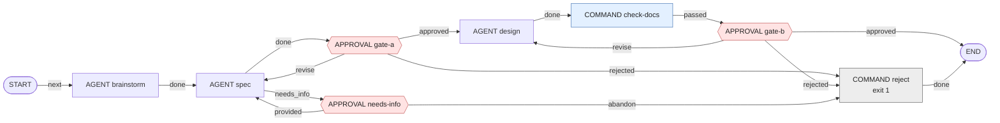
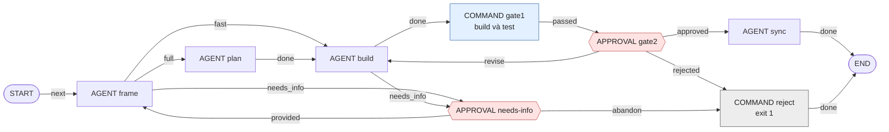
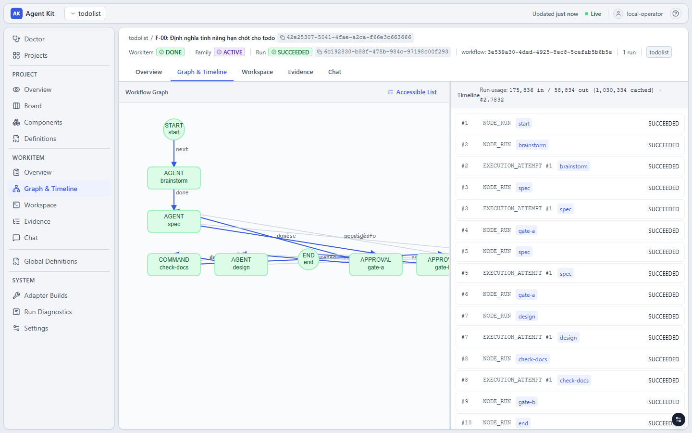
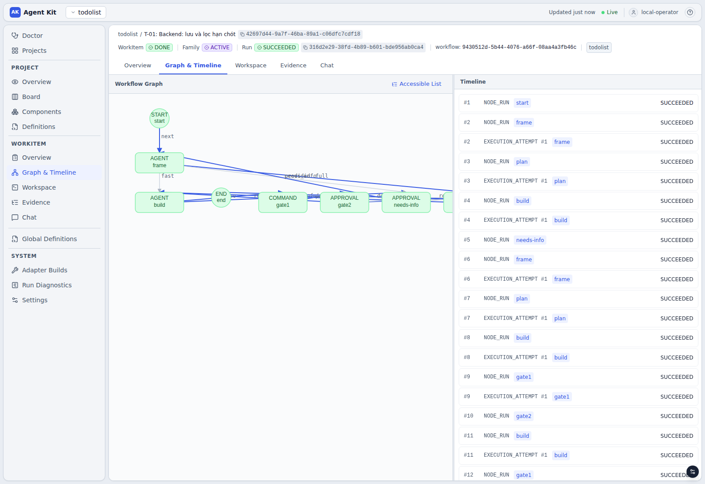

# Chạy thử quy trình hai tầng TÍNH NĂNG → TASK cho todolist

Tài liệu này đi kèm [README](README.md) và đi sâu vào ví dụ chính của nó: quy trình nghiệp vụ của todolist
([README 3.1](README.md#31-bước-2--mô-tả-quy-trình-nghiệp-vụ)) được ánh xạ thành hai workflow
([README 3.2](README.md#32-bước-3--ánh-xạ-sang-node-của-aw)):

- **tầng tính năng:** INTAKE → BRAINSTORM → SPEC → GATE A → DESIGN → GATE B → chia task;
- **tầng task:** FRAME → fast lane? → PLAN → BUILD → GATE 1 → GATE 2 → SYNC → DONE;
- nhánh NEEDS_INFO ở cả hai tầng.

Ở đây có bốn phần: lý do của những chỗ phải thiết kế khác sơ đồ nghiệp vụ, bảng định tuyến context theo node,
transcript chạy thật, và các biến thể.

Điều kiện trước: đã làm xong [README Phần 2](README.md#2-bước-1--chuẩn-bị-môi-trường-và-repository) (repository tạo
từ `repo-template/`, `aw serve`/`aw worker`, `init-project.sh`) và đã chạy `aw-publish.py aw-project.json`
([README 3.5](README.md#35-bước-6--khai-báo-và-publish)). File khai báo đó publish cả hai workflow cùng 7 agent của
quy trình.

> **Phạm vi kiểm chứng.** Cả hai workflow đã được publish và chạy thật với binary `aw` (commit `7d0fb4c`), Maven và
> npm thật, cùng một agent giả lập theo giai đoạn (nói đúng giao thức stream-json và marker outcome). Các nhánh đã
> chạy:
> - NEEDS_INFO ở SPEC và ở BUILD;
> - `revise` ở GATE A và GATE 2;
> - `approved` ở mọi cổng, `rejected` ở GATE 2;
> - lane `fast` và `full`;
> - GATE 1 pass, GATE 1 fail, và chạy lại sau khi GATE 1 fail.
>
> **Chưa kiểm chứng với Claude CLI thật:** việc Claude in đúng marker outcome và Stop hook của Claude Code (mục 2.2)
> là cấu hình khuyến nghị, chưa có transcript chạy thật.

## Mục lục

- [1. Hai workflow](#1-hai-workflow)
- [2. Những chỗ phải thiết kế khác sơ đồ nghiệp vụ](#2-những-chỗ-phải-thiết-kế-khác-sơ-đồ-nghiệp-vụ)
- [3. Bảng định tuyến context theo node](#3-bảng-định-tuyến-context-theo-node)
- [4. Chạy](#4-chạy)
- [5. Biến thể](#5-biến-thể)
- [6. Giới hạn cần biết](#6-giới-hạn-cần-biết)
- [7. Các file](#7-các-file)

---

## 1. Hai workflow

Một tính năng là một **WorkItem gốc**: một TaskFamily, một worktree, một branch. Dưới gốc đó có các WorkItem con:

- WorkItem con `F-00` chạy tầng tính năng;
- mỗi task là một WorkItem con chạy tầng task.

### 1.1 Tầng tính năng — [`wf-feature-definition.json`](definitions/workflows/wf-feature-definition.json)



Completion: [`policy-completion-feature`](definitions/policies/policy-completion-feature.json). Policy này cần
`STATIC` (evidence `COMMAND_EXECUTION` của `check-docs`) và `HUMAN` (người có role `operator` đã quyết định).

### 1.2 Tầng task — [`wf-task-delivery.json`](definitions/workflows/wf-task-delivery.json)



Completion: [`policy-completion-reviewed`](definitions/policies/policy-completion-reviewed.json). Policy này cần
`UNIT` (evidence `COMMAND_EXECUTION` của `gate1`) và `HUMAN`.

Mọi node APPROVAL có `cyclePolicy: {maxIterations: 3, escalationOutcome: rejected|abandon}`. Quá 3 vòng sửa (hoặc 3
lần NEEDS_INFO) thì node tự đi nhánh `reject`. Hết hạn 7 ngày không ai quyết định cũng vậy. Engine chỉ cho publish khi
mọi vòng lặp có giới hạn như thế.

## 2. Những chỗ phải thiết kế khác sơ đồ nghiệp vụ

| Trong sơ đồ nghiệp vụ | Trong `aw` | Mức hỗ trợ |
|---|---|---|
| "Fast lane?" | Node FRAME tự chọn outcome `fast` / `full` / `needs_info` bằng marker | **Điều chỉnh** (2.1) |
| GATE 1 "fail → BUILD" | `COMMAND gate1` làm cổng chính thức, cộng vòng lặp trong BUILD bằng Stop hook | **Điều chỉnh** (2.2) |
| NEEDS_INFO, "đã bổ sung → FRAME" | `APPROVAL needs-info` (`provided` / `abandon`); ở tầng tính năng thì quay về SPEC | **Điều chỉnh nhẹ** (2.3) |
| "Chia thành N task" | `split-tasks.sh` đọc `tasks.json` do DESIGN viết | **Ngoài engine** (2.4) |
| *(thêm)* | `COMMAND check-docs` kiểm tra tài liệu tính năng trước GATE B | Bổ sung |

Các bước còn lại ánh xạ thẳng: BRAINSTORM, SPEC, DESIGN, PLAN, BUILD, SYNC thành AGENT; GATE A, GATE B, GATE 2 thành
APPROVAL. Xem bảng đầy đủ ở [README 3.2](README.md#32-bước-3--ánh-xạ-sang-node-của-aw).

### 2.1 "Fast lane?" do FRAME quyết định bằng marker outcome

Node `ROUTER` của Alpha chỉ được một outcome (ADR-026), nên không rẽ nhánh được. Thay vào đó, FRAME khai báo ba
outcome, và agent kết thúc bằng một dòng:

```text
<agentkit-outcome>{"schemaVersion":1,"outcome":"fast"}</agentkit-outcome>
```

Hai điều quan trọng (đọc từ code, đã kiểm chứng khi chạy):

- **Prompt của `aw` không cho agent biết các outcome hợp lệ.** Prompt chỉ có `taskContract`, `messages`, `resources`.
  Vì vậy Skill phải nói rõ hai điều:
  - resource `flow.outcome-protocol` (HARD_CONSTRAINT) mô tả cú pháp marker;
  - resource của từng giai đoạn liệt kê outcome được phép (FRAME: `fast, full, needs_info`).
- Các trường hợp sau đều làm attempt **FAILED**: thiếu marker khi node có hơn một outcome, marker sai định dạng, in
  hai lần, hoặc giá trị ngoài danh sách.

Tiêu chí fast lane nằm trong `flow.frame`. Task đi lane fast khi đồng thời thỏa:

- sửa tối đa khoảng 3 file code;
- không đổi schema DB;
- không đổi API contract công khai;
- không thêm dependency;
- `riskLevel` là `LOW`.

Muốn quyết định lane cố định thay vì để agent chọn, xem biến thể ở mục 5.

### 2.2 GATE 1: không có cạnh "fail → BUILD" trong engine

Ràng buộc của Alpha (đọc code, rồi kiểm chứng bằng một task cố ý để lại test đỏ):

- Node COMMAND thoát mã khác 0 → attempt FAILED → node FAILED → **cả run FAILED**. Không có edge cho trường hợp lỗi,
  và COMMAND cũng không tự chọn được outcome.
- MACHINE_GATE và agent CHECKER không dùng được sau BUILD trong cùng run, vì chúng yêu cầu repository không có thay
  đổi nào ([README 3.2](README.md#32-bước-3--ánh-xạ-sang-node-của-aw)).
- Nhánh REWORK của completion policy chỉ xảy ra khi run **đã tới END** mà điều kiện chưa đạt. Run fail ở GATE 1 thì
  không tới END.
- Khi COMMAND fail, Alpha **không lưu evidence hay output**. `aw run timeline` chỉ có `FAILED / EXECUTION_FAILED`.

Vì vậy GATE 1 được làm thành hai lớp.

**Lớp 1 — vòng lặp trong, bằng Stop hook của Claude Code.** Script là
[`repo-template/.claude/hooks/stop-gate.sh`](repo-template/.claude/hooks/stop-gate.sh), đăng ký trong
[`repo-template/.claude/settings.json`](repo-template/.claude/settings.json). Mỗi khi agent định kết thúc, hook làm
như sau:

1. Nếu `backend/` hay `frontend/` có thay đổi, chạy test của phần đó.
2. Nếu có `docs/features/*/tasks.json` thay đổi, kiểm tra schema.
3. Nếu fail, hook trả mã 2. Claude Code khi đó không cho agent kết thúc mà đưa log lỗi cho agent sửa tiếp.

Đây chính là cạnh "fail → BUILD", nhưng nằm bên trong phiên BUILD. Hook chặn tối đa 3 lần liên tiếp rồi để agent kết
thúc. Logic của script đã được thử bằng tay:

- test đỏ → mã 2 ba lần, lần thứ 4 → mã 0;
- sửa xong → mã 0;
- `tasks.json` sai → mã 2.

Việc Claude CLI thật gọi hook **chưa kiểm chứng**.

**Lớp 2 — cổng chính thức, `COMMAND gate1`** ([`commands/gate1.sh`](commands/gate1.sh)). Lệnh này chạy test của phần
code đã đổi, hoặc toàn bộ nếu task không đổi code. Nó độc lập với lời agent tự báo, và sinh evidence
`COMMAND_EXECUTION` cho completion policy.

Khi `gate1` vẫn fail (hook đã hết lượt hoặc không chạy): run FAILED, WorkItem ở trạng thái `ACTIVE`, và code lỗi vẫn
nằm trong worktree. Cách chạy lại ở mục 4.5.

### 2.3 NEEDS_INFO

- Node AGENT được phép dừng để hỏi (SPEC, FRAME, BUILD) khai thêm outcome `needs_info`. Agent của nó có resource
  `flow.needs-info`, hướng dẫn như sau: không đoán; ghi câu hỏi đánh số kèm phương án mặc định vào
  `docs/features/<slug>/needs-info.md`; rồi kết thúc với `needs_info`.
- `needs_info` dẫn tới node `APPROVAL needs-info`. Người vận hành đọc câu hỏi trong worktree, rồi chọn một trong hai:
  - trả lời bằng `review-task.sh <run> provided "câu trả lời"` (câu trả lời thành message của WorkItem);
  - hoặc chọn `abandon`.
- `provided` quay về **FRAME** ở tầng task, đúng như sơ đồ. Ở tầng tính năng thì quay về **SPEC**, vì hai tầng là hai
  workflow riêng nên không thể quay về FRAME.
- Dùng APPROVAL thay cho node `WAIT` vì APPROVAL có người quyết định, có hạn chót, có lối thoát (`abandon`), và được
  completion policy ghi nhận.

### 2.4 "Chia thành N task" nằm ngoài engine

Alpha chưa có node sinh WorkItem (loại `SPAWN_WORK_ITEMS` được hoãn lại có chủ đích). Vì vậy việc chia task đi qua bốn
bước:

1. DESIGN viết `docs/features/<slug>/tasks.json` theo schema
   `[{id: "T-01", title, pathScopes, riskLevel, lane: "fast"|"full", behavior, acceptanceCriteria: [...]}]`.
2. Node `check-docs` ([`commands/check-feature-docs.sh`](commands/check-feature-docs.sh)) kiểm tra trước GATE B:
   có đủ `01-brainstorm.md`, `02-spec.md`, `03-design.md`, và `tasks.json` đúng schema. Stop hook kiểm tra cùng schema
   ngay trong phiên DESIGN.
3. Sau GATE B và commit, [`split-tasks.sh <slug>`](scripts/split-tasks.sh) sinh `tasks/<slug>/T-xx.json`. Mỗi file là
   một WorkItem con:
   - `pathScopes` của task cộng thêm `docs`;
   - `riskLevel` của task;
   - AC lấy từ `tasks.json`;
   - `behavior` ghi rõ thư mục tài liệu, task id và lane đề xuất.
4. Chạy lần lượt từng task. Một family chỉ có một worktree, nên làm tuần tự và commit sau mỗi task.

## 3. Bảng định tuyến context theo node

Selector chỉ có `taskKinds`/`riskClasses` hiệu lực lúc chạy. Vì vậy cách duy nhất để mỗi node đọc một bộ hướng dẫn
khác nhau là: **mỗi node một agent profile, trỏ tới một CONTEXT policy**. Bảng này nằm trong `agents` của
[`aw-project.json`](aw-project.json), và `aw-publish.py` dựng CONTEXT policy `ctx-<agent>` từ đó:

| Node | Agent profile | Resource được nạp |
|---|---|---|
| brainstorm | `agent-flow-brainstorm` | `flow.outcome-protocol`, `flow.brainstorm` |
| spec | `agent-flow-spec` | `flow.outcome-protocol`, `flow.needs-info`, `flow.spec` |
| design | `agent-flow-design` | `flow.outcome-protocol`, `flow.design`, Layer Spring/SQLite/React |
| frame | `agent-flow-frame` | `flow.outcome-protocol`, `flow.needs-info`, `flow.frame` |
| plan | `agent-flow-plan` | `flow.outcome-protocol`, `flow.routing-table`, `flow.plan`, Layer Spring/SQLite/React |
| build | `agent-flow-build` | `flow.outcome-protocol`, `flow.needs-info`, `flow.build`, Layer Spring/SQLite/React, `dev.definition-of-done`, `dev.high-risk-extra` (chỉ khi `riskLevel: HIGH`) |
| sync | `agent-flow-sync` | `flow.outcome-protocol`, `flow.sync` |

Kết quả thật ghi lại từ agent giả lập, là danh sách resource mà từng attempt nhận được:

```text
stage=brainstorm resources=["flow.outcome-protocol","flow.brainstorm"]
stage=spec       resources=["flow.outcome-protocol","flow.needs-info","flow.spec"]
stage=build      resources=["dev.definition-of-done","flow.outcome-protocol","react.api-client","spring.rest-api",
                            "sqlite.datasource","flow.build","flow.needs-info","react.project-structure",
                            "spring.project-structure","sqlite.migrations","react.testing","spring.testing"]
```

`flow.routing-table` là "bảng định tuyến" theo nghĩa của sơ đồ nghiệp vụ. Bảng ánh xạ khu vực thay đổi (migration,
entity, service, REST API, API client, UI, ADR) sang những thư mục và tài liệu cần đọc trước. Nội dung nằm trong
[`skill-feature-flow.json`](definitions/skills/skill-feature-flow.json). Muốn sửa bảng thì sửa resource đó rồi chạy lại
`aw-publish.py`.

## 4. Chạy

Các lệnh dưới đây chạy trong thư mục vận hành có `aw-state.json` (README 2.6), với `$GUIDE/scripts` đã có trên `PATH`.

### 4.1 Chuẩn bị

Repository cần có `.claude/settings.json` và `.claude/hooks/stop-gate.sh` từ `repo-template/`. Hai file này đã có nếu
bạn tạo repo theo README 2.3; nếu chưa, copy chúng vào và commit.

### 4.2 Tầng tính năng

Viết INTAKE theo mẫu [`work-items/feature-due-date.json`](work-items/feature-due-date.json). Dòng
`Thư mục tài liệu: docs/features/<slug>` trong `behavior` là bắt buộc, vì mọi giai đoạn dùng nó để biết ghi tài liệu ở
đâu.

```bash
create-root.sh "Tính năng: hạn chót cho todo"     # mỗi tính năng một WorkItem gốc
WAIT=60m run-task.sh "$GUIDE/work-items/feature-due-date.json" wf-feature-definition
```

Output thật (agent giả lập dừng ở SPEC để hỏi):

```text
Run: 6a0900c4-a9a4-4de8-befd-145282d03ab2  state: RUNNING
  #1 start (vòng 0): SUCCEEDED next
  #2 brainstorm (vòng 0): SUCCEEDED done
  #3 spec (vòng 0): SUCCEEDED needs_info
  #4 needs-info (vòng 0): WAITING
  CHỜ DUYỆT node needs-info: review-task.sh 6a0900c4-… <abandon|provided> ["phản hồi"]
```

Đọc tài liệu trong `$(worktree-path.sh)/docs/features/due-date/`, rồi quyết định ở từng cổng:

```bash
review-task.sh <run> provided "Chỉ cần ngày, không cần giờ. Chưa làm nhắc việc ở đợt này."
review-task.sh <run> revise   "Thêm AC cho việc sửa và xóa hạn chót."    # GATE A: sửa SPEC
review-task.sh <run> approved                                           # GATE A: duyệt SPEC
review-task.sh <run> approved                                           # GATE B: duyệt DESIGN
```

Timeline thật của một lần chạy có đủ NEEDS_INFO và một vòng `revise`:

```text
#1 start → #2 brainstorm done → #3 spec needs_info → #4 needs-info provided → #5 spec done → #6 gate-a revise
→ #7 spec done → #8 gate-a approved → #9 design done → #10 check-docs passed → #11 gate-b approved → #12 end
WorkItem F-00: DONE
```

Ở lần chạy thứ hai, SPEC nhận 1 message (câu trả lời NEEDS_INFO). Ở lần thứ ba, SPEC nhận 2 message (thêm phản hồi
của GATE A).



### 4.3 Chia task

```bash
AUTHOR_NAME="..." AUTHOR_EMAIL="..." commit-task.sh "F-00: định nghĩa tính năng hạn chót"
split-tasks.sh due-date
# ./tasks/due-date/T-01.json
# ./tasks/due-date/T-02.json
```

### 4.4 Tầng task (lặp cho từng task)

```bash
WAIT=60m run-task.sh tasks/due-date/T-01.json wf-task-delivery
# … review diff trong worktree, quyết định GATE 2 / NEEDS_INFO bằng review-task.sh …
AUTHOR_NAME="..." AUTHOR_EMAIL="..." commit-task.sh "T-01: backend lưu và lọc hạn chót"
WAIT=60m run-task.sh tasks/due-date/T-02.json wf-task-delivery
# …
```

Output thật khi run dừng ở GATE 2:

```text
Run: ac34f07f-1327-458b-871d-4004533bfea7  state: RUNNING
  #1 start (vòng 0): SUCCEEDED next
  #2 frame (vòng 0): SUCCEEDED full
  #3 plan (vòng 0): SUCCEEDED done
  #4 build (vòng 0): SUCCEEDED done
  #5 gate1 (vòng 0): SUCCEEDED passed
  #6 gate2 (vòng 0): WAITING
  evidence COMMAND_EXECUTION: SUCCEEDED
  CHỜ DUYỆT node gate2: review-task.sh ac34f07f-… <approved|rejected|revise> ["phản hồi"]
```

Timeline thật của một lần chạy T-01 có lane `full`, BUILD hỏi thêm thông tin một lần, GATE 2 yêu cầu sửa một lần, và
GATE 1 chạy `mvn test` thật:

```text
#2 frame full → #3 plan done → #4 build needs_info → #5 needs-info provided → #6 frame full → #7 plan done
→ #8 build done → #9 gate1 passed → #10 gate2 revise → #11 build done → #12 gate1 passed → #13 gate2 approved
→ #14 sync done → #15 end            WorkItem T-01: DONE
```

T-02 đi lane `fast`. GATE 1 chỉ chạy test frontend, vì chỉ frontend đổi:

```text
#2 frame fast → #3 build done → #4 gate1 passed → #5 gate2 approved → #6 sync done → #7 end
```

Ba commit cục bộ thật trên branch của family:

```text
0c9ea61 T-02: frontend hiển thị hạn chót [Release-Set-Local-Commit-Marker: …]
b6b7215 T-01: backend lưu và lọc hạn chót [Release-Set-Local-Commit-Marker: …]
c2721fe F-00: định nghĩa tính năng hạn chót (spec, design, tasks) [Release-Set-Local-Commit-Marker: …]
```



Kết thúc tính năng: merge branch `agentkit/w-…` của family vào `main`, như
[README 4.9](README.md#49-kết-thúc-đợt-merge-vào-main).

### 4.5 Khi GATE 1 fail

Cách chạy lại sau khi GATE 1 fail (đã kiểm chứng):

```bash
WT=$(worktree-path.sh)
LOG=$(cd "$WT/backend" && mvn -B -q test 2>&1 | grep -E 'FAIL|expected' | head -20)     # tự lấy log lỗi
aw work-item cancel --reason "GATE 1 fail, chạy lại" --yes <workItemId cũ>
jq '.title += " (lần 2)"' tasks/due-date/T-03.json > tasks/due-date/T-03b.json
MESSAGE="GATE 1 fail ở lần trước: $LOG" WAIT=60m run-task.sh tasks/due-date/T-03b.json wf-task-delivery
```

WorkItem mới chạy lại từ FRAME. Nó nhận log lỗi trong `messages`, thấy code cũ trong worktree, và sửa tiếp.

## 5. Biến thể

| Muốn | Sửa gì |
|---|---|
| Lane cố định từ DESIGN thay vì để FRAME chọn | Tạo hai template: `wf-task-fast.json` (FRAME một outcome `done` → BUILD) và `wf-task-full.json` (FRAME → PLAN → BUILD). Khai báo cả hai trong `workflows`. Khi chạy, chọn workflow theo `lane` của task. FRAME khi đó không cần marker |
| Bỏ BRAINSTORM cho tính năng nhỏ | Copy template, nối `start → spec`, khai báo thành workflow khác (ví dụ `wf-feature-lite`) |
| PLAN cũng được hỏi NEEDS_INFO | Thêm `needs_info` vào outcome của `plan`, thêm `skill-feature-flow#flow.needs-info` vào resource của `agent-flow-plan`, thêm edge `plan --needs_info--> needs-info` |
| Thêm một cổng tự động (lint, kiểm tra migration…) | Thêm script vào `commands/` và Command (như `cmd-gate1`), chèn giữa `gate1` và `gate2` |
| Nhiều vòng sửa hơn trước khi tự reject | Tăng `cyclePolicy.maxIterations` của node APPROVAL tương ứng |
| Đổi model cho từng giai đoạn | Thêm khóa `model` cho agent tương ứng trong `aw-project.json` |
| Một agent AI review thay cho người ở GATE 2 | Không làm được sau BUILD trong cùng run, vì agent CHECKER bắt buộc worktree không có thay đổi. Có thể review ở một WorkItem riêng sau khi đã commit |

Sau mỗi thay đổi, chạy `aw-publish.py aw-project.json --check`, rồi `aw-publish.py aw-project.json`. WorkItem đã tạo
vẫn pin workflow version cũ, nên task mới phải dùng WorkItem mới. `split-tasks.sh` và `run-task.sh` tự làm điều này.

## 6. Giới hạn cần biết

- **Claude CLI thật chưa được kiểm chứng.** Marker outcome và Stop hook là hai điểm cần thử đầu tiên với một tính năng
  nhỏ. Nếu agent quên marker ở node nhiều outcome, attempt FAILED với `OUTCOME_REJECTED`.
- **GATE 1 fail làm cả run FAILED**, và `aw` không lưu log (mục 2.2). Stop hook giảm khả năng này nhưng không thay
  được cổng chính thức.
- **Stop hook chạy ở mọi giai đoạn.** SYNC chạy sau BUILD nên code vẫn còn thay đổi chưa commit, và hook chạy lại test.
  Việc này chậm hơn nhưng vô hại. Tắt hook bằng cách bỏ khóa `hooks` trong `.claude/settings.json`.
- **Tuần tự.** Một tính năng là một family với một worktree; task chạy lần lượt và commit sau mỗi task.
- **Chia task là thao tác của người vận hành** (`split-tasks.sh`), không phải node của workflow.
- **Sửa wrapper Claude hay file executable thì phải chạy lại `aw-publish.py`** để có adapter build mới. Nếu không, node
  AGENT sẽ bị `ADAPTER_BUILD_DRIFT` (đã gặp khi kiểm chứng).

## 7. Các file

| File | Vai trò |
|---|---|
| [`definitions/skills/skill-feature-flow.json`](definitions/skills/skill-feature-flow.json) | Hướng dẫn từng giai đoạn, giao thức marker, NEEDS_INFO, bảng định tuyến |
| [`definitions/workflows/wf-feature-definition.json`](definitions/workflows/wf-feature-definition.json) | Template workflow tầng tính năng |
| [`definitions/workflows/wf-task-delivery.json`](definitions/workflows/wf-task-delivery.json) | Template workflow tầng task |
| [`definitions/policies/policy-completion-feature.json`](definitions/policies/policy-completion-feature.json) | Completion tầng tính năng |
| [`work-items/feature-due-date.json`](work-items/feature-due-date.json) | Mẫu INTAKE |
| [`aw-project.json`](aw-project.json) | Khai báo 7 agent `agent-flow-*`, `cmd-gate1`, `cmd-check-feature-docs` và hai workflow |
| [`commands/check-feature-docs.sh`](commands/check-feature-docs.sh), [`commands/gate1.sh`](commands/gate1.sh) | Script của `check-docs` và `gate1` |
| [`scripts/split-tasks.sh`](scripts/split-tasks.sh) | Chia `tasks.json` thành WorkItem |
| [`repo-template/.claude/hooks/stop-gate.sh`](repo-template/.claude/hooks/stop-gate.sh) | Stop hook: vòng lặp trong của GATE 1 |
| `create-root.sh`, `run-task.sh`, `review-task.sh`, `commit-task.sh`, `worktree-path.sh` | Dùng chung với README (Phần 4) |
