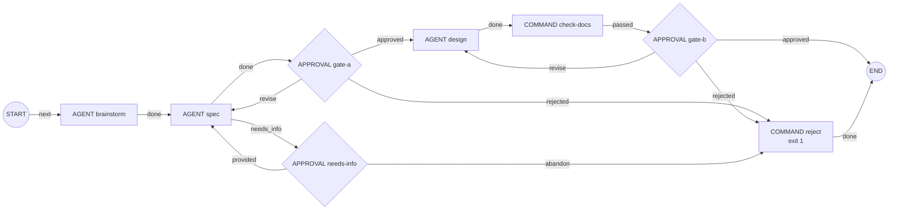
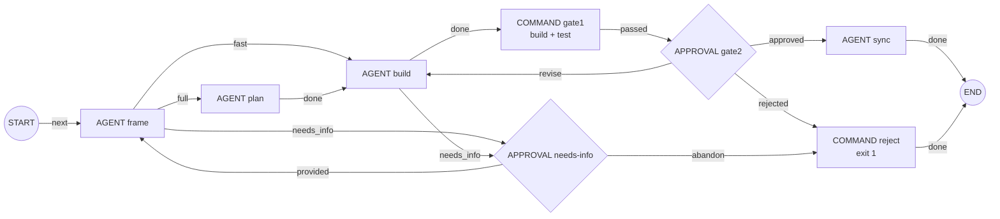

# Quy trình hai tầng TÍNH NĂNG → TASK trên `aw`

Tài liệu này trả lời câu hỏi: *làm sao dựng trên `aw` một quy trình gồm tầng tính năng (INTAKE → BRAINSTORM → SPEC →
GATE A → DESIGN → GATE B → chia task) và tầng task (FRAME → fast lane? → PLAN → BUILD → GATE 1 → GATE 2 → SYNC →
DONE), có nhánh NEEDS_INFO*. Đây là phần mở rộng của [hướng dẫn todolist](README.md); cần làm xong Phần 1–3 của
hướng dẫn đó trước (đã có repo, `aw serve`/`aw worker`, `publish-definitions.sh`).

> **Phạm vi kiểm chứng.** Cả hai workflow đã được publish và chạy thật với binary `aw` (commit `7d0fb4c`), Maven và
> npm thật, cùng một agent giả lập theo giai đoạn (nói đúng giao thức stream-json và marker outcome). Các nhánh đã
> chạy: NEEDS_INFO ở SPEC và ở BUILD, `revise` ở GATE A và GATE 2, `approved` ở mọi cổng, `rejected` ở GATE 2,
> lane `fast` và `full`, GATE 1 pass và fail, chạy lại sau khi GATE 1 fail. **Chưa kiểm chứng với Claude CLI thật**:
> việc Claude in đúng marker outcome và Stop hook của Claude Code (mục 3.2) là cấu hình khuyến nghị, chưa có
> transcript chạy thật.

## Mục lục

- [1. Ánh xạ sơ đồ sang `aw`](#1-ánh-xạ-sơ-đồ-sang-aw)
- [2. Hai workflow sau khi ánh xạ](#2-hai-workflow-sau-khi-ánh-xạ)
- [3. Những chỗ phải thiết kế khác sơ đồ gốc](#3-những-chỗ-phải-thiết-kế-khác-sơ-đồ-gốc)
- [4. Bảng định tuyến context theo node](#4-bảng-định-tuyến-context-theo-node)
- [5. Cài đặt và chạy](#5-cài-đặt-và-chạy)
- [6. Biến thể](#6-biến-thể)
- [7. Giới hạn cần biết](#7-giới-hạn-cần-biết)
- [8. Các file](#8-các-file)

---

## 1. Ánh xạ sơ đồ sang `aw`

| Trong sơ đồ | Trong `aw` | Mức hỗ trợ |
|---|---|---|
| Tầng tính năng / tầng task | Hai workflow: `wf-feature-definition` và `wf-task-delivery`. WorkItem **gốc** = một tính năng (một TaskFamily, một worktree, một branch). WorkItem con `F-00` chạy tầng tính năng; mỗi task là một WorkItem con chạy tầng task. | Trực tiếp |
| INTAKE "Ý tưởng thô" | `contract.behavior` của `F-00` (+ message bổ sung). Không cần node riêng. | Trực tiếp |
| BRAINSTORM, SPEC, DESIGN, FRAME, PLAN, BUILD, SYNC | Node `AGENT` role `MAKER`. **Mỗi giai đoạn một agent profile và một CONTEXT policy riêng.** | Trực tiếp |
| GATE A, GATE B, GATE 2 | Node `APPROVAL`, outcome `approved` / `revise` / `rejected`, có `cyclePolicy`. | Trực tiếp |
| Cạnh "sửa" quay lại | Edge `revise` về node trước; phản hồi của người duyệt đi vào prompt dưới dạng message. | Trực tiếp |
| "Fast lane?" | Node FRAME tự chọn outcome `fast` / `full` / `needs_info` bằng marker. Không dùng `ROUTER` vì Alpha chỉ cho ROUTER một outcome (ADR-026). | **Điều chỉnh** |
| PLAN "đọc context theo bảng định tuyến" | Context policy riêng của PLAN + resource `flow.routing-table`. | Trực tiếp |
| GATE 1 build + test, "fail → BUILD" | Node `COMMAND gate1` làm cổng chính thức (fail là run FAILED) + vòng lặp trong BUILD bằng Stop hook của Claude Code. | **Điều chỉnh** (3.2) |
| NEEDS_INFO, "đã bổ sung → FRAME" | Agent chọn outcome `needs_info` → node `APPROVAL needs-info` (`provided` / `abandon`) → `provided` quay về FRAME (tầng task) hoặc SPEC (tầng tính năng). | **Điều chỉnh nhẹ** (3.3) |
| "Chia thành N task" | `split-tasks.sh` đọc `tasks.json` do DESIGN viết, sinh N file WorkItem. | **Ngoài engine** (3.4) |
| SYNC "Doc / ADR" | Node AGENT `sync`, chỉ sửa trong `docs/`. | Trực tiếp |
| DONE | END + completion policy (test PASS + người duyệt) → WorkItem `DONE` → local commit. | Trực tiếp |
| *(thêm)* | Node `COMMAND check-docs` kiểm tra máy tài liệu tính năng trước GATE B. | Bổ sung |

## 2. Hai workflow sau khi ánh xạ

### 2.1 Tầng tính năng — [`wf-feature-definition.json`](definitions/workflows/wf-feature-definition.json)



Completion: [`policy-completion-feature`](definitions/policies/policy-completion-feature.json) = `STATIC`
(`COMMAND_EXECUTION` của `check-docs`) + `HUMAN` (người có role `operator` đã quyết định).

### 2.2 Tầng task — [`wf-task-delivery.json`](definitions/workflows/wf-task-delivery.json)



Completion: [`policy-completion-reviewed`](definitions/policies/policy-completion-reviewed.json) = `UNIT`
(`COMMAND_EXECUTION` của `gate1`) + `HUMAN`.

Mọi node APPROVAL có `cyclePolicy: {maxIterations: 3, escalationOutcome: rejected|abandon}`: quá 3 vòng sửa (hoặc 3 lần
NEEDS_INFO) thì tự đi nhánh `reject`; hết hạn 7 ngày không ai quyết định cũng vậy. Engine bắt buộc mọi vòng lặp phải
có giới hạn như thế mới cho publish.

## 3. Những chỗ phải thiết kế khác sơ đồ gốc

### 3.1 "Fast lane?" do FRAME quyết định bằng marker outcome

Node `ROUTER` của Alpha chỉ được một outcome, nên không rẽ nhánh được. Thay vào đó, FRAME khai báo ba outcome và agent
kết thúc bằng một dòng:

```text
<agentkit-outcome>{"schemaVersion":1,"outcome":"fast"}</agentkit-outcome>
```

Hai điều quan trọng (đọc từ code, đã kiểm chứng khi chạy):

- **Prompt của `aw` không cho agent biết các outcome hợp lệ.** Prompt chỉ có `taskContract`, `messages`, `resources`.
  Vì vậy Skill phải nói rõ: resource `flow.outcome-protocol` (HARD_CONSTRAINT) mô tả cú pháp marker, còn resource của
  từng giai đoạn liệt kê outcome được phép (FRAME: `fast, full, needs_info`).
- Thiếu marker khi node có hơn một outcome, marker sai định dạng, in hai lần, hoặc giá trị ngoài danh sách đều làm
  attempt **FAILED**.

Tiêu chí fast lane nằm trong `flow.frame`: sửa tối đa khoảng 3 file code, không đổi schema DB, không đổi API contract
công khai, không thêm dependency **và** `riskLevel` là `LOW`. Nếu muốn quyết định cố định thay vì để agent chọn, xem
biến thể ở mục 6.

### 3.2 GATE 1: không có cạnh "fail → BUILD" trong engine

Ràng buộc của Alpha (đọc code, rồi kiểm chứng bằng một task cố ý để lại test đỏ):

- Node COMMAND thoát mã khác 0 → attempt FAILED → node FAILED → **cả run FAILED**. Không có edge cho trường hợp lỗi.
  COMMAND cũng không tự chọn được outcome.
- MACHINE_GATE và agent CHECKER không dùng được sau BUILD trong cùng run vì yêu cầu repository không có thay đổi nào
  ([README Phần 4](README.md#4-workflow-mặc-định)).
- Nhánh REWORK của completion policy chỉ xảy ra khi run **đã tới END** mà điều kiện chưa đạt. Run bị fail ở GATE 1 thì
  không tới END.
- Khi COMMAND fail, Alpha **không lưu evidence hay output** (chỉ có `FAILED / EXECUTION_FAILED` trong
  `aw run timeline`).

Vì vậy GATE 1 được làm thành hai lớp:

1. **Vòng lặp trong — Stop hook của Claude Code** ([`repo-template/.claude/hooks/stop-gate.sh`](repo-template/.claude/hooks/stop-gate.sh),
   đăng ký trong [`repo-template/.claude/settings.json`](repo-template/.claude/settings.json)). Mỗi khi agent định kết
   thúc: nếu `backend/` hay `frontend/` có thay đổi thì chạy test phần đó; nếu có `docs/features/*/tasks.json` thay đổi
   thì kiểm schema. Fail thì hook trả mã 2: Claude Code không cho agent kết thúc mà đưa log lỗi cho agent sửa tiếp. Đây
   chính là cạnh "fail → BUILD", nhưng nằm trong phiên BUILD. Hook chặn tối đa 3 lần liên tiếp rồi để agent kết thúc.
   Logic của script đã được thử bằng tay (test đỏ → mã 2 ba lần, lần 4 → mã 0; sửa xong → mã 0; `tasks.json` sai →
   mã 2); việc Claude CLI thật gọi hook **chưa kiểm chứng**.
2. **Cổng chính thức — `COMMAND gate1`** ([`scripts/gate1.sh`](scripts/gate1.sh)). Chạy test của phần code đã đổi
   (hoặc toàn bộ nếu không đổi code), độc lập với lời agent tự báo, và sinh evidence `COMMAND_EXECUTION` cho completion
   policy.

Khi `gate1` vẫn fail (hook đã hết lượt hoặc không chạy): run FAILED, WorkItem ở `ACTIVE`, code lỗi vẫn nằm trong
worktree. Cách chạy lại (đã kiểm chứng):

```bash
WT=$("$GUIDE/scripts/worktree-path.sh")
LOG=$(cd "$WT/backend" && mvn -B -q test 2>&1 | grep -E 'FAIL|expected' | head -20)     # tự lấy log lỗi
aw work-item cancel --reason "GATE 1 fail, chạy lại" --yes <workItemId cũ>
jq '.title = "T-03 (lần 2): ..."' tasks/due-date/T-03.json > tasks/due-date/T-03b.json
MESSAGE="GATE 1 fail ở lần trước: $LOG" "$GUIDE/scripts/run-task.sh" tasks/due-date/T-03b.json WF_TASK
```

WorkItem mới chạy lại từ FRAME, nhận log trong `messages`, thấy code cũ trong worktree và sửa tiếp.

### 3.3 NEEDS_INFO

- Node AGENT nào được phép dừng để hỏi (SPEC, FRAME, BUILD) khai thêm outcome `needs_info`, và context policy của nó có
  resource `flow.needs-info`: không đoán; ghi câu hỏi đánh số kèm phương án mặc định vào
  `docs/features/<slug>/needs-info.md`; kết thúc với `needs_info`.
- `needs_info` dẫn tới node `APPROVAL needs-info`. Người vận hành đọc câu hỏi trong worktree, trả lời bằng
  `review-task.sh <run> provided "câu trả lời"` (câu trả lời thành message của WorkItem), hoặc `abandon`.
- `provided` quay về **FRAME** ở tầng task, đúng như sơ đồ. Ở tầng tính năng thì quay về **SPEC**: hai tầng là hai
  workflow riêng nên không thể quay về FRAME.
- Dùng APPROVAL thay cho node `WAIT` vì APPROVAL có người quyết định, có hạn chót, có lối thoát (`abandon`) và được
  completion policy ghi nhận.

### 3.4 "Chia thành N task" nằm ngoài engine

Alpha chưa có node sinh WorkItem (loại `SPAWN_WORK_ITEMS` được hoãn lại có chủ đích). Vì vậy:

1. DESIGN viết `docs/features/<slug>/tasks.json`, schema:
   `[{id: "T-01", title, pathScopes, riskLevel, lane: "fast"|"full", behavior, acceptanceCriteria: [...]}]`.
2. Node `check-docs` ([`check-feature-docs.sh`](scripts/check-feature-docs.sh)) kiểm tra đủ `01-brainstorm.md`,
   `02-spec.md`, `03-design.md` và schema `tasks.json` trước GATE B. Stop hook kiểm tra cùng schema trong phiên DESIGN.
3. Sau GATE B và commit, [`split-tasks.sh <slug>`](scripts/split-tasks.sh) sinh `tasks/<slug>/T-xx.json`. Mỗi file là
   một WorkItem con với `pathScopes` của task + `docs`, `riskLevel` của task, AC lấy từ `tasks.json`, và `behavior`
   ghi rõ thư mục tài liệu, task id và lane đề xuất.
4. Chạy lần lượt từng task (một family chỉ có một worktree, nên làm tuần tự và commit sau mỗi task).

## 4. Bảng định tuyến context theo node

Vì selector chỉ có `taskKinds`/`riskClasses` hiệu lực lúc chạy, cách duy nhất để mỗi node đọc một bộ hướng dẫn khác
nhau là **mỗi node một agent profile → một CONTEXT policy**. `publish-feature-flow.sh` dựng bảng này (hàm `stage`):

| Node | Agent profile | Resource được nạp |
|---|---|---|
| brainstorm | `agent-flow-brainstorm` | `flow.outcome-protocol`, `flow.brainstorm` |
| spec | `agent-flow-spec` | `flow.outcome-protocol`, `flow.needs-info`, `flow.spec` |
| design | `agent-flow-design` | `flow.outcome-protocol`, `flow.design`, Layer Spring/SQLite/React |
| frame | `agent-flow-frame` | `flow.outcome-protocol`, `flow.needs-info`, `flow.frame` |
| plan | `agent-flow-plan` | `flow.outcome-protocol`, `flow.routing-table`, `flow.plan`, Layer Spring/SQLite/React |
| build | `agent-flow-build` | `flow.outcome-protocol`, `flow.needs-info`, `flow.build`, Layer Spring/SQLite/React, `dev.definition-of-done`, `dev.high-risk-extra` (chỉ khi `riskLevel: HIGH`) |
| sync | `agent-flow-sync` | `flow.outcome-protocol`, `flow.sync` |

Kết quả thật ghi lại từ agent giả lập (danh sách resource mà từng attempt nhận được):

```text
stage=brainstorm resources=["flow.outcome-protocol","flow.brainstorm"]
stage=spec       resources=["flow.outcome-protocol","flow.needs-info","flow.spec"]
stage=build      resources=["dev.definition-of-done","flow.outcome-protocol","react.api-client","spring.rest-api",
                            "sqlite.datasource","flow.build","flow.needs-info","react.project-structure",
                            "spring.project-structure","sqlite.migrations","react.testing","spring.testing"]
```

`flow.routing-table` là "bảng định tuyến" theo nghĩa của sơ đồ: khu vực thay đổi (migration, entity, service, REST
API, API client, UI, ADR) → những thư mục/tài liệu cần đọc trước. Nội dung nằm trong
[`skill-feature-flow.json`](definitions/skills/skill-feature-flow.json); sửa bảng là sửa resource đó rồi chạy lại
`publish-feature-flow.sh`.

## 5. Cài đặt và chạy

### 5.1 Publish

```bash
cd ~/aw                                   # thư mục chứa aw-ids.env
"$GUIDE/scripts/publish-definitions.sh"   # nếu chưa chạy, hoặc sau khi sửa wrapper/Layer
"$GUIDE/scripts/publish-feature-flow.sh"  # ghi thêm WF_FEATURE, WF_TASK... vào aw-ids.env
```

Repository cần có `.claude/settings.json` và `.claude/hooks/stop-gate.sh` từ `repo-template/` (đã có nếu bạn tạo repo
theo README 1.3 sau lần cập nhật này; nếu không thì copy hai file đó vào và commit).

### 5.2 Tầng tính năng

Viết INTAKE theo mẫu [`work-items/feature-due-date.json`](work-items/feature-due-date.json). Dòng
`Thư mục tài liệu: docs/features/<slug>` trong `behavior` là bắt buộc: mọi giai đoạn dùng nó để biết ghi tài liệu ở đâu.

```bash
"$GUIDE/scripts/create-root.sh" "Tính năng: hạn chót cho todo"     # mỗi tính năng một WorkItem gốc
WAIT=60m "$GUIDE/scripts/run-task.sh" "$GUIDE/work-items/feature-due-date.json" WF_FEATURE
```

Output thật (agent giả lập dừng ở SPEC để hỏi):

```text
Run: a4bcf2fb-…  state: RUNNING
  brainstorm #1: SUCCEEDED COMPLETED
  spec #1: SUCCEEDED COMPLETED
  CHỜ DUYỆT node needs-info: review-task.sh a4bcf2fb-… <abandon|provided> ["phản hồi"]
```

Đọc tài liệu trong `$(worktree-path.sh)/docs/features/due-date/`, rồi quyết định ở từng cổng:

```bash
"$GUIDE/scripts/review-task.sh" <run> provided "Chỉ cần ngày, không cần giờ. Chưa làm nhắc việc ở đợt này."
"$GUIDE/scripts/review-task.sh" <run> revise   "Thêm AC cho việc sửa và xóa hạn chót."    # GATE A: sửa SPEC
"$GUIDE/scripts/review-task.sh" <run> approved                                           # GATE A: duyệt SPEC
"$GUIDE/scripts/review-task.sh" <run> approved                                           # GATE B: duyệt DESIGN
```

Timeline thật của run này:

```text
#1 start → #2 brainstorm done → #3 spec needs_info → #4 needs-info provided → #5 spec done → #6 gate-a revise
→ #7 spec done → #8 gate-a approved → #9 design done → #10 check-docs passed → #11 gate-b approved → #12 end
WorkItem F-00: DONE
```

Ở lần chạy thứ hai và thứ ba, SPEC nhận lần lượt 1 rồi 2 message: câu trả lời NEEDS_INFO và phản hồi của GATE A.


### 5.3 Chia task

```bash
AUTHOR_NAME="..." AUTHOR_EMAIL="..." "$GUIDE/scripts/commit-task.sh" "F-00: định nghĩa tính năng hạn chót"
"$GUIDE/scripts/split-tasks.sh" due-date
# ./tasks/due-date/T-01.json
# ./tasks/due-date/T-02.json
```

### 5.4 Tầng task (lặp cho từng task)

```bash
WAIT=60m "$GUIDE/scripts/run-task.sh" tasks/due-date/T-01.json WF_TASK
# … review diff trong worktree, quyết định GATE 2 / NEEDS_INFO bằng review-task.sh …
AUTHOR_NAME="..." AUTHOR_EMAIL="..." "$GUIDE/scripts/commit-task.sh" "T-01: backend lưu và lọc hạn chót"
WAIT=60m "$GUIDE/scripts/run-task.sh" tasks/due-date/T-02.json WF_TASK
# …
```

Timeline thật của T-01 (lane `full`, BUILD hỏi thêm thông tin một lần, GATE 2 yêu cầu sửa một lần; GATE 1 chạy
`mvn test` thật):

```text
#2 frame full → #3 plan done → #4 build needs_info → #5 needs-info provided → #6 frame full → #7 plan done
→ #8 build done → #9 gate1 passed → #10 gate2 revise → #11 build done → #12 gate1 passed → #13 gate2 approved
→ #14 sync done → #15 end            WorkItem T-01: DONE
```

T-02 (lane `fast`; GATE 1 chỉ chạy test frontend vì chỉ frontend đổi):

```text
#2 frame fast → #3 build done → #4 gate1 passed → #5 gate2 approved → #6 sync done → #7 end
```

Ba commit cục bộ thật trên branch của family:

```text
0c9ea61 T-02: frontend hiển thị hạn chót [Release-Set-Local-Commit-Marker: …]
b6b7215 T-01: backend lưu và lọc hạn chót [Release-Set-Local-Commit-Marker: …]
c2721fe F-00: định nghĩa tính năng hạn chót (spec, design, tasks) [Release-Set-Local-Commit-Marker: …]
```


Kết thúc tính năng: merge branch `agentkit/w-…` của family vào `main` như [README 5.7](README.md#57-thứ-tự-đề-xuất-và-kết-thúc-đợt).

## 6. Biến thể

| Muốn | Sửa gì |
|---|---|
| Lane cố định từ DESIGN thay vì để FRAME chọn | Tạo `wf-task-fast.json` (FRAME một outcome `done` → BUILD) và `wf-task-full.json` (FRAME → PLAN → BUILD); trong `split-tasks.sh` chọn workflow theo `lane` của task; FRAME khi đó không cần marker |
| Bỏ BRAINSTORM cho tính năng nhỏ | Copy template, nối `start → spec`, publish thành workflow khác (`publish-workflow.sh … WF_FEATURE_LITE`) |
| PLAN cũng được hỏi NEEDS_INFO | Thêm `needs_info` vào outcome của `plan`, thêm `flow.needs-info` vào context của `stage plan`, thêm edge `plan --needs_info--> needs-info` |
| Thêm một cổng tự động (lint, kiểm tra migration…) | Thêm script + COMMAND (như `gate1`), chèn giữa `gate1` và `gate2` |
| Nhiều vòng sửa hơn trước khi tự reject | Tăng `cyclePolicy.maxIterations` của node APPROVAL tương ứng |
| Đổi model cho từng giai đoạn | Mỗi giai đoạn đã có agent profile riêng: sửa `agent_profile` trong `lib.sh` hoặc thêm tham số model cho `stage` |
| Một agent AI review thay cho người ở GATE 2 | Không làm được sau BUILD trong cùng run: agent CHECKER bắt buộc worktree không có thay đổi. Có thể review ở một WorkItem riêng sau khi đã commit |

Sau mỗi thay đổi: `publish-feature-flow.sh` (hoặc `publish-workflow.sh` cho template mới). WorkItem đã tạo vẫn pin
workflow version cũ, nên task mới phải dùng WorkItem mới (`split-tasks.sh` + `run-task.sh` tự làm điều này).

## 7. Giới hạn cần biết

- **Claude CLI thật chưa được kiểm chứng**: marker outcome và Stop hook là hai điểm cần thử đầu tiên với một tính năng
  nhỏ. Nếu agent quên marker ở node nhiều outcome, attempt FAILED với `OUTCOME_REJECTED`.
- **GATE 1 fail làm cả run FAILED** và không có log trong `aw` (mục 3.2). Stop hook giảm khả năng này nhưng không thay
  được cổng chính thức.
- **Stop hook chạy ở mọi giai đoạn**: SYNC chạy sau BUILD nên code vẫn còn thay đổi chưa commit, và hook chạy lại test
  (chậm hơn nhưng vô hại). Tắt hook bằng cách bỏ khóa `hooks` trong `.claude/settings.json`.
- **Tuần tự**: một tính năng là một family với một worktree; task chạy lần lượt và commit sau mỗi task.
- **Chia task là thao tác của người vận hành** (`split-tasks.sh`), không phải node của workflow.
- Sửa wrapper Claude hay file executable → chạy lại **cả hai** script publish (adapter build mới), nếu không node AGENT
  sẽ bị `ADAPTER_BUILD_DRIFT` (đã gặp khi kiểm chứng).

## 8. Các file

| File | Vai trò |
|---|---|
| [`definitions/skills/skill-feature-flow.json`](definitions/skills/skill-feature-flow.json) | Hướng dẫn từng giai đoạn, giao thức marker, NEEDS_INFO, bảng định tuyến |
| [`definitions/workflows/wf-feature-definition.json`](definitions/workflows/wf-feature-definition.json) | Template workflow tầng tính năng |
| [`definitions/workflows/wf-task-delivery.json`](definitions/workflows/wf-task-delivery.json) | Template workflow tầng task |
| [`definitions/policies/policy-completion-feature.json`](definitions/policies/policy-completion-feature.json) | Completion tầng tính năng |
| [`work-items/feature-due-date.json`](work-items/feature-due-date.json) | Mẫu INTAKE |
| [`scripts/publish-feature-flow.sh`](scripts/publish-feature-flow.sh) | Publish toàn bộ phần trên (dùng [`lib.sh`](scripts/lib.sh)) |
| [`scripts/check-feature-docs.sh`](scripts/check-feature-docs.sh), [`scripts/gate1.sh`](scripts/gate1.sh) | Script của `check-docs` và `gate1` |
| [`scripts/split-tasks.sh`](scripts/split-tasks.sh) | Chia `tasks.json` thành WorkItem |
| [`repo-template/.claude/hooks/stop-gate.sh`](repo-template/.claude/hooks/stop-gate.sh) | Stop hook: vòng lặp trong của GATE 1 |
| `create-root.sh`, `run-task.sh`, `review-task.sh`, `commit-task.sh`, `worktree-path.sh` | Dùng chung với README (`create-root.sh` nhận tiêu đề; `run-task.sh` nhận `MESSAGE=`; gợi ý duyệt in đúng outcome của từng cổng) |
