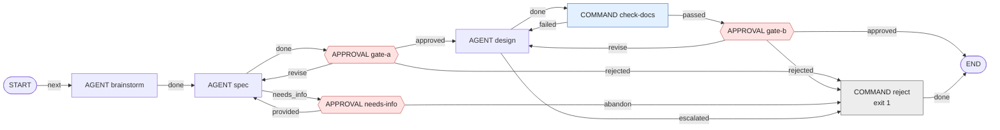
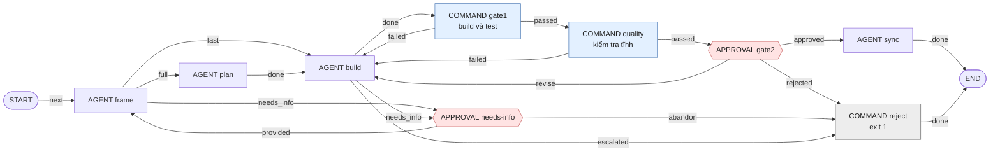

# Chạy thử quy trình hai tầng TÍNH NĂNG → TASK cho todolist

Tài liệu này đi kèm [README](README.md) và đi sâu vào ví dụ chính của nó: quy trình nghiệp vụ của todolist
([README 3.1](README.md#31-bước-2--mô-tả-quy-trình-nghiệp-vụ)) được ánh xạ thành hai workflow
([README 3.2](README.md#32-bước-3--ánh-xạ-sang-node-của-aw)):

- **tầng tính năng:** INTAKE → BRAINSTORM → SPEC → GATE A → DESIGN → kiểm tra tài liệu → GATE B → chia task;
- **tầng task:** FRAME → fast lane? → PLAN → BUILD → GATE 1 → kiểm tra tĩnh → GATE 2 → SYNC → DONE;
- nhánh NEEDS_INFO ở cả hai tầng.

Ở đây có bốn phần: lý do của những chỗ phải thiết kế khác sơ đồ nghiệp vụ, bảng định tuyến context theo node,
transcript chạy thật, và các biến thể.

Điều kiện trước: đã làm xong [README Phần 2](README.md#2-bước-1--chuẩn-bị-môi-trường-và-repository) (repository tạo
từ `repo-template/`, `aw worker`, `init-project.sh`, readiness profile) và đã chạy `aw-publish.py aw-project.json`
([README 3.5](README.md#35-bước-6--khai-báo-và-publish)). File khai báo đó publish cả hai workflow cùng 7 agent của
quy trình.

> **Phạm vi kiểm chứng.** Cả hai workflow đã chạy thật với binary `aw` (commit `9e720ac` của `master`), Claude CLI
> 2.1.288, Maven và npm thật, trên Windows 10: một tính năng từ ý tưởng thô tới bốn task đã commit, gồm `revise` ở
> GATE A và GATE 2, lane `fast` và `full`, GATE 1 đỏ rồi tự sửa, và hai run hỏng vì provider hết hạn mức rồi được chạy
> lại. Các nhánh NEEDS_INFO, `check-docs` đỏ, kiểm tra tĩnh đỏ và `rejected` chạy với agent giả lập. Chi tiết ở
> [README](README.md).

## Mục lục

- [1. Hai workflow](#1-hai-workflow)
- [2. Những chỗ phải thiết kế khác sơ đồ nghiệp vụ](#2-những-chỗ-phải-thiết-kế-khác-sơ-đồ-nghiệp-vụ)
- [3. Bảng định tuyến context theo node](#3-bảng-định-tuyến-context-theo-node)
- [4. Chạy](#4-chạy)
- [5. Biến thể](#5-biến-thể)
- [6. Giới hạn cần biết](#6-giới-hạn-cần-biết)
- [7. Các file](#7-các-file)

---

## 1. Hai workflow

Một tính năng là một **WorkItem gốc**: một TaskFamily, một worktree, một branch. Dưới gốc đó có các WorkItem con:

- WorkItem con `F-00` chạy tầng tính năng;
- mỗi task là một WorkItem con chạy tầng task.

### 1.1 Tầng tính năng — [`wf-feature-definition.json`](../../../kit/workflows/wf-feature-definition.json)



Completion: [`policy-completion-feature`](../../../kit/policies/policy-completion-feature.json). Policy này cần
`STATIC` (evidence `COMMAND_EXECUTION` của `check-docs`) và `HUMAN` (người có role `operator` đã quyết định).

### 1.2 Tầng task — [`wf-task-delivery.json`](../../../kit/workflows/wf-task-delivery.json)



Completion: [`policy-completion-reviewed`](../../../kit/policies/policy-completion-reviewed.json). Policy này cần
`UNIT` (evidence `COMMAND_EXECUTION` của `gate1` và `quality`, lần chạy cuối phải đạt) và `HUMAN`.

Giới hạn của các vòng lặp:

| Vòng | Node giữ `cyclePolicy` | Giới hạn | Hết thì |
|---|---|---|---|
| `design` ⇄ `check-docs`, `design` ⇄ `gate-b` | `design` (`maxIterations: 5`) và `gate-b` (3) | 6 lần chạy `design`; 3 lần `revise` | `reject` |
| `spec` ⇄ `gate-a` | `gate-a` (3) | 3 lần `revise` | `reject` |
| `build` ⇄ `gate1` / `quality` / `gate2` | `build` (5) và `gate2` (3) | 6 lần chạy `build`; 3 lần `revise` | `reject` |
| NEEDS_INFO | `needs-info` (3) | 3 lần hỏi | `reject` |

Mọi node APPROVAL có hạn 7 ngày; hết hạn không ai quyết định thì tự đi nhánh `rejected` / `abandon`. Engine chỉ cho
publish khi mọi vòng lặp có giới hạn.

## 2. Những chỗ phải thiết kế khác sơ đồ nghiệp vụ

| Trong sơ đồ nghiệp vụ | Trong `aw` | Mức hỗ trợ |
|---|---|---|
| "Fast lane?" | Node FRAME tự chọn outcome `fast` / `full` / `needs_info` bằng marker | **Điều chỉnh** (2.1) |
| GATE 1 "fail → BUILD" | `COMMAND gate1` và `COMMAND quality` có `failureOutcome` quay lại `build` | **Trực tiếp** (2.2) |
| NEEDS_INFO, "đã bổ sung → FRAME" | `APPROVAL needs-info` (`provided` / `abandon`); ở tầng tính năng thì quay về SPEC | **Điều chỉnh nhẹ** (2.3) |
| "Chia thành N task" | `split-tasks.sh` đọc `tasks.json` do DESIGN viết | **Ngoài engine** (2.4) |
| *(thêm)* | `COMMAND check-docs` kiểm tra tài liệu tính năng trước GATE B, sai thì quay lại DESIGN | Bổ sung |

Các bước còn lại ánh xạ thẳng: BRAINSTORM, SPEC, DESIGN, PLAN, BUILD, SYNC thành AGENT; GATE A, GATE B, GATE 2 thành
APPROVAL. Xem bảng đầy đủ ở [README 3.2](README.md#32-bước-3--ánh-xạ-sang-node-của-aw).

### 2.1 "Fast lane?" do FRAME quyết định bằng marker outcome

Node `ROUTER` chỉ được một outcome, nên không rẽ nhánh được. Thay vào đó, FRAME khai báo ba outcome. Engine đưa danh
sách đó vào prompt (`taskContract.allowedOutcomes`) cùng cách báo (`taskContract.outcomeProtocol`): agent kết thúc
thông điệp cuối bằng đúng một dòng

```text
<agentkit-outcome>{"schemaVersion":1,"outcome":"fast"}</agentkit-outcome>
```

Skill không chép lại danh sách hay cú pháp này. `flow.frame` chỉ nói *khi nào* chọn cái nào. Task đi lane fast khi
đồng thời thỏa:

- sửa tối đa khoảng 3 file code;
- không đổi schema DB;
- không đổi API contract công khai;
- không thêm dependency;
- `riskLevel` là `LOW`.

Thiếu marker, marker sai định dạng, in hai lần, hoặc giá trị ngoài danh sách đều làm attempt `FAILED` với
`OUTCOME_REJECTED`. Muốn quyết định lane cố định thay vì để agent chọn, xem biến thể ở mục 5.

### 2.2 GATE 1 và kiểm tra tĩnh: bước kiểm tra gửi agent quay lại

Cạnh "fail → BUILD" của sơ đồ nghiệp vụ có trong engine:

```json
{"key": "gate1", "type": "COMMAND", "outcomes": ["passed", "failed"],
 "command": {"commandRef": {"$ref": "command:cmd-gate1"},
             "policyRefs": [{"$ref": "policy:policy-attempt-once"}, {"$ref": "policy:policy-permission"}],
             "failureOutcome": "failed"}}
```

Khi script thoát mã khác 0, node vẫn `SUCCEEDED` nhưng chọn outcome `failed`, run đi theo cạnh `gate1 → build`. Lần
chạy tiếp theo của BUILD nhận trong prompt:

- `checkFailures`: bước nào đỏ (`what`), 4 KiB cuối của **stderr** của lệnh (`why`), phải làm gì (`fix`), và baseline
  của repository (`baseline`: lỗi này do task gây ra, hay đã có từ trước và được chấp nhận);
- evidence `COMMAND_EXECUTION` có verdict `FAILED` vẫn được lưu, đọc lại được bằng `aw artifact get`.

Vì `why` lấy từ stderr, [`gate1.sh`](commands/gate1.sh) gom output của Maven và npm rồi in phần lỗi cô đọng ra stderr.
Maven tự nó in lỗi ra stdout và chỉ để cảnh báo của JVM ở stderr; không xử lý thì agent nhận toàn cảnh báo.

Hai bước kiểm tra nối tiếp nhau, cùng quay lại `build`:

- **`gate1`** ([`commands/gate1.sh`](commands/gate1.sh)): build và test của phần code đã đổi, hoặc toàn bộ nếu task
  không đổi code.
- **`quality`** ([`commands/quality-check.sh`](commands/quality-check.sh)): những thứ test không bắt được. Không có
  test bị tắt (`@Disabled`, `.skip(`), không sửa hay xóa migration Flyway đã commit.

`build` giữ `cyclePolicy: {maxIterations: 5, escalationOutcome: "escalated"}`: sau 6 lần chạy mà vẫn đỏ, run đi tới
`reject` và kết thúc `FAILED`. WorkItem khi đó `BLOCKED`; xem code và log rồi `retry-task.sh` (mục 4.5).

`quality` là COMMAND chứ không phải MACHINE_GATE, dù việc nó làm là "kiểm tra, không sửa gì": MACHINE_GATE hiện
không chạy được trong một family đã có local commit ([README mục 6](README.md#6-giới-hạn-cần-biết)), mà family của
một tính năng thì có commit ngay sau F-00.

### 2.3 NEEDS_INFO

- Node AGENT được phép dừng để hỏi (SPEC, FRAME, BUILD) khai thêm outcome `needs_info`. Agent của nó có resource
  `flow.needs-info`, hướng dẫn như sau: không đoán; ghi câu hỏi đánh số kèm phương án mặc định vào
  `docs/features/<slug>/needs-info.md`; rồi kết thúc với `needs_info`.
- `needs_info` dẫn tới node `APPROVAL needs-info`. Người vận hành đọc câu hỏi trong worktree, rồi chọn một trong hai:
  - trả lời bằng `review-task.sh <run> provided "câu trả lời"` (câu trả lời thành message của WorkItem);
  - hoặc chọn `abandon`.
- `provided` quay về **FRAME** ở tầng task, đúng như sơ đồ. Ở tầng tính năng thì quay về **SPEC**, vì hai tầng là hai
  workflow riêng nên không thể quay về FRAME.
- Dùng APPROVAL thay cho node `WAIT` vì APPROVAL có người quyết định, có hạn chót, có lối thoát (`abandon`), và được
  completion policy ghi nhận.

### 2.4 "Chia thành N task" nằm ngoài engine

Không có node sinh WorkItem. Vì vậy việc chia task đi qua bốn bước:

1. DESIGN viết `docs/features/<slug>/tasks.json` theo schema
   `[{id: "T-01", title, pathScopes, riskLevel, lane: "fast"|"full", behavior, acceptanceCriteria: [...]}]`.
2. Node `check-docs` ([`kit/commands/check-feature-docs.sh`](../../../kit/commands/check-feature-docs.sh)) kiểm tra trước GATE B:
   có đủ `01-brainstorm.md`, `02-spec.md`, `03-design.md`, và `tasks.json` đúng schema. Sai thì run quay lại DESIGN
   với thông báo lỗi; người duyệt chỉ thấy tài liệu đã qua kiểm tra máy.
3. Sau GATE B và commit, [`split-tasks.sh <slug>`](../../../kit/scripts/split-tasks.sh) sinh `tasks/<slug>/T-xx.json`. Mỗi file là
   một WorkItem con:
   - `pathScopes` của task cộng thêm `docs`;
   - `riskLevel` của task;
   - AC lấy từ `tasks.json`;
   - `behavior` ghi rõ thư mục tài liệu, task id và lane đề xuất.
4. Chạy lần lượt từng task. Một family chỉ có một worktree, nên làm tuần tự và commit sau mỗi task.

## 3. Bảng định tuyến context theo node

Tri thức tới agent qua hai lớp ([README 3.3](README.md#33-bước-4--chuẩn-bị-tri-thức-cho-agent)):

- **Theo bước:** mỗi node của quy trình có agent profile riêng, vì selector không phân biệt được bước. Danh sách
  resource của từng agent nằm trong `agents` của [`aw-project.json`](aw-project.json).
- **Theo vùng code:** trong danh sách đó, resource của Layer gắn `componentTags`, nên task `backend` không nhận
  convention của React và ngược lại.

| Node | Agent profile | Model | Resource ứng viên |
|---|---|---|---|
| brainstorm | `agent-flow-brainstorm` | opus | `flow.working-rules`, `flow.brainstorm`, `dev.stack-overview` |
| spec | `agent-flow-spec` | opus | `flow.working-rules`, `flow.needs-info`, `flow.spec`, `dev.stack-overview` |
| design | `agent-flow-design` | opus | `flow.working-rules`, `flow.design`, Layer Spring/SQLite/React, `dev.stack-overview` |
| frame | `agent-flow-frame` | sonnet | `flow.working-rules`, `flow.needs-info`, `flow.frame` |
| plan | `agent-flow-plan` | sonnet | `flow.working-rules`, `dev.routing-table`, `flow.plan`, Layer Spring/SQLite/React |
| build | `agent-flow-build` | sonnet | `flow.working-rules`, `flow.needs-info`, `flow.build`, Layer Spring/SQLite/React, `dev.definition-of-done`, `dev.high-risk-extra` |
| sync | `agent-flow-sync` | sonnet | `flow.working-rules`, `flow.sync` |

Resource thực nhận, theo scope của WorkItem:

| Attempt | Scope của WorkItem | `hardConstraints` | `resources` |
|---|---|---|---|
| `spec` của F-00 | `docs` | `flow.spec`, `flow.working-rules` | `flow.needs-info`, `dev.stack-overview` |
| `design` của F-00 | `docs` | `flow.design`, `flow.working-rules`, `spring.rest-api` | `dev.stack-overview` |
| `frame` của một task | `backend`, `docs` | `flow.frame`, `flow.working-rules` | `flow.needs-info` |
| `plan` của một task backend | `backend`, `docs` | `flow.plan`, `flow.working-rules`, `spring.rest-api`, `sqlite.datasource` | `flow.routing-table`, `spring.project-structure`, `sqlite.migrations`, `spring.testing` |
| `build` của một task backend | `backend`, `docs` | `dev.definition-of-done`, `flow.build`, `flow.working-rules`, `spring.rest-api`, `sqlite.datasource` | `flow.needs-info`, `spring.project-structure`, `sqlite.migrations`, `spring.testing` |
| `build` của một task frontend | `frontend`, `docs` | `dev.definition-of-done`, `flow.build`, `flow.working-rules`, `react.api-client`, `spring.rest-api` | `flow.needs-info`, `react.project-structure`, `react.testing` |

Hướng dẫn của chính giai đoạn (`flow.<giai đoạn>`) luôn nằm trong `hardConstraints`, ở đầu prompt, cùng với ranh giới
file của giai đoạn đó.

F-00 chỉ ghi `docs/`, nên bước DESIGN không nhận convention của `backend` hay `frontend` qua selector: nó nhận hợp
đồng API (`spring.rest-api`, global), tổng quan hệ thống (`dev.stack-overview`), và tự đọc code trong worktree.

`dev.routing-table` là "bảng định tuyến" theo nghĩa của sơ đồ nghiệp vụ. Bảng ánh xạ khu vực thay đổi (migration,
entity, service, REST API, API client, UI, ADR) sang những thư mục và tài liệu cần đọc trước. Bảng là tri thức riêng của todolist nên nằm trong
[`skill-todolist-routing.json`](definitions/skills/skill-todolist-routing.json), không phải trong skill chung của kit
(`skill-feature-flow` chỉ nói PLAN "đọc theo bảng định tuyến trong resources nếu có"). Muốn sửa bảng thì sửa resource đó
rồi chạy lại `aw-publish.py`.

## 4. Chạy

Các lệnh dưới đây chạy trong thư mục vận hành có `aw-state.json` (README 2.6), với `$KIT/scripts` đã có trên `PATH` (README 2.6).

Mọi transcript ở mục này lấy từ một lần chạy thật: Claude CLI thật, Maven và npm thật, trên Windows 10 (Git Bash).

### 4.1 Chuẩn bị

Tính năng được làm trên một gốc mới, tách từ nhánh chính **đã merge** đợt trước (README 4.9): family của tính năng cần
thấy code của đợt MVP.

### 4.2 Tầng tính năng

Viết INTAKE theo mẫu [`work-items/feature-due-date.json`](work-items/feature-due-date.json). Dòng
`Thư mục tài liệu: docs/features/<slug>` trong `behavior` là bắt buộc, vì mọi giai đoạn dùng nó để biết ghi tài liệu ở
đâu.

```bash
create-root.sh "Tính năng: hạn chót cho todo"     # mỗi tính năng một WorkItem gốc
run-task.sh "$GUIDE/work-items/feature-due-date.json" wf-feature-definition
```

```text
Run: 6c192830-b88f-478b-984c-97198c00f293  state: RUNNING
  #1 start (vòng 0): SUCCEEDED next
  #2 brainstorm (vòng 0): SUCCEEDED done
  #3 spec (vòng 0): SUCCEEDED done
  #4 gate-a (vòng 0): WAITING
  provider báo cáo: 69305 token vào, 21176 token ra, 1.0382 USD
  CHỜ DUYỆT node gate-a: review-task.sh 6c192830-b88f-478b-984c-97198c00f293 <approved|rejected|revise> ["phản hồi"]
```

Đọc tài liệu trong `$(worktree-path.sh)/docs/features/due-date/`, và đọc điều agent muốn bạn chú ý:

```bash
agent-log.py 6c192830-b88f-478b-984c-97198c00f293 --node spec
```

```text
== #3 spec (vòng 0) attempt 1: SUCCEEDED  [154858 token vào, 11388 token ra, 0.5266 USD]
Đã viết `docs/features/due-date/02-spec.md`, sẵn sàng để duyệt ở GATE A. …
Spec đi theo phương án đề xuất của brainstorm: hạn chót theo ngày, kèm nhãn "Sắp tới hạn", không làm thông báo chủ
động. Tài liệu có 22 quy tắc nghiệp vụ (BR-1 đến BR-22) và 26 acceptance criteria Given/When/Then …
Chín câu hỏi mở của brainstorm chưa có trả lời nào từ người vận hành, nên tôi đã tự chốt và ghi rõ nguồn ở mục 8
của spec. Cần xác nhận khi duyệt: …
```

Ở lần chạy này SPEC không dừng để hỏi: nó tự chốt các câu hỏi mở, ghi rõ từng quyết định là của ai, và để GATE A xác
nhận.

**Checklist cho người duyệt GATE A** (đọc `02-spec.md`; duyệt `approved`, hoặc `revise` kèm phản hồi cụ thể):

1. **Phạm vi và lý do**: spec nêu cái gì đã có, thay đổi tối thiểu và chế độ phạm vi (giữ, thu hẹp, mở rộng) mà agent chọn. Bạn đồng ý với chế độ đó không? Phần "ngoài phạm vi" có đúng ý bạn không?
2. **Quyết định agent tự chốt**: mỗi quyết định ghi rõ ai chốt. Cái nào là của agent mà bạn chưa đồng ý thì `revise` ngay ở đây, vì thiết kế và task sẽ dựa vào nó.
3. **Acceptance criteria**: có đường lỗi và giá trị biên (rỗng, dài tối đa, không tồn tại) hay chỉ có đường thành công? Mỗi AC có kiểm chứng được bằng một test tự động không?
4. **Tình huống bị bỏ**: mục "Hạn chế đã biết" liệt kê các tình huống không thành AC. Có cái nào bạn thấy phải thành AC không?
5. **Quy tắc và AC khớp nhau**: mỗi quy tắc nghiệp vụ có ít nhất một AC; không có hai AC mâu thuẫn.

Người vận hành thu nhỏ phạm vi ngay tại cổng:

```bash
review-task.sh 6c192830-… revise "Thu nhỏ phạm vi: bỏ phần nhãn 'Sắp tới hạn' (nhắc việc) khỏi đợt này. Chỉ giữ: đặt, đổi, xóa hạn chót theo ngày; đánh dấu việc quá hạn; lọc việc quá hạn. Các quyết định còn lại ở mục 8 tôi đồng ý."
review-task.sh 6c192830-… approved          # GATE A: duyệt SPEC đã sửa
review-task.sh 6c192830-… approved          # GATE B: duyệt DESIGN
```

Timeline đầy đủ:

```text
  #1 start (vòng 0): SUCCEEDED next
  #2 brainstorm (vòng 0): SUCCEEDED done
  #3 spec (vòng 0): SUCCEEDED done
  #4 gate-a (vòng 0): SUCCEEDED revise
  #5 spec (vòng 1): SUCCEEDED done
  #6 gate-a (vòng 1): SUCCEEDED approved
  #7 design (vòng 0): SUCCEEDED done
  #8 check-docs (vòng 0): SUCCEEDED passed
  #9 gate-b (vòng 0): SUCCEEDED approved
  #10 end (vòng 0): SUCCEEDED
  provider báo cáo: 175836 token vào, 58834 token ra, 2.7892 USD
```

| Chặng | Thời gian | Ghi chú |
|---|---|---|
| BRAINSTORM + SPEC | 3 phút 20 giây | model `opus` |
| SPEC lần 2 (sau `revise`) | 1 phút 21 giây | phản hồi của GATE A nằm trong `messages`; spec có thêm mục "Lịch sử sửa" |
| DESIGN + `check-docs` | 4 phút 32 giây | `check-docs` chạy `jq` thật trên `tasks.json` |

Kết quả là 827 dòng tài liệu trong `docs/features/due-date/`: `01-brainstorm.md`, `02-spec.md` (20 quy tắc nghiệp vụ,
26 acceptance criteria), `03-design.md` và `tasks.json`.

**Khi SPEC dừng để hỏi.** Nhánh NEEDS_INFO đã chạy với agent giả lập (agent được dặn hỏi ở lần đầu):

```text
  #3 spec (vòng 0): SUCCEEDED needs_info
  #4 needs-info (vòng 0): WAITING
  CHỜ DUYỆT node needs-info: review-task.sh 758415b5-… <abandon|provided> ["phản hồi"]
$ review-task.sh 758415b5-… provided "Chỉ cần ngày, không cần giờ."
  #4 needs-info (vòng 0): SUCCEEDED provided
  #5 spec (vòng 1): SUCCEEDED done
  #6 gate-a (vòng 0): WAITING
```

Cùng lần chạy giả lập đó có nhánh `check-docs` đỏ: DESIGN viết `tasks.json` sai schema, `check-docs` chọn `failed`,
DESIGN chạy lại với `checkFailures` và sửa, không cần người.


### 4.3 Chia task

```bash
commit-task.sh "F-00: định nghĩa tính năng hạn chót (spec, design, tasks)"
split-tasks.sh due-date
# ./tasks/due-date/T-01.json
# ./tasks/due-date/T-02.json
# ./tasks/due-date/T-03.json
# ./tasks/due-date/T-04.json
```

DESIGN chia tính năng thành bốn task:

| Task | Tiêu đề | `pathScopes` | Risk | Lane đề xuất | Số AC |
|---|---|---|---|---|---|
| T-01 | Backend: lưu hạn chót và API đặt/đổi/xóa hạn | `backend` | MEDIUM | full | 11 |
| T-02 | Frontend: đặt hạn khi tạo, hiển thị hạn và nhãn Quá hạn | `frontend` | MEDIUM | full | 11 |
| T-03 | Frontend: đặt, đổi, bỏ hạn chót ngay trên từng dòng | `frontend` | MEDIUM | full | 5 |
| T-04 | Frontend: bộ lọc Quá hạn | `frontend` | LOW | fast | 7 |

`split-tasks.sh` cộng thêm `docs` vào scope của mỗi task, vì FRAME, PLAN và SYNC ghi tài liệu.

### 4.4 Tầng task (lặp cho từng task)

```bash
run-task.sh tasks/due-date/T-01.json wf-task-delivery
# … review diff trong worktree, đọc agent-log.py, quyết định GATE 2 bằng review-task.sh …
commit-task.sh "T-01: backend lưu hạn chót và API đặt/đổi/xóa hạn"
run-task.sh tasks/due-date/T-02.json wf-task-delivery
# …
```

**T-02, lane `full`, một vòng `revise` ở GATE 2:**

```text
Run: ca58bf74-b62d-446d-858e-57a59d6c0069  state: RUNNING
  #1 start (vòng 0): SUCCEEDED next
  #2 frame (vòng 0): SUCCEEDED full
  #3 plan (vòng 0): SUCCEEDED done
  #4 build (vòng 0): SUCCEEDED done
  #5 gate1 (vòng 0): SUCCEEDED passed
  #6 quality (vòng 0): SUCCEEDED passed
  #7 gate2 (vòng 0): WAITING
  provider báo cáo: 119007 token vào, 26989 token ra, 0.9296 USD
  CHỜ DUYỆT node gate2: review-task.sh ca58bf74-… <approved|rejected|revise> ["phản hồi"]
$ review-task.sh ca58bf74-… revise "Ô chọn hạn chót trong form tạo việc cần có nhãn truy cập (aria-label 'Hạn chót') và một test kiểm tra nhãn đó."
  #7 gate2 (vòng 0): SUCCEEDED revise
  #8 build (vòng 1): SUCCEEDED done
  #9 gate1 (vòng 1): SUCCEEDED passed
  #10 quality (vòng 1): SUCCEEDED passed
  #11 gate2 (vòng 1): WAITING
$ review-task.sh ca58bf74-… approved
  #11 gate2 (vòng 1): SUCCEEDED approved
  #12 sync (vòng 0): SUCCEEDED done
  #13 end (vòng 0): SUCCEEDED
```

PLAN chỉ viết `plan.md` (danh sách file sẽ tạo hoặc sửa, các bước, test cho từng AC); BUILD viết code theo đó; `gate1`
chạy `npm ci`, `vitest` và `vite build` thật.

**T-04, lane `fast`, GATE 1 đỏ một lần:**

```text
  #2 frame (vòng 0): SUCCEEDED fast
  #3 build (vòng 0): SUCCEEDED done
  #4 gate1 (vòng 0): SUCCEEDED failed
  #5 build (vòng 1): SUCCEEDED done
  #6 gate1 (vòng 1): SUCCEEDED passed
  #7 quality (vòng 0): SUCCEEDED passed
  #8 gate2 (vòng 0): SUCCEEDED approved
  #9 sync (vòng 0): SUCCEEDED done
  #10 end (vòng 0): SUCCEEDED
```

FRAME chọn `fast` (task `LOW`, vài file, không đổi API), nên không có PLAN. Bộ lọc mới thêm một nút "Quá hạn", làm 5
test cũ dùng `getByText('Quá hạn')` thấy hai phần tử. `gate1` đỏ; BUILD nhận phần cuối output của Vitest trong
`checkFailures`, và ở vòng 1 báo lại:

```text
== #5 build (vòng 1) attempt 1: SUCCEEDED  [373341 token vào, 4705 token ra, 0.2361 USD]
…
Nguyên nhân GATE 1 fail: bộ lọc mới có nút "Quá hạn", nên các test cũ dùng `getByText('Quá hạn')` thấy hai phần tử
(nút lọc và nhãn trên dòng) và báo lỗi.
Tôi đã sửa các test cũ để chỉ tìm nhãn trên dòng, tức thẻ `<strong>`. … Các assertion giữ nguyên ý nghĩa, không
test nào bị xóa hay làm yếu đi.
```

**Cả tính năng:**

| WorkItem | Diễn biến | Chi phí provider báo |
|---|---|---|
| F-00 | BRAINSTORM, SPEC, `revise` ở GATE A, DESIGN, `check-docs`, GATE B | 2,79 USD |
| T-01 | `full`; GATE 1 và kiểm tra tĩnh xanh ngay; duyệt; SYNC tạo ADR `0001-endpoint-rieng-cho-han-chot.md`. Ở task này PLAN đã viết luôn code thay cho BUILD; skill được sửa trước T-02 ([README 3.3](README.md#33-bước-4--chuẩn-bị-tri-thức-cho-agent)) | 1,07 USD |
| T-02 | `full`; một vòng `revise` ở GATE 2 | 1,31 USD |
| T-03 | `full`; run đầu `FAILED` ở SYNC (provider hết hạn mức), chạy lại bằng `retry-task.sh` | 0,94 + 0,69 USD |
| T-04 | run đầu `FAILED` ngay ở FRAME (provider hết hạn mức); chạy lại: `fast`, GATE 1 đỏ một lần rồi xanh | 0,83 USD |

```text
ca192d5 T-03: cập nhật tài liệu sau khi hoàn tất [Release-Set-Local-Commit-Marker: …]
cda77b1 T-04: frontend bộ lọc Quá hạn [Release-Set-Local-Commit-Marker: …]
4b2eda0 T-03: frontend đặt, đổi, bỏ hạn chót trên từng dòng [Release-Set-Local-Commit-Marker: …]
bf026f8 T-02: frontend đặt hạn khi tạo, hiển thị hạn và nhãn Quá hạn [Release-Set-Local-Commit-Marker: …]
2dd2a77 T-01: backend lưu hạn chót và API đặt/đổi/xóa hạn [Release-Set-Local-Commit-Marker: …]
1922ba7 F-00: định nghĩa tính năng hạn chót (spec, design, tasks) [Release-Set-Local-Commit-Marker: …]
```

Sau khi merge branch của family vào `main` ([README 4.9](README.md#49-kết-thúc-đợt-merge-kiểm-tra-nhánh-chính-thu-hồi-worktree)),
`mvn test`, `vitest` và `vite build` trên nhánh chính đều xanh, và API mới chạy thật:

```text
POST  /api/todos {"title":"Nop bao cao","dueDate":"2026-10-01"}  → {"id":1,…,"dueDate":"2026-10-01",…}
PATCH /api/todos/1/due-date {"dueDate":"2026-10-20"}             → {"id":1,…,"dueDate":"2026-10-20",…}
PATCH /api/todos/1/due-date {"dueDate":"2026-02-30"}             → 400 {"detail":"dueDate phải là ngày có thật, dạng YYYY-MM-DD",…}
PATCH /api/todos/1/due-date {}                                   → {"id":1,…,"dueDate":null,…}
```


### 4.5 Khi một run FAILED giữa chừng

Hai run của tính năng này `FAILED` vì một lý do không liên quan tới code: tài khoản Claude hết hạn mức của phiên.

```text
Run: 69d8a3e7-6f59-4fe9-a0c4-6a676c0d1715  state: FAILED
  #1 start (vòng 0): SUCCEEDED next
  #2 frame (vòng 0): FAILED
  attempt frame #1: FAILED EXECUTION_FAILED
  provider báo cáo: 0 token vào, 0 token ra, 0 USD
  BLOCKER RUN_FAILED đang mở
  Run FAILED. Xem lỗi rồi chạy lại trên chính WorkItem này:
    retry-task.sh 2d28b685-5702-486d-b49d-cd3294d357ef ["ghi chú cho agent"]
$ agent-log.py 69d8a3e7-6f59-4fe9-a0c4-6a676c0d1715
== #2 frame (vòng 0) attempt 1: FAILED  [0 token vào, 0 token ra, 0.0000 USD]
You've hit your session limit · resets 5:30am (Asia/Barnaul)
```

Khi hạn mức được đặt lại, chạy lại trên chính WorkItem đó:

```text
$ retry-task.sh 2d28b685-5702-486d-b49d-cd3294d357ef
Đã gỡ blocker 69d8a3e7-6f59-4fe9-a0c4-6a676c0d1715-run-failed-blocker
Run: 8e283828-2edd-4963-acfe-2297162bb97a  state: RUNNING
  #1 start (vòng 0): SUCCEEDED next
  #2 frame (vòng 0): SUCCEEDED fast
  …
```

Ba điều rút ra từ lần này:

- **Run mới chạy lại workflow từ đầu.** `aw` không chạy tiếp từ node bị hỏng. T-03 hỏng ở node cuối (SYNC) sau khi
  code đã được duyệt; khi chạy lại, FRAME và PLAN chạy lại, BUILD đọc worktree, thấy phần việc đã có và không sửa gì
  ("Phần T-03 đã có sẵn trong repo từ commit trước, nên tôi không sửa gì"), GATE 1 chạy lại toàn bộ test, GATE 2 hỏi
  lại người duyệt, rồi SYNC mới chạy. Lần chạy lại đó mất 3 phút và 0,69 USD.
- **Đọc trạng thái run trước khi commit.** `review-task.sh … approved` trả về cả khi run kết thúc `FAILED` ở bước sau
  cổng. `commit-task.sh` từ chối commit khi family còn task `ACTIVE` hoặc `BLOCKED`:

  ```text
  Family còn task chưa xong:
    T-03: Frontend: đặt, đổi, bỏ hạn chót ngay trên từng dòng: BLOCKED
  Xử lý chúng trước (show-run.sh, review-task.sh, retry-task.sh), hoặc đặt FORCE=1 để vẫn commit.
  ```
- **Quay lại một gốc cũ:** `create-root.sh "<đúng tiêu đề cũ>"` không tạo gốc mới mà đưa gốc đó về làm gốc hiện tại
  trong `aw-state.json` (khóa idempotency suy ra từ tiêu đề).

Trường hợp vòng sửa hết ngân sách (BUILD chạy 6 lần mà GATE 1 vẫn đỏ) và các sự cố khác:
[operations.md mục 5](operations.md#5-khi-có-sự-cố).

## 5. Biến thể

| Muốn | Sửa gì |
|---|---|
| Lane cố định từ DESIGN thay vì để FRAME chọn | Tạo hai template: `wf-task-fast.json` (FRAME một outcome `done` → BUILD) và `wf-task-full.json` (FRAME → PLAN → BUILD). Khai báo cả hai trong `workflows`. Khi chạy, chọn workflow theo `lane` của task. FRAME khi đó không cần marker |
| Bỏ BRAINSTORM cho tính năng nhỏ | Copy template, nối `start → spec`, khai báo thành workflow khác (ví dụ `wf-feature-lite`) |
| PLAN cũng được hỏi NEEDS_INFO | Thêm `needs_info` vào outcome của `plan`, thêm `skill-feature-flow#flow.needs-info` vào resource của `agent-flow-plan`, thêm edge `plan --needs_info--> needs-info` |
| Thêm một cổng tự động (lint, kiểm tra bảo mật…) | Thêm script vào `commands/` và Command (như `cmd-quality-check`), chèn một node COMMAND có `failureOutcome` giữa `quality` và `gate2` |
| Nhiều vòng tự sửa hơn trước khi dừng | Tăng `cyclePolicy.maxIterations` của `build` (hoặc `design`) |
| Nhiều vòng `revise` hơn trước khi tự reject | Tăng `cyclePolicy.maxIterations` của node APPROVAL tương ứng |
| Đổi model cho từng giai đoạn | Khóa `model` của agent tương ứng trong `aw-project.json` |
| Thêm AI review trước GATE 2 | Chèn một node `AGENT` role `CHECKER` (như `ai-review` của `wf-fullstack-review`) giữa `quality` và `gate2`, cả hai outcome đi tới `gate2`. Đọc kết luận của nó bằng `agent-log.py <runId> --node ai-review` |

Sau mỗi thay đổi, chạy `aw-publish.py aw-project.json --check`, rồi `aw-publish.py aw-project.json`. WorkItem đã tạo
vẫn pin workflow version cũ, nên task mới phải dùng WorkItem mới. `split-tasks.sh` và `run-task.sh` tự làm điều này.

## 6. Giới hạn cần biết

- **Agent không tự chạy được test** ở chế độ `acceptEdits`. Mỗi vòng "đỏ → sửa" là một lần BUILD chạy lại từ đầu với
  `checkFailures`, nên tốn thêm một lần gọi model. Script kiểm tra càng in lỗi rõ, số vòng càng ít.
- **Hết số vòng thì run `FAILED`**, WorkItem `BLOCKED`. Không mất gì: code dở vẫn ở worktree, log vẫn ở evidence.
  Chạy lại bằng `retry-task.sh` (mục 4.5).
- **Tuần tự.** Một tính năng là một family với một worktree; task chạy lần lượt và commit sau mỗi task.
- **Chia task là thao tác của người vận hành** (`split-tasks.sh`), không phải node của workflow.
- **MACHINE_GATE không dùng được ở tầng task** (mục 2.2).
- **Claude CLI được cập nhật thì node AGENT bị chặn** với `ADAPTER_BUILD_DRIFT`
  ([operations.md mục 5.6](operations.md#56-claude-cli-thay-đổi-sau-khi-đăng-ký-adapter_build_drift)).

## 7. Các file

| File | Vai trò |
|---|---|
| [`kit/skills/skill-feature-flow.json`](../../../kit/skills/skill-feature-flow.json) | Hướng dẫn từng giai đoạn, quy tắc làm việc, NEEDS_INFO (kit, dùng chung) |
| [`kit/workflows/wf-feature-definition.json`](../../../kit/workflows/wf-feature-definition.json) | Template workflow tầng tính năng |
| [`kit/workflows/wf-task-delivery.json`](../../../kit/workflows/wf-task-delivery.json) | Template workflow tầng task |
| [`kit/policies/policy-completion-feature.json`](../../../kit/policies/policy-completion-feature.json) | Completion tầng tính năng |
| [`work-items/feature-due-date.json`](work-items/feature-due-date.json) | Mẫu INTAKE |
| [`aw-project.json`](aw-project.json) | Khai báo 7 agent `agent-flow-*`, `cmd-gate1`, `cmd-quality-check`; lấy `cmd-check-feature-docs` và hai workflow từ kit bằng `"from": "kit"` |
| [`kit/commands/check-feature-docs.sh`](../../../kit/commands/check-feature-docs.sh), [`commands/gate1.sh`](commands/gate1.sh), [`commands/quality-check.sh`](commands/quality-check.sh) | Script của `check-docs`, `gate1` và `quality` |
| [`kit/scripts/split-tasks.sh`](../../../kit/scripts/split-tasks.sh) | Chia `tasks.json` thành WorkItem |
| `create-root.sh`, `run-task.sh`, `review-task.sh`, `retry-task.sh`, `commit-task.sh`, `show-run.sh`, `agent-log.py`, `worktree-path.sh` | Dùng chung với README (Phần 4) |
