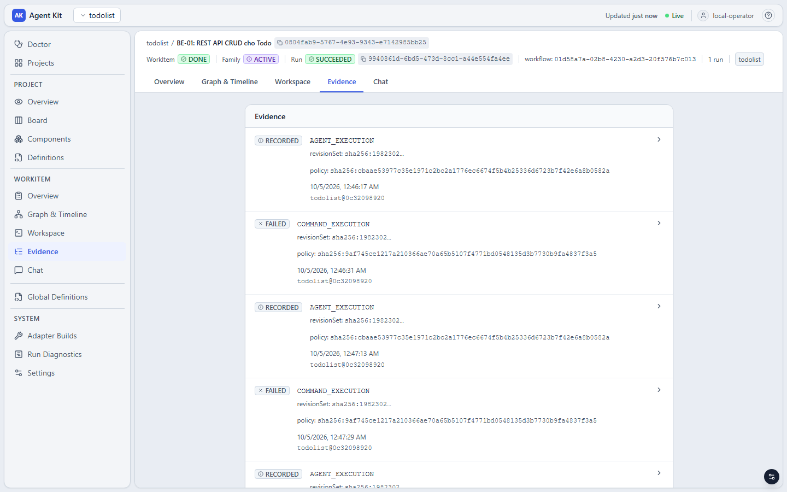

# Vận hành todolist trên `aw`: xem trạng thái, xử lý sự cố, bảo trì

Tài liệu này đi kèm [README](README.md). README đi theo đường thẳng: cài đặt, định nghĩa workflow, chạy task, commit,
merge. Tài liệu này gom những việc còn lại mà người vận hành gặp hằng ngày: đọc trạng thái, gửi thêm thông tin cho
agent, xem bằng chứng và mã nguồn, xử lý khi một run hỏng giữa chừng, mở rộng phạm vi sang repository khác, và bảo trì
bản cài.

Mọi lệnh và output ở đây đã chạy thật trên `aw` (xem "Phạm vi kiểm chứng" trong README). Phần lớn tình huống ở mục 5
là những nhánh mà một agent thật không tự đi vào theo yêu cầu (sửa ngoài scope, không sửa nổi lỗi, bị hủy giữa
chừng…), nên chúng được dựng bằng một **agent giả lập** làm theo kịch bản, với script kiểm tra thế thân. Ở những
transcript đó, các dòng do script in ra (ví dụ `FAIL src/simChange.test.ts …`) là output của bản thế thân; mọi thứ
do `aw` in ra là thật. Mục 5.9 và các ví dụ có ghi "chạy thật" lấy từ lần chạy với Claude CLI thật. Output được rút
gọn; id dài được cắt bằng `…`.

Quy ước dùng trong tài liệu:

```bash
P=$(jq -r .projectId aw-state.json)          # project id; aw-state.json do init-project.sh tạo (README 2.6)
FAMILY=$(jq -r .root.familyId aw-state.json) # family của WorkItem gốc hiện tại
```

- **Cờ đứng trước, tham số vị trí (id) đứng cuối.** `aw run cancel --reason "…" --yes <runId>` đúng;
  `aw run cancel <runId> --reason "…"` sai.
- **Lệnh sửa dữ liệu đọc body JSON từ stdin** hoặc `--file`, và nhận `--idempotency-key`. Gọi lại cùng khóa với cùng
  body trả về kết quả cũ (`"replayed": true`).
- **`--yes`** chỉ dành cho các lệnh "tác động lớn" (bảng ở [mục 8](#8-lệnh-nào-cần---yes)). Lệnh khác nhận `--yes` sẽ
  báo `flag provided but not defined: -yes`.

## Mục lục

- [1. Xem trạng thái](#1-xem-trạng-thái)
- [2. Message và context của agent](#2-message-và-context-của-agent)
- [3. Evidence và artifact](#3-evidence-và-artifact)
- [4. Mã nguồn và release](#4-mã-nguồn-và-release)
- [5. Khi có sự cố](#5-khi-có-sự-cố)
- [6. Thêm repository cho một family: scope expansion](#6-thêm-repository-cho-một-family-scope-expansion)
- [7. Bảo trì bản cài](#7-bảo-trì-bản-cài)
- [8. Lệnh nào cần `--yes`](#8-lệnh-nào-cần---yes)

---

## 1. Xem trạng thái

### 1.1 Bản cài

```bash
aw version --json     # version, commit, goVersion, os, schemaVersion, uiEmbedded
aw health live        # status: live
aw health ready       # status: ready
aw doctor
```

```text
status: HEALTHY
restartRequired: false
checks:
  - process_liveness [LIVENESS] HEALTHY: process is running and able to respond
  - app_config [READINESS] HEALTHY: startup configuration is valid
  - database [READINESS] HEALTHY: database is reachable
  - artifact_root [READINESS] HEALTHY: …/install/artifacts exists and is writable
  - git [READINESS] HEALTHY: git version 2.55.0
  - safe_settings [READINESS] HEALTHY: persisted safe settings desired document decodes cleanly
  - provider:claude [CAPABILITY] HEALTHY: observed executable fingerprint sha256:ebfe5b83…, size=4553216 bytes …
  - provider_environment:claude [CAPABILITY] HEALTHY: the claude executable ran its version probe in the environment
    an agent would get from this worker, which inherits only the variable names: HOME, PATH, SystemRoot
  - isolation_enforcement [CAPABILITY] HEALTHY: OPERATOR_TRUSTED_LOCAL isolation is enforceable; …
```

Hai dòng `provider…` chỉ xuất hiện khi `aw doctor` biết đường dẫn Claude CLI và danh sách biến môi trường, qua hai biến
`AW_CLAUDE_EXECUTABLE` và `AW_ENV_ALLOWLIST` (README 2.5). Dòng `provider_environment` chạy `--version` của CLI với
đúng các biến mà agent sẽ có; nếu báo `PROVIDER_ENV_INSUFFICIENT` thì agent cũng sẽ không khởi động được.

`aw doctor` **không** so executable với adapter build đã đăng ký. CLI bị thay sau khi đăng ký vẫn cho `HEALTHY`; chỗ
phát hiện là lúc chạy node AGENT ([mục 5.6](#56-claude-cli-thay-đổi-sau-khi-đăng-ký-adapter_build_drift)).

```bash
aw adapter list --json                                    # mọi adapter build đã đăng ký
aw adapter show "$(jq -r .adapterBuild aw-state.json)"    # build mà các workflow đang pin
```

### 1.2 Project, repository, component, pack

```bash
aw project list
aw project show "$P"
aw repository list "$P"
aw repository show todolist            # status, defaultRef, version (không cần --project-id)
aw repository onboarding todolist      # các lần probe: state, result, baseCommit, dirty
aw component list "$P"                 # backend, frontend, docs: mỗi thư mục cấp 1 một component
aw pack-assignment list <componentId>  # Pack đang gán cho component, ai gán, lúc nào
aw repository readiness show todolist  # readiness profile và baseline của từng worktree (README 2.7)
```

### 1.3 Catalog definition và version

```bash
aw definition list --kind WORKFLOW --project-id "$P"     # WORKFLOW có scope project
aw definition list --kind GATE                           # các loại còn lại là global: không có --project-id
aw definition show --kind SKILL todo-skill-review
aw definition versions --kind POLICY todo-policy-attempt # mọi version, kèm canonicalSource và publishedAt
aw version show <versionId>                              # một version (thêm --project-id "$P" cho WORKFLOW)
aw version diff <versionIdA> <versionIdB>
```

`status: DRAFT` trong `definition list`/`show` là trạng thái của vỏ definition, không nói gì về version: version đã
publish là bất biến và dùng được ngay.

`aw version diff` so nguồn của hai version theo dòng. Ví dụ sau khi đổi `timeoutSeconds` của `policy-attempt`:

```bash
aw version diff 9ff2982f-… 51c232f2-… | jq -r '.sourceDiff[] | select(.op != "equal") | "\(.op)\t\(.text)"'
# remove	    "timeoutSeconds": 1800
# add   	    "timeoutSeconds": 30
```

Version id của mọi definition trong project nằm trong `aw-state.json`:
`jq -r '.definitions.POLICY["policy-attempt"].versionId' aw-state.json`.

### 1.4 Bảng việc và WorkItem

```bash
aw work-item list --project-id "$P"                          # mọi WorkItem, trạng thái THẬT
aw work-item show --project-id "$P" <workItemId>             # một WorkItem, trạng thái THẬT
aw work-item children --project-id "$P" <rootWorkItemId>     # các con trực tiếp của một gốc
aw work-item detail --project-id "$P" <workItemId>           # thẻ trên bảng + readiness tính lại + mọi run
aw work-item kanban --project-id "$P" --status BLOCKED       # bảng; --status lặp lại được, thêm --family-id <id>
aw task-family show --project-id "$P" "$FAMILY"              # status và scopeVersion của family
```

Có hai nguồn trạng thái, và chúng **không luôn khớp nhau**:

- `work-item list` / `show`, và các trường `readiness`, `runs` của `work-item detail`, đọc thẳng dữ liệu gốc.
- `work-item kanban`, trường `card` của `work-item detail`, và màn hình Board trên UI đọc một bảng tổng hợp
  (projection) do worker cập nhật từ dòng sự kiện.

Trên bản build đã kiểm chứng, thẻ của WorkItem đã hoàn thành **không chuyển sang `DONE`** mà đứng ở `ACTIVE` với
run `COMPLETING`, kể cả sau khi rebuild projection ([mục 7.2](#72-projection-của-bảng)):

```text
BE-01: REST API CRUD cho Todo          card=ACTIVE   run=COMPLETING   work-item show: DONE
FS-01: Hiển thị thời gian tạo của todo card=ACTIVE   run=COMPLETING   work-item show: DONE
CHECK-01: kiểm tra nhánh chính …       card=BLOCKED  run=FAILED       work-item show: BLOCKED
```

Vì vậy: cột `BACKLOG`, `READY`, `BLOCKED` và số run trên bảng dùng được; muốn biết một task **đã xong chưa** thì đọc
`aw work-item show` (hoặc `readiness.status` trong `work-item detail`). `aw work-item kanban --status DONE` trả danh
sách rỗng.

`work-item detail` là lệnh nên dùng khi xem một task: `card.topBlockerType` cho biết đang bị chặn bởi gì, `runs` liệt
kê mọi run từ cũ tới mới.

```json
{"card": {"status": "BLOCKED", "topBlockerType": "RUN_FAILED", "runCount": 1, "…": "…"},
 "readiness": {"status": "BLOCKED", "version": 4, "ready": true},
 "runs": [{"runId": "2f746862-…", "runNumber": 1, "state": "FAILED", "workflowVersionId": "…"}]}
```

### 1.5 Run

```bash
show-run.sh <runId>                         # gom các lệnh dưới đây thành một màn hình (README 4.3)
aw run show <runId>                         # state, workItemId, approvalRequests, waitRegistrations
aw run timeline <runId>                     # NODE_RUN, EXECUTION_ATTEMPT, usage
aw run graph <runId>                        # node và outcome của đúng workflow version mà run đang chạy
aw run diagnostics --project-id "$P" <runId>
```

`run timeline` trả lời "node nào chạy mấy vòng, chọn outcome gì, attempt hỏng vì đâu". Với attempt hỏng vì lỗi kỹ
thuật, `failureCode` và `failureDetail` nằm ngay trong entry `EXECUTION_ATTEMPT`:

```text
attempt implement #1: FAILED SCOPE_VIOLATION 1 path(s) outside the granted scope: todolist:README.md
```

Trường `usage` của timeline là tổng token và chi phí mà provider CLI tự báo cáo, cộng trên mọi attempt của run:
`{"inputTokens": 18425, "cachedInputTokens": 0, "outputTokens": 400, "costUsd": 0.1}`.

`run diagnostics` trả lời "vì sao run hay WorkItem đứng lại": blocker đang mở, attempt mồ côi, tình trạng provider, và
trạng thái từng worktree.

```json
{"workItemStatus": "BLOCKED", "runState": "FAILED",
 "blockers": [{"blockerId": "2f746862-…-run-failed-blocker", "type": "RUN_FAILED", "state": "OPEN",
               "reason": "workflow run 2f746862-… failed (RUN_FAILED)", "admissionReason": false}],
 "repositoryWorkspaces": [{"repositoryId": "todolist", "state": "READY", "generation": 1,
                           "hasActiveWriteLease": false}]}
```

### 1.6 Dòng sự kiện

```bash
aw events watch --project-id "$P"                    # phát lại từ đầu rồi theo dõi tiếp; Ctrl+C để dừng
aw events watch --project-id "$P" --from-cursor 400  # chỉ từ vị trí 400 trở đi
```

```text
{"journalPosition":2,"eventType":"ProjectCreated","schemaVersion":1}
{"journalPosition":3,"eventType":"RepositoryRegistered","schemaVersion":1}
…
{"journalPosition":152,"eventType":"EXECUTION_ATTEMPT_FINALIZED","schemaVersion":1}
```

Mỗi dòng là một sự kiện: vị trí, loại, version schema. Lệnh hợp để theo dõi tiến độ từ một terminal khác hoặc để một
script chờ một loại sự kiện; nội dung chi tiết đọc bằng các lệnh ở trên.

---

## 2. Message và context của agent

Message là kênh để người vận hành nói thêm với agent mà không sửa contract. Mọi node AGENT chạy sau đó nhận message
trong phần `messages` của prompt.

```bash
echo "Dùng record Java cho DTO." | aw message append --project-id "$P" --role USER <workItemId>
echo "RÀNG BUỘC: không đổi tên field nào trong openapi.yaml." \
  | aw message append --project-id "$P" --role USER --pinned <workItemId>
aw message upload-attachment --project-id "$P" --role USER --content-type text/markdown \
  --file review-notes.md <workItemId>
aw message list --project-id "$P" <workItemId>
aw message content --project-id "$P" --output - <workItemId> <messageId>
```

- `review-task.sh` và `retry-task.sh` tự append phản hồi của bạn thành message; `MESSAGE="…" run-task.sh` append trước
  khi chạy. Lệnh trên dùng khi muốn gửi thêm ở thời điểm khác.
- `upload-attachment` tạo một message có nội dung là file; đã kiểm chứng với file Markdown. Chuyển tài liệu PDF, Word
  sang văn bản trước khi gửi.
- `message content --output -` in nội dung ra stdout, và in một dòng mô tả (hash, kích thước, media type) ra stderr.
- `aw message context-snapshot` chỉ dùng được cho message gắn với một attempt; với message của người vận hành nó báo
  `message has no linked execution attempt`.

**Ngân sách message.** `aw-project.json` của todolist khai `"messageBudget": {"maxBytes": 32768, "keepLatest": 2}`.
Khi tổng message vượt `maxBytes`, engine giữ nguyên văn các message **ghim** và `keepLatest` message mới nhất; phần
còn lại chỉ còn là tham chiếu trong `omittedMessages`. Kiểm chứng với một task có 5 message (1 ghim, 3 ghi chú dài
khoảng 20 KB, 1 file đính kèm): agent nhận `messages=3`, `omittedMessages=2`. Vì vậy ràng buộc phải sống suốt task thì
gửi kèm `--pinned`.

**Agent đã thực sự nhận gì.** Mỗi attempt AGENT có một ContextSnapshot:

```bash
snap=$(aw run timeline <runId> | jq -r '[.entries[] | select(.kind=="EXECUTION_ATTEMPT" and .nodeKey=="implement")][-1].contextSnapshotId')
aw context-snapshot show --project-id "$P" <workItemId> "$snap" | jq '{resources: [.resourceRefs[].resourceKey], repositoryInstructionFiles}'
```

```json
{"resources": ["dev.definition-of-done", "spring.rest-api", "sqlite.datasource", "dev.implement-feature",
               "spring.project-structure", "sqlite.migrations", "spring.testing", "dev.stack-overview"],
 "repositoryInstructionFiles": [{"repositoryId": "todolist", "fileName": "CLAUDE.md",
   "sha256": "sha256:fe70e6df…", "sizeBytes": 545, "warnLimitBytes": 16384, "oversized": false}]}
```

`resources` là các resource đã qua selector (README 3.3): task `backend` không nhận resource `react.*`.
`repositoryInstructionFiles` ghi lại file `CLAUDE.md` mà chính Claude CLI tự nạp từ repository: tên, hash, kích thước,
và có vượt ngưỡng cảnh báo hay không.

**Agent đã nói gì.** Chiều ngược lại, từ agent tới người vận hành, hiện chưa có lệnh `aw` nào: tóm tắt cuối phiên
của agent, câu hỏi của nó, kết luận của AI reviewer đều không nằm trong message, evidence hay UI.
[`agent-log.py`](scripts/agent-log.py) đọc thẳng bảng `agent_events` trong database (chỉ đọc; đây là chi tiết cài đặt,
không phải API công khai):

```bash
agent-log.py <runId>                    # thông điệp cuối của mỗi lần agent chạy, kèm token và chi phí của lần đó
agent-log.py <runId> --node ai-review   # chỉ một node
agent-log.py <runId> --all              # mọi thông điệp
agent-log.py <runId> --denied           # thêm các lệnh agent định chạy nhưng bị từ chối
```

Ví dụ chạy thật ở README mục 4.3 và 4.4. Đây cũng là chỗ đọc lý do khi một attempt AGENT `FAILED` mà không có
`failureDetail` (mục 5.9).

---

## 3. Evidence và artifact

Mỗi node có thực thi để lại evidence. Completion policy của workflow xét evidence của **run hiện tại**.

```bash
aw evidence list --project-id "$P" <workItemId>                                          # mọi evidence của WorkItem
aw evidence list --project-id "$P" --kind COMMAND_EXECUTION --run-id <runId> <workItemId>
aw evidence show --project-id "$P" <workItemId> <evidenceId>
aw evidence verify --project-id "$P" <workItemId> <evidenceId>     # băm lại artifact, so với hash đã ghi
aw artifact list --project-id "$P" <workItemId> <evidenceId>
aw artifact get --project-id "$P" --output - <workItemId> <evidenceId> <artifactId>
```

| Node | `kind` của evidence | `verdict` | Artifact |
|---|---|---|---|
| `AGENT` | `AGENT_EXECUTION` | `RECORDED` | Danh sách file agent đã đổi và patch (base64) so với revision gốc |
| `COMMAND` | `COMMAND_EXECUTION` | `SUCCEEDED` / `FAILED` | Mã thoát, argv, thư mục làm việc, thời gian, stdout/stderr |
| `MACHINE_GATE` | Mỗi tiêu chí một evidence, `kind` là `evidenceKey` của tiêu chí (ví dụ `NO_SECRET_FILES`) | `PASS` / `FAIL` / `ERROR` | Output của lệnh gate |

Một COMMAND thoát mã khác 0 vẫn để lại evidence `FAILED` kèm output. Đây là nơi đọc lý do một bước kiểm tra không đạt,
không cần chạy lại lệnh bằng tay:

```bash
aw artifact get --project-id "$P" --output - <workItemId> d0fd7eec-…:COMMAND_EXECUTION 2078b305-… 2>/dev/null | jq .
```

```json
{"exitCode": 1, "argv": ["run"], "cwdRepositoryTarget": "todolist", "cwd": "…/workspaces/worktrees/ws_4b7a0032…",
 "durationMillis": 22325, "truncated": false,
 "stderr": "GATE 1: frontend, bước 'npm test' không đạt\n … FAIL src/components/DueDateEditor.test.tsx > clears the due date
   with the Bỏ hạn button (AC-7)\nAssertionError: expected <button type=\"button\" …></button> to be null\n …
   Test Files  2 failed | 4 passed (6)\n      Tests  5 failed | 32 passed (37)\n …"}
```

Đây là kết quả chạy thật của `gate1` ở task T-04 (rút gọn): chính đoạn `stderr` này được gửi lại cho agent BUILD trong
`checkFailures`. `retry-task.sh` in sẵn phần này cho mọi bước kiểm tra FAILED của run trước.



`aw evidence verify` trả `"verdict": "VERIFIED"` khi mọi artifact còn nguyên vẹn:

```json
{"evidenceId": "a631d34f-…:COMMAND_EXECUTION", "verdict": "VERIFIED",
 "artifacts": [{"artifactId": "f24db26a-…", "verified": true}]}
```

Mỗi evidence ghi `revisions` (commit của worktree lúc node chạy) và `policyVersion`. Timeout, bị kill, hay không spawn
được lệnh **không** để lại evidence: đó là lỗi kỹ thuật, đọc ở `failureCode` của attempt trong `run timeline`.

---

## 4. Mã nguồn và release

Thay đổi **chưa commit** của agent xem bằng git trong worktree (`git -C "$(worktree-path.sh)" status` và `diff`,
README 4.5). Các lệnh dưới đây đọc những gì **đã commit**, qua `aw`, không cần biết worktree nằm ở đâu.

```bash
aw workspace-set show --project-id "$P" "$FAMILY"    # workspaceSetId, state, các repositoryWorkspace
aw repository-workspace show --project-id "$P" <repositoryWorkspaceId>
```

```json
{"workspaceSetId": "104806f3-…", "familyId": "65b0c737-…", "state": "READY", "version": 3,
 "repositoryWorkspaces": [{"repositoryWorkspaceId": "dd652aaf-…", "repositoryId": "todolist", "generation": 1,
   "state": "READY", "version": 1, "currentRevision": "e3a62424…", "hasActiveWriteLease": false}]}
```

`currentRevision` là commit mà worktree được tạo ra từ đó. Nó **không** tiến lên sau local commit; HEAD thật của
worktree lấy bằng `git -C "$(worktree-path.sh)" rev-parse HEAD`.

Ba lệnh đọc mã nguồn dùng chung bốn tham số định vị, và mỗi revision đi kèm số `generation` của worktree:

```bash
RW=<repositoryWorkspaceId>; WS=<workspaceSetId>; HEAD=$(git -C "$(worktree-path.sh)" rev-parse HEAD)
LOC="--project-id $P --repository-id todolist --workspace-set-id $WS"

aw repository-workspace log    $LOC --anchor "$HEAD" --anchor-generation 1 --limit 3 "$RW"
aw repository-workspace diff   $LOC --base-revision <commitA> --base-revision-generation 1 \
                                    --result-revision "$HEAD" --result-revision-generation 1 "$RW"
aw repository-workspace source $LOC --revision "$HEAD" --revision-generation 1 --path CLAUDE.md --output - "$RW"
```

- `log` trả `entries` gồm `commitId`, `parentIds`, tác giả, `subject`. Trang kế tiếp: `--cursor <commitId cuối>`.
- `diff` trả `files` (đường dẫn, số dòng thêm/bớt) và `patch` mã hóa base64:
  `… | jq -r .patch | base64 -d`. Giới hạn bằng `--file-limit`, `--byte-limit`; kết quả có `filesTruncated`,
  `patchTruncated`.
- `source` in nội dung file ra stdout và một dòng mô tả (`totalBytes`, `lineCount`, `truncated`, `binary`) ra stderr.

Tab **Workspace** của một task trên UI dùng đúng ba thao tác này.

### ReleaseSet và local commit

`commit-task.sh` (README 4.6) làm ba bước `release-set create` → `seal` → `local-commit`. Các lệnh đọc:

```bash
aw release-set list --project-id "$P" "$FAMILY"      # mọi ReleaseSet của family và trạng thái
aw release-set show <releaseSetId>
aw release-set local-commit status --project-id "$P" <releaseSetId> <localCommitId>
```

Trạng thái của ReleaseSet: `CREATED` → `SEALED` (đã chốt, tạo được local commit) hoặc `ABANDONED`. Một ReleaseSet tạo
nhầm, chưa seal, bỏ bằng:

```bash
aw release-set abandon --expected-version 1 --idempotency-key abandon-1 --yes <releaseSetId>   # → "state": "ABANDONED"
```

ReleaseSet đã `SEALED` không abandon được; cứ để nguyên. Local commit trên worktree không có thay đổi kết thúc ngay ở
`FAILED` với `failureReason: "NO_CHANGES"`, không tạo commit và không thử lại:

```json
{"state": "FAILED", "failureReason": "NO_CHANGES", "parentVcsObjectId": "26b77673…"}
```

---

## 5. Khi có sự cố

Hai lệnh đầu tiên luôn là `show-run.sh <runId>` và `aw run diagnostics --project-id "$P" <runId>`.

### 5.1 Run kết thúc `FAILED`

Run `FAILED` mở blocker `RUN_FAILED` và đưa WorkItem sang `BLOCKED`. Bạn chạy lại **trên chính WorkItem đó**, không
tạo WorkItem mới: message, evidence và lịch sử ở nguyên một chỗ.

```bash
retry-task.sh <workItemId> "Lần trước test vẫn đỏ sau 3 vòng sửa: kiểm tra lại simChange.ts."
```

```text
      4 lệnh thoát mã 1: FAIL src/simChange.test.ts - renders due date: expected ok received SIM_BUG
      1 lệnh thoát mã 1: Thay doi bi nguoi duyet tu choi.
Đã gỡ blocker 2f746862-…-run-failed-blocker
Run: a5bd6e89-…  state: SUCCEEDED
  #1 start (vòng 0): SUCCEEDED next
  #2 implement (vòng 0): SUCCEEDED done
  #3 verify (vòng 0): SUCCEEDED passed
  #4 end (vòng 0): SUCCEEDED
```

[`retry-task.sh`](scripts/retry-task.sh) làm bốn việc, đều là lệnh `aw` thường:

1. In output của các bước kiểm tra `FAILED` trong run trước (`evidence list` + `artifact get`).
2. `aw blocker resolve --mode RESOLVED --reason "…" <blockerId>` cho mọi blocker đang mở. WorkItem về `READY`.
3. Append ghi chú thành message.
4. `aw run start` với **đúng workflow version đã pin** và một khóa idempotency mới.

Những điều cần biết:

- **Worktree không được reset.** Run mới bắt đầu từ những gì run trước để lại. Xem `git -C "$(worktree-path.sh)" status`
  và hoàn tác những gì run mới không nên thấy **trước khi** chạy lại.
- **Workflow version không đổi được.** WorkItem pin version trong contract; `run start` với version khác bị từ chối.
  Muốn chạy bằng workflow vừa publish lại thì tạo WorkItem mới (sửa `title` trong file rồi `run-task.sh`).
- **Evidence của run cũ không tính cho run mới.** Completion policy chỉ xét run hiện tại.
- `RUN_FAILED` chỉ `RESOLVED` được, không `WAIVED` được. Muốn bỏ hẳn: `aw work-item cancel` (5.3).
- `work-item detail` cho thấy lịch sử: `"runs": [{"runNumber": 1, "state": "FAILED"}, {"runNumber": 2, "state": "SUCCEEDED"}]`.

### 5.2 `SCOPE_VIOLATION`: agent sửa ngoài `pathScopes`

```text
Run: ccb47771-…  state: FAILED
  #2 implement (vòng 0): FAILED
  attempt implement #1: FAILED SCOPE_VIOLATION 1 path(s) outside the granted scope: todolist:README.md
```

Đây là kết luận về những gì attempt **đã ghi**, không phải lỗi provider, và không được thử lại tự động.
`failureDetail` nêu tên các đường dẫn vi phạm. File vi phạm vẫn nằm trong worktree:

```bash
WT=$(worktree-path.sh)
git -C "$WT" status --porcelain            #  M README.md   ← ngoài scope "backend"
git -C "$WT" checkout -- README.md         # hoàn tác phần ngoài scope, giữ phần trong scope
retry-task.sh <workItemId> "Chỉ sửa trong backend/. README.md nằm ngoài phạm vi của task này."
```

Nếu task thật sự cần sửa chỗ đó thì scope của task sai: tạo WorkItem mới với `pathScopes` rộng hơn. Thay đổi chưa
commit của **task trước** cũng bị tính là ngoài scope của task sau; vì vậy commit sau mỗi task (README 4.6).

Agent CHECKER và MACHINE_GATE chỉ có quyền đọc: bất kỳ thay đổi nào trong repository cũng cho `SCOPE_VIOLATION`.

### 5.3 Dừng một run, bỏ một task

**Cách an toàn: dừng khi run đang chờ ở một cổng duyệt.** Lúc đó không có agent nào đang ghi.

```bash
aw run cancel --reason "đổi yêu cầu, tạm dừng" --yes <runId>     # → "state": "CANCELLING", rồi CANCELLED
```

```text
Run: e8384d40-…  state: CANCELLED
  #5 ai-review (vòng 0): SUCCEEDED approved
  #6 review (vòng 0): CANCELLED
  BLOCKER RUN_CANCELLED đang mở
```

Worktree vẫn `READY` và giữ nguyên thay đổi của agent. WorkItem `BLOCKED` bởi `RUN_CANCELLED`. Từ đây có hai lối:

```bash
retry-task.sh <workItemId> "Yêu cầu mới: hiển thị cả giờ cập nhật."   # làm tiếp trên cùng WorkItem
aw work-item cancel --reason "không làm task này nữa" --yes <workItemId>   # bỏ hẳn → CANCELLED
```

`RUN_CANCELLED` có thể `WAIVED`, nhưng cần `--policy-grant-ref`; không có grant thì lệnh báo
`WAIVED requires Actor, Reason and PolicyGrantRef`. Dùng `RESOLVED` (là cái `retry-task.sh` làm).

Sau `work-item cancel`, thay đổi dở dang vẫn nằm trong worktree. Dọn trước khi chạy task khác:
`git -C "$WT" checkout -- . && git -C "$WT" clean -fd`.

Ở một cổng duyệt, chọn `rejected` cũng dừng run, nhưng run kết thúc `FAILED` (qua node `reject`) chứ không
`CANCELLED`.

**Hủy khi agent đang chạy thì khác hẳn**: xem 5.4.

### 5.4 Worktree bị `QUARANTINED`

`aw run cancel` trong lúc một agent MAKER đang chạy cắt ngang một attempt đang ghi. Engine không biết worktree đang ở
trạng thái nào nên cách ly nó:

```text
Run: bc290cd0-…  state: CANCELLED
  #2 implement (vòng 0): CANCELLED
  attempt implement #1: INDETERMINATE OWNERSHIP_LOST_MUTATING
  BLOCKER RUN_CANCELLED đang mở
  WORKTREE của todolist bị QUARANTINED: đọc operations.md mục 5.4 trước khi làm gì tiếp
```

Khi worktree của family bị `QUARANTINED`:

- `aw blocker resolve` bị từ chối: `work item's family has a quarantined repository workspace`;
- task mới trong family không `READY` được: `baseline pending — the repository workspace is QUARANTINED, not READY`.

Lệnh dành cho tình huống này là `aw repository-workspace reconcile`. Trên bản build đã kiểm chứng, lệnh **không đưa
được family trở lại làm việc**. Cụ thể đã quan sát được:

| Bước | Kết quả quan sát được |
|---|---|
| Reconcile khi worktree **còn file dở dang** | Worktree giữ `QUARANTINED`, version không đổi. Mọi lần reconcile sau đó bị từ chối: `already has an open reconciliation at version 2`. Không còn lối nào khác |
| Dọn sạch worktree **rồi** reconcile | Engine tạo một worktree mới, `generation: 2`, `READY`, trên một **branch mới** tách từ commit gốc của family. Các commit family đã có (ở branch cũ) **không** nằm trong worktree mới |
| Baseline của worktree mới | Đứng ở `PENDING`; phải gọi `aw repository readiness verify todolist` mới chạy |
| `blocker resolve` sau đó | Vẫn bị từ chối, vì dòng `generation: 1` vẫn `QUARANTINED` |
| Task mới trong family | Attempt AGENT `FAILED` với `CONFLICT`: run vẫn gắn với `generation: 1` |

Vì vậy cách xử lý thực tế là **đóng family đó lại và làm tiếp ở một family mới**:

```bash
# 1. Commit đã có của family nằm trên branch cũ của nó. Đưa chúng về nhánh chính.
cd ~/work/todolist && git worktree list            # tìm branch agentkit/w-… của worktree bị cách ly
git merge --no-ff agentkit/w-<branch cũ>

# 2. Bỏ task dở và mở đợt mới từ nhánh chính đã merge.
aw work-item cancel --reason "run bị hủy giữa chừng, làm lại ở đợt mới" --yes <workItemId>
create-root.sh "Đợt sửa lỗi (tiếp)"
run-task.sh <file task dở> <workflow>
```

Phần agent đã viết dở (chưa commit) nằm trong thư mục worktree cũ; muốn giữ thì chép tay sang trước khi bỏ.

Cách tránh: không `run cancel` khi timeline đang có một node AGENT `RUNNING`. Chờ agent xong (run sẽ dừng ở bước kiểm
tra hoặc cổng duyệt) rồi mới hủy như 5.3. Mỗi attempt đã có giới hạn thời gian (`timeoutSeconds` của policy ATTEMPT)
và giới hạn chi phí (`--claude-max-budget-usd`), nên chờ không phải là chờ vô hạn.

### 5.5 Worker chết khi agent đang chạy

Mất điện, kill nhầm `aw worker`, máy treo. Sau khi khởi động lại worker:

```text
Run: ccbb7416-…  state: FAILED
  #2 implement (vòng 0): FAILED
  attempt implement #1: INDETERMINATE OWNERSHIP_LOST_MUTATING
  attempt implement #2: FAILED CONFLICT
  BLOCKER RUN_FAILED đang mở
```

Attempt đầu mất chủ; attempt thứ hai `CONFLICT` vì attempt đầu vẫn giữ **khóa ghi** worktree
(`"hasActiveWriteLease": true` trong `run diagnostics`). Worktree vẫn `READY`, không bị cách ly. Khóa tự hết hạn sau
`timeoutSeconds` của policy ATTEMPT cộng 2 phút, tính từ nhịp cuối của worker cũ: với `policy-attempt` của todolist
(30 phút) là khoảng 32 phút. `retry-task.sh` gọi trước lúc đó sẽ lại `CONFLICT`.

```bash
aw run diagnostics --project-id "$P" <runId> | jq '.repositoryWorkspaces[0].hasActiveWriteLease'   # chờ tới false
git -C "$(worktree-path.sh)" status --porcelain     # xem attempt dở đã để lại gì
retry-task.sh <workItemId> "Worker chết giữa chừng lần trước."
```

Đã kiểm chứng với một policy có `timeoutSeconds: 30`: khóa hết hạn sau 150 giây, `retry-task.sh` sau đó chạy
`SUCCEEDED`. Trong lúc chờ, family đó không chạy được task ghi nào khác; các family khác không bị ảnh hưởng.

Worker dừng khi run đang chờ ở cổng duyệt thì không mất gì: trạng thái nằm trong database. Đã kiểm chứng: dừng worker
lúc run chờ ở `review`, khởi động lại, `review-task.sh … approved`, run chạy tiếp tới `SUCCEEDED`.

### 5.6 Claude CLI thay đổi sau khi đăng ký: `ADAPTER_BUILD_DRIFT`

Workflow pin một adapter build, trong đó có SHA-256 của file executable Claude CLI (README 3.4). Claude CLI tự cập
nhật, hoặc bạn cài bản khác vào cùng đường dẫn, là executable đã đổi. Node AGENT kế tiếp không được chạy:

```text
Run: 01dba780-…  state: RUNNING
  #2 implement (vòng 0): BLOCKED
  BỊ CHẶN ADAPTER_BUILD_DRIFT: adapter build drift: … observed build sha256:c65b90c6…, pinned build sha256:6f2fbb0a…
    sửa nguyên nhân rồi chạy: aw node-run retry-blocked --reason "<lý do>" d3545131-…
```

Run vẫn `RUNNING`; WorkItem `BLOCKED`. Có hai cách, tùy bạn muốn dùng bản CLI nào:

**Giữ bản CLI đã đăng ký.** Đặt lại đúng file cũ vào đường dẫn cũ, rồi cho node bị chặn chạy lại:

```bash
aw node-run retry-blocked --reason "đã khôi phục đúng bản CLI đã đăng ký" <nodeRunId>
# {"nodeRunId": "d3545131-…", "retried": true, "reactivatedNodeRunId": "31e2b715-…"}
watch-run.sh <runId>           # run chạy tiếp tới SUCCEEDED
```

Gọi khi nguyên nhân chưa hết thì lệnh trả `"retried": false` kèm `failureReason` và `failureDetail`; không có gì bị
đổi, sửa xong gọi lại. `aw node-run retry-blocked` cần biết đường dẫn CLI: đặt `AW_CLAUDE_EXECUTABLE` như README 2.5.

**Chuyển sang bản CLI mới.** Chạy lại `aw-publish.py`: script đăng ký adapter build mới và publish version mới cho
mọi workflow. WorkItem **đã tạo** vẫn pin workflow cũ (build cũ), nên run đang bị chặn không cứu được bằng cách này:
`aw run cancel` nó, `aw work-item cancel`, rồi `run-task.sh` lại để có WorkItem mới pin workflow mới. Cổng duyệt đang
chờ không gọi agent nên không bị ảnh hưởng cho tới khi run quay lại một node AGENT.

Để tránh bất ngờ, trỏ `--claude-executable` vào một bản CLI cố định (tắt tự cập nhật, hoặc dùng bản cài theo version),
và coi việc nâng CLI là một lần `aw-publish.py` có chủ đích giữa hai đợt việc.

Ba blocker admission còn lại (`ISOLATION_ENFORCEMENT_UNAVAILABLE`, `CAPABILITY_REQUIREMENT_UNSATISFIED`,
`WRITE_CAPABILITY_OR_GRANT_MISSING`) xử lý cùng cách: sửa nguyên nhân, rồi `aw node-run retry-blocked`.

### 5.7 Baseline của repository đỏ

Repository có readiness profile (README 2.7) thì mỗi worktree mới chạy lệnh kiểm tra của profile **trước khi** nhận
task ghi. Lệnh đó đỏ nghĩa là repository đã hỏng từ trước, không phải do task:

```bash
aw repository readiness show todolist
```

```json
{"baselineState": "FAIL", "admitsWriters": false,
 "reason": "the VERIFICATION baseline of readiness profile version 2 failed (PRE_EXISTING_FAILURE)",
 "attempt": {"attemptId": "277494ae-…", "outcome": "RED", "failureKind": "PRE_EXISTING_FAILURE", "exitCode": 1,
             "stderrExcerpt": "FAIL TodoApplicationTests.contextLoads"}}
```

`create-root.sh` dừng với `baseline: FAIL`, và task không `READY` được:

```text
repository todolist: baseline FAILED (PRE_EXISTING_FAILURE, attempt 277494ae-…) before any change — fix the
repository and run `aw repository readiness verify`, or accept the failure with `aw repository readiness accept-exception`
```

Hai lối, đúng như thông báo:

```bash
# Sửa nhánh chính cho xanh, rồi chạy lại baseline trên mọi worktree đang READY
aw repository readiness verify todolist

# Hoặc chấp nhận: task sắp chạy chính là task sửa cái đang đỏ
aw repository readiness accept-exception --attempt-id 277494ae-… \
  --reason "test contextLoads đỏ từ trước, task này sửa nó" todolist
```

Ngoại lệ được ghi kèm tên người chấp nhận và lý do, chỉ cho đúng attempt đó. Khi một bước kiểm tra của task fail,
agent được báo rõ baseline thuộc trường hợp nào (trường `baseline` trong `checkFailures`):

```text
baseline xanh:  "… its baseline passed before this task started, so a check that fails now was passing — the failure
                comes from the changes made during this task."
đã chấp nhận:   "… its baseline had already failed before this task started (PRE_EXISTING_FAILURE, …) and an operator
                accepted it (…). A failure that matches the baseline is not caused by this task; fix what this task
                changed and leave the rest."
```

`failureKind: ENVIRONMENT_ERROR` nghĩa là lệnh không chạy được (thiếu executable, timeout): sửa môi trường của
worker rồi `verify`. Đổi profile bằng `aw repository readiness set` cũng chạy lại baseline trên mọi worktree `READY`.

### 5.8 Repository `BLOCKED` sau khi đăng ký

```bash
aw repository show todolist-contract
# "status": "BLOCKED", "lastProbeErrorCode": "NOT_FOUND", "version": 3
```

Đường dẫn chưa tồn tại, chưa phải Git repo, hoặc chưa có commit. Sửa trên đĩa, rồi probe lại với `version` vừa đọc:

```bash
aw repository retry-probe --expected-version 3 todolist-contract      # → "status": "PROBING", rồi ACTIVE
```

Nếu sai là ở chính đường dẫn đã đăng ký thì không sửa được: đăng ký lại với một `repositoryId` khác. Id không dùng lại
được (đăng ký trùng id báo `CONFLICT`).

### 5.9 Provider hết hạn mức hoặc trả lỗi

Chạy thật: giữa đợt, tài khoản Claude hết hạn mức của phiên. Claude CLI vẫn khởi động được, nhưng trả kết quả lỗi
ngay. Attempt `FAILED` với `EXECUTION_FAILED`, không có `failureDetail`, không tốn token; lỗi này không được thử lại
tự động, nên node và run `FAILED`:

```text
Run: 69d8a3e7-6f59-4fe9-a0c4-6a676c0d1715  state: FAILED
  #2 frame (vòng 0): FAILED
  attempt frame #1: FAILED EXECUTION_FAILED
  provider báo cáo: 0 token vào, 0 token ra, 0 USD
  BLOCKER RUN_FAILED đang mở
```

Lý do nằm trong lời của agent, không nằm trong timeline:

```bash
agent-log.py 69d8a3e7-6f59-4fe9-a0c4-6a676c0d1715
# == #2 frame (vòng 0) attempt 1: FAILED  [0 token vào, 0 token ra, 0.0000 USD]
# You've hit your session limit · resets 5:30am (Asia/Barnaul)
```

Chờ hạn mức được đặt lại, rồi `retry-task.sh <workItemId>` (mục 5.1). Hai điều cần nhớ:

- Run mới chạy lại workflow **từ đầu**, kể cả khi run cũ hỏng ở node cuối. Các agent thấy phần việc đã có trong
  worktree và không làm lại, nhưng mỗi node vẫn tốn một lần gọi model, và cổng duyệt hỏi lại.
- Một run có thể `FAILED` **sau** cổng duyệt cuối (ví dụ ở bước cập nhật tài liệu). `review-task.sh` in trạng thái đó;
  `commit-task.sh` từ chối commit khi family còn task `ACTIVE` hoặc `BLOCKED`.

Cùng cách đọc này dùng cho mọi attempt AGENT `FAILED` mà timeline không nói rõ: CLI chưa đăng nhập, model không tồn
tại, mạng lỗi. Giới hạn chi phí của một attempt (`--claude-max-budget-usd`) cũng làm CLI dừng theo cách này.

### 5.10 Bảng tra

| Hiện tượng | Nguyên nhân | Xử lý |
|---|---|---|
| Attempt AGENT `FAILED` `EXECUTION_FAILED`, 0 token | Provider trả lỗi: hết hạn mức, chưa đăng nhập, model sai | `agent-log.py <runId>` đọc lý do; 5.9 |
| `run start`: `workspace set is not READY` | Worker chưa tạo xong worktree của gốc mới | `create-root.sh` đã chờ sẵn; nếu tự gọi `aw`, chờ `workspace-set show` báo `READY`. Kiểm tra `aw worker` đang chạy |
| `run start` / `mark-ready`: `baseline pending` | Baseline chưa chạy xong, hoặc worktree không `READY` | Chờ; `aw repository readiness show`. Worktree `QUARANTINED` → 5.4 |
| `run start`: `work item is not READY` | WorkItem `BACKLOG` (chưa `mark-ready`) hoặc `BLOCKED` | `aw work-item detail` xem `topBlockerType`; `RUN_FAILED`/`RUN_CANCELLED` → `retry-task.sh` |
| `run start`: `requested workflow version does not match the work item's pinned version` | Đã publish lại workflow sau khi tạo WorkItem | Chạy lại bằng version cũ (`retry-task.sh` tự lấy), hoặc tạo WorkItem mới |
| Run `RUNNING` mãi, một node `BLOCKED` | Blocker admission, thường là `ADAPTER_BUILD_DRIFT` | 5.6 |
| Run `RUNNING`, một node `WAITING` | Chờ người duyệt hoặc chờ tín hiệu | `show-run.sh` in sẵn lệnh cần gõ |
| Attempt AGENT `FAILED` `SCOPE_VIOLATION` | Sửa ngoài `pathScopes`, hoặc CHECKER ghi vào repository | 5.2 |
| Attempt AGENT `FAILED` `OUTCOME_REJECTED` | Node nhiều outcome mà agent không in marker, in sai hoặc in hai lần | `agent-log.py <runId>` xem agent đã viết gì; thường là resource của bước đó mô tả outcome chưa rõ. `retry-task.sh` |
| Attempt AGENT `FAILED` `PROVIDER_UNAVAILABLE` | CLI không chạy được: thiếu biến môi trường, chưa đăng nhập, model sai | `aw doctor` (dòng `provider_environment`); README 2.4 |
| Attempt `FAILED` `CONFLICT` | Worktree đang bị attempt khác giữ khóa ghi, hoặc family có worktree bị cách ly | 5.5, 5.4 |
| Node COMMAND `FAILED` `VALIDATION_FAILED` ngay lập tức | Command cần mạng mà không pin policy `NETWORK_ACCESS`; OS không khớp; repository của lệnh không thuộc scope | Sửa khai báo (`aw-publish.py --check` bắt trường hợp đầu), publish lại, WorkItem mới |
| Node COMMAND: `could not be spawned` | Script không chạy được trên OS của worker (ví dụ `.sh` trên Windows) | Publish bằng `aw-publish.py` của hướng dẫn, nó bọc `.sh` thành `.cmd` chạy bằng `sh.exe` của Git (README 3.4); kiểm tra `git` có trên `PATH` của worker |
| MACHINE_GATE `FAILED` không kèm lý do, trong family đã có local commit | Giới hạn đã biết (README mục 6) | Dùng COMMAND cho kiểm tra trong family; MACHINE_GATE chỉ trên gốc mới |
| Local commit `FAILED` `NO_CHANGES` | Worktree không có gì để commit | Không cần làm gì; `commit-task.sh` đã chặn trước |
| Thẻ trên Board đứng ở `ACTIVE`/`COMPLETING` | Giới hạn của projection (1.4) | Đọc `aw work-item show` |
| `definition create`: `CONFLICT … persistent record already exists` | `definitionId` đã có, kể cả ở project khác | Mỗi project một `prefix` (README 3.5) |
| Publish in `CẢNH BÁO: … was last verified N days ago` | `provenance.lastVerified` của resource quá 180 ngày | Rà lại nội dung, đặt `lastVerified` mới, publish lại |

---

## 6. Thêm repository cho một family: scope expansion

Một family chỉ đọc và ghi được những repository có trong scope của nó. Scope ban đầu do `create-root.sh` đặt
(`todolist` WRITE, cộng các repository READ liệt kê thêm trên dòng lệnh). Giữa chừng mới thấy cần thêm một repository
thì xin mở rộng.

Ví dụ: backend cần đối chiếu với hợp đồng API nằm ở một repository khác.

```bash
# 1. Repository thứ hai phải được đăng ký và ACTIVE trong project
jq -n '{repositoryId: "todolist-contract", name: "todolist-contract",
        remoteLocator: "/home/me/work/todolist-contract", defaultRef: "main"}' \
  | aw repository register --project-id "$P" --idempotency-key repo-contract-1

# 2. Xin quyền READ cho family hiện tại
jq -n '{requestedGrants: [{repositoryId: "todolist-contract", access: "READ", reason: "đọc openapi.yaml để đối chiếu"}],
        reason: "Task backend cần đối chiếu với hợp đồng API"}' \
  | aw scope-expansion request --project-id "$P" --idempotency-key scope-1 "$FAMILY"
# "requestId": "9deccccc-…", "status": "PENDING"

# 3. Xem và quyết định
aw scope-expansion list --project-id "$P" "$FAMILY"
aw scope-expansion show --project-id "$P" 9deccccc-…          # có "version" để dùng cho --expected-version
aw scope-expansion approve --project-id "$P" --expected-version 1 9deccccc-…
```

```json
{"requestId": "9deccccc-…", "newScopeVersion": 2,
 "approvedGrants": [{"repositoryId": "todolist-contract", "access": "READ"}],
 "provisionedRepositories": [{"repositoryId": "todolist-contract", "provisionJobId": "63372875-…"}]}
```

Duyệt xong, `scopeVersion` của family tăng (`aw task-family show`), và worker tạo thêm một worktree cho repository
mới trong workspace set của family (`aw workspace-set show` liệt kê cả hai). Từ đó WorkItem con được khai repository
đó trong `effectiveScope`:

```json
"effectiveScope": [
  {"repositoryId": "todolist", "access": "WRITE", "reason": "Chỉ sửa backend", "pathScopes": ["backend"]},
  {"repositoryId": "todolist-contract", "access": "READ", "reason": "đọc openapi.yaml"}
]
```

Agent nhận đường dẫn của cả hai trong system prompt, kèm quyền của từng cái:

```text
- repository todolist: …/worktrees/ws_1fb0d2df… (READ_WRITE)
- repository todolist-contract: …/worktrees/ws_a7c36fcd… (READ_ONLY)
```

Khai một repository chưa được duyệt bị từ chối ngay khi tạo WorkItem:
`child effective scope exceeds approved family scope`.

Hai quyết định còn lại:

```bash
aw scope-expansion reject --project-id "$P" --expected-version 1 --note "hợp đồng API do nhóm khác sở hữu" <requestId>
aw scope-expansion withdraw --project-id "$P" --expected-version 1 <requestId>    # người xin tự rút
```

Ghi chú:

- Một scope chỉ có **một mục cho mỗi repository**. Không khai được vừa WRITE `docs/` vừa READ phần còn lại của cùng
  repository; agent có quyền WRITE vẫn đọc được mọi file trong worktree đó.
- `pathScopes` của một WorkItem đã tạo không đổi được. Cần phạm vi khác thì tạo WorkItem khác.
- Repository thứ hai không có readiness profile thì baseline của nó là `NOT_REQUIRED`.

---

## 7. Bảo trì bản cài

### 7.1 Cấu hình

```bash
aw settings show          # giá trị mong muốn (desired) và giá trị đang có hiệu lực (effective), kèm nguồn
aw settings show --json
```

Phần lớn cấu hình của hướng dẫn này đi qua cờ dòng lệnh và biến môi trường của `aw serve` / `aw worker` (README 2.5),
là cách nên dùng. `aw settings update` ghi một bộ "giá trị mong muốn" vào database; nó chỉ có hiệu lực sau khi khởi
động lại, và `aw doctor` báo `restartRequired: true` cho tới lúc đó. Body phải là **toàn bộ** tài liệu, đủ bảy
trường, không trường nào rỗng:

```bash
jq -n '{managedWorkspaceRoot: "workspaces", managedArtifactRoot: "artifacts", evidenceRetention: "720h0m0s",
        processOutputLimit: 2097152, providerExecutablePath: "claude", providerDefaultModel: "sonnet",
        providerCredentialRef: "env:ANTHROPIC_API_KEY"}' \
  | aw settings update --expected-version 1 --json
```

Thiếu một trường thì lệnh báo `INVALID_REQUEST`, ví dụ `safesettings: managedWorkspaceRoot: must not be empty`. Đừng
đổi hai thư mục gốc ở đây trừ khi bạn cũng đổi cờ `--workspace-root` / `--artifact-root` tương ứng.

### 7.2 Projection của bảng

```bash
aw projection status --project-id "$P" --projection-name workitem
# {"projectionName": "workitem", "generation": 1, "cursor": 417, "status": "LIVE"}
aw projection rebuild --project-id "$P" --projection-name workitem      # dựng lại từ dòng sự kiện
aw projection rebuild-status <operationId>                              # "phase": "SUCCEEDED", "shadowGeneration": 2
```

`cursor` là vị trí sự kiện cuối cùng bảng đã xử lý. Bảng không cập nhật thường là do `aw worker` không chạy (chỉ worker
mới cập nhật projection). Rebuild cần khi nâng cấp từ bản cũ, hoặc khi nghi bảng lệch; nó chạy nền và chuyển sang
generation mới khi xong. Rebuild **không** sửa được việc thẻ hoàn thành không sang `DONE` (1.4).

### 7.3 Sao lưu và khôi phục

Sao lưu là một binary riêng, `aw-maintenance` (build bằng `go build -o ~/bin/aw-maintenance ./cmd/aw-maintenance`).
Theo [tài liệu vận hành](../../operator/08-backup-and-restore.md), `backup` chạy được khi `aw serve` / `aw worker` đang
dùng database; lần kiểm chứng ở đây chạy lúc worker đã dừng.

```bash
aw-maintenance backup --db "$AW_DB" --out ~/aw/backup-2026-10-04
# {"DBDestPath": "…/snapshot.db", "ManifestDestPath": "…/manifest.json", "ArtifactCount": 146}
# aw-maintenance: backup complete — 146 artifact(s) inventoried
```

Thư mục backup chứa `snapshot.db` (bản chụp nhất quán của database) và `manifest.json` (danh mục artifact kèm hash).
**Nội dung artifact và các worktree không nằm trong đó**: tự sao lưu `$AW_ARTIFACT_ROOT` bằng công cụ sao chép thư mục
thông thường. Repository của bạn là Git, đã có lịch sử riêng.

```bash
cp -R "$AW_ARTIFACT_ROOT" ~/aw/restored-artifacts        # hoặc lấy từ bản sao lưu artifact của bạn
aw-maintenance restore --backup ~/aw/backup-2026-10-04 --into ~/aw/restored --artifact-root ~/aw/restored-artifacts
# {"totalArtifacts": 146, "okCount": 146, "missingCount": 0, "corruptCount": 0}
# aw-maintenance: restored database opened successfully at …/restored/restored.db
# aw-maintenance: restore verified clean — every manifest entry is present and intact
```

`restore` dựng database vào một thư mục **mới** và đối chiếu từng artifact với manifest. Nó không ghi đè bản cài đang
chạy. Dùng bản khôi phục bằng cách trỏ `AW_DB` tới `restored.db` và `AW_ARTIFACT_ROOT` tới thư mục artifact đã khôi
phục. Trước khi nâng cấp `aw`, backup bằng `aw-maintenance` của **bản đang chạy**
([10-upgrade-and-rollback](../../operator/10-upgrade-and-rollback.md)).

### 7.4 Thu hồi worktree của family đã xong

Mỗi family giữ một worktree trên đĩa. Sau khi đã merge branch của family về nhánh chính (README 4.9):

```bash
V=$(aw workspace-set show --project-id "$P" <familyId> | jq -r .version)
aw workspace-set release --project-id "$P" --expected-version "$V" --idempotency-key release-mvp --yes <familyId>
aw workspace-set show --project-id "$P" <familyId> | jq -r .state        # RELEASED
```

Thư mục worktree bị xóa; **branch `agentkit/w-…` và các commit của nó vẫn còn** trong repository. Thu hồi là một
chiều: task mới trong family đó không `READY` được nữa (`the repository workspace is RELEASED, not READY`). Đợt việc
tiếp theo dùng gốc mới.

Thay đổi chưa commit trong worktree mất theo thư mục: commit hoặc chép ra trước khi thu hồi.

---

## 8. Lệnh nào cần `--yes`

Khi chạy từ script (stdin không phải terminal), lệnh "tác động lớn" đòi `--yes`; thiếu thì báo
`high-impact command requires confirmation (re-run with --yes)`.

| Cần `--yes` | Không nhận `--yes` |
|---|---|
| `definition publish`, `adapter register` | `definition create`, `pack-assignment assign` |
| `release-set seal`, `release-set local-commit`, `release-set abandon` | `release-set create` |
| `run cancel`, `work-item cancel` | `run start`, `work-item create`, `create-child`, `mark-ready` |
| `workspace-set release` | `repository-workspace reconcile`, `repository retry-probe` |
| | `approval resolve`, `wait signal`, `blocker resolve`, `node-run retry-blocked` |
| | `scope-expansion request` / `approve` / `reject` / `withdraw` |
| | `repository readiness set` / `verify` / `accept-exception` |
| | `message append`, `message upload-attachment`, `projection rebuild`, `settings update` |

Tài liệu vận hành chung của `aw`, không gắn với todolist: [docs/operator](../../operator/00-start-here.md).
