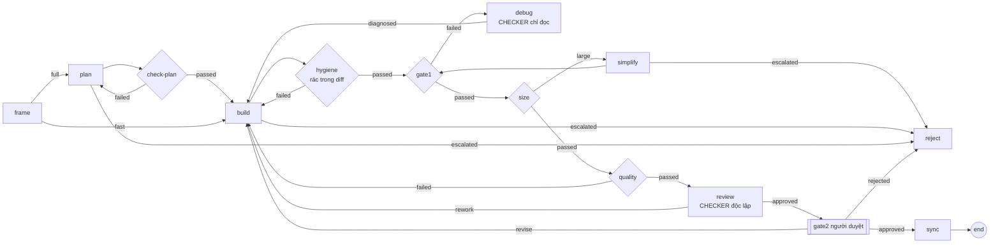
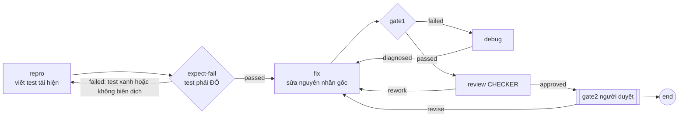

# aw kit — kho dùng chung cho mọi project

`kit/` là kho trong repo `aw` chứa những thứ mà project nào dùng `aw` cũng cần: script vận hành, policy, skill chung, script
lệnh chung, workflow mẫu. Mục tiêu là khi sang một project mới, mọi thiết lập **lấy từ kho hoặc chạy bằng `aw`**, không
phải để AI tự viết lại script cho từng project (mỗi lần viết lại là một lần lệch).

**Nguyên tắc.** Người hay AI chỉ được *điền nội dung vào chỗ trống đã định sẵn*, không được *viết cơ chế*:

| Điền theo project | Lấy từ kho |
|---|---|
| Layer (quy ước của stack), lệnh test cụ thể, contract của task, tri thức riêng (bảng định tuyến…) | Script vận hành, `aw-publish.py`, thư viện cho script lệnh, policy, skill chung, workflow mẫu |

Tài liệu này chỉ nói về kho. Ví dụ đầy đủ một project dùng kho: [docs/guides/todolist-spring-react](../docs/guides/todolist-spring-react/README.md). Ví dụ nhiều repository (hợp đồng, api, web; dùng `bind`, `from kit:<id>`, `argRepositories`): [docs/guides/issue-tracker](../docs/guides/issue-tracker/README.md).

## Mục lục

- [1. Cấu trúc](#1-cấu-trúc)
- [2. Project dùng kho thế nào](#2-project-dùng-kho-thế-nào)
- [Workflow mẫu có chẩn đoán, review độc lập và sửa lỗi](#workflow-mẫu-có-chẩn-đoán-review-độc-lập-và-sửa-lỗi-v10-14)
- [3. Cái nào dùng chung thật, cái nào là bản mẫu](#3-cái-nào-dùng-chung-thật-cái-nào-là-bản-mẫu)
- [4. Thư viện script lệnh (`lib.sh`)](#thư-viện-script-lệnh-libsh)
- [5. Thêm một mục vào kho](#5-thêm-một-mục-vào-kho)
- [Chắt lọc từ nguồn bên ngoài](#chắt-lọc-từ-nguồn-bên-ngoài)
- [6. Version và nâng cấp](#6-version-và-nâng-cấp)
- [7. Kiểm tra kho](#7-kiểm-tra-kho)
- [8. Giới hạn hiện tại](#8-giới-hạn-hiện-tại)

## 1. Cấu trúc

```text
kit/
├── kit.json                    # khai báo của kho: role "kit", name, version, prefix "kit-", danh mục mục
├── scripts/                    # script vận hành (đọc aw-project.json / aw-state.json), không gắn với stack nào
│   ├── init-project.sh  create-root.sh  run-task.sh  watch-run.sh  show-run.sh  review-task.sh
│   ├── retry-task.sh  commit-task.sh  worktree-path.sh  split-tasks.sh  agent-log.py
│   ├── aw-publish.py  aw-resource-hashes.py
│   └── import-skill.py  context-check.sh   # công cụ cho người chắt lọc tri thức (mục "Chắt lọc từ nguồn bên ngoài")
├── commands/
│   ├── lib.sh                  # thư viện cho script lệnh (mục 4)
│   └── reject.sh  check-feature-docs.sh  secrets-gate.sh
├── policies/                   # attempt(-once), permission(-network), completion(-reviewed, -feature)
├── layers/                     # layer-stack-spring-sqlite, layer-stack-react-vite, layer-api-design, layer-sql-quality,
│                               # layer-backend-security, layer-react-quality, layer-frontend-testing
├── skills/                     # skill-feature-flow, skill-maker, skill-review, skill-code-review, skill-dev-rules, skill-ask, skill-brainstorm, skill-spec, skill-design, skill-plan, skill-build, skill-debug, skill-test, skill-security, skill-docs
├── workflows/                  # wf-feature-definition, wf-task-delivery, wf-task-delivery-plus, wf-bugfix (mẫu, có chỗ trống cho project điền)
├── schema/aw-project.schema.json   # đặc tả của aw-project.json và kit.json
├── drafts/                     # bản nháp do import-skill.py sinh (git bỏ qua, không bao giờ publish)
└── tests/check-kit.sh          # kiểm tra tự động (mục 7)
```

`kit.json` có cùng định dạng với `aw-project.json` của project (xem schema), thêm `role: "kit"`, `name`, `version`.

## 2. Project dùng kho thế nào

Một project mới chỉ cần ba thứ trong `aw-project.json`:

```json
{
  "prefix": "shop-",
  "repository": "shop",
  "kit": {"path": "/đường/dẫn/tới/aw-tqunglnh/kit/kit.json", "version": "1"},
  "agents": [ … agent của project: resource lấy từ kit hoặc Layer của project … ],
  "commands": [{"id": "cmd-reject", "from": "kit"}, {"id": "cmd-check-feature-docs", "from": "kit"}],
  "workflows": [{"id": "wf-feature-definition", "from": "kit"}]
}
```

- `"kit"` cho phép tham chiếu mọi id của kho mà không khai lại. `version` ghim số major: kho đổi major thì `--check` báo.
- `"from": "kit"` lấy bản mẫu cùng id; field khác trong entry ghi đè bản mẫu.
- **Agent mẫu theo vai trò** (`agent-flow-brainstorm … agent-flow-sync`, `agent-reviewer`, `agent-debugger`, `agent-simplifier`): kho
  chỉ biết tri thức của kho, project cộng tri thức của mình bằng `addResources` (Layer stack, `dev.stack-overview`…), không phải chép lại cả danh sách:
  `{"id": "agent-flow-build", "from": "kit", "addResources": ["layer-stack-spring-sqlite", "skill-maker#dev.definition-of-done"], "model": "opus"}`.
  `addResources` được nối vào `resources` của bản mẫu, mục trùng chỉ giữ một; `name`/`model` ghi đè như mọi field khác.
- **Nhiều repository dùng một bản mẫu:** `{"id": "cmd-secrets-gate-api", "from": "kit:cmd-secrets-gate", "repository": "api"}` đặt tên
  khác cho bản mẫu; với workflow thêm `"bind"` để gắn lại chỗ trống cho từng repo:
  `{"id": "wf-task-delivery-api", "from": "kit:wf-task-delivery", "bind": {"command:cmd-gate1": "cmd-api-test", …}}`.
  Khóa `bind` gõ sai bị `--check` bắt.
- **Lệnh cần đọc repository khác:** Command khai `"argRepositories": ["contracts"]` thì script nhận đường dẫn worktree (chỉ đọc)
  của repo đó làm tham số tiếp theo (`$2`). Đã chạy thật: lệnh ở worktree `api` thấy được nội dung worktree `contracts`.
- **Chỗ trống.** Workflow mẫu tham chiếu những thứ phụ thuộc stack (agent, command…) mà project phải tự định nghĩa. Xem
  project còn thiếu gì:

```bash
aw-publish.py aw-project.json --slots
# wf-task-delivery  — Workflow: giao một task
#   [THIẾU] agent:agent-flow-build        project tự định nghĩa
#   [có]    command:cmd-reject            kit có bản mẫu, lấy bằng "from": "kit"
```

Rồi `aw-publish.py aw-project.json --check`, rồi publish như thường. Môi trường: `export AW_KIT=<thư mục kit>` và đặt
`$AW_KIT/scripts` vào `PATH`.

## Workflow mẫu có chẩn đoán, review độc lập và sửa lỗi (V10-14)

Hai workflow mẫu thêm vào `wf-task-delivery` những bước mà ClaudeKit làm bằng `/cook` và `/fix`, nhưng thành **graph có giới hạn vòng**
của aw (mọi vòng sửa có `cyclePolicy`, hết vòng thì sang `reject` và run FAILED, không lặp vô hạn).

`wf-task-delivery-plus` = `wf-task-delivery` + kiểm plan, kiểm rác, đo diff (làm gọn nếu lớn), node **debug** khi gate1 đỏ và node **review** (CHECKER độc lập) trước cổng người duyệt:



`wf-bugfix` bắt buộc có **test đỏ trước khi sửa**: agent `repro` chỉ được viết test tái hiện, bước `expect-fail` (Command) chạy bộ test và
chỉ cho qua khi test **đang đỏ vì đúng một lỗi test**, rồi agent `fix` mới sửa:



Điều cần biết khi dùng:

- **Agent `debug` không nhận kết quả của kiểm tra đỏ.** Engine chỉ đưa `checkFailures` cho agent sửa đi thẳng từ một kiểm tra; một CHECKER
  nhận yêu cầu, diff và evidence nhưng prompt không có đoạn lỗi (đã kiểm bằng `walk-workflow.py`, xem dưới). Vì vậy `debug.diagnosis-report`
  bắt agent chẩn đoán **tự tái hiện** trên bản sao repository và trích nguyên văn lỗi vào báo cáo; agent sửa sau đó nhận báo cáo ấy dưới dạng
  `reviewerFeedback` (và **không** nhận `checkFailures`). Chẩn đoán dở thì agent sửa mất luôn thông báo lỗi gốc: đây là rủi ro thật, chỉ chạy
  `wf-task-delivery-plus` thật mới biết có đáng không (chưa đo; xem kết luận V10-18).
- `expect-fail.sh` nhận diện stack như `maven-test.sh` và `npm-test.sh` (`backend/pom.xml` hoặc `frontend/package.json`), chạy test và **đảo nghĩa**:
  đạt khi test đỏ; không đạt khi test xanh, khi code không biên dịch (đỏ vì lý do khác) hoặc khi lỗi mạng (báo `MÔI TRƯỜNG:`).
- Project cần khai `agent-debugger`, `agent-reviewer` (và `agent-flow-repro`, `agent-flow-fix` cho `wf-bugfix`) bằng `"from": "kit"` kèm `addResources`
  của stack mình, và một `cmd-expect-fail` theo repository (`from kit:cmd-expect-fail`). Mẫu: [docs/guides/issue-tracker](../docs/guides/issue-tracker/aw-project.json).

### Hook của ClaudeKit thành bước kiểm tra của workflow (V10-15)

ClaudeKit làm các kiểm tra này bằng hook, và hook **lỗi thì cho qua** (fail-open). Trong aw chúng là node của workflow, nên lỗi thì **chặn** (fail-closed):

| Hook của ClaudeKit | Trong kit | Chỗ gắn trong `wf-task-delivery-plus` |
|---|---|---|
| `simplify-gate` (cảnh báo khi diff lớn, tắt được) | `cmd-diff-size` (ngưỡng 400 dòng, 8 file, 200 dòng một file; bỏ qua tài liệu, lockfile) → nhánh `large` → node `simplify` (`agent-simplifier`, tối đa 2 vòng; diff vẫn lớn thì run dừng ở `reject` để người vận hành chia nhỏ task) | sau `gate1`, trước `quality` |
| (agent tự nhớ không để rác) | `cmd-temp-artifacts`: chặn `debugger`, `console.log`, `System.out`, `.only`, `@Disabled`/`.skip`, TODO **mới thêm**, báo WHAT / WHY / FIX | ngay sau `build`, trước `gate1` |
| `plan-format-kanban`, `workflow-artifact-gate` | `cmd-check-plan`: `plan.md` của task phải có đủ sáu mục (`plan.checklist`); thiếu thì gửi về `plan` | sau `plan` |
| `privacy-block` (chặn đọc file bí mật) | đã có `gate-secrets`/`cmd-secrets-gate` (chặn file bí mật và database trong thay đổi) | gate của repository |
| `scout-block` (giữ agent khỏi thư mục nặng) | **không cần**: aw đã giới hạn đường đi bằng `pathScopes` và mount của WorkItem | - |

Hai chỗ khác ClaudeKit: `cmd-diff-size` và `cmd-temp-artifacts` chỉ xét diff **chưa commit** của worktree (so với HEAD), nên chúng đo thay đổi của task đang làm; và `cmd-check-plan`
nhận tiêu đề bằng từ khóa tiếng Việt hoặc tiếng Anh nên một `plan.md` đúng ý nhưng đặt tên mục lạ vẫn có thể bị gửi trả (đã chỉnh `plan.checklist` để agent dùng đúng tên mục).

**Cạnh hết vòng (`escalationOutcome`) phải dẫn ra ngoài vòng.** Mã runtime của engine (`advance.go`) từ chối cạnh hết vòng dẫn tới node còn quay lại được vòng đó.
`walk-workflow` đã gặp lỗi này thật: khi `simplify` hết vòng và cạnh `escalated` đi tới `quality` (nằm trong vòng vì `quality` → `build`), attempt kề trước kết thúc
`INDETERMINATE` (`OWNERSHIP_LOST_MUTATING`) sau 30 giây và run đứng im ở `RUNNING`, không có thông báo lỗi định nghĩa lúc publish. Vì vậy mọi cạnh hết vòng của hai workflow mẫu đều đi tới
`reject`, và kịch bản `plus-large-exhaust` giữ điều này (đường nhánh tới `reject` chạy được, đã kiểm).

**Kiểm tra mọi cạnh không tốn tiền:** `kit/scripts/walk-workflow.py <kịch-bản.json>` dựng bản cài aw tạm, chạy một WorkItem qua workflow với
agent giả lập (chọn outcome theo kịch bản) và lệnh giả lập (đạt/hỏng theo kịch bản), tự duyệt cổng người, rồi so thứ tự node với mong đợi
và kiểm nội dung prompt (`checkFailures`, `reviewerFeedback`, resource nào có mặt). 14 kịch bản ở `kit/tests/walk/scenarios/` đi qua mọi cạnh của hai workflow;
`check-kit.sh` chạy hai kịch bản đại diện, `WALK_ALL=1 sh kit/tests/check-kit.sh` chạy hết (khoảng 4 phút).

## 3. Cái nào dùng chung thật, cái nào là bản mẫu

Chỉ **Layer, Skill (kể cả script skill) và Policy** dùng chung thật: publish **một lần** cho cả bản cài dưới prefix `kit-`
(`kit-policy-attempt`), mọi project nhận cùng một version. Đã kiểm chứng bằng `aw` thật: hai project publish lần lượt nhận
đúng cùng `versionId` cho các mục này, và chạy lại không đổi version nào.

**Command, Gate và Workflow không dùng chung được** nên kho chỉ giữ bản mẫu, project lấy về và publish dưới prefix của mình:
Command ghim `cwdRepositoryTarget` (id repository của project, và id repository không dùng lại được giữa các project),
Workflow có scope project, Agent phụ thuộc Layer của stack. Script bên trong Command vẫn là bản dùng chung (nằm trong script
skill `kit-scripts-common`).

## Thư viện script lệnh (`lib.sh`)

Script của node COMMAND phải theo một hợp đồng (README của ví dụ, mục 3.4): mã thoát 0 là đạt; **lỗi in ra stderr** vì agent
chỉ nhận 4 KiB cuối của stderr; không màu. Để mọi script thực hiện hợp đồng đó giống nhau, `commands/lib.sh` cung cấp:

| Hàm | Việc |
|---|---|
| `aw_step <tên> <lệnh…>` | Chạy lệnh; đạt thì im lặng. Hỏng thì in `<AW_STEP_HEAD> '<tên>' không đạt` và `${AW_TAIL:-60}` dòng cuối của output ra stderr, thoát mã 1 |
| `aw_fail <thông báo>` | Lỗi của code: in stderr, thoát 1 |
| `aw_env_fail <thông báo>` | Lỗi của máy chạy (thiếu binary, cổng bị chiếm): in `MÔI TRƯỜNG: …` kèm lời dặn agent dừng bằng `needs_info` thay vì sửa code vô ích |
| `aw_wait_http <url> <tên> <log> [giây]` | Chờ một URL trả lời; quá hạn thì in lỗi kèm đuôi log |

Cách dùng, một dòng ở đầu script:

```sh
set -eu
. "${AW_KIT:?đặt AW_KIT=<thư mục kit> khi chạy tay}/commands/lib.sh" # @aw-include
AW_STEP_HEAD="frontend: bước"
aw_step "npm test" npm test
```

`aw-publish.py` thay đúng dòng có `# @aw-include` bằng nội dung `lib.sh` khi publish. Hệ quả: script đã publish **tự chứa**
(worker không cần `AW_KIT`), và hash của script đổi khi thư viện đổi, nên mọi thay đổi của thư viện đều thành version mới
có thể truy vết. Khi chạy tay trên máy dev, `AW_KIT` trỏ tới thư mục kit để dòng đó nạp file thật. `--check` báo lỗi nếu
`@aw-include` trỏ tới file không có trong kho.

Quy tắc: **project không tự viết lại những hàm này**. Cần hành vi mới dùng chung thì thêm vào `lib.sh`; cần hành vi riêng
của stack thì viết trong script của project, dùng các hàm trên làm nền.

## 5. Thêm một mục vào kho

Ví dụ: bạn muốn node review dùng một skill review tổng hợp từ nhiều nguồn.

1. **Chắt lọc, đừng dán nguyên.** Prompt có ngân sách tính bằng byte (mặc định 64 KB cho tài nguyên của một agent) và
   `aw-publish.py` cảnh báo khi một agent nhận quá 15 `HARD_CONSTRAINT`. Viết thành các resource nhỏ theo chủ đề
   (checklist, bảo mật, phong cách…), mỗi resource một `key` có tiền tố theo nguồn (`review.`, `security.`).
2. **Ghi nguồn.** Mỗi resource có `provenance`:
   `{"owner": "…", "source": "<đường dẫn trong kho, tên nguồn hoặc URL>", "revision": "…", "lastVerified": "<RFC 3339>"}`.
   **Chỉ bốn trường này**: `aw` đọc nghiêm ngặt và từ chối trường lạ lúc publish (đã thử: `unknown field "license"`), và
   `--check` bắt sớm lỗi đó. Nội dung lấy từ bên ngoài thì khai thêm ở **entry trong `kit.json`** (chỉ `aw-publish.py` đọc):
   `"origin": "<từ đâu>"` và `"license": "<giấy phép>"`; có `origin` hoặc `provenance.source` là URL mà thiếu `license` thì
   `--check` từ chối. Chưa biết giấy phép thì ghi `"license": "UNKNOWN"`: `--check` và publish in cảnh báo mỗi lần cho tới
   khi xác nhận. Resource quá 180 ngày chưa rà lại bị `aw-publish.py` cảnh báo.
3. **Chọn `priority` và `selector` đúng chỗ.** Ví dụ review chỉ cho agent `CHECKER`: `"selector": {"blockKinds": ["CHECKER"]}`.
   Hai trường này nằm trong hash của resource, nên project đổi selector là tạo ra một mục khác (xem mục 8).
4. **Đặt file** vào `skills/` (hoặc `policies/`, `commands/`) và **khai trong `kit.json`**:
   ```json
   {"id": "skill-review-security", "name": "Skill: review bảo mật (CHECKER)", "file": "skills/skill-review-security.json"}
   ```
5. **Tăng `version`** trong `kit.json`: thêm mục thì minor, đổi nghĩa mục cũ thì major.
6. **Chạy `tests/check-kit.sh`** (mục 7).
7. **Project dùng nó** bằng một dòng trong `resources` của agent review, không cần file nào khác:
   `"skill-review-security#security.checklist"`.

**Nhận nội dung từ bên ngoài là nhận một chỉ dẫn mà agent sẽ tuân theo (và với script là mã chạy dưới quyền user, vì Alpha
không có sandbox).** Vì vậy: người đọc từng dòng trước khi nhận, không nhận script chạy được mà chưa đọc, và khi cập nhật
từ nguồn thì xem diff của nội dung chứ không chỉ số revision. Hash khóa nội dung nên thay đổi không bị lặng lẽ lọt vào.

## Chắt lọc từ nguồn bên ngoài

Quy ước của V10 ([docs/design/13-v10-kit-knowledge.md](../docs/design/13-v10-kit-knowledge.md)) cho mọi nội dung lấy từ công cụ
khác (ClaudeKit, skill công khai, tài liệu của nhà cung cấp). Phần lớn được `aw-publish.py --check` kiểm tự động.

**Viết lại, không chép nguyên.** Trong `aw`, agent MAKER không chạy được lệnh shell, không có subagent, không hỏi người trực
tiếp (muốn hỏi thì chọn outcome `needs_info`), và outcome do engine kiểm. Vì vậy `--check` chặn những cấu trúc chỉ có ở công
cụ gốc: `/ck:…`, `AskUserQuestion`, `TaskCreate`/`TaskUpdate`/`TaskGet`/`TaskList`, `SendMessage`, `Task(…)`, `repomix`,
đường dẫn `.claude/`, `plans/reports`, marker `@@PRIVACY`. Gặp ý hay dùng các cấu trúc đó thì diễn đạt lại theo cách aw làm
được (ví dụ "hỏi người" thành "chọn `needs_info` và nêu câu hỏi").

**Một resource một ý.**

| Luật | Ngưỡng | Kết quả của `--check` |
|---|---|---|
| Kích thước `instruction` | cảnh báo trên 2048 byte, lỗi trên 3072 byte | tách thành các resource nhỏ hơn |
| `HARD_CONSTRAINT` mỗi agent | tối đa 15 (cùng ngưỡng cảnh báo của `aw`) | lỗi: hạ bớt xuống `REQUIRED_PROCEDURE` hoặc `GUIDANCE` |
| Cùng một luật ở hai resource | câu từ 60 ký tự trở lên, giống nhau sau khi chuẩn hóa | cảnh báo: mỗi luật chỉ ở một chỗ, nơi khác tham chiếu |

`HARD_CONSTRAINT` chỉ dành cho luật kiểm được mà vi phạm là sai. Quy trình thì `REQUIRED_PROCEDURE`, lời khuyên thì
`GUIDANCE`, tài liệu tra cứu thì `REFERENCE`. Viết tiếng Việt, giữ thuật ngữ kỹ thuật tiếng Anh.

**Xuất xứ và giấy phép theo từng mục** (khai ở entry trong `kit.json`, vì `provenance` của aw chỉ nhận bốn trường):

```json
{"id": "skill-debug", "file": "skills/skill-debug.json",
 "origin": "claudekit-engineer@ed8a1fa",
 "license": "MIT",
 "redistributable": true}
```

- `origin` của mục lấy từ ClaudeKit có dạng `claudekit-engineer@<commit>` (có thể thêm ghi chú sau một dấu cách).
- `license` ghi theo từng skill nguồn: đọc trường `license:` trong `SKILL.md` của nó (một số là MIT hoặc Apache-2.0).
  Skill không khai thì theo giấy phép độc quyền của ClaudeKit: ghi `ClaudeKit-Proprietary (licensed)`.
- `redistributable` bắt buộc với mục lấy từ ClaudeKit: `false` nếu nội dung không được phân phối lại. Trường này không ảnh
  hưởng việc publish lên bản cài của chính bạn.
- Mỗi resource của mục đó có `provenance.source` dạng `claudekit-engineer@<commit>:<đường dẫn trong ClaudeKit>`, ví dụ
  `claudekit-engineer@ed8a1fa:skills/ck-debug/SKILL.md`; `--check` từ chối nếu thiếu hoặc khác commit của `origin`.

**Công cụ cho người chắt lọc.**

- `scripts/import-skill.py <thư mục skill | file .md>` đọc skill dạng `SKILL.md` (kèm `references/*.md`), agent hoặc rule của
  công cụ khác và sinh **bản nháp** vào `kit/drafts/<tên>.json` cùng `<tên>.report.md`: mỗi mục `## …` thành một resource
  (mục dài được tách theo đoạn), `provenance.source` đã có dạng `<nguồn>:<đường dẫn>`, báo cáo nêu giấy phép trong nguồn, đoạn
  khai mẫu cho `kit.json` và những chỗ `--check` sẽ chặn. Bản nháp không nằm trong `kit.json` nên không bao giờ được publish;
  bạn viết lại từng resource rồi mới chuyển vào `skills/` hoặc `layers/`. Dùng được cho mọi nguồn theo chuẩn `SKILL.md`.
- `scripts/context-check.sh <aw-project.json> [<workflow>:]<node> [--repository ID] [--component TÊN] [--risk MỨC]` kiểm tra
  tri thức nào thực sự đến một node AGENT mà **không tốn tiền**: dựng bản cài aw tạm, publish project, chạy đúng node đó bằng
  agent giả lập (`fake-claude`) rồi in resource mà attempt nhận (kèm độ ưu tiên, byte, ngân sách) và resource bị loại
  (`NOT_APPLICABLE`…). `--expect <key>` và `--absent <key>` (lặp được) biến nó thành kiểm tra tự động: thoát mã 1 khi sai.
  Chạy khoảng 8 giây. Cần `aw` và `fake-claude` (biến `AW`, `AW_FAKE_CLAUDE` hoặc PATH; trong repo aw, thiếu thì tự `go build`).

  ```bash
  context-check.sh docs/guides/todolist-spring-react/aw-project.json build --component backend \
      --expect flow.build --absent react.api-client
  ```

**Trước khi chia sẻ kho ra ngoài** chạy `aw-publish.py kit/kit.json --share`: lệnh liệt kê mục có `redistributable: false` và
mục có giấy phép `UNKNOWN`, thoát mã 1 nếu có.

## 6. Version và nâng cấp

- `kit.json` có `version` (`major.minor.patch`). Project ghim số major trong `"kit": {"version": "1"}`.
- Publish là **content-addressed**: nội dung không đổi thì version của mục không đổi. Sửa một mục chỉ tạo version mới cho
  mục đó và những gì phụ thuộc vào nó.
- Nâng cấp kho **không tự động** ảnh hưởng project: project chỉ nhận nội dung mới khi publish lại. WorkItem đã tạo vẫn ghim
  workflow version cũ (README của ví dụ, mục 5.1).
- `aw-state.json` của project ghi `kit: {name, version, prefix}` đã dùng ở lần publish cuối.

## 7. Kiểm tra kho

```bash
kit/tests/check-kit.sh            # kiểm tra kho, ví dụ todolist, các nhánh báo lỗi, nhúng thư viện, schema
```

Script chạy: `aw-publish.py kit.json --check`; `--check` cho project ví dụ; các nhánh báo lỗi (prefix trùng, id trùng, kit
khác major, thiếu bản mẫu, nguồn URL thiếu license, `@aw-include` hỏng); các luật chắt lọc (cấu trúc chỉ có ở công cụ
gốc, kích thước, quá 15 `HARD_CONSTRAINT`, luật lặp, xuất xứ và `--share`); script đã nhúng thư viện chạy đúng **khi không có
`AW_KIT`**; và, nếu có Python `jsonschema`, validate các khai báo theo schema.

Chưa có trong script (cần một bản cài `aw` thật): publish hai project và so version. Đã làm tay một lần khi tách kho (ghi ở
README của ví dụ, mục "Phạm vi kiểm chứng").

## Ví dụ đã thử: `skill-code-review`

Skill review của claudekit (người dùng cung cấp) được nhận vào kho **sau khi chắt lọc**, không dán nguyên. Phần giữ lại:
phương pháp dựa trên bằng chứng, hai giai đoạn (đúng yêu cầu rồi mới chất lượng), soi dấu hiệu code do AI viết, mức nghiêm
trọng, và không tuyên bố điều chưa kiểm chứng. Phần bỏ vì không chạy được trong node CHECKER của `aw` (agent không tương tác,
chỉ đọc, `git` và lệnh shell bị chặn ở chế độ `acceptEdits`): chọn chế độ review bằng `AskUserQuestion`, `gh pr diff`, subagent
`code-reviewer`, `/ck:scout`, pipeline Task, và các `references/*.md` (không được cung cấp). Từ V10-09 skill này được
ghim lại theo ClaudeKit `ed8a1fa` (`skills/ck-code-review`, `agents/code-reviewer`), giấy phép ghi theo nguồn và `redistributable: false`; bản
người dùng cung cấp ban đầu (giấy phép `UNKNOWN`) không còn trong kho. Phần bổ sung: dò edge case trước khi review và danh sách rà
(`codereview.edge-scout`, `codereview.checklist`), báo cáo thêm mục "Edge case dò được" và "Câu hỏi chưa giải quyết".

Dùng: `agent-reviewer` của project thêm `"skill-code-review"` vào `resources` (cạnh `skill-review`, vốn giữ ràng buộc chỉ đọc
và quy tắc chọn outcome). Cả ba resource có selector `blockKinds: ["CHECKER"]` nên chỉ agent review nhận.

**Đã thử thật** (`aw` build từ repo, Claude CLI, node CHECKER trong workflow chỉ-review, sonnet, effort medium):

| Ca | Skill cũ (`skill-review`) | + `skill-code-review` |
|---|---|---|
| Code cài sẵn 9 lỗi (test vẫn xanh), 2 lần mỗi bên | 9/9 lỗi, `rework` | 9/9 lỗi, `rework` |
| Thay đổi đúng nhưng test thiếu biên Unicode | `approved`, ghi "Minor, không chặn" | `rework` (Important): đột biến `\p{javaWhitespace}`→`\s` qua toàn bộ test, đã kiểm chứng đúng |
| Cùng thay đổi, test đã kín | `approved` | `approved` |

- **Không chứng minh được "tìm nhiều lỗi hơn"**: reviewer cũ đã tìm đủ 9/9, nên bài thử bão hòa ở chỉ số đó.
- **Khác biệt quan sát được ở hình thức và kỷ luật**: báo cáo xếp Critical/Important/Minor, mỗi mục có `file:dòng`, mở đầu nói rõ
  "đã đọc, chưa chạy `mvn`", và đặt điều chưa kiểm chứng ở mục "Nghi ngờ chưa xác minh" riêng. Chi phí cao hơn khoảng 12 đến 17%
  (0,130 và 0,138 USD so với 0,115 và 0,118).
- **Tác dụng phụ**: hai lần trên code cài lỗi, reviewer mới xếp "thiếu `GET /{id}` và `PUT`" (không nằm trong tiêu chí của task)
  ở Critical hoặc Important, trong khi một lần của reviewer cũ ghi đúng rằng việc đó không quyết định outcome. Xu hướng nâng mức
  cho điều ngoài tiêu chí là rủi ro cần để ý.
- **Giới hạn của bài thử**: mỗi ô một đến hai lần chạy, một repo, một stack. Ca "đúng nhưng test thiếu biên" do tôi vô tình
  tạo ra, nên khác biệt ở ca đó có thể một phần là phương sai giữa các lần chạy, không chỉ do skill. Chưa chạy trong
  `wf-fullstack-review` đủ vòng (có `implement`, hai bước test và cổng người duyệt).

## 8. Giới hạn hiện tại

- **Command và Gate chưa chia sẻ được** (mục 3). Project nào cũng publish bản riêng, dù script bên trong là một.
- **Chưa có cơ chế override selector.** Project muốn đổi `selector` của một resource của kho phải thêm resource riêng (id
  khác) thay vì sửa bản chung.
- **Workflow mẫu là cái khung nguyên khối.** Muốn thêm một node (ví dụ node e2e) vào `wf-task-delivery`, project copy template
  về làm workflow riêng của mình: nó không còn tự nhận cập nhật từ kho. Nếu thêm node thành nhu cầu chung, nên đưa vào kho như
  một biến thể.
- **Chỉ kiểm tra hợp đồng script ở mức thư viện.** `--check` không chạy script; script tự viết `exit 1` mà quên in lỗi ra
  stderr thì chưa có gì bắt được.
- **Cần sửa engine mới làm được:** lệnh `aw project init`, lệnh publish một manifest do chính `aw` sở hữu, lệnh chờ run tới
  lúc cần người, API đọc lời agent và đường dẫn worktree. Các script trong `scripts/` vẫn là lớp ghép ngoài `aw`.
